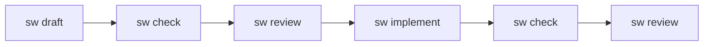

# SpecWeaver

[](https://www.python.org/downloads/)
[](https://opensource.org/licenses/Apache-2.0)
[](https://github.com/astral-sh/ruff)
[](https://mypy-lang.org/)

**A Company-Grade Software Factory for Autonomous AI Generation.**

Standard AI coding tools lack context, hallucinate architectures, and break builds. **SpecWeaver** solves this by mapping your project's dependency topology to guarantee safe, reviewable, and mathematically sound code generation. 

Write a specification, review it with AI, and let autonomous agents safely implement the code inside zero-trust git boundaries.

---

## 🚀 Quickstart

Get started in seconds. No complex setups required.

```bash
# 1. Install SpecWeaver
pip install specweaver

# 2. Initialize your workspace
sw init my-app --path .

# 3. Interactively draft a specification with the LLM
sw draft new_feature

# 4. Safely implement the spec via autonomous agents
sw implement new_feature.md
```

## 💡 The "Spec-First" Workflow

SpecWeaver enforces a secure, spec-driven development lifecycle natively from your CLI.



## 🛡️ Why SpecWeaver?

*   **Zero-Trust Security**: Agents execute strictly inside isolated Git Worktrees with dictatorial folder-level grants. They physically cannot overwrite unauthorized files or hallucinate system commands.
*   **Context-Aware Topology**: Reads your databases and maps your polyglot code topology (Python, TS, Java, Rust, Go) so the LLM never hallucinates invalid dependencies or breaks SLA bounds.
*   **Interactive "Interview" Mode**: Don't know how to write a spec? `sw draft` interviews you and generates the specification for you interactively.
*   **Strangler Fig Adoption**: You don't need to map your 10-year-old legacy monolith. Start by running SpecWeaver in a single sub-folder and map the rest when you are ready.

## 🧠 How It Works (The Engine)

Under the hood, SpecWeaver is powered by enterprise-grade mechanics:
- **Polyglot Ecosystem Support** — Natively extracts and manipulates ASTs across Python, JavaScript/TypeScript, Java, Kotlin, Rust, C/C++, Go, SQL, and Markdown.
- **Deep Semantic Pipeline Hashing** — Sub-second mathematical caching bypasses unaffected workflows natively.
- **Knowledge Graph Engine** — In-Memory NetworkX code-topology graph with a Persistent SQLite Storage Adapter.
- **External DB Context Harness** — Connect to Postgres via the Model Context Protocol (MCP) securely.

> 🔎 *For an exhaustive, technical inventory of internal engine mechanics, capabilities, and upcoming architectural deployments, please view the active [SpecWeaver Master Story Roadmap](docs/roadmap/master_story_roadmap.md).*

## 📚 Documentation

### 📖 User Handbooks (End-Users)
If you are using SpecWeaver to build software:
1. [Installation & Setup](docs/user_guides/1_installation_and_setup.md)
2. [Drafting Effective Specs](docs/user_guides/2_drafting_effective_specs.md)
3. [Managing Constitutions](docs/user_guides/3_managing_constitutions.md)
4. [Interactive HITL Gates](docs/user_guides/4_interactive_hitl_gates.md)
5. [Framework Archetypes](docs/user_guides/5_framework_archetypes.md)

### 🛠️ Developer Guides (Maintainers)
If you are extending the core Engine:
- [Pipeline Engine Guide](docs/dev_guides/pipeline_engine_guide.md)
- [Layer Isolation & DI](docs/dev_guides/layer_isolation_and_di.md)
- [Adding Tools & Atoms](docs/dev_guides/adding_tools_and_atoms.md)
- [Agent Tools & Atoms Reference](docs/dev_guides/agent_tools_reference.md)
- [Testing Architecture](docs/dev_guides/testing_guide.md)

## 👨‍💻 Development

Want to build on the engine? SpecWeaver is built with Python 3.11+, `uv`, and SQLite.

```bash
# Install with dev dependencies
uv sync --all-extras

# Run the 4,500+ test suite
uv run pytest

# Run linter and architectural checks
uv run ruff check src/ tests/
uv run tach check
```

## License

Apache License 2.0 — see [LICENSE](LICENSE).
