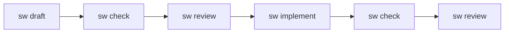

# SpecWeaver

[](https://www.python.org/downloads/)
[](https://opensource.org/licenses/Apache-2.0)
[](https://github.com/astral-sh/ruff)
[](https://mypy-lang.org/)

**Specification-driven development lifecycle tool.**

SpecWeaver enforces a spec-first workflow: write a spec, validate it, review it with AI, then generate code and tests — all natively from the CLI.



```
sw init <name> → sw draft → sw check → sw review → sw implement → sw check → sw review
```

## Core Capabilities

- **Polyglot Ecosystem Support** — Natively extracts and manipulates ASTs across Python, JavaScript/TypeScript, Java, Kotlin, Rust, C/C++, Go, SQL, and Markdown, allowing seamless integration into virtually any enterprise stack.
- **Interactive spec drafting** — Co-author markdown specifications natively with an LLM, validating logical consistency before a single line of code is written.
- **AI-powered Code Generation & Review** — Agents implement tests and code sequentially from specs, returning ACCEPTED/DENIED verdicts mapped with confidence-scored findings.
- **Deterministic Pipeline Engine** — YAML-defined rule pipelines orchestrating Human-In-The-Loop feedback loops, Scenario Generation validations, and strict pipeline rollbacks.
- **Framework Archetype Bounds** — Structural AST extraction (Python, JS/TS, Java, Kotlin, Rust, Go, SQL) enforcing macro isolation and dynamic tool constraints based on project topological overlays.
- **Constitutions & Auto-Discovery** — Analyze legacy codebases mathematically to extract naming, import, and logic standards to constrain generation context implicitly.
- **Zero-Trust Tool Isolation** — Agent generation occurs strictly inside isolated Git Worktree Sandbox environments utilizing dictatorial grant checks avoiding hallucinatory system overwrites.
- **Deep Semantic Pipeline Hashing** — Sub-second mathematical incremental crawler computes Merkle-tree state cache over physical structures to bypass unaffected workflows downstream natively.
- **External DB Context Harness** — Connect externally to persistent databases (e.g. Postgres) via the Model Context Protocol (MCP) securely routing read-only structures through ephemeral Node environments with telemetry scrubbing.
- **Knowledge Graph Engine** — In-Memory NetworkX code-topology graph with a Persistent SQLite Storage Adapter utilizing Idempotent Tombstoning and Integer-Mapped Reconstitution for math-safe agent execution across boundaries.

> 🔎 *For an exhaustive, technical inventory of internal engine mechanics, capabilities, and upcoming architectural deployments, please view the active [SpecWeaver Master Story Roadmap](docs/roadmap/master_story_roadmap.md).*

## Documentation

SpecWeaver's detailed workflows, execution commands, and pipeline explanations have been cleanly modularized into our dual-layer documentation directories:

### 📖 User Handbooks (End-Users)
If you are using SpecWeaver to build software, consult the User Guides:
1. [Installation & Setup](docs/user_guides/1_installation_and_setup.md)
2. [Drafting Effective Specs](docs/user_guides/2_drafting_effective_specs.md)
3. [Managing Constitutions](docs/user_guides/3_managing_constitutions.md)
4. [Interactive HITL Gates](docs/user_guides/4_interactive_hitl_gates.md)
5. [Framework Archetypes](docs/user_guides/5_framework_archetypes.md)

### 🛠️ Developer Guides (Maintainers)
If you are extending SpecWeaver's core Engine, custom tools, or LLM adapters, consult the Maintainer Guides:
- [Pipeline Engine Guide](docs/dev_guides/pipeline_engine_guide.md)
- [Layer Isolation & DI](docs/dev_guides/layer_isolation_and_di.md)
- [Adding Tools & Atoms](docs/dev_guides/adding_tools_and_atoms.md)
- [Testing Architecture](docs/dev_guides/testing_guide.md)
- [MCP DB Harness Setup](docs/dev_guides/mcp_db_harness_setup.md)
- [View all Developer Guides...](docs/dev_guides/)

## Project Structure

```
~/.specweaver/
    specweaver.db               # SQLite: projects, LLM profiles, active state

├── src/specweaver/
│   ├── cli/                    # Typer CLI package (13 submodules)
│   ├── logging.py              # Logging setup (JSON file output, Rich console UI)
│   ├── config/                 # SQLite database, settings, migrations
│   ├── context/                # Context providers (HITL, inferrer, analyzers)
│   ├── drafting/               # Interactive spec drafter
│   ├── flow/                   # Pipeline engine: models, parser, runner, state, handlers, store
│   ├── graph/                  # In-Memory Knowledge Graph Engine, Builder, Topology & Persistent SQLite Adapter
│   ├── implementation/         # Code generator
│   ├── llm/                    # Multi-provider auto-discovery registry, models, telemetry
│   │   ├── adapters/           # Self-describing concrete adapters (Gemini, OpenAI, etc)
│   │   ├── atoms/              # Engine-level building blocks
│   │   │   ├── filesystem/     # Filesystem atom (engine-level)
│   │   │   └── git/            # Git atom (checkpoint, integrate, publish)
│   │   ├── commons/            # Shared infrastructure (executors)
│   │   │   ├── filesystem/     # FileExecutor
│   │   │   └── git/            # GitExecutor, EngineGitExecutor
│   │   └── tools/              # Agent-facing tools
│   │       ├── filesystem/     # Filesystem tool (grants, roles, intents)
│   │       └── git/            # Git tool (intents, interfaces, roles)
│   ├── pipelines/              # Bundled pipeline templates (YAML)
│   ├── project/                # Scaffold, discovery, constitution loader
│   ├── review/                 # AI reviewer (constitution-aware)
│   ├── standards/              # Standards auto-discovery (analyzer, scope detector, HITL reviewer)
│   └── validation/             # Rules engine (S01-S11, C01-C09, C12, drift detection)
├── tests/                      # 4644 tests (unit, integration, E2E)
├── docs/                       # Architecture & methodology docs
└── pyproject.toml
```

## Context & Topology

Every module in a SpecWeaver project can have a `context.yaml` boundary manifest — a structured file that declares the module's identity, dependencies, and architectural constraints.

```yaml
# src/billing/context.yaml
name: billing
level: module
purpose: Calculate invoice totals and apply discounts.
archetype: pure-logic
consumes: [pricing, customers]
constraints: [no-direct-db, stateless]
```

**TopologyGraph** builds a project-wide dependency graph from all `context.yaml` files:

```python
from specweaver.graph.topology import TopologyGraph

graph = TopologyGraph.from_project(project_path, auto_infer=True)
graph.dependencies_of("billing")     # → {"pricing", "customers"}
graph.impact_of("pricing")           # → {"billing"} (who would break)
graph.operational_warnings("billing") # → latency SLA mismatches
```

- **Auto-infer** (`sw scan`): generates `context.yaml` for Python packages that lack one, using docstrings, imports, and heuristics
- **Operational warnings**: detects SLA mismatches (e.g., a 50ms-latency module depending on a 500ms dependency)
- **Constraint sharing**: finds modules with overlapping constraints for cross-cutting concern analysis

See [context_yaml_spec.md](docs/architecture/context_yaml_spec.md) for the full specification.

## Agent Tools

SpecWeaver provides role-restricted tools for LLM agents, inspired by the [flowManager](https://github.com/sbula/flowManager) atoms & tools architecture.

### FileSystemTool

Grant-based file access for agents. Each agent receives a set of `FolderGrant` objects that define which directories it can read, write, or execute — with path traversal prevention built in.

```python
from specweaver.loom.tools.filesystem.tool import FileSystemTool, FolderGrant, AccessMode

grants = [FolderGrant("src/billing", AccessMode.WRITE, recursive=True)]
tool = FileSystemTool(executor=executor, role="implementer", grants=grants)

tool.read_file("src/billing/calc.py")           # ✅ within grant
tool.create_file("src/billing/utils.py", code)  # ✅ write access
tool.read_file("src/auth/secrets.py")           # ❌ outside grant
tool.read_file("src/billing/../../etc/passwd")  # ❌ path traversal blocked
```

| Intent | Description |
|---|---|
| `read_file` | Read file contents (with line range support) |
| `create_file` | Create a new file |
| `edit_file` | Replace a specific section of a file |
| `delete_file` | Remove a file |
| `list_directory` | List directory contents |
| `search_content` | Regex search across files |
| `find_placement` | Suggest where to place new code (uses `context.yaml`) |

**Security:** All paths are normalized via `posixpath.normpath`, absolute paths are rejected, and `..` traversal beyond grant boundaries returns an error.

### GitTool

High-level git operations that agents call by intent, not raw commands. Each intent maps to a safe sequence of git commands executed on the target project directory (never SpecWeaver's own repo).

```python
from specweaver.loom.tools.git.interfaces import create_git_interface

# Agent gets only the methods its role allows
git = create_git_interface("implementer", project_path)
git.commit("feat: add login endpoint")    # ✅ stages, validates, commits
git.history()                              # ❌ AttributeError — not on this interface
```

| Role | Allowed Intents |
|---|---|
| **Implementer** | commit, inspect_changes, discard, uncommit, start_branch, switch_branch |
| **Reviewer** | history, show_commit, blame, compare, list_branches |
| **Debugger** | history, file_history, show_old, search_history, reflog, inspect_changes |
| **Drafter** | commit, inspect_changes, discard |
| **Conflict Resolver** | list_conflicts, show_conflict, mark_resolved, abort_merge, complete_merge |

> The `conflict_resolver` role is hidden — only the Engine can activate it temporarily when a merge conflict occurs during `integrate`.

### GitAtom

Flow-level git operations for the Engine. Unlike GitTool (agent-facing, role-restricted), GitAtom handles orchestrator-driven tasks using `EngineGitExecutor` (no blocked commands).

```python
from specweaver.loom.atoms.git import GitAtom

atom = GitAtom(cwd=project_path)
result = atom.run({"intent": "checkpoint", "message": "flow step complete"})
result = atom.run({"intent": "integrate", "source": "feat/login", "target": "main"})
```

| Intent | Purpose | Git commands |
|---|---|---|
| **checkpoint** | Semantic commit after flow step | add, diff, commit |
| **isolate** | Create isolation branch for flow | switch -c |
| **restore** | Return to original branch | switch |
| **discard_all** | Clean working tree | restore . |
| **rollback** | Undo last checkpoint | reset --soft HEAD~1 |
| **publish** | Push flow results to remote | push |
| **integrate** | Merge branch into target | checkout, merge |
| **sync** | Pull latest from remote | fetch, pull |
| **tag** | Mark release/milestone | tag |
| **worktree_add** | Create isolated parallel worktree branch | worktree add |
| **worktree_teardown** | Force removal with Windows retry resilience | worktree remove, prune |

**Built-in guardrails:**
- Conventional commit messages enforced (`feat:`, `fix:`, `docs:`, ...)
- Branch naming enforced (`feat/`, `fix/`, `docs/`, ...)
- `push`, `pull`, `merge`, `rebase`, `tag` are permanently blocked
- Auto-stash on branch switch

## Development

For detailed instructions on running specific tests, integration layers, or the full suite, please see the [Testing Guide](docs/testing_guide.md).

```bash
# Install with dev dependencies
uv sync --all-extras

# Run tests
uv run pytest

# Run linter
uv run ruff check src/ tests/

# Run architectural layer tests
uv run tach check

# Run tests with coverage
uv run pytest --cov=specweaver --cov-report=term-missing
```

## Tech Stack

| Component | Choice |
|---|---|
| Language | Python ≥ 3.11 |
| Package manager | uv |
| CLI framework | Typer + Rich |
| LLM SDK | google-genai, openai, anthropic, mistralai |
| Config store | SQLite (WAL mode) + Pydantic |
| Legacy config | ruamel.yaml (migration only) |
| Testing | pytest + pytest-asyncio |
| Linting | Ruff |

## License

Apache License 2.0 — see [LICENSE](LICENSE).
