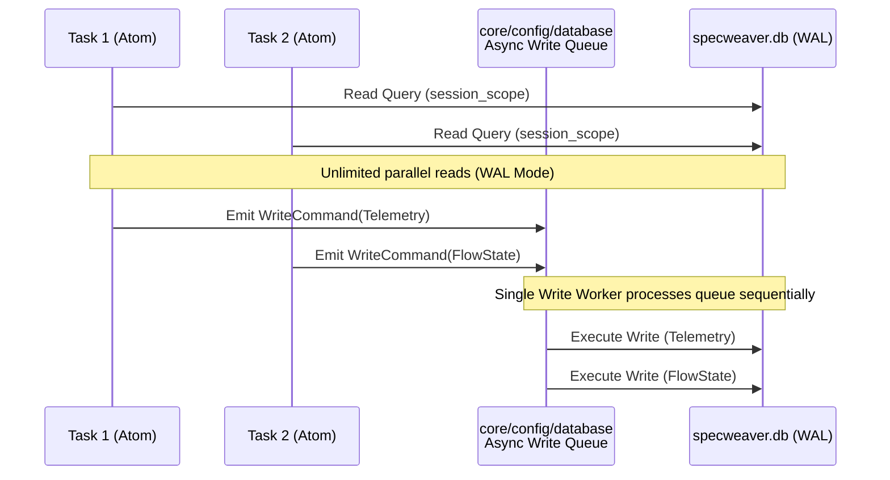

# CQRS & SQLite WAL (Database Concurrency)

This document visualizes how we safely write to SQLite from heavily concurrent tasks without locking, using our internal CQRS (Command Query Responsibility Segregation) engine.

## The Async Write Queue
Because SpecWeaver agents operate in parallel and emit high-volume telemetry and state changes, we avoid `database is locked` deadlocks by isolating all write operations to a single worker queue, while allowing infinite concurrent reads via WAL.

