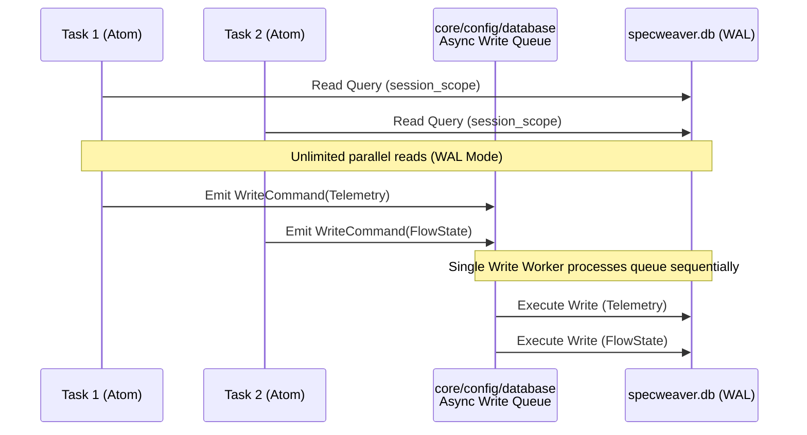

# CQRS & SQLite WAL (Database Concurrency)

Parallel SpecWeaver tasks read and write one SQLite file. Two mechanisms keep them from hitting
`database is locked`: WAL mode for reads, and a single write worker for queued writes. Both live in
`core/config/database.py`.

## The Async Write Queue

- **Reads** run in parallel through `session_scope` (WAL mode). An `asyncio.Semaphore` caps them at
  500 concurrent sessions by default, to avoid file-descriptor exhaustion.
- **Writes** go onto one `asyncio` queue (`CQRSQueueManager`, max 1000 items). One background worker
  runs them in order.
- **Failed writes** go to a dead-letter log (`.dead_letter.log`, rotating) and do not stop the worker.
- **Lifecycle**: `cqrs_context()` starts the worker, and on exit flushes the queue and stops it.
  `PipelineRunner` opens it for every run and every resume.
- **Current state**: nothing in `src/` calls `enqueue` yet; the queue runs empty. The flow state
  store (`core/flow/engine/store.py`) writes through its own WAL connection.

```mermaid
sequenceDiagram
    participant T1 as Task 1 (Atom)
    participant T2 as Task 2 (Atom)
    participant SQ as core/config/database<br>Async Write Queue
    participant DB as specweaver.db (WAL)

    T1->>DB: Read Query (session_scope)
    T2->>DB: Read Query (session_scope)
    Note over T1,DB: Unlimited parallel reads (WAL Mode)
    
    T1->>SQ: Emit WriteCommand(Telemetry)
    T2->>SQ: Emit WriteCommand(FlowState)
    Note over SQ,DB: Single Write Worker processes queue sequentially
    
    SQ->>DB: Execute Write (Telemetry)
    SQ->>DB: Execute Write (FlowState)
```

The diagram shows the intended flow. In code, a "WriteCommand" is any callable passed to
`enqueue` / `enqueue_nowait`, and reads are capped by the semaphore, not unlimited.

## Rules

- Async engines use `NullPool` by default (`create_async_engine`), to avoid SQLite lock contention.
- Stores that open their own `sqlite3` connections set `PRAGMA journal_mode=WAL` themselves.
