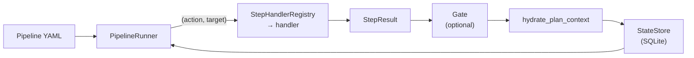

# Pipeline Engine

A pipeline is a YAML list of **steps**. The runner executes them in order, a **gate** after a step
decides what happens next, and state is saved to SQLite after every step so a run can resume.



## Step model

Each step is an **action** (verb) on a **target** (noun):

- Actions: `draft`, `validate`, `review`, `generate`, `lint_fix`, `plan`, `decompose`, `arbitrate`,
  `enrich`, `detect`, `orchestrate`, `convert`, `bash`
- Targets: `spec`, `code`, `tests`, `feature`, `verdict`, `standards`, `drift`, `components`,
  `contract`, `scenario`, `script`

Source: `StepAction` / `StepTarget` in `engine/models.py`.

```yaml
# Example: new_feature.yaml
steps:
  - name: validate_spec
    action: validate
    target: spec
    gate:
      type: auto
      condition: all_passed
      on_fail: abort
```

## Gate model

| Field | Values |
|---|---|
| **type** | `auto` (machine-evaluated), `hitl` (human approves); also `reserve`, `join` |
| **condition** | `all_passed`, `accepted`, `completed` |
| **on_fail** | `abort`, `retry`, `loop_back`, `continue` |
| **loop_target** | step name to jump back to (for `loop_back`) |
| **max_retries** | bounded retry/loop count |

```text
               ┌─────────┐
  Step result ─▶  Gate    ├──pass──▶ Next step
               └────┬────┘
                    │fail
           ┌────────┼────────┐
         abort    retry   loop_back
          │         │        │
        STOP    re-run    jump to
                 step    earlier step
```

## Handler registry

`StepHandlerRegistry` maps `(action, target)` pairs to handler classes:

| Action + Target | Handler | Module |
|----------------|---------|--------|
| `draft+spec` | `DraftSpecHandler` | `core/flow/handlers/draft.py` |
| `draft+feature` | `DraftFeatureHandler` | `core/flow/handlers/draft.py` |
| `validate+spec` | `ValidateSpecHandler` | `core/flow/handlers/validation.py` |
| `validate+feature` | `ValidateSpecHandler` (routes `kind=feature` → `validation_spec_feature`) | `core/flow/handlers/validation.py` |
| `validate+code` | `ValidateCodeHandler` | `core/flow/handlers/validation.py` |
| `validate+tests` | `ValidateTestsHandler` | `core/flow/handlers/validation.py` |
| `review+spec` | `ReviewSpecHandler` | `core/flow/handlers/review.py` |
| `review+code` | `ReviewCodeHandler` | `core/flow/handlers/review.py` |
| `generate+code` | `GenerateCodeHandler` | `core/flow/handlers/generation.py` |
| `generate+tests` | `GenerateTestsHandler` | `core/flow/handlers/generation.py` |
| `generate+contract` | `GenerateContractHandler` | `core/flow/handlers/generation.py` |
| `generate+scenario` | `GenerateScenarioHandler` | `core/flow/handlers/scenario.py` |
| `convert+scenario` | `ConvertScenarioHandler` | `core/flow/handlers/scenario.py` |
| `lint_fix+code` | `LintFixHandler` | `core/flow/handlers/lint_fix.py` |
| `plan+spec` | `PlanSpecHandler` | `core/flow/handlers/generation.py` |
| `enrich+standards` | `EnrichStandardsHandler` | `core/flow/handlers/standards.py` |
| `detect+drift` | `DriftCheckHandler` | `core/flow/handlers/drift.py` |
| `decompose+feature` | `DecomposeFeatureHandler` | `core/flow/handlers/decompose.py` |
| `orchestrate+components` | `OrchestrateComponentsHandler` | `core/flow/handlers/decompose.py` |
| `arbitrate+verdict` | `ArbitrateVerdictHandler` | `core/flow/handlers/arbiter.py` |
| `bash+script` | `BashActionHandler` | `core/flow/handlers/bash_action.py` |

Source of truth: `StepHandlerRegistry.__init__` in `core/flow/handlers/registry.py`.

**Rule:** every pair in `VALID_STEP_COMBINATIONS` (`engine/models.py`) needs a handler here. A
missing one makes the pipeline unrunnable: the runner errors with "No handler registered for
`<action>`+`<target>`" at that step (the `feature_decomposition` gap INT-US-21 FR-1 closed).

## Runner

`PipelineRunner` loop, per step:

1. Look up the handler in the registry.
2. Execute it → `StepResult`.
3. If the step has a gate, evaluate it (advance/stop/retry/loop_back/park).
4. **Hydrate plan context** from the step's output (below).
5. Persist state to SQLite (enables `resume(run_id)`).
6. Emit events for UI progress display.

### HITL approve-on-resume (`engine/approval.py`)

`GateEvaluator` parks HITL gates unconditionally. **Resuming a reviewed gate-park is the approval.**
(Replaced: `resume()` used to only flip the status back to RUNNING, so the gate re-parked forever.)

The decision reads only already-persisted state: no schema change, no approval store.

| park flavour | `record.status` | `result.status` | verdict |
|---|---|---|---|
| gate-park (HITL) | `WAITING_FOR_INPUT` | `PASSED` | **approve** |
| gate-park on failure | `WAITING_FOR_INPUT` | `FAILED` / `ERROR` | re-execute |
| handler-park | `WAITING_FOR_INPUT` | `WAITING_FOR_INPUT` | re-execute |
| RESERVE-park | `WAITING_FOR_INPUT` | `PENDING` | re-execute |

Rules:

- **Only `PASSED` approves.** Every other flavour re-executes — the safe direction: a step that
  never produced a verdict must never be skipped.
- **`step_name` must match** the pipeline step at that index, so a YAML edited between sessions
  cannot let one step's result approve another.
- **One-shot signal.** An explicit `approve_parked` keyword is threaded `resume() → execute_run →
_execute_loop` and consumed on the first iteration whether or not it approves. `run()` never
  sets it: a fresh run cannot auto-approve, and one resume approves at most one gate.

> [!CAUTION]
> The check sits at the **very top of the loop body**, ahead of both the staleness-bypass block
> (which would otherwise complete the step as `SKIPPED` and discard the approval) and
> `mark_step_running()` (which overwrites the `WAITING_FOR_INPUT` status the decision reads).
> It also bypasses **gate evaluation**, not just handler execution — the HITL gate parks
> unconditionally, so re-evaluating it would simply re-park.

### Plan context hydration (`engine/hydration.py`)

Two plan concepts flow between steps, on **two separate `RunContext` fields** (INT-US-21 AD-1;
replaced one shared field that nothing wrote):

| Producing step | Field | Content | Consumed by |
|---|---|---|---|
| `decompose+feature` | `context.decomposition` | `DecompositionPlan` as canonical JSON | `OrchestrateComponentsHandler` |
| `plan+spec` | `context.plan` | implementation `PlanArtifact` file body | `GenerateCode/TestsHandler` (`add_plan`) |

`hydrate_plan_context()` is the single writer for both. Contract:

- **Only `PASSED` results hydrate.** A non-`PASSED` result *clears* the field that step owns, so a
  superseded plan never survives a failed re-run.
- **Never raises.** A missing key, deleted file, unreadable path or non-serializable output logs a
  WARNING and leaves the field untouched; the consuming step then fails with its own message.
- **Serializes with `default=str`, matching `StateStore` exactly** (`engine/store.py`). Without
  it an output carrying a `Path`/`set` fails to hydrate live but succeeds after a resume — the same
  run would behave differently depending on whether it was interrupted.

> [!IMPORTANT]
> The hook is called from the **join point both advance paths reach** — after the gate's `advance`
> fall-through *and* after the no-gate branch. Placing it inside the gate block would silently skip
> every gateless plan/decompose step.

> [!CAUTION]
> `RunContext` is **shared** across concurrent fan-out sub-runners
> (`handlers/decompose.py`), and the runner writes `run_id`/`step_records` onto it every step.
> Concurrent sub-runs therefore race on this state — tracked as **`TECH-014`**.

#### Cross-session rehydration

Plan fields live in memory and die with the process. `resume()` calls `rehydrate_from_records()`
**before the loop starts**, replaying `hydrate_plan_context` over the persisted step records, so a
resumed handler sees what a same-session handler would.

- **Keys on the stored RESULT status, never the record status.** A gate-parked step's *record*
  is `WAITING_FOR_INPUT` while its stored *result* is `PASSED` — keying on the record would skip
  exactly the step a resumed run needs.
- **Pairs records to step definitions by index AND name.** A YAML edited between sessions keeps
  its length when steps are only reordered or renamed, so index alone would pair a stored result
  with the wrong action/target and hydrate the wrong field. Mismatches are skipped with a warning; a whole-run warning fires up front when
  `run.pipeline_name` disagrees with the definition being resumed.
- Records with `result is None` (a loop-back resets its target that way) are skipped.

The store round-trip is the seam this rests on: `StateStore.save_run` serializes step records to
JSON with `default=str`, `load_run` rebuilds them. Pinned by
`tests/integration/core/flow/engine/test_rehydration_integration.py` — in-memory unit tests cannot
catch a regression in the persistence layer.
