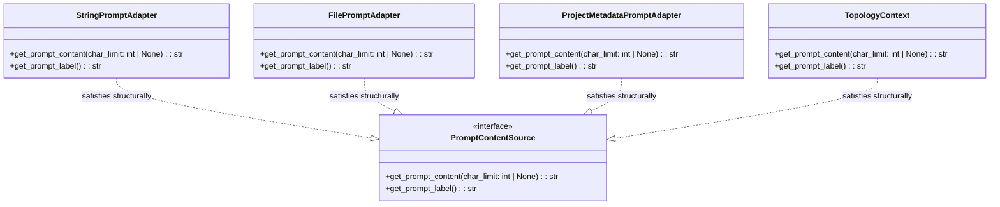
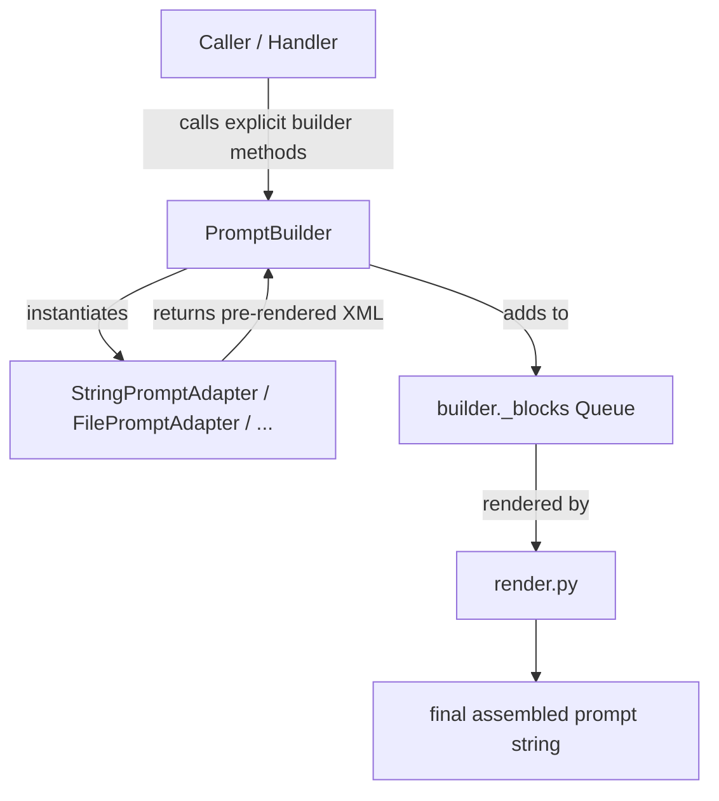

# LLM Adapter Registry & Dispatch

## LLM Adapter Registry

The system employs a multi-provider auto-discovery registry for its underlying LLM backends (introduced in Feature 3.12a).

- **Auto-Discovery**: Any new file added to `src/specweaver/llm/adapters/` that defines an `LLMAdapter` subclass with a `provider_name` is automatically discovered at runtime by the `registry.py` module. No hardcoded imports or central dictionary registrations are needed, and the folder functions as a PEP 420 Implicit Namespace Package.
- **Supported Providers**: Natively supports `gemini`, `openai`, `anthropic`, `mistral`, and `qwen`.
- **Factory Encapsulation**: `src/specweaver/llm/factory.py` reads the project's linked database profile to instantiate the configured adapter dynamically. If no provider is explicitly set, the factory cleanly falls back to `gemini`.
- **Telemetry Transparency**: The factory automatically wraps any instantiated adapter inside a `TelemetryCollector` proxy to provide unified token usage, cost tracking, and streaming telemetry, totally invisible to the underlying adapter logic.
- **Cost Aggregation**: The registry dynamically aggregates `default_costs` mappings from all discovered adapters into a unified tier-sheet, ensuring new providers automatically inject their pricing rules without central hardcoding.

## LLM Function-Calling Dispatch

When the LLM uses native function calling (e.g., Gemini `FunctionDeclaration`), a
**dispatcher** maps `(name, args)` pairs from the LLM response to tool implementations.

```text
GeminiAdapter.generate_with_tools(messages, config, dispatcher)
    ← LLM returns: FunctionCall(name="grep", args={...})
    → dispatcher.execute("grep", args)
        → FileSystemTool.grep(...)
```

### Where the dispatcher lives

The dispatcher consumes tools — so it CANNOT live in `commons/` (which forbids
`tools/*`). It belongs at the **`sandbox/` root level** (e.g., `sandbox/dispatch.py`)
because `sandbox/` is the only layer that can consume all three sub-layers.

### Who calls the dispatcher

The dispatcher is consumed by `review/`, `planning/`, and `flow/` through the
`_build_tool_executor()` factory in `flow/_review.py`.

> [!WARNING]
> **Current violation:** `review/` and `planning/` both `forbid: sandbox/*` in
> their `context.yaml`, yet they import `ToolExecutor` from
> `sandbox/research/executor.py`. This is a boundary violation that
> needs to be resolved.

### Each tool owns its own definitions

Tool definitions (`ToolDefinition` from `llm/models.py`) should live with their
respective tools in `sandbox/{domain}/`, NOT centralized in a separate module.

## Pluggable Context & Injection-Safe PromptBuilder

The system leverages a structured, token-aware `PromptBuilder` to assemble LLM system prompts, instructions, files, and modular boundaries into XML-tagged blocks. 

To resolve the vulnerability to XML/HTML injection and the tight compile-time coupling between domain layers (like graph topology) and LLM infrastructure layers, the architecture implements a **Pluggable Context Protocol** and an **Injection-Safe Escaping Engine**.

### Modularity & Dependency Inversion (Duck-Typing Protocol)

Domain modules (such as `assurance/graph`) must remain independent of the `infrastructure/llm` package. To achieve this, the prompt building engine is encapsulated inside a dedicated sub-package:
`src/specweaver/infrastructure/llm/prompt/`

This directory isolates:
* `interfaces.py`: Houses the `PromptContentSource` protocol.
* `builder.py`: Implements the `PromptBuilder`.
* `render.py`, `constants.py`, `profiles.py`: House rendering logic and profiles.
* `adapter.py`: Consolidates all input prompt adapters (`StringPromptAdapter`, `FilePromptAdapter`, `ProjectMetadataPromptAdapter`).

The core interface is the `PromptContentSource` protocol:
* **`get_prompt_content(char_limit: int | None = None)`**: Returns the text content to inject into the prompt, with optional raw content slicing before formatting/escaping to prevent XML/CDATA breakout on dynamic budget truncation.
* **`get_prompt_label()`**: Returns the identifier/name of the context block.

Domain models (like `TopologyContext` in `assurance/graph`) implement these two methods natively. Because Python protocols are structurally resolved (duck-typed), the domain models satisfy the prompt injection contract without importing any LLM classes or modules.

Below is the package layout and boundary graph showing this clean layer separation:



### Strongly-Typed Context Injection

The prompt builder exposes explicit, strongly-typed methods for different raw context types, delegating formatting and escaping directly to their respective adapters:
1. **String Context (`add_string_context`):** Wraps raw strings into `StringPromptAdapter`.
2. **File Context (`add_file_context`):** Wraps paths into `FilePromptAdapter`.
3. **Project Metadata (`add_project_metadata_context`):** Wraps project config models into `ProjectMetadataPromptAdapter`.
4. **Conforming Sources (`add_context`):** A polymorphic entry point for objects already implementing the `PromptContentSource` protocol natively (e.g., `TopologyContext`).

This preserves separation of concerns, keeps the builder API self-documenting, and prevents dynamic runtime type guessing.

The diagram below details the data flow and prompt assembly pipeline:




