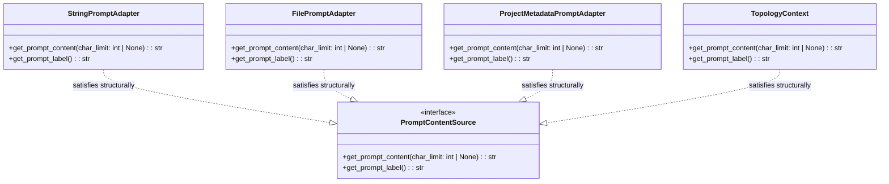
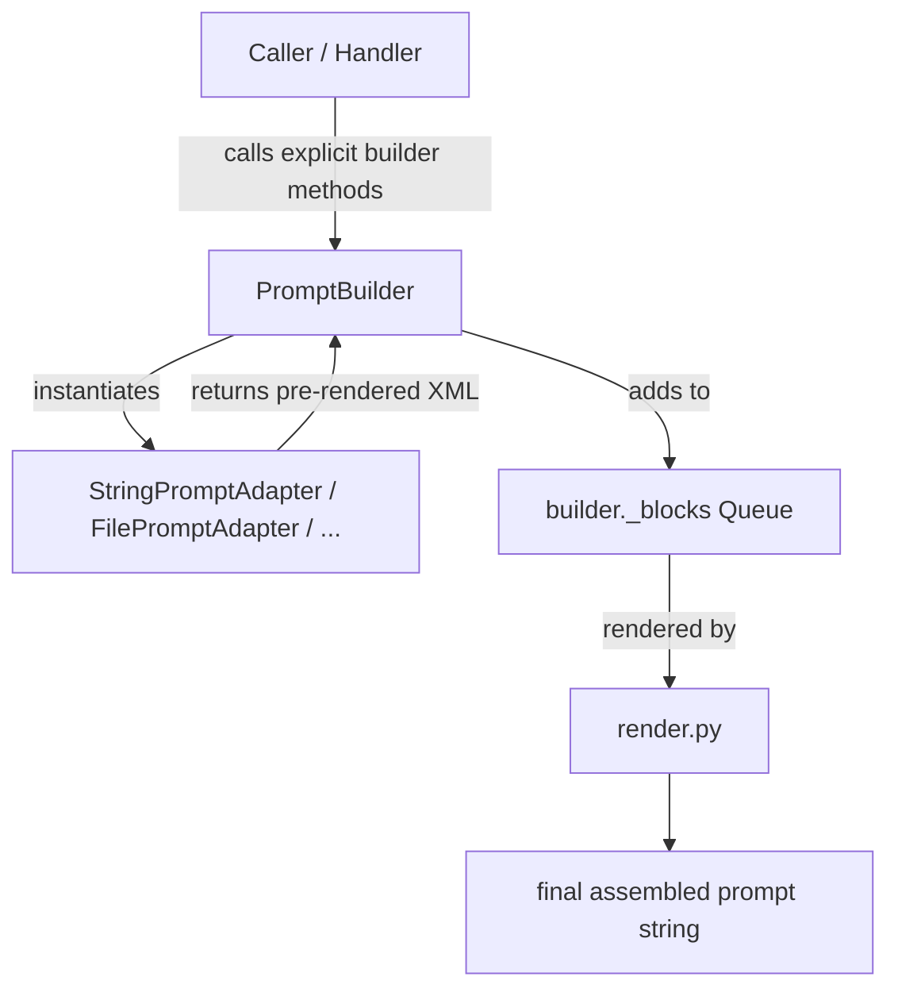

# LLM Adapter Registry & Dispatch

The LLM layer (`src/specweaver/infrastructure/llm/`) has three parts: an adapter registry that finds
provider backends, a tool dispatcher for native function calling, and a `PromptBuilder` that
assembles escaped, XML-tagged prompts.

## LLM adapter registry

Multi-provider, auto-discovered (introduced in Feature 3.12a).

| Part | What it does |
|---|---|
| **Auto-discovery** | `adapters/registry.py` imports every module in `src/specweaver/infrastructure/llm/adapters/` and registers each `LLMAdapter` subclass with a `provider_name`. |
| **Providers** | `gemini`, `openai`, `anthropic`, `mistral`, `qwen` |
| **Factory** | `infrastructure/llm/factory.py` builds the configured adapter from the project's settings (its linked database profile). Default provider: `gemini`. |
| **Telemetry** | The factory wraps the adapter in a `TelemetryCollector` proxy: token usage, cost, streaming telemetry. The adapter does not know. |
| **Cost table** | The registry merges every adapter's `default_costs` into one tier-sheet. |

Rules:

- Adding a provider = adding one file under `adapters/`. No hardcoded imports, no central
  dictionary. The folder is a PEP 420 implicit namespace package (no `__init__.py`).
- New providers bring their own pricing via `default_costs`; nothing central changes.

(Since moved: this package was `src/specweaver/llm/` (adapters in `src/specweaver/llm/adapters/`); `registry.py` and `src/specweaver/llm/factory.py`
now live under `src/specweaver/infrastructure/llm/`.)

## LLM function-calling dispatch

When the LLM uses native function calling (e.g., Gemini `FunctionDeclaration`), a
**dispatcher** maps `(name, args)` pairs from the LLM response to tool implementations.

```text
GeminiAdapter.generate_with_tools(messages, config, dispatcher)
    ← LLM returns: FunctionCall(name="grep", args={...})
    → dispatcher.execute("grep", args)
        → FileSystemTool.grep(...)
```

| Question | Answer |
|---|---|
| Where it lives | `ToolDispatcher` in `sandbox/dispatcher.py` — at the **`sandbox/` root**, the only layer that can consume all its sub-layers. |
| Why not `commons/` | The dispatcher consumes tools; `commons/` forbids that (its `context.yaml` forbids all `specweaver/*`, which includes `tools/*`). |
| Who builds it | `_build_tool_dispatcher()` in `core/flow/handlers/review.py` (flow layer). |
| How `review/` and `planning/` use it | Through `ToolDispatcherProtocol` in `infrastructure/llm/models.py` — no `sandbox` import. |

Both `review/` and `planning/` `forbid: sandbox/*` in their `context.yaml`, and that now holds.
Replaced: the `ToolExecutor` god-object (`sandbox/research/executor.py`, built by
`_build_tool_executor()` in `flow/_review.py`), which `review/` and `planning/` imported in
violation of that rule.

**Rule:** tool definitions (`ToolDefinition` from `llm/models.py`) live with their tools in
`sandbox/{domain}/`, not in a central module.

## Pluggable context & injection-safe PromptBuilder

`PromptBuilder` assembles system prompts, instructions, files and module boundaries into
token-aware, XML-tagged blocks. Two mechanisms:

- **Pluggable Context Protocol** — domain layers (e.g. graph topology) feed the prompt without a
  compile-time dependency on the LLM layer.
- **Injection-Safe Escaping Engine** — content is escaped so it cannot break out of its XML block (XML/HTML injection).

### Package layout

Domain modules (such as `assurance/graph`) must not depend on `infrastructure/llm`. The prompt
engine lives in its own sub-package, `src/specweaver/infrastructure/llm/prompt/`:

| File | Holds |
|---|---|
| `interfaces.py` | `PromptContentSource` protocol |
| `builder.py` | `PromptBuilder` |
| `render.py`, `constants.py`, `profiles.py` | rendering logic and profiles |
| `adapter.py` | input prompt adapters: `StringPromptAdapter`, `FilePromptAdapter`, `ProjectMetadataPromptAdapter` |

### `PromptContentSource` protocol

- **`get_prompt_content(char_limit: int | None = None)`** — the text to inject. `char_limit` slices
  the raw content *before* formatting/escaping, so budget truncation cannot cause an XML/CDATA
  breakout.
- **`get_prompt_label()`** — the identifier/name of the context block.

Domain models (like `TopologyContext` in `assurance/graph`) implement these two methods. Python
protocols are structural (duck-typed), so they satisfy the contract without importing any LLM
module.


```mermaid
classDiagram
    class PromptContentSource {
        <<interface>>
        +get_prompt_content(char_limit: int | None) : str
        +get_prompt_label() : str
    }
    class StringPromptAdapter {
        +get_prompt_content(char_limit: int | None) : str
        +get_prompt_label() : str
    }
    class FilePromptAdapter {
        +get_prompt_content(char_limit: int | None) : str
        +get_prompt_label() : str
    }
    class ProjectMetadataPromptAdapter {
        +get_prompt_content(char_limit: int | None) : str
        +get_prompt_label() : str
    }
    class TopologyContext {
        +get_prompt_content(char_limit: int | None) : str
        +get_prompt_label() : str
    }

    StringPromptAdapter ..|> PromptContentSource : satisfies structurally
    FilePromptAdapter ..|> PromptContentSource : satisfies structurally
    ProjectMetadataPromptAdapter ..|> PromptContentSource : satisfies structurally
    TopologyContext ..|> PromptContentSource : satisfies structurally
```

### Typed context injection

One explicit method per raw context type; formatting and escaping are delegated to the adapter:

1. **String context (`add_string_context`)** → `StringPromptAdapter`.
2. **File context (`add_file_context`)** → `FilePromptAdapter`.
3. **Project metadata (`add_project_metadata_context`)** → `ProjectMetadataPromptAdapter`.
4. **Conforming sources (`add_context`)** — any object already implementing `PromptContentSource`
   (e.g. `TopologyContext`).

Why: the API documents itself and there is no runtime type guessing.


```mermaid
flowchart TD
    Caller[Caller / Handler] -->|calls explicit builder methods| Builder[PromptBuilder]
    Builder -->|instantiates| Adapters[StringPromptAdapter / FilePromptAdapter / ...]
    Adapters -->|returns pre-rendered XML| Builder
    Builder -->|adds to| Queue[builder._blocks Queue]
    Queue -->|rendered by| Render[render.py]
    Render --> Output[final assembled prompt string]
```
