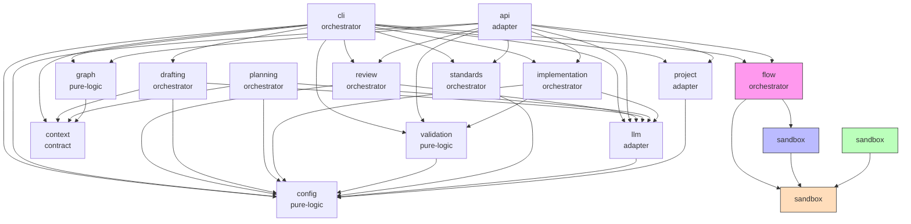

# Module Dependency Graph

```mermaid
graph TD
    CLI[cli<br/>orchestrator] --> Config[config<br/>pure-logic]
    CLI --> Validation[validation<br/>pure-logic]
    CLI --> Review[review<br/>orchestrator]
    CLI --> Drafting[drafting<br/>orchestrator]
    CLI --> Implementation[implementation<br/>orchestrator]
    CLI --> Flow[flow<br/>orchestrator]
    CLI --> Graph[graph<br/>pure-logic]
    CLI --> LLM[llm<br/>adapter]
    CLI --> Project[project<br/>adapter]
    CLI --> Standards[standards<br/>orchestrator]
    CLI --> Context[context<br/>contract]

    API[api<br/>adapter] --> Config
    API --> Validation
    API --> Review
    API --> Implementation
    API --> Flow
    API --> Graph
    API --> LLM
    API --> Project
    API --> Standards

    Flow --> LoomAtoms[sandbox]
    Flow --> LoomCommons[sandbox]

    Review --> LLM
    Review --> Config
    Drafting --> LLM
    Drafting --> Config
    Drafting --> Context
    Planning[planning<br/>orchestrator] --> LLM
    Planning --> Config
    Planning --> Context
    Implementation --> LLM
    Implementation --> Config
    Implementation --> Validation
    Graph --> Context
    Validation --> Config
    Standards --> Config
    LLM --> Config
    Project --> Config

    LoomAtoms --> LoomCommons
    LoomTools[sandbox] --> LoomCommons

    style Flow fill:#f9e,stroke:#333
    style LoomAtoms fill:#bbf,stroke:#333
    style LoomTools fill:#bfb,stroke:#333
    style LoomCommons fill:#fdb,stroke:#333
```
