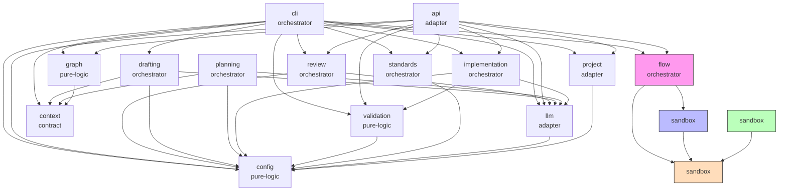

# Module Dependency Graph

Which top-level module may import which. Each node shows its archetype. The per-module rules
(consumes / forbids) are in [Hard Dependency Rules](hard_dependency_rules.md).

**Since moved (2026-09-25):** the graph uses the old flat module names. `src/specweaver/` is now
grouped into `assurance/`, `core/`, `infrastructure/`, `interfaces/`, `sandbox/`, `workflows/`,
`workspace/`, `commons/`, `graph/`. The enforced graph is `tach.toml` (`exact = true`), checked by
the `tach` gate in `scripts/quality.py`.
