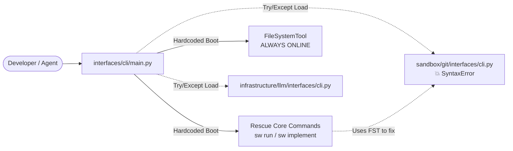

# CLI Architecture: Native Healer & Rescue Core

The SpecWeaver CLI acts as the system's "Rescue Core." 

Because SpecWeaver employs a decentralized plugin architecture where domains expose their own CLI commands, a syntax error or fatal bug in one domain's `interfaces/cli` module could theoretically bring down the entire tool, preventing the agent from using SpecWeaver to fix SpecWeaver.

## The Try/Except Plugin Loader
To solve this, `interfaces/cli/main.py` dynamically loads plugins using isolated `try/except` blocks. If a plugin crashes during import, the CLI still boots up successfully, displaying a red error message for the failed module, but keeping the core Rescue Commands (`sw run`, `sw implement`) online so the agent can heal the broken module.

