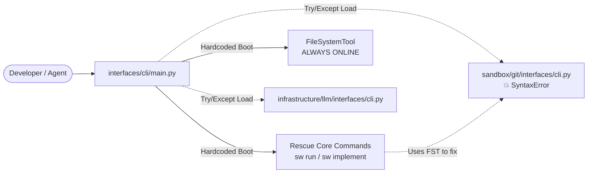

# CLI Architecture: Native Healer & Rescue Core

The `sw` CLI is a Typer app. Each domain exposes its own commands from an `interfaces/cli` module,
and `interfaces/cli/main.py` mounts them.

**Why:** a broken plugin must not take the whole CLI down. The CLI is the "Rescue Core" — the agent
uses SpecWeaver to fix SpecWeaver, so the rescue commands (`sw run`, `sw implement`) have to stay
online while one domain's CLI module is broken.

## The try/except plugin loader

`interfaces/cli/main.py` mounts each plugin inside its own `try/except` block. If one fails to
import, the CLI still boots, prints a red error line for that module, and the other plugins stay
available.

| Plugin | Module |
|---|---|
| config | `core/config/interfaces/cli.py` |
| graph, lineage | `graph/interfaces/cli.py` |
| validation | `assurance/validation/interfaces/cli.py` |
| standards | `assurance/standards/interfaces/cli.py` |
| costs, usage | `infrastructure/llm/interfaces/cli.py` |
| implement | `workflows/implementation/interfaces/cli.py` |
| review | `workflows/review/interfaces/cli.py` |
| workspace, sandbox | `workspace/project/interfaces/cli.py`, `interfaces/cli/routers/sandbox_router.py` |
| flow pipelines (`sw run`) | `core/flow/interfaces/cli.py` |
| serve | `interfaces/cli/routers/serve_router.py` |

Target design:

```mermaid
graph LR
    User([Developer / Agent]) --> CLI[interfaces/cli/main.py]
    
    CLI -->|Hardcoded Boot| Core[Rescue Core Commands<br>sw run / sw implement]
    CLI -->|Hardcoded Boot| FST[FileSystemTool<br>ALWAYS ONLINE]
    
    CLI -.->|Try/Except Load| Plug1[infrastructure/llm/interfaces/cli.py]
    CLI -.->|Try/Except Load| Plug2[sandbox/git/interfaces/cli.py<br>💥 SyntaxError]
    
    Core -.->|Uses FST to fix| Plug2
```

## Limits (as of 2026-09-25)

The code does not yet match the diagram:

- **Only `ImportError` is caught.** A `SyntaxError` (or any other exception) raised while importing a
  plugin still crashes the CLI.
- **The rescue commands are plugins too.** `sw run` (`core/flow/interfaces/cli.py`) and
  `sw implement` (`workflows/implementation/interfaces/cli.py`) load through the same `try/except`
  blocks; nothing is mounted as a hardcoded boot.
- There is no always-online `FileSystemTool` mount in the CLI, and no
  `sandbox/git/interfaces/cli.py` (the diagram's example of a broken plugin).
