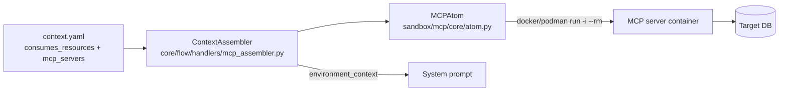

# MCP Architecture: Features 3.32c and 3.32c-1

How SpecWeaver uses the **Model Context Protocol (MCP)** to give the LLM real facts about the target
environment (e.g. a live database schema) instead of letting it guess ("Blank Canvas Syndrome",
hallucinated environments). Red-team approved.



## 1. Feature 3.32c: common MCP client

**Goal:** a native JSON-RPC MCP client, zero-trust, without LLM round-trip latency.

### Pre-fetched context envelope

Not chosen: exposing MCP tool arrays to the LLM (3000+ tokens), or letting the LLM spend API rounds
calling MCP tools to find data (latency spiral). Instead SpecWeaver **pre-fetches**:

1. **Target bound** — the local `context.yaml` declares exactly which resources it needs.
   ```yaml
   consumes_resources:
     - "mcp://database/schema/users"
     - "mcp://database/schema/billing"
   ```
2. **Assembler hook** — before the prompt is sent, `ContextAssembler` connects to the MCP server,
   reads those resources, and serializes the schema strings.
3. **Injection** — the data goes into an `<environment_context>` XML block in the system prompt.

**Result:** no tool round-trips, and token cost is bounded by the resources the boundary declares.

## 2. Feature 3.32c-1: external DB context harness

**Goal:** introspect target databases without RCE (Remote Code Execution), supply-chain exposure,
or orphaned connections.

### Ephemeral Docker MCP pod

**Rule:** no `npx` or `uvx` wrapper execution. Native execution opens supply-chain RCE and leaves
"zombie" processes that exhaust database connection pools.

1. **Pinned container execution.** MCP DB servers run in ephemeral, version-pinned containers via
   `docker run -i --rm`. `MCPAtom` refuses any runtime other than `docker`/`podman` (NFR-2).
   ```yaml
   mcp_servers:
     postgres:
       command: "docker"
       args: ["run", "-i", "--rm", "mcp/postgres@sha256:abcd...", "${VAULT:DB_URL}"]
   ```
   **Why:** when SpecWeaver closes the pipe, the container dies. No zombie processes, no lingering
   TCP connections to the database.

2. **`vault.env` credential shield.** Connection strings never go in `context.yaml` (tracked by
   Git). They go in `.specweaver/vault.env`, which is `.gitignore`d and injected into the container
   at runtime.
   - `sw init` scaffolding creates `.specweaver/vault.env` and adds it to `.gitignore`.
   - The runner aborts if `vault.env` is tracked by Git (`verify_vault_security`,
     `core/flow/engine/security.py`).
   - `MCPAtom` scrubs env values of 8+ characters from server responses (`***RESTRICTED***`).

## 3. Known limitations & mitigations

### Temporal disconnect & topology cycle deadlock

**Risk:** the MCP server reads the live schema from the real database. If an 8-minute pipeline is
**building a new table** (Tier 1) and Tier 2 then queries the MCP server for that schema, it gets
an empty result — the code is not deployed to the DB yet.

**Mitigation:** topology DAG routing (Feature 3.49 and Tiered Dependencies).

- `ContextAssembler` must run **lazily** per tier, not at global `Wave 0`.
- Agents treat `Spec.md` as the source of truth for the *delta* (the future); MCP context is the
  *baseline past*.

### Docker friction

**Risk:** `docker run -i --rm` solves supply-chain and zombie-process problems but requires
**Docker / Podman installed and running locally**.

**Mitigation:** SpecWeaver already depends on Podman/Docker elsewhere (e.g., Feature 3.45 Ephemeral
Execution Containers). MCP makes a container runtime a core prerequisite: one infrastructure
requirement, not two.
