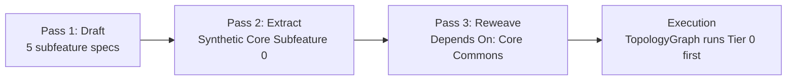

# Synthetic Commons and Interactive Questionnaire

Architecture notes for two features that stop autonomous generation from going wrong:
**Feature 3.51 (Synthetic Commons Extraction)** against "Parallel Duplication" and **Feature 3.52
(Interactive Design Questionnaire)** against "Blank Canvas Syndrome". Each covers feasibility,
prerequisites and logic.

---

## Feature 3.52: Interactive Design Questionnaire

> [!IMPORTANT]
> **Superseded in mechanism, 2026-08-27. Kept unedited below as the record.**
> This became capability `D-INTL-04`, which was retired into **`D-INTL-07` (Agentic Interview
> Drafting)** as its bootstrap rubric `[agreed 2026-08-27]`.
>
> **Still true:** the goal — an unsupervised LLM must not guess persistence, auth or archetype on a
> blank canvas; the output — a `context.yaml`, **localized to the directory the command ran in**;
> and the *Monolith* mitigation below.
>
> **No longer the plan:** the mechanic. The fixed three-question `Typer` wizard described here is
> the hardcoded question tree the roadmap rejected on 2026-07-21. `D-INTL-07` replaces it with an
> adaptive interview — rounds over a frontier, a recommended answer beside every question, facts
> looked up rather than asked, and an unanswered question that blocks rather than defaulting.

**Goal**: Prevent "Blank Canvas Syndrome" where an unsupervised LLM guesses critical bounds (Database framework, Authentication layer) during greenfield generation, causing architectural debt. 

**Mechanic**: Enforce hard CLI Wizard constraints prior to executing the `sw draft` / `sw plan` prompt.

### Architecture
SpecWeaver already utilizes `Typer` and `Rich` for CLI interactions. 
Before the `DecomposeHandler` invokes an LLM, the CLI triggers a localized questionnaire:
1. "Select Target Framework Archetype."
2. "Select Target Persistence Layer."
3. "Select Target Authentication Pattern."

### Prerequisites for Deterministic ROI
To ensure the LLM complies with the answers, the responses are **not just injected into the chat context**. The system must explicitly construct or modify the local `context.yaml` directory manifest:
```yaml
# Generated by sw init wizard
name: billing_domain
archetype: spring-boot
persistence: postgres-jpa
auth_pattern: oauth2-stateless
```
This bounds the LLM's infinite solution space into an explicit corridor using SpecWeaver's existing Polyglot Profile tools and pipeline overrides.

### Edge Case Mitigation
- **The "Monolith" Edge Case**: A global questionnaire setting `react-node` at the root will fail on a strictly Python backend subsystem. 
- *Mitigation*: The questionnaire will inherently target and bind exclusively to the directory in which `sw init`/`sw draft` is executed, localizing the `context.yaml` isolation layer.

---

## Feature 3.51: Synthetic Commons Extraction (Synergies)

Roadmap capability: `B-INTL-03` (planned), in
[topic_04_intelligence.md](../../roadmap/topics/topic_04_intelligence.md).

**Goal**: stop parallel pipelines from generating conflicting implementations of the same utility
(pre-emptive de-duplication).

**Mechanic**: an extraction pass inside the `DecomposeHandler` finds structural overlaps across
planned subcomponents and moves them into a shared dependency root.

### Architecture



1. **Pass 1 (Draft)**: the LLM drafts 5 subfeature specs blindly into memory.
2. **Pass 2 (Extract)**: an extraction model (Claude 3.5/o3) scans the 5 specs for cross-cutting
   requirements (e.g. all 5 need an Authentication Token DTO) and creates a "Synthetic Core
   Subfeature 0" holding the token interfaces.
3. **Pass 3 (Reweave)**: the 5 original specs are rewritten: their duplicated boilerplate is
   removed and replaced by a hard dependency (`Depends On: Core Commons`).
4. **Execution**: SpecWeaver schedules from the `TopologyGraph`, so the DAG orchestrator runs
   "Tier 0" (Core Commons) first. The 5 dependent subfeatures are blocked until Tier 0 validates.

### Risks and mitigations

- **"Spaghetti Dump"**: the LLM groups unrelated functions into one large `utils.py`.
  - *Mitigation*: **Feature 3.20a (Tach internal Layer Enforcement)** keeps domain logic out of
    infrastructure. A `GateType.HITL` prompt asks the user: *"Agent recognized 3 synergies.
    Extracting a unified Auth DTO. [Y/n]"*. The developer checks the extraction mapping before any
    code is generated.
- **Diverging Semantic Lifecycles**: merging two similarly named classes that must evolve
  differently (False Equivalence).
  - *Mitigation*: prompt boundaries limit extraction to Data Transfer Objects (DTOs), Interface
    Definitions and Infrastructure Configs. Business rules and mutable schemas are never extracted.
