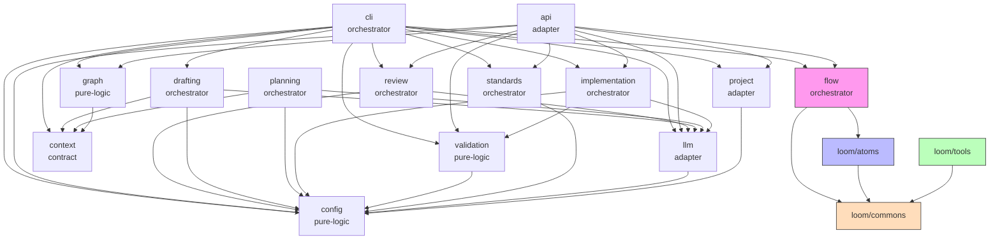

# SpecWeaver Architecture Reference

> **Consult this document before planning, writing specs, or implementing
> anything in the SpecWeaver codebase.**

## Contents

1. [System Overview](#system-overview) — module tree
2. [Feature Map](#feature-map) — what exists, where, and why
3. [Module Dependency Graph](#module-dependency-graph) — Mermaid visualization
4. [Hard Dependency Rules](#hard-dependency-rules) — consumes/forbids tables
5. [Archetypes](#archetypes) — structural pattern definitions
6. [Tool Architecture](#tool-architecture-4-layer-stack) — Executor → Tool → Interface → Atom
7. [LLM Function-Calling Dispatch](#llm-function-calling-dispatch) — how agents call tools
8. [Idea to Production](#idea-to-production--the-default-workflow) — L1–L6 lifecycle
9. [Pipeline Engine](#pipeline-engine) — steps, gates, handlers, runner
10. [Atom vs Tool](#atom-vs-tool) — trust model, consumer differences
11. [Guardrails](#guardrails--how-safety-is-built-and-assured) — 7-layer safety stack
12. [Known Boundary Violations](#known-boundary-violations) — current issues
13. [Anti-Patterns](#anti-patterns-learned) — what not to do
14. [Cross-References](#cross-references) — related docs

## System Overview

SpecWeaver is a specification-driven development lifecycle tool. It enforces
spec quality through a 10-test battery and manages AI agents via
role-restricted tool interfaces.

```
specweaver/                       ← level: system, archetype: orchestrator
├── cli/                          ← Typer CLI (`sw` command)
├── api/                          ← FastAPI REST server
├── config/                       ← Pydantic settings + SQLite DB
├── context/                      ← HITL context providers
├── drafting/                     ← LLM-assisted spec drafting
├── flow/                         ← Pipeline engine (models, runners, gates, handlers)
├── graph/                        ← Topology graph + dependency analysis
├── implementation/               ← Code generation from specs
├── llm/                          ← LLM provider abstraction
│   ├── adapters/                 ← Concrete adapters (Gemini)
│   ├── mention_scanner/          ← Auto-detect spec/file mentions in LLM output
│   ├── collector.py              ← TelemetryCollector decorator (3.12)
│   ├── telemetry.py              ← Cost estimation + UsageRecord (3.12)
│   └── factory.py                ← Adapter creation with optional telemetry wrapping
├── loom/                         ← Execution engine (tools, atoms, commons)
│   ├── tools/                    ← Agent-facing capability providers
│   │   ├── filesystem/           ← FileSystemTool + role interfaces
│   │   ├── git/                  ← GitTool + role interfaces
│   │   ├── test_runner/          ← TestRunnerTool + role interfaces
│   │   └── web/                  ← WebTool + role interfaces
│   ├── atoms/                    ← Engine-internal workflow ops
│   │   ├── filesystem/
│   │   ├── git/
│   │   └── test_runner/
│   └── commons/                  ← Shared executors + helpers
│       ├── filesystem/           ← FileExecutor, search helpers
│       ├── git/                  ← GitExecutor
│       └── test_runner/          ← TestRunnerExecutor
├── pipelines/                    ← YAML pipeline definitions (data only)
├── planning/                     ← Implementation plan generation
├── project/                      ← Project discovery + scaffolding
├── review/                       ← LLM-based spec/code review
├── standards/                    ← Codebase standards auto-discovery
└── validation/                   ← 10-test spec quality battery
    └── rules/                    ← Rule implementations (spec + code)
```

---

## Feature Map

Each feature was built incrementally across 3 phases. For each feature:
**Where** = specific files, **What** = their role, **Why there** = architectural reasoning.

### Phase 1 — MVP (Prove the Core Loop)

**Project scaffold** (`sw init`)
- `project/scaffold.py` — creates directory structure + registers in DB. Lives in `project/` (adapter archetype) because it does filesystem I/O to discover/create project structures.
- `config/database.py` — SQLite schema + multi-project registry. Lives in `config/` (pure-logic, leaf) because every module needs settings — it's at the bottom.
- `cli/project_commands.py` — `sw init/use/projects/remove`. Lives in `cli/` (entry-point) — thin delegation to `project/`.

**Loom layer** (filesystem tools + atoms + interfaces)
- `loom/commons/filesystem/executor.py` — `FileExecutor`: raw I/O with path validation, symlink blocking, `FolderGrant`. In `commons/` because it's shared infra consumed by both tools and atoms.
- `loom/tools/filesystem/tool.py` — `FileSystemTool`: intent-based facade with `ROLE_INTENTS` gating. In `tools/` because it's the agent-facing layer.
- `loom/tools/filesystem/interfaces.py` — `ReviewerFileInterface`, `ImplementerFileInterface`, etc. Each role sees only its allowed methods — physically absent, not just blocked.
- `loom/atoms/filesystem/atom.py` — `FileSystemAtom`: engine-internal ops (unrestricted). In `atoms/` because the engine is trusted.

**Validation engine** (19 rules)
- `validation/runner.py` — `ValidationRunner`: applies rule list to a spec. In `validation/` (pure-logic) because it's stateless computation — no I/O, no LLM.
- `validation/rules/spec/s01_one_sentence.py` through `s11_...py` — individual rule implementations. Each is a pure function: `(spec_text) → findings[]`.
- `validation/rules/code/c01_...py` through `c08_...py` — code quality rules.

**LLM adapter** (Multi-Provider)
- `llm/adapter.py` — `LLMAdapter` abstract base class (provider-agnostic contract). In `llm/` (adapter archetype) because it wraps an external service.
- `llm/adapters/__init__.py` — Auto-discovery registry. Scans and registers adapters dynamically at import.
- `llm/adapters/gemini.py` — `GeminiAdapter`: Gemini API calls, error translation, response parsing.
- `llm/adapters/openai.py` — `OpenAIAdapter`: OpenAI SDK wrapper with full tool use.
- `llm/adapters/anthropic.py` — `AnthropicAdapter`: Anthropic SDK wrapper with full tool use.
- `llm/adapters/mistral.py` — `MistralAdapter`: Mistral SDK wrapper.
- `llm/adapters/qwen.py` — `QwenAdapter`: Qwen via OpenAI-compatible endpoint.
- `llm/prompt_builder.py` — `PromptBuilder`: XML-tagged block assembly with token budgets and metadata injection (`add_project_metadata`). In `llm/` because prompt construction is part of the LLM abstraction.
- `llm/models.py` — `LLMResponse`, `ToolDefinition`, `TaskType`, `GenerationConfig`. Data models for the LLM contract.
- `llm/telemetry.py` — `estimate_cost()`, `create_usage_record()`, `CostEntry`, `UsageRecord`. Pure-logic cost estimation with configurable pricing tables. In `llm/` because it's LLM-specific pricing logic. *(Feature 3.12)*
- `llm/collector.py` — `TelemetryCollector`: decorator wrapping `LLMAdapter`, captures token usage per call. In `llm/` because it's an adapter-level concern. *(Feature 3.12)*
- `llm/factory.py` — `create_llm_adapter()`: factory function that creates adapter + optional `TelemetryCollector` wrapping. Loads cost overrides from DB. *(Feature 3.12)*
- `config/_db_telemetry_mixin.py` — `TelemetryMixin`: DB persistence for `llm_usage_log` + `llm_cost_overrides` tables. In `config/` because it's a DB mixin. *(Feature 3.12)*

**Spec drafting** (`sw draft`)
- `drafting/drafter.py` — `Drafter`: multi-turn LLM interaction for spec authoring. In `drafting/` (orchestrator) because it coordinates LLM + HITL context.
- `context/providers.py` — `ContextProvider`, `HITLProvider`: supply project context to the drafter. In `context/` (contract archetype) — pure interfaces, no implementation.

**Spec/Code review** (`sw review`)
- `review/reviewer.py` — `Reviewer`: sends spec/code to LLM, parses structured verdict. In `review/` (orchestrator) — coordinates LLM calls + verdict parsing.
- `review/models.py` — `ReviewResult`, `ReviewVerdict`, `ReviewFinding`. Pure data models.

**Code generation** (`sw implement`)
- `implementation/generator.py` — `CodeGenerator`: spec → code + tests via LLM. In `implementation/` (orchestrator) — coordinates LLM + validation.

### Phase 2 — Flow Engine (Orchestration)

**Topology graph** (`sw context`)
- `graph/topology.py` — `TopologyGraph`: builds dep graph from `context.yaml` files, provides impact analysis, cycle detection. In `graph/` (pure-logic) — stateless computation over context data.
- `graph/selectors.py` — cross-cutting queries ("all modules with archetype=adapter"). Pure functions.

**Config store** (`sw config`, `sw projects`)
- `config/settings.py` — `SpecWeaverSettings`, `ValidationSettings`, `LLMSettings`: Pydantic models with env-var loading + TOML overrides. In `config/` because it's the root of the settings hierarchy.
- `config/database.py` — `Database`: SQLite with migrations (v1→v5), stores projects, LLM profiles, validation overrides, pipeline state.

**Pipeline models + runner**
- `flow/models.py` — `PipelineDefinition`, `PipelineStep`, `GateDefinition`, `StepAction`, `StepTarget`: pure data model (no execution). In `flow/` because it defines what a pipeline *is*.
- `flow/parser.py` — YAML → `PipelineDefinition` deserialization.
- `flow/runner.py` — `PipelineRunner`: walks steps, dispatches to handlers, evaluates gates. The core execution loop.
- `flow/gates.py` — `GateEvaluator`: auto/hitl/loop_back/retry/abort logic. Extracted from runner for testability.
- `flow/handlers.py` — `StepHandlerRegistry`: maps `(action, target)` → handler class. Each handler (`_draft.py`, `_review.py`, `_validation.py`, `_generation.py`, `_lint_fix.py`) adapts a step to the corresponding domain module.
- `flow/state.py` — `PipelineRun`, `StepRecord`, `StepResult`: mutable run state.
- `flow/store.py` — `StateStore`: SQLite persistence for run state + audit log.
- `pipelines/*.yaml` — declarative pipeline definitions (data, not code).

**Git tools** (loom) — same 4-layer pattern as filesystem:
- `loom/commons/git/executor.py` — `GitExecutor`: whitelisted git commands, `_BLOCKED_ALWAYS` list.
- `loom/tools/git/tool.py` — `GitTool`: conventional commit enforcement, role gating.
- `loom/tools/git/interfaces.py` — `ReviewerGitInterface` (read-only), `ImplementerGitInterface` (commit allowed).
- `loom/atoms/git/atom.py` — `EngineGitExecutor`: unrestricted for engine use.

**Test runner** (loom) — same pattern:
- `loom/commons/test_runner/executor.py` — `TestRunnerExecutor`: subprocess pytest with output capture.
- `loom/tools/test_runner/tool.py` — `TestRunnerTool`: role-gated test execution.
- `loom/atoms/test_runner/atom.py` — `TestRunnerAtom`: engine-internal test runs + lint-fix reflection.

### Phase 3 — Feature Expansion (Incremental)

**3.1 Kind-aware validation** — Added `--level feature` thresholds to `validation/`. Created `feature_decomposition.yaml` pipeline in `pipelines/`. Added `DecomposeHandler` to `flow/`. Each lives where its archetype dictates: rules in pure-logic, pipeline in data, handler in orchestrator.

**3.2 Constitution** — `project/constitution.py` handles discovery/validation of `CONSTITUTION.md` (in `project/` because it's filesystem discovery). `llm/prompt_builder.py` got `add_constitution()` (in `llm/` because it's prompt assembly). `cli/constitution_commands.py` added CLI surface.

**3.3 Domain profiles** — `config/profiles.py` defines 5 built-in profiles with threshold presets. Lives in `config/` because profiles are configuration data. DB v5 migration added profile storage. `cli/config_commands.py` added 5 profile CLI commands.

**3.4 Rules-as-pipeline** — `validation/` extended with sub-pipeline YAML definitions using inheritance (`extends: base`). `pipelines/validation_spec_*.yaml` files define domain-specific rule ordering. Custom D-prefix rules loaded from project dirs. `RuleAtom` adapter bridges rules→pipeline execution.

**3.5 Standards auto-discovery** — `standards/analyzer.py` (`StandardsAnalyzer`), `standards/python_analyzer.py` (`PythonStandardsAnalyzer`): single-pass AST extraction for 6 categories. In its own module `standards/` (orchestrator) because it's a self-contained capability that only needs `config/` for DB storage.

**3.6 Plan phase** — `planning/planner.py` (`Planner`): generates structured Plan artifacts from specs. `flow/_generation.py` got `PlanSpecHandler`. Planning is a separate module from implementation because it produces *plans* (architecture decisions, file layout), not *code*.

**3.7 REST API** — `api/` (adapter archetype): FastAPI server wrapping domain modules as HTTP endpoints. Forbidden from importing `cli/` or `loom/*` — it's a parallel entry point to CLI, not a wrapper around it.

**3.8 Web dashboard** — Extends `api/` with HTMX+Jinja2 templates for browser UI. Same module because it's the same HTTP server, just with HTML rendering alongside JSON endpoints.

**3.12 Token & Cost Telemetry** — `llm/telemetry.py` (`CostEntry`, `UsageRecord`), `llm/collector.py` (`TelemetryCollector`), `config/_db_telemetry_mixin.py` (`llm_cost_overrides`). Lives in `llm/` because it's LLM usage, and `config/` for SQLite persistence.

**3.12a Multi-Provider Adapter Registry** — `llm/adapters/__init__.py` (auto-discovery registry scanning package at import), `llm/adapters/base.py` (self-describing adapter ABC), `config/settings.py` (`provider` field). Lives in `llm/adapters/` (adapter archetype) to support dynamic provider creation without central maps.

**3.13 Project Metadata Injection** — `llm/prompt_builder.py` updated to inject system data (project name, OS, archetype) ensuring robust reasoning references across LLM boundaries.

**3.13a Unified Runner Architecture** — The `PipelineRunner` (`flow/runner.py`) is now universally used to execute not just full YAML workflows but simple single-shot tasks (`sw review`, `sw draft`, `sw standards scan`) through dynamically constructed 1-step `PipelineDefinition` objects via `create_single_step()`. This removed disjoint telemetry-flushing and state management logic out of `cli/` and into the robust `flow/` engine.

### How Features Map to Lifecycle Layers

```
L1 (Business)        ← drafting, context
L2 (Architecture)    ← graph, standards (3.5)
L3 (Specification)   ← validation, review, constitution (3.2), profiles (3.3)
L4 (Implementation)  ← implementation, planning (3.6), loom tools
L5 (Review)          ← review, loom tools (git, filesystem, test_runner)
L6 (Deploy)          ← api (3.7), dashboard (3.8), container (3.9)
```

---

## Module Dependency Graph



---

## Hard Dependency Rules

### Top-Level Modules

| Module | Archetype | Consumes | Forbids |
|--------|-----------|----------|---------|
| `cli` | orchestrator | config, validation, review, drafting, implementation, flow, graph, llm, project, standards, context | loom/* |
| `api` | adapter | config, validation, review, implementation, flow, graph, llm, project, standards | cli, loom/* |
| `config` | pure-logic | *(leaf)* | loom/* |
| `context` | contract | *(leaf)* | loom/* |
| `drafting` | orchestrator | llm, config, context | loom/* |
| `flow` | orchestrator | config, llm, review, implementation, planning, validation, loom/atoms/test_runner, loom/dispatcher, loom/security | loom/tools/*, loom/commons/*, drafting, context |
| `graph` | pure-logic | context | loom/*, llm, drafting, implementation |
| `implementation` | orchestrator | llm, config, validation | *(none)* |
| `llm` | adapter | config | loom/* |
| `llm/adapters` | adapter | llm | loom/*, validation, drafting |
| `pipelines` | data | *(leaf)* | *(none)* |
| `planning` | orchestrator | llm, config, context, loom/dispatcher (type-only) | loom/* (except dispatcher) |
| `project` | adapter | config | loom/*, llm |
| `review` | orchestrator | llm, config, loom/dispatcher (type-only) | loom/* (except dispatcher) |
| `standards` | orchestrator | config | loom/* |
| `validation` | pure-logic | config | loom/*, llm |

> [!CAUTION]
> **12 of 16 modules explicitly `forbid: loom/*`.** Only `flow/` is allowed to
> touch loom (via atoms only, NOT tools or commons). The loom layer is isolated.

### Loom Sub-Layers

| Layer | Consumes | Forbids |
|-------|----------|---------|
| `commons/` | *(leaf — nothing)* | `tools/*`, `atoms/*` |
| `tools/` | `commons/*` | `atoms/*` |
| `atoms/` | `commons/*` | `tools/*` |
| `loom/` (root) | `tools/*`, `atoms/*`, `commons/*` | — |

> [!CAUTION]
> **Dependency flows UPWARD only within loom.** Commons NEVER imports from
> tools or atoms. Tools NEVER import from atoms (and vice versa).
> Only `loom/` root level can import across sub-layers.

---

## Archetypes

| Archetype | Allowed | Forbidden |
|-----------|---------|-----------|
| `pure-logic` | Business logic, calculations, value objects | DB, HTTP, I/O, framework imports |
| `adapter` | Framework wrappers, external library integration | Direct business logic |
| `facade` | Thin delegation, method signatures | Implementation logic, complex helpers |
| `contract` | Interfaces, Protocols, DTOs, constants | Any implementation code |
| `orchestrator` | Workflow coordination, event routing, pipeline assembly | Direct data transformation |
| `data` | Static resources, config files, templates | Code with behavior |

See [context_yaml_spec.md](context_yaml_spec.md) for the full archetype specification.

---

## Tool Architecture (4-Layer Stack)

Each tool domain (filesystem, git, test_runner, web) follows the same layered pattern:

```
Flow Engine ──▶ Atom ──▶ Interface ──▶ Tool ──▶ Executor
(Lifecycle)    (Step)    (Role RBAC)   (Intent)  (Raw I/O)
```

### Layer Responsibilities

| Layer | Location | Responsibility |
|-------|----------|----------------|
| **Executor** | `loom/commons/{domain}/` | Raw I/O with transport-level security (whitelists, path validation, symlink blocking) |
| **Tool** | `loom/tools/{domain}/tool.py` | Intent-based operations with role gating (`ROLE_INTENTS`) + grant enforcement (`FolderGrant`) |
| **Interface** | `loom/tools/{domain}/interfaces.py` | Role-specific facades — unauthorized methods physically absent |
| **Atom** | `loom/atoms/{domain}/` | Engine-internal workflow operations (unrestricted, not agent-facing) |

### Security Stack

1. **Executor** — transport-level blocking (whitelists, path validation, symlink blocking)
2. **Tool** — intent-level gating (`ROLE_INTENTS`) + grant enforcement (`FolderGrant`)
3. **Interface** — method-level RBAC (unauthorized methods physically absent)

Do NOT create parallel security mechanisms. Use the existing stack.

---

## LLM Adapter Registry

The system employs a multi-provider auto-discovery registry for its underlying LLM backends (introduced in Feature 3.12a).

- **Auto-Discovery**: Any new file added to `src/specweaver/llm/adapters/` that defines an `LLMAdapter` subclass with a `provider_name` is automatically discovered at runtime by the `__init__.py` module. No hardcoded imports or central dictionary registrations are needed.
- **Supported Providers**: Natively supports `gemini`, `openai`, `anthropic`, `mistral`, and `qwen`.
- **Factory Encapsulation**: `src/specweaver/llm/factory.py` reads the project's linked database profile to instantiate the configured adapter dynamically. If no provider is explicitly set, the factory cleanly falls back to `gemini`.
- **Telemetry Transparency**: The factory automatically wraps any instantiated adapter inside a `TelemetryCollector` proxy to provide unified token usage, cost tracking, and streaming telemetry, totally invisible to the underlying adapter logic.

## LLM Function-Calling Dispatch

When the LLM uses native function calling (e.g., Gemini `FunctionDeclaration`), a
**dispatcher** maps `(name, args)` pairs from the LLM response to tool implementations.

```
GeminiAdapter.generate_with_tools(messages, config, dispatcher)
    ← LLM returns: FunctionCall(name="grep", args={...})
    → dispatcher.execute("grep", args)
        → FileSystemTool.grep(...)
```

### Where the dispatcher lives

The dispatcher consumes tools — so it CANNOT live in `commons/` (which forbids
`tools/*`). It belongs at the **`loom/` root level** (e.g., `loom/dispatch.py`)
because `loom/` is the only layer that can consume all three sub-layers.

### Who calls the dispatcher

The dispatcher is consumed by `review/`, `planning/`, and `flow/` through the
`_build_tool_executor()` factory in `flow/_review.py`.

> [!WARNING]
> **Current violation:** `review/` and `planning/` both `forbid: loom/*` in
> their `context.yaml`, yet they import `ToolExecutor` from
> `loom/commons/research/executor.py`. This is a boundary violation that
> needs to be resolved.

### Each tool owns its own definitions

Tool definitions (`ToolDefinition` from `llm/models.py`) should live with their
respective tools in `loom/tools/{domain}/`, NOT centralized in a separate module.

---

## Idea to Production — The Default Workflow

SpecWeaver spans 6 lifecycle layers. Each transition is gated by the 10-test
battery at the appropriate fractal level (see [lifecycle_layers.md](lifecycle_layers.md)):

```
L1 Business       ─Feature Spec──▶  L2 Architecture  ─Decomposition──▶  L3 Specification
(HITL + Agent)                      (Architect + Agent)                  (Developer + Agent)
                                                                               │
                                                                       Component Specs
                                                                               │
L6 Deploy  ◄──CI/CD──  L5 Review  ◄──Code──  L4 Implementation  ◄────────────┘
(DevOps)               (Reviewer Agent)       (Implementer Agent)
```

### Typical Flow for a Single Feature

1. **L1 — Business**: HITL describes the feature → agent structures it into
   a Feature Spec → completeness tests run → HITL approves
2. **L2 — Architecture**: Agent proposes component decomposition → readiness
   tests check each split → architect approves
3. **L3 — Specification**: Agent drafts component spec using 5-section template
   → 10-test battery validates → LLM semantic review pipeline scores quality
4. **L4 — Implementation**: Agent generates code from spec → generates tests →
   runs tests → validates code → LLM reviews code against spec
5. **L5 — Review**: Reviewer agent (read-only) checks against spec + checklist
   → ACCEPTED or DENIED with feedback → loops back to L4 if DENIED
6. **L6 — Deploy**: CI/CD pipeline runs (lint, type check, tests, security, build)

### SpecWeaver Pipelines Automate L3–L5

The `flow/` engine automates the spec→code→review cycle through declarative
YAML pipeline definitions:

| Pipeline | Steps | Purpose |
|----------|-------|---------|
| `new_feature` | draft→validate→review→generate→test→validate→review | Full spec-first loop |
| `feature_decomposition` | draft→validate→decompose | Feature→components |
| `validate_only` | validate | Static quality check |
| `validation_spec_*` | validate (with domain presets) | Domain-specific rules |
| `validation_code_default` | validate code | Code quality check |

---

## Pipeline Engine

### Step Model

A pipeline is a sequence of **steps**. Each step combines:
- **Action** (verb): `draft`, `validate`, `review`, `generate`, `lint_fix`, `plan`, `decompose`
- **Target** (noun): `spec`, `code`, `tests`, `feature`

```yaml
# Example: new_feature.yaml
steps:
  - name: validate_spec
    action: validate
    target: spec
    gate:
      type: auto
      condition: all_passed
      on_fail: abort
```

### Gate Model

Gates sit after steps and control flow. Each gate has:
- **type**: `auto` (machine-evaluated) or `hitl` (human approves)
- **condition**: `all_passed`, `accepted`, `completed`
- **on_fail**: `abort`, `retry`, `loop_back`, `continue`
- **loop_target**: step name to jump back to (for `loop_back`)
- **max_retries**: bounded retry/loop count

```
               ┌─────────┐
  Step result ─▶  Gate    ├──pass──▶ Next step
               └────┬────┘
                    │fail
           ┌────────┼────────┐
         abort    retry   loop_back
          │         │        │
        STOP    re-run    jump to
                 step    earlier step
```

### Handler Registry

The `StepHandlerRegistry` maps `(action, target)` pairs to handler classes:

| Action + Target | Handler | Module |
|----------------|---------|--------|
| `draft+spec` | `DraftSpecHandler` | `flow/_draft.py` |
| `validate+spec` | `ValidateSpecHandler` | `flow/_validation.py` |
| `validate+code` | `ValidateCodeHandler` | `flow/_validation.py` |
| `validate+tests` | `ValidateTestsHandler` | `flow/_validation.py` |
| `review+spec` | `ReviewSpecHandler` | `flow/_review.py` |
| `review+code` | `ReviewCodeHandler` | `flow/_review.py` |
| `generate+code` | `GenerateCodeHandler` | `flow/_generation.py` |
| `generate+tests` | `GenerateTestsHandler` | `flow/_generation.py` |
| `lint_fix+code` | `LintFixHandler` | `flow/_lint_fix.py` |
| `plan+spec` | `PlanSpecHandler` | `flow/_generation.py` |

### Runner

The `PipelineRunner` walks through steps sequentially:
1. Look up handler in registry
2. Execute handler → get `StepResult`
3. If step has a gate → evaluate it (advance/stop/retry/loop_back/park)
4. Persist state to SQLite after each step (supports resume)
5. Emit events for UI progress display

State is persisted so interrupted runs can `resume(run_id)`.

---

## Atom vs Tool

Both atoms and tools use executors from `commons/` — but they serve fundamentally
different consumers and have different trust models:

| | Tool | Atom |
|---|------|------|
| **Consumer** | AI agent (LLM) | Flow engine (SpecWeaver internal) |
| **Access control** | Role-restricted interfaces — methods physically absent | Unrestricted — full access to executor |
| **Trust model** | Agent is untrusted — security enforced at every layer | Engine is trusted — no role gating needed |
| **Location** | `loom/tools/{domain}/` | `loom/atoms/{domain}/` |
| **Forbids** | `atoms/*` | `tools/*` |
| **Example** | `GitTool.commit()` checks conventional commits, role gating | `EngineGitExecutor.run()` — raw `git` with full whitelist |

### Key Distinction

Tools exist because **agents cannot be trusted**. Every tool method:
1. Checks if the agent's role allows this intent
2. Checks if the agent's folder grants cover this path
3. Delegates to the executor with validated parameters

Atoms exist because **the engine needs unrestricted access** to perform
workflow operations (e.g., running tests, linting, committing after review).
They bypass the role/grant checking because the engine itself is trusted code.

```
Agent (LLM)                          Engine (SpecWeaver)
     │                                     │
     ▼                                     ▼
Role Interface ──▶ Tool ──▶ Executor  Atom ──▶ Executor
  (RBAC)         (Intent)  (Raw I/O)        (Raw I/O)
```

### Atom Base Class

```python
class Atom(ABC):
    @abstractmethod
    def run(self, context: dict[str, Any]) -> AtomResult:
        """Execute the discrete unit of work."""

    def cleanup(self) -> None:
        """Graceful teardown hook (SIGINT/SIGTERM)."""
```

Returns `AtomResult(status=SUCCESS|FAILED|RETRY, message, exports)`.
The engine reads `exports` and writes them to the flow context for
downstream atoms.

---

## Guardrails — How Safety Is Built and Assured

SpecWeaver enforces safety at **every layer** through distinct mechanisms:

### Layer 1: Boundary Manifests (`context.yaml`)

Every directory declares its allowed dependencies, forbidden imports, and
archetype. Violations are detectable by AST analysis (free, no LLM needed).

| Enforcement Field | Mechanism |
|-------------------|-----------|
| `consumes` | Whitelist of allowed imports |
| `forbids` | Explicit deny list (overrides parent) |
| `archetype` | Structural pattern validation |
| `constraints` | Free-form rules for veto agent |

### Layer 2: Tool Security Stack (3 layers deep)

```
Executor ─── transport-level: whitelist commands, block path traversal, block symlinks
   │
  Tool ───── intent-level: ROLE_INTENTS gating, FolderGrant enforcement, mode checks
   │
Interface ── method-level: unauthorized methods physically absent (not just blocked)
```

### Layer 3: Pipeline Gates

Every pipeline step can have a gate that blocks progression:
- **Auto gates**: machine-evaluated (`all_passed`, `accepted`)
- **HITL gates**: require human approval before proceeding
- **Loop-back**: failed review → loops back to draft/generate with feedback
- **Bounded retries**: `max_retries` prevents infinite loops

### Layer 4: 10-Test Battery (Spec Quality)

Static validation rules (S01-S11, C01-C08) catch structural and completeness
issues before any LLM is involved:

| Category | Rules | Examples |
|----------|-------|---------|
| Structure (S01-S05) | One sentence, single setup, size budget, dependency direction, conjunction count | Detects "god specs" |
| Completeness (S06-S11) | Weasel words, examples, error paths, done definition, scenarios | Detects ambiguity |
| Code (C01-C08) | Generated code quality validation | Detects spec deviations |

### Layer 5: LLM Semantic Review

`Reviewer` and `Planner` use LLM function-calling to research the codebase
(via tools) and produce structured verdicts (ACCEPTED/DENIED with findings).
This catches semantic issues that static rules miss.

### Layer 6: Constitution

The `CONSTITUTION.md` is a project-level policy file:
- **Read-only for agents** — agents MUST read it before any work
- **Overrides specs** — if a spec conflicts with the constitution, the constitution wins
- **Injected into prompts** — constitution content is added to LLM prompts
  via `PromptBuilder.add_constitution()`
- **Protected by filesystem tool** — `_PROTECTED_PATTERNS` blocks agent writes
  to `context.yaml` and similar sensitive files

### Layer 7: Standards Auto-Discovery

The `standards/` module analyzes the codebase via AST parsing to extract
naming conventions, error handling patterns, type hint usage, etc.
These are injected into LLM prompts so generated code matches existing style.

### How Guardrails Compose

```
Constitution ──▶ injected into every LLM prompt
Standards ──────▶ injected into every LLM prompt
context.yaml ───▶ pre-code: validates placement + imports
10-test battery ▶ post-draft: validates spec quality
Pipeline gates ─▶ post-step: controls flow (auto/HITL)
Tool stack ─────▶ runtime: enforces agent permissions
```

---

## Known Boundary Violations

| Violation | Where | Rule Broken | Status |
|-----------|-------|-------------|--------|
| `loom/*` consumed by `llm` | `src/specweaver/llm/prompt_builder.py` | `llm` archetype `context.yaml` explicitly `forbids: specweaver/loom/*` | FIXED (CB-2 Gate Phase 1) |

> **Resolved in Feature 3.14 (Artifact Tagging Engine)**
> The implementation plan for SF-2 explicitly instructed `prompt_builder.py` to import `wrap_artifact_tag` from `specweaver.loom.commons.lineage`. However, `llm/` strictly forbids all imports from `loom/`. I resolved this by immediately relocating `lineage.py` into the `llm` module natively (`specweaver/llm/lineage.py`) and exposing its utilities via `llm/context.yaml`.

> **Resolved in Feature 3.11a:**
> - Deleted `loom/commons/research/` entirely
> - Moved dispatcher to `loom/dispatcher.py` (loom root level)
> - Consolidated `WorkspaceBoundary` into `loom/security.py`
> - Tool definitions moved into each tool's own `definitions.py`
> - `review/` and `planning/` use `loom/dispatcher` via `TYPE_CHECKING` only
> - `flow/` consumes `loom/dispatcher` and `loom/security` at runtime (declared in `context.yaml`)
> - `test_runner/interfaces.py` tools→atoms import fixed to lazy factory import

---

## Anti-Patterns (Learned)

| Anti-Pattern | Why It's Wrong |
|--------------|----------------|
| Putting tool-consuming code in `commons/` | Violates `forbids: tools/*` |
| Creating parallel security classes (e.g. `WorkspaceBoundary`) | Duplicates `FolderGrant` + `FileExecutor._validate_path()` |
| Centralizing tool definitions in a separate module | Each tool should own its own `ToolDefinition` list |
| God-object dispatcher reimplementing I/O | Delegate to actual tool methods instead |
| Naming modules by what the agent *does* ("research") | Name by what the code *is* |
| Domain modules importing from `loom/*` | 12 of 16 modules explicitly forbid this — use `flow/` as the bridge |

---

## Cross-References

| Document | Coverage |
|----------|----------|
| [context_yaml_spec.md](context_yaml_spec.md) | Full schema, archetypes, validation, semantic search |
| [lifecycle_layers.md](lifecycle_layers.md) | L1-L6 lifecycle, quality gates, DMZ patterns |
| [spec_methodology.md](spec_methodology.md) | 10-test battery |
| [atoms_and_tools KI](file:///C:/Users/steve/.gemini/antigravity/knowledge/secure_ai_agent_workflows/artifacts/architecture/atoms_and_tools.md) | Executor → Tool → Interface → Atom hierarchy |
