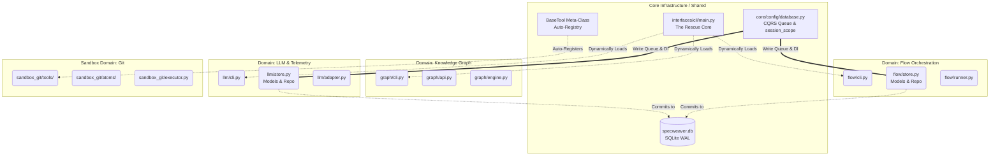
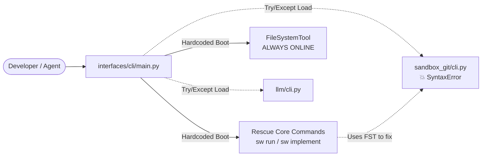
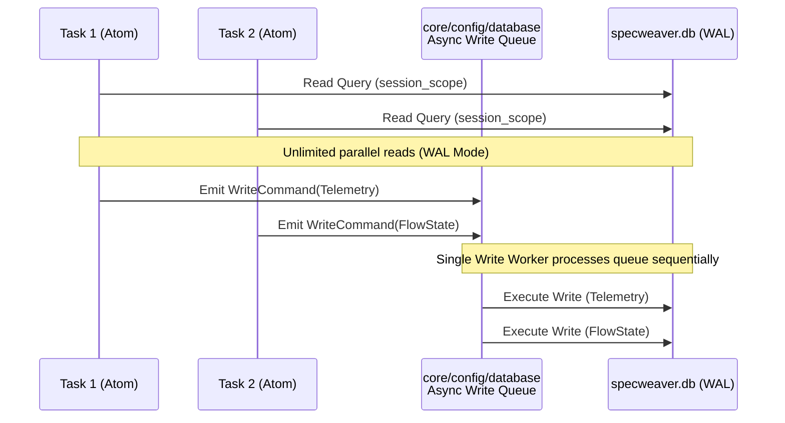

# SpecWeaver DDD Architecture (TECH-01)

This document visualizes the complete architectural overhaul defined in `TECH-01`. It maps out the boundaries, the modules, and the commonly used resources to restore the big picture after the Red/Blue Team sparring.

> [!IMPORTANT]
> **Timeline & Validity Context:** 
> - **Effective Date:** May 2026
> - **Status:** This document represents the **current, valid architecture**. All legacy patterns (global config pools, monolithic CLI routing) are now **deprecated and invalid**. Any new development MUST adhere to the bounded contexts defined below.

## 1. System Overview: The New Bounded Contexts

The system transitions from "Package by Layer" (Monoliths) to "Package by Feature" (Bounded Contexts).



## 2. The Unassailable Defenses Visualized

Here is how the 4 major defenses from the Red/Blue Team battle actually map to the physical architecture.

### Defense A: Native Healer & Rescue Core
If a plugin crashes, the CLI still boots so the agent can heal it.



### Defense B: CQRS & SQLite WAL (Database Concurrency)
How we safely write to SQLite from heavily concurrent tasks without locking.



### Defense C: Alembic Branching (Microservice Readiness)
How Alembic handles isolated domain metadata without a monolithic registry.

```mermaid
graph TD
    subgraph Alembic Environment
        Env(alembic/env.py)
    end

    subgraph Domain Models
        M1(llm/models.py<br>@declared_attr prefix)
        M2(flow/models.py<br>@declared_attr prefix)
    end

    subgraph Migration Timelines
        V1[alembic/versions/llm/]
        V2[alembic/versions/flow/]
    end

    M1 -->|Target Metadata| Env
    M2 -->|Target Metadata| Env

    Env -->|Generates independent branch| V1
    Env -->|Generates independent branch| V2
```

## 3. The Rules of the New Borders

To maintain this architecture, developers must follow three strict border rules enforced by `tach` (context.yaml):

1. **The Monolith Rule**: Domains (e.g., `llm/`, `graph/`) must NEVER import from each other. They can only communicate via the shared `core/` infrastructure or formal REST APIs/Event Buses.
2. **The Lazy Rule**: Domain `cli.py` files must NEVER import heavy logic at the top level. Imports must be inside the `def command():` block.
3. **The BaseTool Rule**: Sandbox domains MUST inherit from `BaseTool`. They do not need to register themselves anywhere; the Meta-class handles it automatically.
