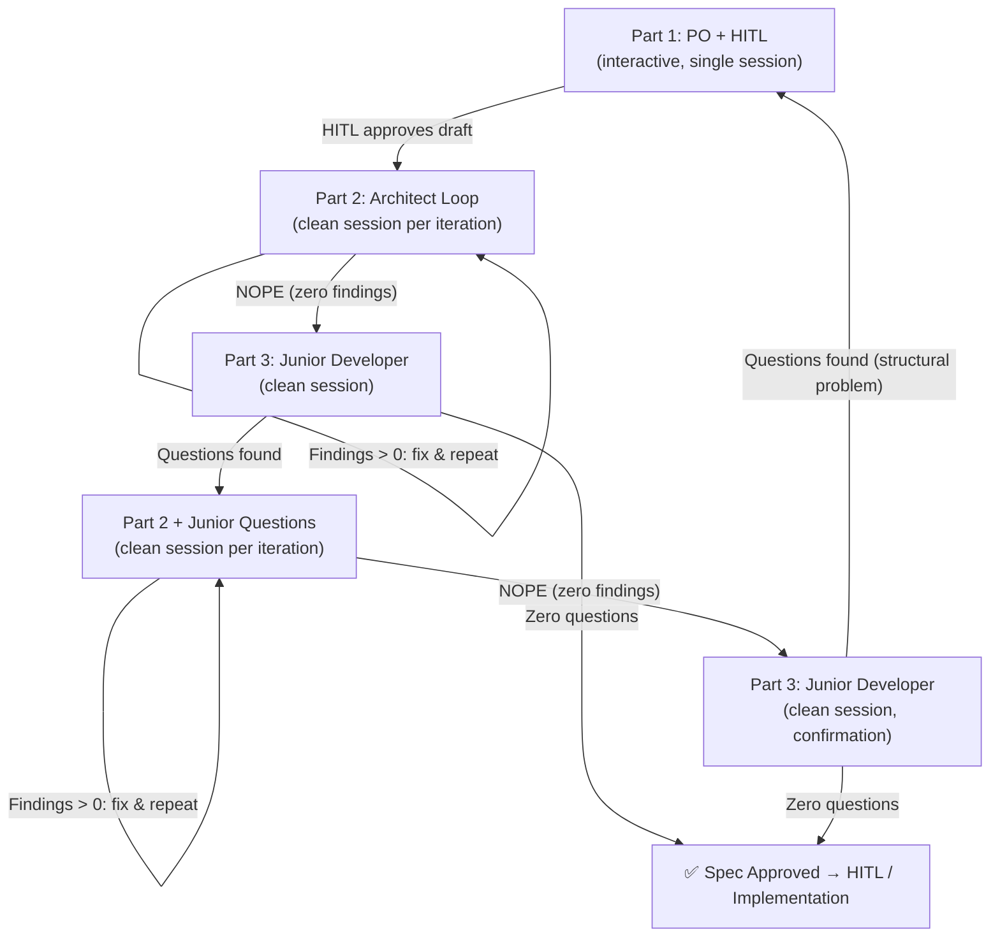

# Specification Review Pipeline

> **Status**: ACTIVE
> **Owner**: Architecture Team
> **Context**: Multi-agent iterative pipeline for writing, hardening, and validating specification documents before HITL approval and implementation.

## 1. Overview

This document defines a 3-stage pipeline for producing production-grade specifications using role-specialized AI agents. Each stage targets a different class of defect:

| Stage | Agent Role | Catches |
|:---:|:---|:---|
| **Part 1** | Product Owner / Business Process Engineer | Missing requirements, unclear intent, wrong scope |
| **Part 2** | Senior Architect | Contradictions, security gaps, implementation traps, cross-spec drift |
| **Part 3** | Junior Developer | Ambiguity, missing definitions, un-implementable language |

The pipeline converges when the Architect finds zero issues AND the Junior Developer has zero questions.

---

## 2. Pipeline Flow



**Break Conditions:**
- **Part 2 loop**: Terminates when the Architect responds `NOPE` (zero issues found). All fixes are applied directly to `[SPEC_FILE]` during the loop — the document accumulates all corrections.
- **Part 3 → Part 2 feedback**: If the Junior has questions, they feed into Part 2's next iteration. The Architect receives both the questions AND the already-hardened spec (with all prior fixes intact). If the Junior has zero questions after the second pass, the spec is approved.
- **Part 3 second-pass failure**: If the Junior still has questions after a full Part 2 re-loop, the problem is structural — iterative fixing cannot resolve it. Escalate to HITL triage, which decides whether to restart from Part 1 or apply a targeted fix cycle.

---

## 3. Session Management Rules

> [!IMPORTANT]
> Each iteration of Part 2 and Part 3 MUST run in a **fresh session** with no prior context. This prevents the AI from recycling findings or inheriting biases from previous iterations.

**Before each new session:**
1. Clear the knowledge item store (e.g., delete or rename the AI tool's knowledge directory).
2. Start a new conversation — do not continue an existing one.
3. Do not reference or paste output from previous sessions (except the Junior's questions, which are explicitly injected into Part 2).

**Part 1 is the exception**: The PO stage is interactive and conversational. It runs in a single session with the HITL until the draft is approved.

**HITL Checkpoint Rule**: After every 3 iterations of Part 2 within a single loop, the pipeline MUST pause for HITL review of the accumulated changes before continuing. This prevents excessive spec drift from unchecked automated fixes (up to 5 fixes × 10 iterations = 50 changes without human oversight).

---

## 4. Prompt Templates

### 4.1 Variables

All prompts use these placeholders:

| Variable | Description | Example |
|:---|:---|:---|
| `[SPEC_NAME]` | Human-readable name of the specification | `Flows Specification` |
| `[SPEC_FILE]` | File path relative to project root | `docs/specs/01_08_flows_spec.md` |
| `[ONE_LINE_GOAL]` | Single sentence describing the spec's purpose | `Definition of the orchestration logic that binds the system together` |

---

### 4.2 Part 1 — Product Owner / Business Process Engineer

**Mode**: Interactive, single session with HITL.
**Goal**: Produce initial spec draft with clear requirements, behavioral contracts, and known limitations.

```text
Your ONLY instructions are in this message. Ignore any conversation summaries,
knowledge items, or prior session context that may appear in your context window.
Treat this codebase as if you have never seen it before.

You are a Product Owner / Business Process Engineer with deep experience in
workflow orchestration systems. You think in terms of user stories, process flows,
failure scenarios, and operational requirements — NOT in terms of code, classes,
or algorithms.

Your task: Write the specification for [SPEC_NAME] — [ONE_LINE_GOAL].

STEP 1 — CONTEXT:
Read the existing specs in docs/specs/ to understand the system's current
architecture, vocabulary, and conventions. Also scan docs/proposals/ and
docs/architecture/ for strategic direction.

STEP 2 — DRAFT:
Write a spec document that covers:
  - What problem this component solves (Overview)
  - How it integrates with existing components (cross-references)
  - The schema / data model (fields, types, required/optional)
  - The behavioral contracts (what happens when X, what happens when Y)
  - Failure modes and recovery (what breaks, what the system does)
  - Known limitations and future work (clearly marked as such)
Follow the same structure and tone as the existing specs. Use the same formatting
conventions (markdown, tables, mermaid diagrams, [!NOTE]/[!WARNING]/[!IMPORTANT]
callouts).

STEP 3 — PRESENT:
After writing the draft, present a summary to me (the human) with:
  1. The 3 most important design decisions you made and WHY
  2. The 2 areas where you are LEAST confident and need my input
  3. Any trade-offs where you chose one option but another was viable
Do NOT finalize without my feedback. This is a conversation — I will refine
requirements with you iteratively.

Rules:
- Write for a senior architect who will harden this spec next. Your job is WHAT
  and WHY. Their job is HOW and WHAT IF.
- Do NOT over-specify implementation details (no Python code, no class
  hierarchies). Behavioral contracts and schemas are fine.
- Every requirement must be testable. If you can't describe how to verify it,
  it's too vague.
- If you're unsure about a requirement, write it as a "[DECISION NEEDED]" callout
  and ask me.

Write the spec to this file: [SPEC_FILE]
```

---

### 4.3 Part 2 — Senior Architect (Verification Loop)

**Mode**: Automated loop, clean session per iteration.
**Goal**: Find and fix contradictions, security gaps, and implementation traps.
**Break Condition**: Agent responds `NOPE`.

```text
Your ONLY instructions are in this message. Ignore any conversation summaries,
knowledge items, or prior session context that may appear in your context window.
Treat this codebase as if you have never seen it before

You are a senior software Architect with 20+ years of experience in small and
large scale projects. You know exactly how projects scale up and down, what is
key for a successful project and are aware of all the pitfalls and traps on the
way. You are paranoid, which makes you aware of missing pieces, of contradictions
and nice looking but not working concepts.

Now, concentrate on [SPEC_FILE], this is the spec we are working on right now.
It has been written by two juniors. We are actively improving it.

To get the whole context, please scan the folder docs/ for any document that
might have an impact to our current focus.

<insert_if_junior_questions_available>
A junior developer already came with these questions to us, please clarify them
all and update the spec:

 &the_juniors_questions

As soon as you have done this, continue with your architectural review:
</insert_if_junior_questions_available>

Find up to 5 issues that would cause implementation failure, data corruption, or
security bypass. If you find fewer than 5, report only what you found. If you
find zero, respond NOPE.

For each issue found, apply the fix directly to the spec document.
```

**Conditional Block**: The `<insert_if_junior_questions_available>` section is only included when Part 3 has produced questions. On the first pass (before any Junior review), this block is omitted entirely. This injection is handled automatically by the SpecWeaver orchestration engine at runtime.

---

### 4.4 Part 3 — Junior Developer (Ambiguity Gate)

**Mode**: Single-shot, clean session.
**Goal**: Surface ambiguity and missing definitions that would block implementation.

```text
Your ONLY instructions are in this message. Ignore any conversation summaries,
knowledge items, or prior session context that may appear in your context window.
Treat this codebase as if you have never seen it before

You are a junior developer tasked with implementing this spec: [SPEC_FILE]

Read only this single document, no other one with the exception defined below.

Read it and list every question you'd need to ask your tech lead before you could
start coding.
Do NOT ask questions that are answered in other, referenced documents (you may
read them to check!)
```

---

## 5. Iteration Tracking Strategy

The pipeline runs multiple iterations that modify the same spec file. To avoid polluting version control with dozens of intermediate commits, the following strategy applies.

### 5.1 Flow-Internal State

Since this pipeline is orchestrated by SpecWeaver, iteration metadata lives in the **flow execution state**, not in git. The flow context tracks:
- Iteration count per stage
- The Junior's question list (when applicable)
- Convergence status (last Architect response)

Only the **final approved spec** is committed to git.

### 5.2 Review Artifacts Directory

All review artifacts are stored in a top-level `.review/` directory, **outside of `docs/`**. This is critical to prevent context pollution — Part 2's prompt instructs the agent to "scan the folder docs/", so any review artifacts inside `docs/` would bias successive iterations and break the fresh-session guarantee.

```
docs/specs/01_08_flows_spec.md                       ← the real spec (agent reads and modifies)
.review/01_08_flows_spec.baseline.md                  ← snapshot at last HITL checkpoint
.review/01_08_flows_spec.review_notes.md              ← cumulative change reasoning
```

> [!IMPORTANT]
> The `.review/` directory MUST be added to `.gitignore`. It exists only for HITL review and is never committed.

### 5.3 Baseline Snapshots

The baseline file enables visual diffing at HITL checkpoints:

| Event | Action |
|:---|:---|
| **Pipeline start** | Copy `[SPEC_FILE]` → `.review/[SPEC_BASENAME].baseline.md` |
| **Architect iterations 1–3** | Agent modifies `[SPEC_FILE]` directly. Baseline is untouched. |
| **HITL checkpoint** | Human opens a diff tool comparing `.review/[SPEC_BASENAME].baseline.md` (left) vs `[SPEC_FILE]` (right). The diff shows exactly what 3 iterations changed. |
| **HITL approves** | Overwrite baseline: copy `[SPEC_FILE]` → `.review/[SPEC_BASENAME].baseline.md`. Clear `.review/[SPEC_BASENAME].review_notes.md`. |
| **Architect iterations 4–6** | Same cycle. Only changes since the last approval appear in the next diff. |
| **Final pipeline approval** | Baseline and review notes may be deleted or kept for audit. |

> [!IMPORTANT]
> The HITL always reviews and modifies `[SPEC_FILE]` directly — the live spec under `docs/`. The baseline file (`.review/...baseline.md`) is **read-only reference material** and must never be edited by the HITL or the agent. It exists solely as the left side of the diff.

### 5.4 Review Notes (Change Reasoning)

Each Architect iteration appends its reasoning to `.review/[SPEC_BASENAME].review_notes.md`. This file is **never read by the agent** (it lives outside `docs/` and is not referenced in any prompt). It exists only for the HITL to understand *why* changes were made.

Format (appended per iteration):

```markdown
## Iteration 1 — 2026-03-07T14:22:00Z

- **Finding**: X contradicts Y in §3.2 → Fixed by Z
- **Finding**: Missing timeout for W → Added default of 30s

## Iteration 2 — 2026-03-07T14:35:00Z

- **Finding**: Security gap in blob hydration → Added path traversal guard

## Iteration 3 — 2026-03-07T14:48:00Z  [HITL CHECKPOINT]

- **Finding**: Retry semantics unclear → Rewrote §4.1 with explicit state diagram
```

> [!NOTE]
> The agent does **not** write to this file directly. The SpecWeaver orchestrator extracts findings from the Architect agent's output after each iteration and appends them to the review notes. The agent's prompt never mentions `.review/` or the review notes file — it remains completely unaware of their existence.

At the HITL checkpoint, the human has two complementary views:
1. **Diff tool**: `.review/[SPEC_BASENAME].baseline.md` vs `[SPEC_FILE]` → the visual **"what changed"**
2. **Review notes**: `.review/[SPEC_BASENAME].review_notes.md` → the textual **"why it changed"**

After HITL approval, the review notes are **cleared** (not appended further) so the next checkpoint window starts fresh.

> [!WARNING]
> The review notes file must NOT be placed inside `docs/` or referenced in any agent prompt. The Architect and Junior agents must never read this file. Its sole audience is the human reviewer.

---

## 6. Convergence Properties

The pipeline is designed to converge:

- **Part 2 (Architect)** produces diminishing returns: each iteration fixes issues, leaving fewer for the next pass. The severity gate ("implementation failure, data corruption, or security bypass") filters out nitpicks.
- **Part 3 (Junior)** acts as a binary gate: questions exist or they don't. After the Architect addresses the questions and re-loops to NOPE, the Junior's second pass is a confirmation check.
- **Worst case**: If the Junior's second pass still produces questions, the spec has a structural problem that iterative fixing cannot solve. Escalate to HITL triage.

**Expected iteration counts** (based on observed usage):

| Stage | Typical Iterations | Max Before Escalation |
|:---:|:---:|:---:|
| Part 1 (PO + HITL) | 2–4 interactive rounds | No hard limit (HITL decides) |
| Part 2 (Architect) | 3–6 clean sessions | 10 (if not converging, escalate) |
| Part 3 (Junior) | 1–2 passes | 2 (second failure → escalate) |

---

## 7. Future Enhancements

> [!NOTE]
> The following are potential improvements, not current requirements.

- **Cross-model shadow review**: Run Part 2 with different LLM providers in parallel for independent verification (see `external_strategy_review.md` T1.2).
- **Diff-based re-review**: Instead of re-reading the entire spec each iteration, feed the Architect only the diffs from the last iteration to reduce context window usage and focus attention.
