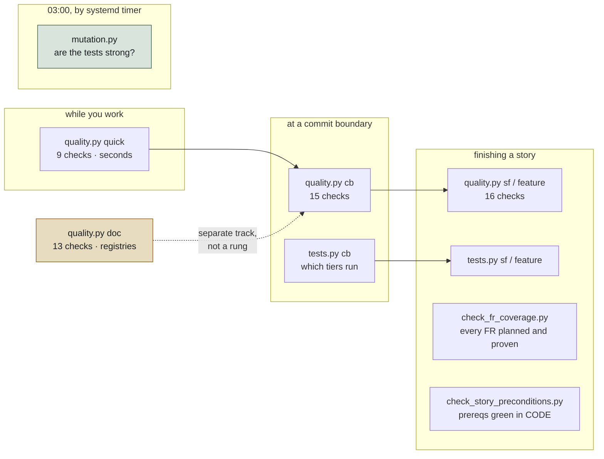

# The development framework — what checks you, and when

One page. What the machinery is, what each part answers, and which parts are yours to change.

Written 2026-08-23, because nothing described this and an agent working here could only learn it by
reading `scripts/`.

---

## Four runners, four questions

Each one answers a different question and keys on a different thing. They do not overlap.



| Runner | Answers | Keyed on |
|---|---|---|
| `quality.py` | Is the code and the registry clean? | what changed |
| `tests.py` | Which test tiers run, over how much? | story type + kind + DAL |
| `mutation.py` | Would the tests notice if the behaviour vanished? | the clock — nightly |
| `check_fr_coverage.py`, `check_story_preconditions.py` | Is this story honest? | a lifecycle moment |

The last two deliberately take a story ID and sit outside `quality.py`. Everything sweep-shaped is
inside it, because **a check that must be invoked to fire reports success by not running.**

---

## `quality.py` — 29 checks, 5 gates

One table decides everything: check name → which gate → how wide. It lives in `MATRIX` at the top of
`scripts/quality.py`.

```
python scripts/quality.py quick     #  9 checks — inner loop, run it constantly
python scripts/quality.py cb        # 15 checks — every commit boundary
python scripts/quality.py sf        # 16 checks — a sub-feature is done
python scripts/quality.py feature   # 16 checks — a story is closing
python scripts/quality.py doc       # 13 checks — registries, a SEPARATE track
```

**The code gates are cumulative.** `feature` ⊇ `sf` ⊇ `cb` ⊇ `quick` — a later point runs more
checks over more code. Never pass `--scope` to make one cheaper; the scope is the contract.

**`doc` is not a rung on that ladder.** It checks roadmap checkboxes, skill-tree parity and FR
ledgers — registries, not code. A stale checkbox must not fail a code gate, and a broken import must
not be excused by a tidy roadmap. Run both; neither substitutes for the other.

### Adding or removing a check

One row in `MATRIX`, one entry in `scripts/_quality_checks.py`. That is the whole surface — removing
`decision_citations` on 2026-08-23 was two deleted entries.

Two guards keep it honest, and both have fired: every checker on disk must be wired into some gate,
and every gate row must have a registered command. You cannot leave an orphan either way.

---

## `tests.py` — which tiers, over how much

Not your choice. It is derived from the story's ID, its kind, and its DAL.

| ID shape | Profile |
|---|---|
| `A-FLOW-01` … | capability — unit-led; integration and e2e arrive at `sf` and `feature` |
| `US-11` | (sub)story — **no unit tier at all**; its spanning tests are integration + e2e |
| `TECH-069` | technical debt — no single profile, so it declares a **kind** |

The four TECH kinds, because they need different proof:

| Kind | Proof |
|---|---|
| `refactor` | the EXISTING tests pass **unmodified** — the runner blocks if you touched a test file |
| `bugfix` | a regression test at the tier where the bug actually showed up |
| `tooling` | the deliverable is a guardrail script; its own unit tests are the proof |
| `audit` | produces findings, not code — declares **no tiers**, and says so out loud |

`python scripts/tests.py matrix` prints every profile.

**DAL shifts the whole profile.** DAL-A runs every tier at full scope from `cb`; DAL-E runs two
states later. Note the direction: **A is Mission-Critical, E is Prototyping**, so "highest DAL" means
the alphabetically *lowest* letter. A naive `max()` picks E and silently selects the weakest profile.

**Widening is allowed; narrowing never is.** `--also integration` and `--all` add tiers. Nothing
removes one. A slow run is the profile telling you what the story costs.

### Two rules worth knowing before they bite you

- **A tier that selects ZERO tests fails.** You changed code nothing mirrors — that is missing
  coverage, not a clean run.
- **Unless the boundary changed no code at all.** A documentation-only commit declares zero tiers
  and passes. Added 2026-08-23 after measuring that **32% of the last 400 commits changed no
  Python** and every one of them was blocked; two landed only because nobody ran the gate. The
  condition is narrow on purpose — `.py` anywhere in the diff and it blocks as before.

---

## `mutation.py` — the nightly

Runs at 03:00 by a systemd user timer, over the corpora in
`docs/roadmap/features/**/<ID>_mutants.json`. It breaks a line your tests claim to cover and checks
that something objects.

**It is deliberately NOT a commit gate.** Blocking a commit on it would mean an on-demand corpus run,
and a gate that slow gets switched off. Judged the next morning with `mutation.py --gate`, which is a
decision about whether feature work continues.

Three verdicts, and only one is a pass: `PROTECTED` · `UNPROTECTED` · `UNMEASURED`. A hang is
`UNMEASURED`, never a survival. A run that leaves no record is an alarm, not a pass.

**What belongs in your commit is the campaign** — when a boundary calls a claim proven, write it into
`<ID>_mutants.json` so the nightly keeps re-asking it forever.

---

## Ratchets — the pattern to recognise

Several checks compare a count against a number in `scripts/baselines/`. **It may fall, never rise.**

That is a deliberate compromise: the debt is recorded and cannot grow, but nothing forces it down. It
is how a check ships against 127 existing violations without blocking every commit until they are
fixed.

Two things follow, and both have caused incidents here:

- **A green ratchet is not a clean repo.** It means the number did not grow.
- **A missing or unreadable baseline fails closed.** A ratchet nobody can read is not a ratchet.

The baselines are version-controlled and **never written by the suite** — a test that rewrites its
own baseline is a guard that cannot fail.

---

## Where the rules live, and where they do not

| File | Holds |
|---|---|
| `.agents/PRINCIPLES.md` | How we work. Non-negotiable, ~1,300 words. **The 13 must-not-guess triggers are §2** |
| `.agents/PROJECT.md` | What this is, where things live, how to test |
| `.agents/STATE.md` | Where the project stands right now — committed |
| `.tmp/HANDOVER.md` | Where **this session** stands — gitignored, dies with the machine |
| `docs/dev_guides/working_in_this_repo.md` | Ten operational traps, each one a real incident |
| `.agents/skills/` + `.claude/skills/` | The procedures. **Two copies**, held in step by `check_skill_sync.py` |

The two skill trees exist because Claude Code reads one path and other agents read the other. That is
an environment constraint, not duplication for its own sake — but it means **every skill edit must be
applied to both trees**, and the gate will tell you if you forget.

### The one rule about rules

`PRINCIPLES.md` §5: **one fact, one place.** A second copy is how two copies come to disagree.

This applies to the rulebook itself, and the rulebook has broken it repeatedly — a skill file that
listed the trigger names inline said *"twelve"* while listing thirteen, and a whole capability was
retired on 2026-08-23 for enforcing a record that was a second copy of facts stated elsewhere in the
same document.

**If you find a rule stated in two places, that is a defect, not thoroughness.**

---

## The shortest version

Run `quality.py cb` and `tests.py cb <STORY-ID>` at every commit boundary. Run `quality.py doc`
beside them. Read the output rather than the exit code — and remember that
`something | tail` gives you `tail`'s status, not the gate's.

Full operational traps: [`working_in_this_repo.md`](working_in_this_repo.md).
