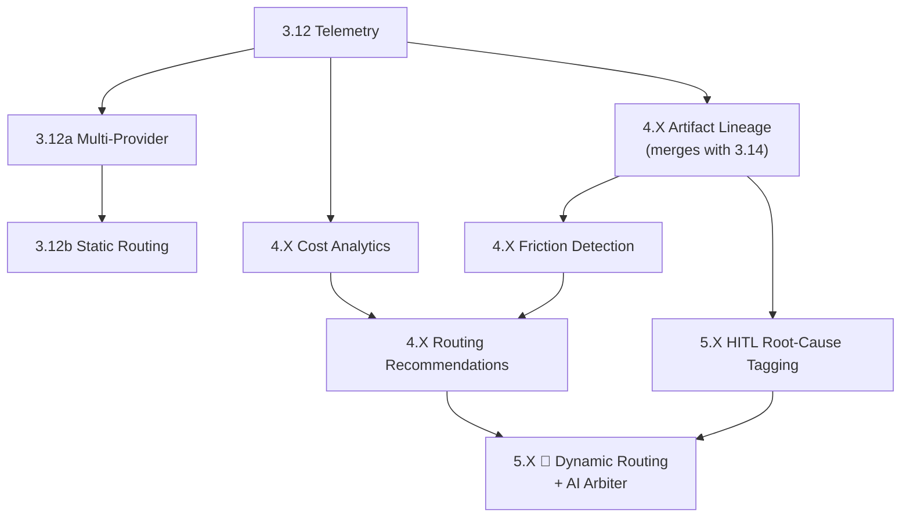

# Multi-Model LLM Support — Feature Analysis

> **Date**: 2026-03-26
> **Status**: Approved — split into 9 sub-features across Phases 3, 4, and 5
> **Original scope**: Features 3.12 (Multi-model LLM support) and 3.12a (LLM cost & token tracking)

---

## 1. Problem Statement

SpecWeaver currently supports a single LLM provider (Google Gemini via `GeminiAdapter`). The adapter interface (`LLMAdapter` ABC) is already abstracted, but only one implementation exists. This creates three limitations:

1. **Vendor lock-in** — if Gemini has an outage or quota limit, everything stops
2. **No cost visibility** — token usage and costs are untracked, making budgeting impossible
3. **No task optimization** — some models are better/cheaper for certain tasks (e.g., a cheap model for simple validation, an expensive model for complex architectural planning)

The original 3.12 entry described the full end-state: "Route prompts to best model per task by result/cost ratio." This conflates simple plumbing (add more providers), observability (track costs), configuration (pick model per task), analytics (dashboard), and AI-driven optimization (dynamic routing) into a single feature — making it too large and too speculative to implement as one unit.

## 2. Why We Split

The feature contains work spanning three fundamentally different engineering phases:

| Layer | Complexity | Phase |
|---|---|---|
| **Plumbing** — register and call multiple providers | Low. Well-understood adapter pattern. | Phase 3 |
| **Observability** — log tokens, costs, lineage | Medium. Needs data pipeline + visualization. | Phase 3 (logging) + Phase 4 (analytics) |
| **Intelligence** — learn from history, auto-route | High. Unsolved research problem (credit assignment). | Phase 5 |

Doing it all at once would mean Phase 3 features sit blocked behind Phase 5 research. By splitting, we get immediate value (use Claude for review tomorrow) while building toward the long-term vision incrementally.

## 3. The North Star Vision

> [!NOTE]
> This section describes the **full end-state** the conversation explored. Much of this is theoretical — the feasible parts are marked, and the speculative parts are flagged as 🔬 Science Fiction.

### 3.1 The Credit Assignment Problem

When multiple models collaborate across a pipeline (Model W writes the Spec, Model X drafts the Plan, Model Y writes the Code), and a failure occurs weeks later when Model Z tries to implement a downstream feature — **who is responsible for the failure?**

This is the **credit assignment problem**, one of the hardest unsolved challenges in multi-agent systems. It scales from single-pipeline attribution (easy) to cross-lifecycle attribution (extremely hard).

### 3.2 Refactor-Adjusted Cost (RAC)

The conversation proposed tracking **True Pipeline Cost**:

```
True Pipeline Cost = Initial Generation Cost + Σ(Cost of downstream retries, fixes, refactoring traced back to this artifact)
```

**Example:**
- Expensive model: $0.05 upfront, zero rework → Total = $0.05
- Cheap model: $0.002 upfront, $0.08 in cascading fix loops → Total = $0.082

**Verdict:** ✅ Feasible for single-pipeline tracking (Phase 4). ❌ Not feasible across weeks/lifecycles without persistent knowledge (Phase 5).

### 3.3 Attributed Lifecycle Score (ALS)

The more advanced metric proposed:

```
ALS_model = Success_Rate / (Initial_Cost + Σ(W_f × Rework_Cost × D_t))
```

Where:
- `W_f` = Fault weight (who caused the rework)
- `D_t` = Time-decay factor (recent rework penalizes more than old rework)

**Verdict:** ⚠️ The formula is mathematically sound, but the inputs (`W_f`) are unknowable without either human labeling (feasible) or an AI Arbiter (speculative).

### 3.4 🔬 The AI Arbiter (Science Fiction)

The conversation proposed an "Arbiter Agent" that performs **Root Cause Analysis** when failures occur, assigning fractional blame across models:

- "80% penalty to Model X's plan, 20% to Model Z for not adapting"
- Applies discount factors for intentionally tagged technical debt

**Why this is science fiction today:**

1. **The Arbiter Paradox** — You're using an LLM to judge other LLMs. If the Arbiter hallucinates the root cause, your entire routing metric is poisoned. No current LLM can reliably perform deterministic RCA across weeks of multi-model development context.

2. **Cost of the metric** — Running the Arbiter with sufficient context (weeks of artifacts) could cost more than the rework it's trying to prevent.

3. **Goodhart's Law** — If models know they're being evaluated by ALS, they will game it:
   - **Discount Factor Exploit**: Tag every decision as "Temporary Compromise" to reduce penalties
   - **Over-Engineering Exploit**: Write maximally defensive code to minimize downstream friction, creating bloated codebases

4. **The Delayed Feedback Loop** — If Model W writes a bad spec on Day 1 but the failure surfaces on Day 21, the router has spent 3 weeks routing tasks to Model W based on a falsely high score.

### 3.5 🔬 Structured Technical Debt Declarations (Partially Feasible)

Force the Planning model to declare shortcuts in structured JSON:

```json
{
  "intentional_compromises": [
    {
      "decision": "Using sync DB calls instead of async",
      "reason": "Async pool not available until Feature 3.15",
      "expected_rework_trigger": "3.15 implementation",
      "max_rework_estimate_hours": 4
    }
  ]
}
```

**Verdict:** ⚠️ The structure is feasible. Enforcing honest self-assessment from LLMs is not — they are notoriously bad at knowing what they don't know. A "debt budget" (max 2 items per plan) mitigates gaming but doesn't solve the honesty problem.

## 4. The Pragmatic Path: 9 Sub-Features

### Phase 3 — Feature Expansion (feasible today, independently useful)

#### 3.12 — Token & Cost Telemetry

Log `model_id`, `prompt_tokens`, `completion_tokens`, `estimated_cost` on every `LLMResponse`. Store in DB. Expose via `sw config show-costs` or similar.

- **Depends on**: Nothing
- **Value alone**: Full cost visibility per session, per task type
- **Effort**: Small — extend `LLMResponse` + DB table + CLI command

#### 3.12a — Multi-Provider Adapter Registry

Extend `LLMAdapter` ABC with adapters for Claude, Qwen, Mistral, OpenAI. Registry maps provider names to adapter classes. Config selects which provider to use.

- **Depends on**: 3.12 (for cost tracking)
- **Value alone**: Use Claude for one task, Gemini for another
- **Effort**: Medium — one adapter per provider + factory + config schema

#### 3.12b — Static Model Routing (Config-Driven)

Map task types to models in config: `review → claude-3.5-sonnet`, `implement → gemini-2.5-pro`, `draft → gemini-2.0-flash`. No AI, no learning — pure user configuration.

- **Depends on**: 3.12a
- **Value alone**: Users manually optimize model selection per task
- **Effort**: Small — config schema + router lookup in handlers

---

### Phase 4 — Advanced Capabilities (significant engineering)

#### 4.X — Task-Type Cost Analytics

Dashboard/report showing cost breakdown by task type (draft, review, plan, implement, validate) across models. Identifies which model is cheapest/most effective per task from historical data.

- **Depends on**: 3.12 (accumulated telemetry data)
- **Value alone**: Data-driven model selection decisions
- **Effort**: Medium — aggregation queries + reporting

#### 4.X — Artifact Lineage Graph

> **Merges with existing 3.14 (Spec-to-Code Traceability)**

Tag every artifact (Spec, Plan, Code) with `artifact_uuid`, `parent_uuid`, `model_id`, `timestamp`. Build a directed graph linking specs → plans → code → tests.

- **Depends on**: 3.12 (telemetry metadata)
- **Value alone**: "Which model wrote this code? What spec drove it?"
- **Effort**: Medium — UUID propagation through pipeline, graph storage

#### 4.X — Deterministic Friction Detection

When a downstream agent modifies >20% of upstream scaffolding (measured by `git diff`), flag a "friction event" and attribute it to the upstream model. No LLM needed — pure diff math.

- **Depends on**: Artifact lineage graph
- **Value alone**: Identifies consistently problematic model/task pairings
- **Effort**: Medium — diff analysis + attribution logic

#### 4.X — Data-Driven Routing Recommendations

Analyze accumulated telemetry + friction data to **suggest** (not auto-apply) model swaps. "Model X has 3x more friction events on planning tasks than Model Y — consider switching."

- **Depends on**: Cost analytics + friction detection + enough historical data
- **Value alone**: Semi-automated optimization recommendations
- **Effort**: Medium — statistical analysis + recommendation engine

---

### Phase 5 — Domain Brain (persistent knowledge, cross-lifecycle)

#### 5.X — HITL Root-Cause Tagging

When a pipeline fails or a human rejects output, prompt the developer: "Where did the root cause originate?" with options: `[Flawed Spec]`, `[Short-sighted Plan]`, `[Bad Code]`, `[Requirements Changed]`. Builds a labeled dataset of failures.

- **Depends on**: Artifact lineage graph (Phase 4)
- **Value alone**: Ground truth dataset for future ML/routing. Fits naturally with 5.5 (Provenance tracking)
- **Effort**: Small — UI prompt + DB storage

#### 5.X — 🔬 Dynamic Routing Engine + AI Arbiter

The full ALS vision: automatic model selection based on lifecycle-attributed performance scores. AI-powered root cause analysis when failures cascade across features and time.

- **Depends on**: Everything above + persistent knowledge graph (5.1-5.5) + enough labeled data
- **Value alone**: Fully autonomous model optimization
- **Effort**: Research-grade — unsolved credit assignment problem, Goodhart's Law risks, Arbiter reliability
- **ROI gate**: Only trigger Arbiter inference when `Σ(Rework_Cost) > Arbiter_Cost × τ` (risk-tolerance multiplier)

> [!WARNING]
> This sub-feature is speculative. The mathematical framework is sound, but the inputs (fault weights, honest self-assessment) cannot be reliably computed with current LLM capabilities. It should remain a north star, not a commitment.

## 5. Dependency Graph



## 6. What Stays in Scope vs. What's a North Star

| Sub-feature | Status | Actionable? |
|---|---|---|
| 3.12 Telemetry | ✅ Concrete | Yes — implement next |
| 3.12a Multi-Provider | ✅ Concrete | Yes — after 3.12 |
| 3.12b Static Routing | ✅ Concrete | Yes — after 3.12a |
| 4.X Cost Analytics | ✅ Concrete | Yes — when data exists |
| 4.X Artifact Lineage | ✅ Concrete | Yes — merge with 3.14 |
| 4.X Friction Detection | ⚠️ Experimental | Maybe — needs validation that diffs are meaningful |
| 4.X Routing Recommendations | ⚠️ Experimental | Maybe — depends on data quality |
| 5.X HITL Root-Cause | ✅ Concrete | Yes — simple UI |
| 5.X Dynamic Routing + Arbiter | 🔬 Science Fiction | Not yet — research only |
