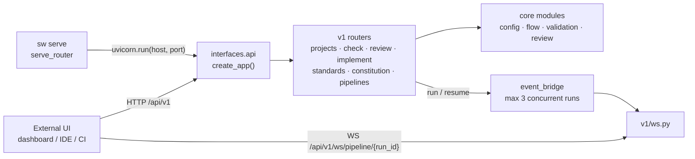

# D-UI-01 — Core Orchestration API (`sw serve`)

**Status**: 🔧 IN WORK — built and proven, **not approved**. The `specweaver-design` Phase 6 gate
was never run for this capability. Status returns to ✅ only after that review and any corrections
it produces. · **Epic**: Topic 01 (UI Glass) · **Legacy**: 3.7 MVP

| | |
|---|---|
| Uses | `E-FLOW-01` (projects) · `C-FLOW-02` (run events) · `E-UI-01` (CLI entry, error shape) · `C-EXEC-06` (isolation policy) |
| Used by | Web Dashboard (3.8) · VS Code extension (3.23) · IntelliJ plugin |
| Not touched | authentication (Phase 2) · output schemas (`D-UI-02`) · the CLI |

Plan: [D-UI-01_implementation_plan.md](D-UI-01_implementation_plan.md).

## What it does

`sw serve` starts a FastAPI server exposing the SpecWeaver operations an external UI needs, plus a
WebSocket that streams a run's progress as it happens. 23 routes across projects, pipelines, runs,
review, check, constitution and standards.

## Why

Every external front end — the tablet dashboard, the VS Code extension, the IntelliJ plugin — would
otherwise shell out to the CLI and parse its console output. This is the seam that lets them call a
contract instead. It unblocks:

- browser-based HITL review (the "train scenario" — review on tablet);
- IDE extensions that send commands without spawning `sw` subprocesses;
- CI/CD pipelines that trigger reviews or validations programmatically;
- monitoring dashboards showing pipeline status across projects.

Response models are already Pydantic, so JSON serialization is free.

## Architecture

| Part | Lives in |
|---|---|
| App factory, CORS, exception handlers | `interfaces/api/app.py`, `errors.py` |
| Per-request DB and state store | `interfaces/api/deps.py` |
| Resource routers + schemas | `interfaces/api/v1/` |
| Run registry and event fan-out | `interfaces/api/event_bridge.py` |
| Process entry | `interfaces/cli/routers/serve_router.py` |

The API does not depend on the CLI; both are front ends over the same engine.

## Decisions

The full decision table (26 rows, with audit Qs) is in the plan. The ones that shape the system:

| Decision | Why |
|---|---|
| **No authentication in Phase 1**; bind `127.0.0.1` by default | Local-only. The default bind is therefore the entire access-control story — `0.0.0.0` would expose every endpoint, including the ones that start runs and execute generated code, to the network. `FR-3` tests it. |
| **Fire-and-forget runs**: `POST /run` returns a `run_id`, a background task runs the pipeline | A run lasts minutes; clients poll `GET /runs/{run_id}` or subscribe via WebSocket. |
| **Runner terminates on park**; the gate endpoint resumes | Same as `sw resume`: the context is rebuilt from stored state. |
| **WebSocket emits the CLI's NDJSON events** | The two front ends cannot describe the same run differently. |
| **Handlers call core modules directly**, no service layer | Core logic already lives outside `cli/`. |

A CORS regex is not access control: it governs which browser origins may call a server the caller
can already reach.

## Functional Requirements

| # | FR | Actor | Action | Outcome |
|---|-----|-------|--------|---------|
| FR-1 | A remote client can drive a project | External UI | Registers, lists, renames, removes and **selects** a project over HTTP | A front end can do the thing every other call depends on — say which project it means — without shelling out to the CLI |
| FR-2 | A run is observable while it runs | External UI | Subscribes to `/api/v1/ws/pipeline/{run_id}` and receives the same NDJSON events the CLI's JSON display emits, ending with `done` | A gate partway through a ten-minute run is visible to a dashboard, and the two front ends cannot describe the same run differently |
| FR-3 | The server reaches the network only when asked | System | Binds `127.0.0.1` by default and forwards whatever `--host` was given to the server | An install with no authentication is not remotely reachable by default, and a deliberate `--host` still works for a container or a LAN |
| FR-4 | An HTTP-started run is the run the CLI would start | System | Applies the same `[sandbox]` isolation policy at the API composition root | Untrusted generated code is bounded identically whichever root launched it |
| FR-5 | A failure is a typed error, not a traceback | System | Returns `{detail, error_code}` with the declared status, defaulting to a client error | A program can branch on the failure, and no response carries module paths or a stack trace |

`FR-4` is a **seam FR** — the policy is resolved in `core.flow.engine.isolation` and consumed here
— and is proven at integration tier.

Proof: `FR-3` and `FR-5` have dedicated tests (`test_serve_binds_locally.py`,
`test_error_contract.py`); `FR-1`, `FR-2` and `FR-4` cite tests that already proved them. Every test names `D-UI-01`,
so `check_fr_coverage.py` can judge the coverage.

## Requirement–Surface Bindings

| FR | Data needed | Provider · surface | Verified how |
|---|---|---|---|
| FR-1 | Project registration and selection | `E-FLOW-01` · `Database` + the projects repository | read `src/specweaver/interfaces/api/v1/projects.py` and `src/specweaver/core/config/database.py` |
| FR-2 | Live run events | `C-FLOW-02` · `event_bridge.get_event_bridge()` | read `src/specweaver/interfaces/api/v1/ws.py` — streams NDJSON, then `{"event": "done"}` and closes |
| FR-3 | The process entry point | `E-UI-01` · `serve_router.serve(port, host, reload, cors_origins)` | read `src/specweaver/interfaces/cli/routers/serve_router.py:28` — `host` defaults to `127.0.0.1` and is forwarded to `uvicorn.run` |
| FR-4 | Worktree isolation policy | `C-EXEC-06` · `isolation.apply_isolation_policy(context, settings, logger)` | read `src/specweaver/core/flow/engine/isolation.py` — the composition root serving both CLI and API |
| FR-5 | The structured failure shape | `E-UI-01` · `errors.SpecWeaverAPIError` / `specweaver_error_handler` | read `src/specweaver/interfaces/api/errors.py:16` |

## Non-Functional Requirements

| # | NFR | Threshold / Constraint |
|---|-----|----------------------|
| NFR-1 | No authentication in Phase 1 | Justified **only** by the local-only bind, which `FR-3` is the test for. Any change to the default bind reopens this and requires the `X-API-Key` phase the plan describes |
| NFR-2 | Optional dependency | FastAPI and Uvicorn are an extra; `sw serve` reports the install command and exits 1 rather than raising an `ImportError` **[proof: meta — a rule about the failure message, not about product behaviour]** |
| NFR-3 | Layer placement | The API lives in `interfaces.api` and reaches the engine through the same surfaces the CLI does **[proof: arch — `tach check`, not pytest]** |

## Non-Goals

- Authentication. Phase 2 territory, and gated on the bind default changing.
- Rendering. Structured output schemas are `D-UI-02`; the dashboard is its own capability.
- Replacing the CLI. Both are front ends over the same engine.
