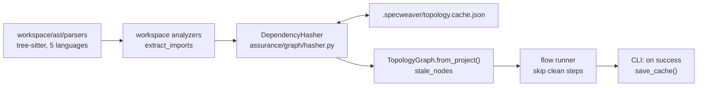

# A-SENS-01 — Deep Semantic Hashing

**Status**: APPROVED. **COMPLETE** — SF-01..SF-04 committed, validated with E2E tests. · **Phase**: 3 · **Feature ID**: 3.32

| | |
|---|---|
| Extends | `TopologyGraph` (`assurance/graph/topology.py`) |
| Used by | flow engine staleness bypass (SF-04); CLI cache flush after a successful run |
| Deferred | "Rocket Mode" sidecar graph databases (Falkor/Neo4j) → Feature 3.48 (AD-3) |

## What it does

Keeps the Topology Graph in sync without a full project crawl on every start. Each module gets a
Merkle **dependency hash**: it changes if and only if the module's own content changes *or* any of
its imported dependencies change. Only invalidated branches are re-parsed (incremental crawling).

## Why this way

- `TopologyGraph.from_project()` ran `rglob` over the whole project and rebuilt the entire
  `DependencyGraph` in memory each time.
- `LanguageAnalyzer.extract_imports()` in `specweaver/workspace/context/analyzers.py` used Python
  `ast` only; Java/Kotlin/Rust were commented out. Polyglot hashing needs the `tree-sitter`
  pure-logic parsers already proven in `core/loom` — so SF-01 moves them down into
  `workspace/ast/parsers/`.
- `assurance/graph/context.yaml` consumes `specweaver/context` (meaning `workspace/context`), so
  hashing in `assurance/graph/hasher.py` follows `dmz` L2→L1 downward consumption without breaking
  `pure-logic` or `loom/*` isolation.

**Since moved** (noted 2026-09-25): `core/loom/*` → `sandbox/*`; the analyzer factory →
`workspace/analyzers/factory.py`; `setup_sandbox_caches` → `core/flow/engine/sandboxed_execution.py`;
the cache flush lives in `core/flow/interfaces/cli.py`.

## Architecture

| Part | Does |
|---|---|
| `workspace/ast/parsers/` | pure-logic tree-sitter parsers; `extract_imports` per language (SF-01) |
| `DependencyHasher` | `sha256` of file contents + imported modules' hashes; reads/writes the cache (SF-02) |
| `TopologyGraph.from_project()` | diffs hashes against the cache, exposes `stale_nodes` (SF-03) |
| Flow runner + QA runner | bypass clean nodes; the CLI flushes the cache only after a successful run (SF-04) |

External tools: `hashlib` (stdlib, `sha256()`) and `json`. No other dependency required.
SF-02 later added `orjson` (see its plan).

## Decisions

| # | Decision | Rationale | Architectural Switch? |
|---|----------|-----------|----------------------|
| AD-1 | Project-Local Persistence (Bicycle Mode) | Cache in `.specweaver/topology.cache.json` at the target `project_root`. Survives Docker/Podman teardown because the root is volume-mounted. Scales per microservice without touching global environments. | No |
| AD-2 | Automated `.gitignore` Injection | AD-1 drops an artifact into existing projects, so SpecWeaver auto-injects `.specweaver/` into the Gitignore. | No |
| AD-3 | External Semantic Backends (Feature 3.48) | Flat files only ("Bicycle Mode"). Feature 3.48, in the backlog, swaps this layer for 'Rocket Mode' sidecar databases (Falkor/Neo4j). | No |
| AD-4 | Reuse `LanguageAnalyzers` | Reuses the AST parsing in `workspace/context` to map dependencies; no duplicated parsing. | No |
| AD-5 | Polyglot Tree-Sitter Decoupling | Move pure-logic Tree-Sitter models out of the restricted `loom/commons/language` sandbox into `workspace/ast/parsers/`. Removes the parallel AST implementations and enables 5 languages within the L0/L3 architecture bounds. | Yes |

## Functional Requirements

| # | FR | Actor | Action | Outcome |
|---|-----|-------|--------|---------|
| FR-1 | Merkle Root Generation | DependencyHasher | Combines `sha256` of file contents + Merkle roots of all extracted imports. | Returns a deterministic `semantic_hash` spanning the dependency tree. |
| FR-2 | Cached Adjacency State | TopologyGraph | Reads/Writes `.specweaver/topology.cache.json` containing previously mapped hashes. | Prevents redundant parsing during sequential Agent tasks. |
| FR-3 | Incremental Crawler | TopologyGraph | Detects mismatches between disk `mtime` / semantic hashes and the Cache. | Recursively invalidates upward consumers via `self._reverse` adjacencies, rebuilding only stale nodes. |

## Non-Functional Requirements

| # | NFR | Threshold / Constraint |
|---|-----|----------------------|
| NFR-1 | Speed / Overhead | Graph verification from Cache must complete in under 50ms for a 1,000-module codebase. |
| NFR-2 | Architectural Purity | The hashing logic MUST reside inside the Topology engine or Workspace layers without crossing OS boundaries. **[proof: arch — tach/lint gate, not pytest]** |

## Risks

- **Staleness bypass is inert in production** (noted 2026-09-25): `GraphContext.stale_nodes` in
  `core/flow/handlers/run_context.py` is read but written by nothing, so it is always `None` and no
  step is skipped. The cache save after a COMPLETED run does happen.

## Sub-features

| SF | Does | FRs | Inputs → Outputs | Depends on | Plan |
|----|------|-----|------------------|-----------|------|
| SF-01 | Polyglot Parser Decoupling — see below | NFR-2 | tree-sitter bindings → `workspace/ast/parsers/` | — | [sf01](A-SENS-01_sf01_implementation_plan.md) |
| SF-02 | Semantic State Caching (`DependencyHasher`) — see below | FR-1, FR-2 | OS file chunks, dotted imports → cache map | SF-01 | [sf02](A-SENS-01_sf02_implementation_plan.md) |
| SF-03 | Incremental Topology Crawler — see below | FR-3 | Semantic Cache map → `TopologyGraph` | SF-02 | [sf03](A-SENS-01_sf03_implementation_plan.md) |
| SF-04 | Pipeline Execution Optimization — see below | NFR-1 | `TopologyGraph`, `stale_nodes` set → incremental pipelines, updated Cache | SF-03 | [sf04](A-SENS-01_sf04_implementation_plan.md) |

- **SF-01**: extract `CodeStructureInterface` and each language's `codestructure.py` from
  `loom/commons/language` down into `workspace/ast/parsers/`. `workspace/context/analyzers.py` uses
  these Tree-Sitter engines instead of Python `ast`. Imports updated across `assurance`, `loom`,
  `workspace`.
- **SF-02**: compute and persist shallow and structural Merkle dependencies in
  `<project_root>/.specweaver/topology.cache.json` (pure-data map with versions and mtime
  signatures, for NFR-1). **MUST** inject `/.specweaver/` into `.gitignore` inside a tracked comment
  block.
- **SF-03**: `topology.py` `TopologyGraph.from_project()` diffs against the Semantic Cache and
  invalidates subtrees via Tarjan's SCC cycle-loop breaking, instead of global recursive parsing.
- **SF-04**: `QARunner`, `PipelineRunner` and `EngineFileExecutor` consume `graph.stale_nodes`;
  testing plugins skip `clean` nodes; cache-flush persistence runs only after validation;
  `.specweaver` is linked into ephemeral Worktree sandboxes.

## Progress Tracker

| SF | Name | Depends On | Design | Impl Plan | Dev | Pre-Commit | Committed |
|----|------|-----------|--------|-----------|-----|------------|-----------|
| SF-01 | Polyglot Parser Decoupling | — | ✅ | ✅ | ✅ | ✅ | ✅ |
| SF-02 | Semantic State Caching | SF-01 | ✅ | ✅ | ✅ | ✅ | ✅ |
| SF-03 | Incremental Topology | SF-02 | ✅ | ✅ | ✅ | ✅ | ✅ |
| SF-04 | Pipeline Execution Optimization | SF-03 | ✅ | ✅ | ✅ | ✅ | ✅ |
