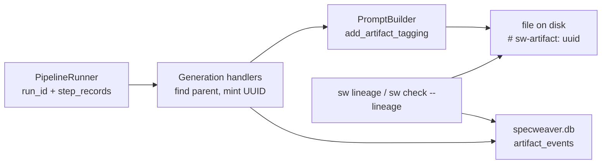

# B-SENS-01 — Spec-to-Code Traceability (Artifact Lineage)

**Status**: COMPLETE · **Phase**: 3 · **Feature ID**: 3.14

| | |
|---|---|
| Touches | `PipelineRunner`, DB telemetry layer, code generators |
| Next | Feature 3.14a (AI Root-Cause Analysis) builds on the lineage table |
| Not touched | AST-based drift detection, coverage gap detection, AI-powered root-cause analysis |
| Blueprints | `future_capabilities_reference.md` §17 (Spec-to-Code Traceability) · `llm_routing_and_cost_analysis.md` (Artifact Lineage Graph) |

## What it does

Records a directional lineage graph (Spec → Plan → Code) in the SQLite database, so every generated
artifact can be traced to its parent and to the LLM model that produced it (credit assignment). Each
artifact gets a UUID, a parent UUID and a generating model.

Constraints: one `# sw-artifact: <uuid>` tag per file (minimal pollution); survives manual file
renames; fast orphan detection from the CLI.

## Why this way

- The lineage graph extends telemetry (`llm_usage_log`, via `config/_db_telemetry_mixin.py`), so it
  lives in `specweaver.db` and cost analytics can JOIN usage and provenance.
- `PipelineRunner` (`flow/runner.py`) runs every step and knows the lineage context; code generation
  runs in `flow/_generation.py` via `CodeGenerator`.
- The LLM writes the UUID tag (instructed by `PromptBuilder`), because it knows each language's
  comment syntax. Engine post-processing of output would risk corrupting JSON/YAML/Python.
- `cli/` forbids raw I/O (`loom/*`), so file scans use pure `pathlib` (e.g. `graph/lineage.py`).

**Since moved** (noted 2026-09-25): the lineage store is `graph/lineage/store/lineage_repository.py`,
the tag helpers `commons/lineage.py`, `check_lineage` `graph/lineage/scanner.py`, the CLI
`graph/interfaces/cli.py`.

## Architecture

External tools: `sqlite3` (built-in; `INSERT`, `SELECT` for graph edges; already used extensively),
`uuid` (built-in; `uuid.uuid4()`).

## Decisions

| # | Decision | Rationale | Architectural Switch? |
|---|----------|-----------|----------------------|
| AD-1 | Lineage graph stored in `specweaver.db` | Related to telemetry; cost analytics can JOIN usage and provenance. | No |
| AD-2 | UUID generation in `flow/` | The Runner knows the lineage context (which step is running, what the parent spec is). | No |
| AD-3 | Rely on LLMs to write `# sw-artifact` | Safer than the engine heuristically mutating LLM output (avoids syntax corruption in JSON/YAML/Python). | No |
| AD-4 | `sw check --lineage` uses pure `pathlib` | Required because `cli` forbids `loom/*`. Same pattern as `standards` auto-discovery. | No |
| AD-5 | Pass UUID via PipelineRun StepRecords | State must explicitly track `artifact_uuid` per step so downstream steps can look up their parent UUID deterministically. | No |

## Functional Requirements

| # | FR | Actor | Action | Outcome |
|---|-----|-------|--------|---------|
| FR-1 | DB Storage | System | SHALL record a lineage graph for generated artifacts linking each child to its parent | Graph is persisted in `specweaver.db` |
| FR-2 | UUID Tagging | LLM/Engine | SHALL inject a single `# sw-artifact: <uuid>` tag into every generated file on disk | Every generated file carries its UUID |
| FR-3 | Graph Metadata | System | SHALL persist `artifact_id`, `parent_id`, `model_id`, timestamp, and `run_id` | Full provenance tracking enabled |
| FR-4 | Trace CLI | Developer | SHALL view lineage history of a file using `sw lineage <file>` | CLI prints tree from DB |
| FR-5 | Orphan CLI | CI/Dev | SHALL run `sw check --lineage` | Fails if untracked manual code is detected in `src/` |
| FR-6 | Manual Tag CLI | Developer | SHALL run `sw lineage tag <file> --author human` | Injects UUID tag and logs provenance with `model_id=human` in DB |

## Non-Functional Requirements

| # | NFR | Threshold / Constraint |
|---|-----|----------------------|
| NFR-1 | Performance | `sw check --lineage` scans 100 files in < 500ms |
| NFR-2 | DB Compatibility | Schema migration must be additive, no break of `llm_usage_log` |
| NFR-3 | Resilience | Manual file renaming must not break the lineage graph (rely on tags in content, not paths) |

## Sub-features

| SF | Name | FRs | Depends on | Plan |
|----|------|-----|-----------|------|
| SF-01 | Lineage Database & Flow Integration | FR-1, FR-3 | — | [sf01](B-SENS-01_sf01_implementation_plan.md) |
| SF-02 | Artifact Tagging Engine | FR-2 | SF-01 | [sf02](B-SENS-01_sf02_implementation_plan.md) |
| SF-03 | Verification & CLI Tools | FR-4, FR-5, FR-6 | SF-01, SF-02 | [sf03](B-SENS-01_sf03_implementation_plan.md) |

- **SF-01**: SQLite persistence; UUID context propagated in the PipelineRunner. Current `run_id` and
  pipeline context in → UUIDs passed to handlers, rows persisted in `lineage_graph`.
- **SF-02**: `PromptBuilder` instructs the LLM to write the tag; handlers bind `parent_uuid` to
  `artifact_uuid`. UUIDs from SF-01 in → code on disk with `# sw-artifact: <uuid>`.
- **SF-03**: orphan detection, manual tagging, lineage tracing. `pathlib` scans of `src/` and SQLite
  SELECT queries in → terminal output and CI exit codes.

## Progress Tracker

| SF | Name | Depends On | Design | Impl Plan | Dev | Pre-Commit | Committed |
|----|------|-----------|--------|-----------|-----|------------|-----------|
| SF-01 | DB & Flow | — | ✅ | ✅ | ✅ | ✅ | ✅ |
| SF-02 | Tagging | SF-01 | ✅ | ✅ | ✅ | ✅ | ✅ |
| SF-03 | Verification CLI | SF-02 | ✅ | ✅ | ✅ | ✅ | ✅ |
