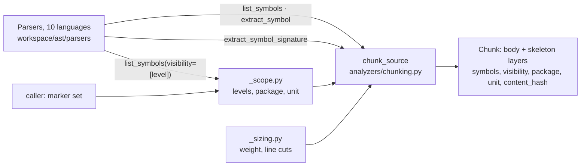

# B-SENS-03 — AST Semantic Chunking

**Status**: COMPLETE 2026-08-27 — all six sub-features delivered, FR ledger green,
51 mutants protected. **The roadmap flag stays `🔧`**: only the user flips it to `✅` ·
**DAL**: B (Severe failure) `[agreed 2026-08-26]` · **Phase**: Topic 02 (Sensors) · **Feature ID**: B-SENS-03

| | |
|---|---|
| Replaces | the 2026-08-2x design of the same capability — shipped and proven, never approved. Rewritten in place rather than under a new ID `[agreed 2026-08-26]`: a `✅` describing behaviour about to be replaced is the rotten-record failure `TECH-069` was retired for |
| Used by | `A-SENS-02` (the only planned consumer: indexes, filters, updates incrementally) · `B-FLOW-04` (ranks on visibility and scope) · `A-SENS-04` (`🔮`; the `unit` radius is its "external interfaces alone" question) |
| Spillover | the graph (`B-SENS-02`) reads the corrected parser surfaces of `FR-1`–`FR-7` · `sandbox/code_structure/core/atom.py` stops returning everything when an agent asks for `private` |
| Not touched | embedding, storage, retrieval scoring, where data is sent |

## What it does

Cuts source into **labelled, whole-unit chunks**: on nested-symbol boundaries, each piece stamped
with its scoped name, visibility, package and unit. It fixes *"a retrieval hit is a fragment nobody
can place"*. Lives in `workspace/ast/parsers` (the parser truth) and `workspace/analyzers` (the
chunker).

Constraints: DAL-B · size in **non-whitespace** characters, not tokens · no overlap · never the
same lines twice within a layer.

The consumer is the **LLM, through the vector half of the RAG** `[agreed 2026-08-26]` — not a
human, and not a gate. `ADR-006` puts vectors on the discovery side; nothing here may ever decide
correctness.

## Why the visibility label exists

**Information hiding, not security and not tidiness** `[agreed 2026-08-26]`. A user of a class,
module or service should not know its internals, so they stay free to change while the interface
holds. The label stops the agent *depending* on an internal — a stronger claim than "keep noise out
of results".

**Not a security boundary** `[agreed 2026-08-26]`. Anyone holding the repository reads the private
code; the index is not a permission system. Sold as security while built as relevance, it would be
the promise-you-cannot-keep this repo retired a capability over.

`B-SENS-03` only **carries** the label. The filter runs at query time, scoped by where the asker
sits `[agreed 2026-08-26]` — inside a module you must see its internals, because you are changing
them; outside you must not.

## Why this way — measured 2026-08-26 on this tree

| Finding | Measurement |
|---|---|
| Oversized top-level symbols in `src/` | **97 of 1,102 (8.8%)** exceed 4,000 chars and were cut **on line boundaries**. `ContainerSubprocessExecutor` became 6 parts; part 3 started mid-method |
| Splitting on nested symbols instead | leaves **15** oversized — **85% of the problem gone** |
| Scoped names | **7 of 8** target languages report `Beta.go` from `list_symbols`. Only SQL does not |
| SQL qualified names torn | `CREATE TABLE public.orders` reported **two** symbols, `public` and `orders`: `(create_table (object_reference (identifier) @name))` captured both identifiers — `sql/codestructure.py:34` |
| Visibility filter **failed open** | `_is_symbol_valid` at `_reading.py:116` read `visibility and "public" in visibility`; every other value fell through to `return True`. `["private"]` returned **everything** |
| TypeScript ignored visibility | `_is_symbol_hidden` walked up for an `export_statement` (`typescript/codestructure.py:79`), so every member of an exported class read as public |
| C failed **closed** to empty | `return visibility is None` (`c/codestructure.py:90`) — any filter returned nothing |
| Doc comments dropped | `extract_symbol` loses them in Java, Kotlin, TypeScript, Rust and Go. Python passes only because a docstring lives *inside* the body. `extract_skeleton` keeps them in all six |
| Preambles | **351 of 351** files have one; median **767** chars; 6 over 4,000 |
| Unnamed constants | **617** top-level assignments in `src/` are reported as symbols by nothing |
| Consumers of chunking | zero callers of `chunk_source` in `src/` |

**The reuse.** C++ already had the accessor the others needed: `_get_symbol_visibility(name_node) -> str`
at `cpp/codestructure.py:133`, returning a **string** and handling `class`-defaults-private vs
`struct`-defaults-public. Promoting that shape to the base, replacing the boolean
`_is_symbol_hidden`, fixes the fail-open for every language and yields the vocabulary in one change.

**Boundary rules.** `ast/parsers/context.yaml`: `archetype: pure-logic`, *"must not execute code"*,
`consumes: []`. `analyzers/context.yaml`: `archetype: adapter`. Neither may read the filesystem for
scope resolution — see `AD-3`.

**cAST** (method, not a dependency; EMNLP 2025 Findings — [arXiv 2506.15655](https://arxiv.org/abs/2506.15655) ·
[ACL](https://aclanthology.org/2025.findings-emnlp.430/)) is the peer-reviewed form of this design:
split-then-merge over the AST, **+4.3 Recall@5** on RepoEval and **+2.67 Pass@1** on SWE-bench
against fixed-size chunking. Adopted from it `[agreed 2026-08-26]`: **merge** adjacent small siblings
*"to maximise per-chunk information density"*, and measure by **non-whitespace character count**
*"rather than by lines… for consistency across coding styles and languages"*. It publishes **no
chunk-size ablation**, so its budget is not evidence for ours — see `NFR-3`.

Blueprints: `ADR-006` (graphs are truth, vectors are discovery) ·
`docs/analysis/language_families_and_the_graph_2026-08-25.md` (per-language classification
measurements, not repeated here).

## Architecture

| Part | Lives in | Does |
|---|---|---|
| Visibility vocabulary | `parsers/interfaces.py` | `VISIBILITY` tuple + `Visibility` Literal |
| Visibility rules | `parsers/_visibility.py` + per-language `codestructure.py` | `_get_symbol_visibility` per parser; one shared filter in `_reading.py` |
| Doc comments | `parsers/_docs.py` | `extract_symbol_doc`, `extract_symbol_signature` |
| Sizing | `analyzers/_sizing.py` | *how much is this, and cut it here* — pure functions of a string |
| Scope | `analyzers/_scope.py` | *which boundary is this inside, and what may see it* |
| Chunker | `analyzers/chunking.py` | where the cuts fall: split, merge, preamble, layers, hash |

tree-sitter unchanged (`Query`, `QueryCursor`, node `.type` / `.text` / `.parent`). No new
dependency.

| Tool | Min Version | Key API Surface | Compat Confirmed | Notes |
|---|---|---|---|---|
| tree-sitter | unchanged | node traversal, `Query` | Y | as declared in `pyproject.toml`. cAST is a **method**, not a package |

## Decisions

| # | Decision | Rationale | Architectural Switch? |
|---|---|---|---|
| AD-1 | The visibility hook becomes a **value** accessor, replacing the boolean `_is_symbol_hidden` | One change fixes the fail-open for four shared languages and produces `FR-1`'s vocabulary. Promotes a shape C++ already ships. Fix the shared helper, not a copy per language `[agreed 2026-08-26]` — four copies of one rule is how the SQL bug happens twice | No — `_is_symbol_hidden` is a private hook with one caller |
| AD-2 | `extract_symbol` is **not** changed; the doc comment arrives via a new accessor `[agreed 2026-08-26]` | It is paired with `replace_symbol` for editing. If extraction started including the comment above a declaration, every editing caller would change what it overwrites | No |
| AD-3 | Chunking stays **pure**; `package` and `unit` are passed in, resolved by a pure rule over a marker set the caller already globbed | `analyzers` and `ast.parsers` both forbid I/O. Walking the filesystem inside the chunker would break `NFR-2` and the archetype | No — this is the choice that **avoids** a switch |
| AD-4 | The SQL fix is confined to `sql/codestructure.py` `[agreed 2026-08-26]` | SQL's failure is its own query, unlike the shared visibility filter. Nothing common or in another parser is touched | No |
| AD-5 | `unknown` visibility is treated as **visible** `[agreed 2026-08-26]` | SQL and markdown have no access concept. Hiding them would empty the index for two of the eight target languages. Recorded as `unknown`, not `public`, so nothing later reads it as a claim the language never made | No |

The 32 grilling decisions are recorded inline, each marked `[agreed 2026-08-26]` beside the fact it
governs — do not re-ask them.

## Functional Requirements

| # | FR | Actor | Action | Outcome |
|---|-----|-------|--------|---------|
| FR-1 | Visibility is a value | Parser | Reports a symbol's access level as one of `public` · `protected` · `internal` · `private` · `unknown`, via a single value hook. **A member with no modifier takes its container's rule** — inside a class it is the language's default, inside an interface or trait it is implicitly public and inherits the container's own level. It replaces the visibility role of **both** existing shapes — the boolean `_is_symbol_hidden` (Java, Kotlin, Rust, TypeScript) and the inline `"public" in visibility` test inside the `_is_symbol_valid` overrides (C, C++, Go, Python) | A consumer can ask *what* a symbol's visibility is, not only *is it public* |
| FR-2 | The filter cannot fail open | Parser | `list_symbols(visibility=[...])` returns exactly the symbols whose level is in the request; `unknown` matches a request containing `public` | Asking for `["private"]` returns private symbols — before, it returned the entire file |
| FR-3 | Export is not accessibility | TypeScript parser | Reports a `private` member of an exported class as `private`, and a non-exported top-level declaration as `internal` | The two independent axes stop being collapsed into one |
| FR-4 | Go has no private | Go parser | Maps a lowercase identifier to `internal`, never to `private` | A package-mate's legitimate use is not hidden from it |
| FR-5 | A symbol yields its description | Parser | A new accessor returns the doc comment attached to a symbol. **`extract_symbol` is not changed** | Descriptions reach the index in every language, not only Python |
| FR-6 | A symbol yields its signature | Parser | A new accessor returns signature plus doc comment, body elided — the per-symbol form of `extract_skeleton` | The skeleton layer of `FR-12` has something to be built from |
| FR-7 | One object, one name | SQL parser | Reports `public.orders` as a single symbol | The index stops containing a chunk named `public` |
| FR-18 | A parser does not lose names | Rust parser | Reports a trait's **required** and **defaulted** methods, each with its scoped name (`T.x`, `T.y`) | Measured 2026-08-26: `pub trait T { fn x(&self); fn y(&self)->i32 {1} }` reported `['T', 'y', ...]` — `T.x` absent, `y` unscoped. `FR-8` cannot split a trait and `FR-13` cannot name its parts until this holds |
| FR-8 | An oversized symbol splits on structure | Chunker | Splits a symbol over budget into its **nested symbols** | A class becomes its methods, each one whole code — not lines 400–500 of something |
| FR-9 | Small neighbours merge | Chunker | Greedily combines adjacent small siblings up to the budget, **only where they share one visibility level and one layer** | Twelve three-line getters stop being twelve near-identical chunks that match everything — without a public getter smuggling a private helper into a public-filtered result |
| FR-10 | Line cutting is the last resort | Chunker | Cuts on line boundaries into numbered `part`/`parts` only when a single symbol is still over budget after `FR-8` | Measured: this path drops from 97 symbols to 15 |
| FR-11 | Size is non-whitespace characters | Chunker | Measures every budget decision by non-whitespace character count | Indented Java and flat Python are judged alike, and reformatting a file stops moving the cuts |
| FR-12 | Two layers | Chunker | Emits a **skeleton** chunk and a **body** chunk per symbol, each labelled with its layer. Splitting and merging run **independently per layer**, and **both halves of `FR-17`** then bind the **body** layer alone | A signature is deliberately in both. "Never the same lines twice" holds **within** a layer, not across; the skeleton layer is a projection that is deliberately incomplete `[agreed 2026-08-26]`. **Verbatim-ness is narrowed with it**: a skeleton chunk is a description and a signature concatenated, not a slice of the file |
| FR-13 | A chunk can be identified | Chunker | Carries the symbol names it contains, a scoped name when exactly one symbol is inside, and a content hash **over the text and every label** | `Beta.go` is findable even when merged into a neighbour's chunk or too small to own one. A merged chunk has **no** single scoped name — the contained list is its identity. Hashing the labels means a corrected visibility invalidates the row instead of leaving a stale one |
| FR-14 | A chunk knows its scope | Chunker | Carries visibility, **package** (its directory) and **unit** (nearest ancestor holding `Cargo.toml`, `go.mod`, `pom.xml`, `build.gradle`, `package.json` or `pyproject.toml`), resolved by a pure rule from a marker set the caller supplies. A line window carries `unknown` `[agreed 2026-08-26]` | A query-time filter can ask *"am I inside this?"* at either radius |
| FR-15 | The preamble is a chunk | Chunker | Emits the run of text **before the first symbol** as one chunk named `<module>` | The docstring, imports and 617 constants are addressable instead of anonymous. Text between two symbols stays unnamed `[agreed 2026-08-26]` — a stray mid-file comment is not the module's description |
| FR-16 | An unreadable file is still indexed | Chunker | Falls back to line windows, **flagged as a line window** | A missing grammar does not look like *this code does not exist*, and a consumer can rank it below real code. Without the flag a line window and an ordinary gap are indistinguishable — both carry no symbol |
| FR-17 | Nothing is dropped | Chunker | Every non-blank character of a file lands in some chunk, and **every chunk is a verbatim slice of the file** | Retrieval over a file is retrieval over all of it. The second half is a separate claim: totality compares non-whitespace characters, so a merge that dropped the blank run between two symbols satisfied it while producing text that never existed |

**Seam (`ADR-003`).** `FR-8`–`FR-17` consume `FR-1`–`FR-7`'s parser surfaces; that crossing is
proven by **integration** tests inside this feature. `US-11`'s `P-3` journey stays owned by
`A-SENS-02`; nothing here claims it.

### Requirement–surface bindings

| FR | Data needed | Provider · surface | Verified how |
|---|---|---|---|
| FR-1 | A per-language access level | this feature · promoted from `_get_symbol_visibility(name_node) -> str` | **read** `cpp/codestructure.py:133` — already returns a string and handles class/struct defaults |
| FR-2 | The current filter | `_is_symbol_valid(sym_name, name_node, visibility, decorator_filter, framework_markers) -> bool` | **read** `_reading.py:98-128`; **ran** all five visibility values against Java and TypeScript — `["protected"]` and `["private"]` returned the full file |
| FR-3 | TS export vs member access | `_is_symbol_hidden(parent) -> bool` | **read** `typescript/codestructure.py:77-83` — walks up for `export_statement` only; **ran** `export class B { private b(){} }` → `b` reported |
| FR-4 | Go identifier case | `_is_symbol_valid` override | **read** `go/codestructure.py:123-138`; **ran** `func (b B) priv()` → dropped under `["public"]` |
| FR-5 | The doc comment | `SCM_COMMENT_QUERY` on every parser | **read** `java/codestructure.py:64`; **ran** `extract_symbol` on six languages — only Python kept the doc |
| FR-6 | Signature without body | `extract_skeleton(code) -> str` | **read** `interfaces.py:35`; **ran** on Java — emits `public int send(String s, int q) { ... }` with its `/** */` |
| FR-7 | The SQL symbol query | `SCM_SYMBOL_QUERY` | **read** `sql/codestructure.py:32-37` — `(object_reference (identifier) @name)` captures every identifier in a qualified name |
| FR-8, FR-13 | Nested symbol names | `list_symbols(code) -> list[str]` | **read** `_reading.py:222`, `_scoped_name` at `:216`; **ran** on eight languages — seven return `Beta.go` |
| FR-14 | Which files are marker files | the caller, as a supplied set | **read** `graph/core/builder/orchestrator.py:151` `collect_files(target_path) -> set[str]` — already rglobs the tree, so it can supply markers without a second walk. `walk_up_dirs` at `workspace/project/directory_walk.py:20` is the existing nearest-ancestor pattern |

### Old FR numbers

This design reuses `FR-1`–`FR-5` for different requirements than the superseded one, and
`B-SENS-03_mutants.json` pinned campaigns to the old numbers. Left alone, the nightly would report
`B-SENS-03 FR-1 PASSED` for a claim nobody makes — the failure `TECH-069` was retired over (the
Phase 6 red team's CRITICAL finding).

| Old FR | Old claim | Fate | Pinned mutant |
|---|---|---|---|
| FR-1 | A symbol is chunked once, as a whole | **replaced** by FR-8 + FR-12 — a chunk may hold several whole units, and lines are deliberately in two layers | **retire** |
| FR-2 | A chunk can be cited | **replaced** by FR-13 + FR-14 — citation now needs scope, not only path and symbol | none |
| FR-3 | An oversized symbol splits rather than truncating | **replaced** by FR-10 — line splitting demoted to a last resort behind FR-8 | **retire** |
| FR-4 | An unreadable file is still indexed | **survives** as FR-16, plus the line-window flag | **re-keyed 2026-08-26** — verbatim claim, only its number moved |
| FR-5 | Nothing is dropped | **survives** as FR-17, narrowed to the body layer | **re-keyed 2026-08-26** |

Re-keying and retiring go through `scripts/_corpus.py`; `--retire` takes a reason and a date, so a
removal is a recorded decision, not a deletion. Rule learned: **a number is conflated the moment two
claims hold it**, not when the code beneath one changes — the corpus showed seven mutants under one
`FR-5`, six about descriptions and one about chunking. Every reader of a renumbered FR must move: the
mutation corpus, the FR coverage ledger (`Proves:` tags) and the NFR sweep.

## Non-Functional Requirements

| # | NFR | Threshold / Constraint |
|---|-----|----------------------|
| NFR-1 | Polyglot | Chunking depends only on the parser interface. No per-language branch in `chunking.py` — a stub parser must exercise every path **[proof: unit]** |
| NFR-2 | Pure | Text in, chunks out. No filesystem, no network, no embedding, no storage. Package and unit arrive as data **[proof: arch — archetype/tach gate]** |
| NFR-3 | Budget | A parameter, default **4,000 non-whitespace characters**. **This number is a guess and is agreed to stay one** `[agreed 2026-08-26]` — cAST publishes no size ablation, and no scan has ever run on a real target. Recalibrating it is a written precondition on `A-SENS-02` **[proof: unit — the default and its unit]**. Consequence: a non-whitespace budget leaves **raw** chunk length unbounded, so deeply indented source produces physically larger chunks than flat source. cAST accepts the same trade; a model with a hard input cap is `A-SENS-02`'s problem to clamp |
| NFR-8 | Chunking a file costs one full parse **per symbol** | `chunk_source` calls `extract_symbol` once per symbol and each re-parses the whole file. **Measured 2026-08-26: 201 calls, 359 ms, for a 7.7 KB file with 200 symbols** — 1.8 ms per symbol, whatever the file's size. `_parent_of`'s containment scan is not the cause: 400 symbols in 3.5 ms. The fix is a batch accessor on the parser interface (`extract_symbols(code) -> dict[str, str]`, one parse) and it is **not built** — a new method across ten parsers, in no FR **[proof: none — a measured limit, not a threshold this capability asserts]** |
| NFR-4 | Deterministic | The same input yields the same chunks, in the same order, with the same hashes. Merging makes this load-bearing: it depends on `list_symbols` returning source order, which must be asserted rather than assumed **[proof: unit]** |
| NFR-5 | Backward compatible | `list_symbols(visibility=["public"])` returns the identical set to before for **all ten** parsers, **except four deltas agreed on 2026-08-26 and enumerated in SF-01's plan**: Python's `__secret` leaves the public set, C stops returning empty, and Java interface members and Rust trait members join it. Two live callers depend on this surface — `analyzers/factory.py:191`, which feeds the generated `context.yaml` `exposes:` list, and the agent-facing `sandbox/code_structure/core/atom.py:139` **[proof: integration — the claim crosses into `workspace/context`, so a unit test of the parser cannot make it]** |
| NFR-6 | Separable layers | Skeleton and body chunks are independently selectable, so `A-SENS-02` can decide what leaves the machine. **That decision is not taken here** `[agreed 2026-08-26]` **[proof: unit — layer field is set and filterable]** |
| NFR-7 | Never a gate | No output of this feature may reach a correctness decision (`ADR-006` decision 3) **[proof: none — scope statement, no threshold to assert]** |

## Risks

| Risk | Probability | Impact | Mitigation |
|---|---|---|---|
| `FR-9` merging degrades retrieval instead of helping | Low | Medium | cAST measured the opposite; the budget is a parameter and merging is a distinct code path that can be disabled |
| `NFR-5` regression — a language's `["public"]` set changes | Medium | High | A pinned per-language fixture asserting the prior exact output, written **before** the hook changed |
| `4,000` is wrong for a real estate | **High** | Low | Declared a guess; recalibration is `A-SENS-02`'s precondition |
| Chunk count roughly doubles under `FR-12` | High | Low | Skeleton chunks are small by construction; `FR-9` merging pulls the other way |

Effort as estimated: visibility as a value (six languages), doc + signature accessors, chunk
metadata + layers — Medium, Low risk; SQL qualified names — Small, Low; split-then-merge — Medium,
Medium risk (`FR-9` merging had no local precedent).

`analyzers/factory.py:191` uses `visibility=["public"]`, the one value that worked; unchanged by
`NFR-5`, and now correct by construction rather than by luck.

Guide owed: **Guide-1** — adding a language to the visibility vocabulary: what `internal` means and
why Go lowercase is not `private`. ⬜ To be written during Pre-commit.

## Non-goals

- **Embedding, storage, retrieval scoring, and what leaves the machine.** `A-SENS-02` and
  `B-FLOW-04`. This feature makes the choice *possible* and does not take it `[agreed 2026-08-26]`
- **Naming the 617 top-level constants.** The same parser-query gap as TypeScript interfaces; one
  owner, one ticket `[agreed 2026-08-26]`
- **TypeScript interfaces becoming symbols.** Never reported. Parked with the graph classifier
  (`graph/core/builder`, which classifies six languages' types wrongly and is its own owner), which
  owns the same gap `[agreed 2026-08-26]`
- **C and C++ visibility.** Outside the eight-language implementation focus `[agreed 2026-08-25]`
- **Methods that are 7,889 characters long.** A code-health finding, and `C-VAL-06`'s job
- **Chunk overlap.** Rejected: it buys nothing on AST cuts and would break the one rule that keeps
  a hit unambiguous `[agreed 2026-08-26]`
- **Tokens as the size unit.** Would mean choosing the embedding model here, which is
  `A-SENS-02`'s decision `[agreed 2026-08-26]`

## Sub-features

Two groups `[agreed 2026-08-26]` — *the parsers tell the truth*, then *the chunks carry it*. Each
exceeds the ≤5-FR agent-sized heuristic (Phase 4 rule 4.5), so each splits into three. Group A never
depends on Group B; SF-06 is the single point where they meet. The graph is acyclic.

| SF | Does | FRs | Depends on | Plan |
|----|------|-----|-----------|------|
| SF-01 | **A.** Visibility is a value, not a guess: a normalised access level replaces the boolean hidden-check (the `_is_symbol_hidden` overrides in Java, Kotlin, Rust, TypeScript and the `_is_symbol_valid` overrides in C, C++, Go, Python); the filter cannot return more than was asked for | FR-1, FR-2, FR-3, FR-4 | — | [sf01](B-SENS-03_sf01_implementation_plan.md) |
| SF-02 | **A.** A symbol yields its signature and its description — two additive accessors from `SCM_COMMENT_QUERY` and `extract_skeleton`; editing primitives untouched | FR-5, FR-6 | — | [sf02](B-SENS-03_sf02_implementation_plan.md) |
| SF-03 | **A.** A parser does not lose names — two tree-sitter queries in two files (`sql/codestructure.py`, `rust/codestructure.py` `SCM_SYMBOL_QUERY`); no shared code, so the Q9 rule holds `[agreed 2026-08-26]`. `public.orders` as one symbol; `T.x` and `T.y` reported and scoped | FR-7, FR-18 | — | [sf03](B-SENS-03_sf03_implementation_plan.md) |
| SF-04 | **B.** Code is cut into whole units — split-then-merge on the AST from `list_symbols`' scoped names, line cutting demoted to a last resort. Its **SQL and Rust-trait** output stays wrong until SF-03 lands, because `FR-8` splits on names those parsers reported wrongly; not a cycle — testable on the other seven languages | FR-8, FR-9, FR-10, FR-11 | — | [sf04](B-SENS-03_sf04_implementation_plan.md) |
| SF-05 | **B.** Nothing is lost — from SF-04's cut points: a `<module>` chunk, flagged line windows, every non-blank character placed | FR-15, FR-16, FR-17 | SF-04 | [sf05](B-SENS-03_sf05_implementation_plan.md) |
| SF-06 | **B.** Every chunk is labelled — SF-01's visibility, SF-02's signatures, SF-03's names, SF-04's chunks and a caller's marker set become skeleton and body chunks with scoped name, contained names, content hash, visibility, package, unit, layer | FR-12, FR-13, FR-14 | SF-01, SF-02, SF-03, SF-04 | [sf06](B-SENS-03_sf06_implementation_plan.md) |

Order: SF-01..04 in parallel → SF-05 → SF-06.

## Progress Tracker

| SF | Name | Depends On | Design | Impl Plan | Dev | Pre-Commit | Committed |
|----|------|-----------|--------|-----------|-----|------------|-----------|
| SF-01 | Visibility is a value | — | ✅ | ✅ | ✅ | ✅ | ✅ |
| SF-02 | Signature and description | — | ✅ | ✅ | ✅ | ✅ | ✅ |
| SF-03 | A parser does not lose names | — | ✅ | ✅ | ✅ | ✅ | ✅ |
| SF-04 | Code is cut into whole units | — | ✅ | ✅ | ✅ | ✅ | ✅ |
| SF-05 | Nothing is lost | SF-04 | ✅ | ✅ | ✅ | ✅ | ✅ |
| SF-06 | Every chunk is labelled | SF-01..04 | ✅ | ✅ | ✅ | ✅ | ✅ |

`check_fr_coverage` green — 18 FRs, every one planned and cited. `tests.py feature` green across
unit, integration and e2e. **51 mutants, 51 protected, 0 stale.**

**Next**: the user decides whether `B-SENS-03` becomes `✅`. Then `A-SENS-02`, the other open item
in `US-11`'s Core MVS and the first consumer of any of this.
