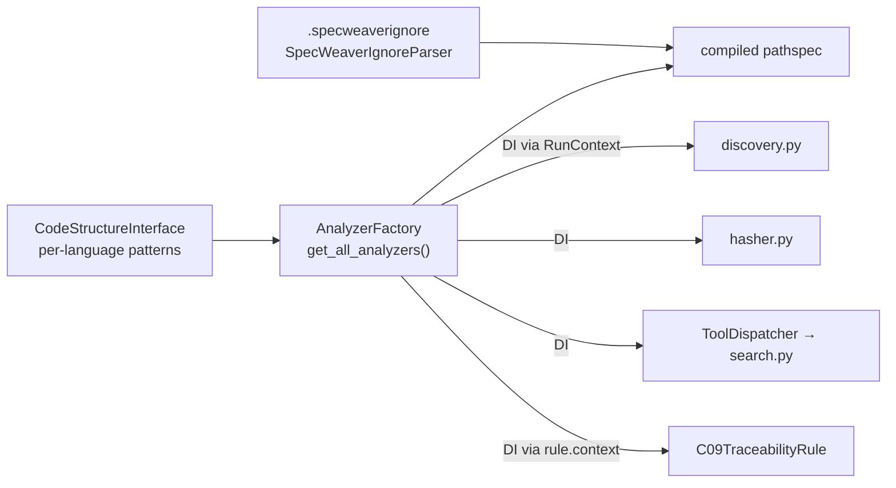

# C-SENS-02 — Smart Scan Exclusions (Tiered)

**Status:** Design Phase Approved. **COMPLETE** — SF-01..SF-05 done (tracker below) · **Feature ID**: 3.32b

| | |
|---|---|
| Extends | `A-SENS-01` (`DependencyHasher`, `TopologyGraph.stale_nodes`) |
| Used by | agent file search (`loom` filesystem tools), standards discovery, C09 traceability, hashing |

## What it does

A 3-tier file exclusion strategy for everything that scans the repo — agent file search and
semantic hashing (`DependencyHasher`):

1. **Directories** — polyglot build paths per language (`target/`, `node_modules/`, `build/`).
2. **Binaries** — per-language binary patterns (`*.pyc`, `*.class`, `*.rlib`, `*.jar`).
3. **Project file** — `.specweaverignore`, `.gitignore` semantics via `pathspec`, scaffolded with
   language defaults.

It keeps binaries out of agent token windows (no hallucination on binary content) and helps the
`< 50ms` hashing NFR.

## Why this way

Exclusions were hard-coded and Python-only in several places: `_SKIP_DIRS` in `discovery.py`,
`rglob` filtering in `hasher.py`, `test_*.py` globs in `c09_traceability.py`, unbounded `rglob` in
the `loom` search tools. Each language now declares its own patterns on its parser
(`CodeStructureInterface`); `AnalyzerFactory` unions them; every scanner takes the union by
dependency injection.

## Architecture

| Module | Role | Archetype |
|---|---|---|
| `workspace/ast/parsers` (`interfaces.py`, `exclusions.py`) | patterns per language; `SpecWeaverIgnoreParser` with injected `IgnoreIOHandler` | pure-logic |
| `workspace/context` (`analyzer_protocols.py`) | `LanguageAnalyzer`, `AnalyzerFactoryProtocol` | contract |
| `workspace/analyzers` (`factory.py`) | concrete `AnalyzerFactory` + Tree-sitter analyzers | adapter |
| `core/flow` | builds the factory, passes it down through `RunContext` | orchestrator |

## Functional Requirements

- **FR-1:** The Engine must enforce structural exclusions for Polyglot build paths (`target/`, `node_modules/`, `build/`).
- **FR-2:** The Engine must statically enforce binary file exclusions to protect token context (`*.pyc`, `*.class`, `*.rlib`, `*.jar`).
- **FR-3:** System must parse `.specweaverignore` identically to `.gitignore` semantics using `pathspec`.
- **FR-4:** Scaffolding operations must automatically populate `.specweaverignore` with language-specific directory defaults if missing.
- **FR-5:** Exclusions must integrate with `TopologyGraph.stale_nodes` to intercept file iterations before deep I/O execution.

## Non-Functional Requirements

- **NFR-1:** Extensibility - Language rules must automatically extend without modifying the `loom` execution engine (Dependency Injection).
- **NFR-2:** Performance - Unrolling `rglob` trees must map via compiled `pathspec` or unified `stale_nodes` prefixing to meet `< 50ms` NFRs.
- **NFR-3:** Mono-Repo Resilience - The global exclusion engine must handle hybrid projects (e.g. Python backend + Typescript frontend) safely without `AnalyzerFactory` detection collisions.

## Sub-features

**SF-01: Pure Logic Definitions & Ignorance Parser** — [plan](C-SENS-02_sf01_implementation_plan.md)
- `CodeStructureInterface` gains polyglot ignore patterns, implemented for `Python`, `Rust`, `Java`,
  `Kotlin`, `TS` (binary patterns vs directory limits).
- `pathspec` parsing moves out of `discovery.py` into one place (`workspace/context/exclusions.py`
  in the design; built as `workspace/ast/parsers/exclusions.py`).

**SF-02: Orchestration Factory & Scaffolding** — [plan](C-SENS-02_sf02_implementation_plan.md)
- `AnalyzerFactory.get_all_analyzers()` for the polyglot global union.
- Scaffolding prefills `.specweaverignore`.

**SF-03: Technical Debt Refactoring (The Execution Sweeps)** — [plan](C-SENS-02_sf03_implementation_plan.md)
- **`discovery.py`**: delete the Python-centric `_SKIP_DIRS`; bind `discover_files` to the polyglot
  engine via `AnalyzerFactory`.
- **`search.py`**: `iter_text_files` and `find_by_glob` in `loom` use injected exclusions, preventing
  token timeouts.
- **`hasher.py`**: drop manual `rglob` string filtering for the unified orchestrator payload.
- **`c09_traceability.py`**: drop the hard-coded `test_*.py` iteration; ask `AnalyzerFactory`, so
  `*Test.java` and `*_scenarios.rs` tests count too.

**SF-04: Analyzer Dependency Injection (Strict Decoupling)** — [plan](C-SENS-02_sf04_implementation_plan.md)
- Move `workspace/context/analyzers.py` out of the Contract layer; Tree-sitter implementations go to
  `workspace/analyzers/` (Adapter Layer).
- `AnalyzerFactoryProtocol` in the pure-logic layer, threaded through the `/flow` orchestrator by DI,
  which removes the `hasher.py` I/O boundary violation.
- The `SpecWeaverIgnoreParser` OS I/O (`Path.read_text()`, `open()`) inside `pure-logic`
  `exclusions.py` is abstracted behind DI (raised at the SF-01 gate).
- The two skipped placeholder tests in `test_exclusions.py` are implemented here (raised by SF-01
  test gaps):
  1. `test_deferred_integration_orchestrator_initializes_ignores_sf4`
  2. `test_deferred_e2e_topological_spec_bypass_hidden_binary_sf4`

**SF-05: Integration Debt Remediation (DI Consistency)** — [plan](C-SENS-02_sf05_implementation_plan.md)
- `ToolDispatcher`, `PipelineRunner` and `C09TraceabilityRule` still imported `AnalyzerFactory`
  statically, bypassing SF-04's DI. Route `AnalyzerFactoryProtocol` down the Flow Handlers through
  `RunContext`.
- Tests mock or pass the dependency down without crossing the orchestrator barrier.

## Progress Tracker

| Sub-Feature | Design/Arch | Impl Plan | Code (`/dev`) | E2E Tests |
| :--- | :---: | :---: | :---: | :---: |
| SF-01: Pure Logic Definitions & Ignorance Parser | ✅ | ✅ | ✅ | ✅ |
| SF-02: Orchestration Factory & Scaffolding | ✅ | ✅ | ✅ | ✅ |
| SF-03: Technical Debt Refactoring | ✅ | ✅ | ✅ | ✅ |
| SF-04: Analyzer Dependency Injection | ✅ | ✅ | ✅ | ✅ |
| SF-05: Integration Debt Remediation (DI) | ✅ | ✅ | ✅ | ✅ |
