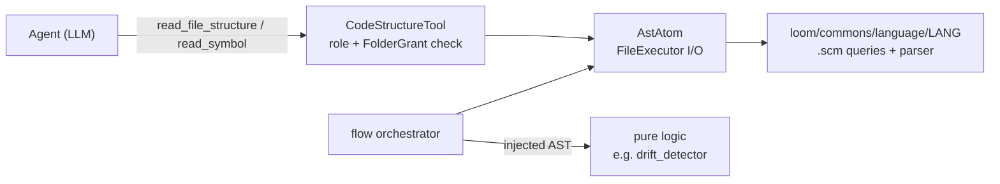

# D-SENS-02 — Polyglot AST Skeleton Extractor & Context Ledger

**Status**: APPROVED. SF-01 committed; SF-02 plan approved. · **Feature ID**: 3.22 · **Phase**: 3

| | |
|---|---|
| Lives in | `loom/commons/language/` registry · `AstAtom` · `CodeStructureTool` |
| Used by | Reviewer and Implementer agents; `flow` handlers that inject ASTs into pure logic (e.g. `drift_detector`) |
| Replaces | the "Context Ledger" `[304 Not Modified]` idea (see below) |

## What it does

Cuts LLM context-window bloat and API cost in long multi-turn agent sessions. The agent-facing
**CodeStructureTool** offers `read_file_structure(file)` (imports, signatures, docstrings only) and
`read_symbol(file, symbol)` (one class/function in full). SF-02 adds surgical AST body patching
(`write_symbol`, split into four intents).

Parsing uses `tree-sitter` with language-specific `.scm` node queries in the consolidated
`loom/commons/language/` registry, run by Atoms in the isolated `Loom` Engine Sandbox.

## Why not a 304 Context Ledger

The first idea: a SQLite-backed "Context Ledger" tracks what the agent has read in a session and
answers a repeat read with `[304 Not Modified]` to save tokens.

Discarded, because LLMs lose attention to content deep in a long context ("Lost in the Middle"): a
file loaded 20 turns ago is effectively forgotten. A reread refreshes attention. Blocking it forces
the agent onto fading memory and causes hallucinated syntax in generated code. A skeleton refreshes
attention with just the interface, at a fraction of the tokens.

## Architecture

- **Language registry:** `src/specweaver/loom/commons/language/<lang>/` is the single source of truth
  for QA test runners and AST C-binary parsing.
- **Dependency injection:** pure-logic layers (e.g. `drift_detector`) never run tree-sitter. The
  `flow` orchestrator uses `AstAtom` to build ASTs and injects them.

## Decisions

| # | Decision | Rationale | Architectural Switch? |
|---|----------|-----------|----------------------|
| AD-1 | Dedicated CodeStructureTool | Keeps raw filesystem operations and code investigation apart in the LLM's tool choice. | No |
| AD-2 | Deprecate `[304 Not Modified]` | Resolves "Lost in the Middle" context bloat via skeleton structure instead of caching. | No |
| AD-3 | Loom Commons Dependency Injection | Tree-sitter C-binding execution must live in `loom/commons/` and be Dependency-Injected into pure logic layers to satisfy Tach layer boundary constraints. | No |

## Functional Requirements

| # | FR | Actor | Action | Outcome |
|---|-----|-------|--------|---------|
| FR-1 | Skeleton Abstraction | CodeStructureTool | reads a file structure | The system SHALL detect the language, route to the correct parser, execute the Tree-Sitter tags query, and return ONLY the file's imports, class/method signatures, and docstrings. |
| FR-2 | Symbol Extraction | CodeStructureTool | reads a specific symbol | The system SHALL return the entire implementation payload of exclusively the requested symbol (class/function) from the target file. |
| FR-3 | Polyglot Registry | Flow Engine | centralizes language I/O | The system SHALL unify test-running (`runner.py`) and AST execution (`ast_parser.py`) exclusively within `loom/commons/language/<name>`. |
| FR-4 | Query Fallback | CodeStructureTool | encounters unsupported language | If the file's language has no registered extractor plugin, the system SHALL throw an explicit error reminding the LLM to use `read_file` instead. |
| FR-5 | Symbol Replacement | CodeStructureTool | writes into a specific symbol | *(SF-02)* The system SHALL replace the body of a specific AST symbol with new code logic without relying on regex or fragile byte matching. |
| FR-6 | Symbol Listing | CodeStructureTool | lists available symbols | The system SHALL return a flat array mapping of all targetable symbols within a file, filterable by a designated visibility constraint (e.g. `['public']`). |
| FR-7 | Symbol Body Extraction | CodeStructureTool | reads only the inner block | The system SHALL return only the internal execution logic block (`{...}`) of a symbol without extracting its decorators or external class wrappers. |

## Non-Functional Requirements

| # | NFR | Threshold / Constraint |
|---|-----|----------------------|
| NFR-1 | Latency | AST Extraction must occur locally via `tree-sitter` with a P95 latency of `<50ms` per file to prevent agent blocking. |
| NFR-2 | Reliability | The Tree-sitter abstraction MUST NOT fail the pipeline if a file contains minor syntax errors (Tree-sitter error-recovery must remain enabled). |

## External dependencies

| Tool | Version | Key API Surface | Source |
|------|---------|----------------|--------|
| `tree-sitter` | Latest | `Parser`, `Language`, `.scm` queries | Already in `pyproject.toml` |
| `tree-sitter-<lang>` | Latest | Pre-compiled language grammars | Already in `pyproject.toml` |

## Sub-features

| SF | Does | FRs | Depends on | Plan |
|----|------|-----|-----------|------|
| SF-01 | Read side: the `loom/commons/language/` registry, `AstAtom`, and the `read_file_structure` / `read_symbol` intents on `CodeStructureTool`. | FR-1, FR-2, FR-3, FR-4 | none | [sf01](D-SENS-02_sf01_implementation_plan.md) |
| SF-02 | Write side: surgical replacement of symbol bodies (`write_symbol`) on the SF-01 parser. | FR-5 | SF-01 | [sf02](D-SENS-02_sf02_implementation_plan.md) |

## Progress Tracker

| SF | Name | Depends On | Design | Impl Plan | Dev | Pre-Commit | Committed |
|----|------|-----------|--------|-----------|-----|------------|-----------|
| SF-01 | Polyglot AST Extractor (Read Side) | — | ✅ | ✅ | ✅ | ✅ | ✅ |
| SF-02 | AST Symbol Writer (Write Side) | SF-01 | ✅ | ✅ | ⬜ | ⬜ | ⬜ |
