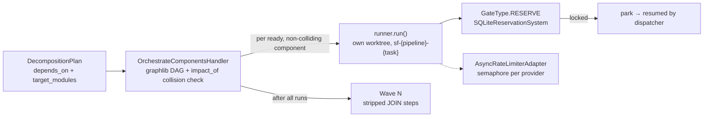

# C-FLOW-03 — Multi-spec Pipeline Fan-out

**Status**: APPROVED · **COMPLETE** — all sub-features implemented, tested and committed; 3986
tests at completion. · **Phase**: 3 · **Feature ID**: 3.27

| | |
|---|---|
| Extends | `PipelineRunner.fan_out(sub_pipelines, ...)` (`asyncio.gather()`), `OrchestrateComponentsHandler` |
| Uses | Topology Graph (blast radius), Git Worktree Bouncer (3.26, `use_worktree` via `GitAtom`) |
| Moved out | FR-3, FR-4 → [`TECH-062`](../../topic_07_technical_debt/TECH-062/TECH-062_design.md) |
| Not touched | components with overlapping blast radiuses — serialized, never run together |

## What it does

Decomposition can yield several components. Instead of running them one after another, the
orchestrator spawns one L3 pipeline per component and runs disjoint ones in parallel, each in its own
worktree sandbox.

- The Topology Graph predicts each component's blast radius; overlapping components never run at the
  same time, so parallel sandboxes never produce git merge conflicts.
- `depends_on` orders components; a failure aborts its dependents.
- A SQLite reservation gate parks a run whose resources another agent holds.
- Shared artifacts (`README.md`, `context.yaml`) are written after the parallel runs, in a JOIN wave.
- LLM calls are throttled per provider across all parallel runs.

**Not built:** the per-sandbox `SW_PORT_OFFSET` (port/SQLite collision avoidance) and serialized
`git worktree add` (FR-3, FR-4). The hazards are real — `run_fan_out` is concurrent via
`asyncio.gather` and each sub-run can call `git worktree add` — so the work is `TECH-062`.

## Architecture

| Part | Lives in (as planned) |
|---|---|
| DAG dispatcher, JOIN stripping, Wave N | `src/specweaver/core/flow/_decompose.py` |
| `target_modules` on `ComponentChange` | `src/specweaver/workflows/planning/decomposition.py` |
| Reservation lock | `src/specweaver/core/flow/reservation.py` |
| `RESERVE` / `JOIN` gates | `core/flow/state.py`, `models.py`, `gates.py` |
| Rate limiter | `src/specweaver/infrastructure/llm/adapters/_rate_limit.py`, wired in `factory.py` |

`TopologyGraph` supplies `impact_of()` and `dependencies_of()`, which resolve downstream impact
recursively.

External tools: Git ^2.30.0 (`git worktree add`, already integrated in 3.26; compat confirmed) and
Python asyncio ^3.10 (`asyncio.gather`), both from the host environment.

Blueprint references:

- Archon: Deterministic Collision Routing — deterministic hash-based port offsets for temporary git
  worktree sandboxes, avoiding OS resource collisions (`EADDRINUSE` or SQLite locking) during
  parallel test runs.
- DMZ Ecosystem: strict isolation of executing worker agents from shared integration/documentation
  steps.

## Decisions

| # | Decision | Rationale | Architectural Switch? |
|---|----------|-----------|----------------------|
| AD-1 | Static Wave Scheduling (DAG) via TopologyGraph | Deterministic wave generation guarantees collision-free sub-branches across the parallel grid, without the deadlock hazards of Dynamic Module Mutex locks. | No |
| AD-2 | Deferred Documentation JOIN Gate | Separating code flows from shared reporting artifact updates (`README.md`, `context.yaml`) avoids markdown collisions. | No |
| AD-3 | Component-Unique Branch Names | Replacing the generic `sf-temp` branch name with a unique per-component namespace prevents Git Branch Exclusivity errors without UUID overhead. | No |

AD-1 as built: SF-01 (HITL) replaced strict sequential waves with a **dynamic DAG dispatcher** —
a component starts the moment its dependencies finish, if its impact does not overlap a running one —
so one straggler no longer stalls a whole wave.

## Functional Requirements

| # | FR | Actor | Action | Outcome |
|---|-----|-------|--------|---------|
| FR-1 | Blast Radius Wave Scheduling | Orchestrator | Analyzes each decomposed component against the `TopologyGraph` and explicitly enforces `depends_on` logical dependencies. | Identifies completely disjoint sets of components and assigns them to sequential execution "Waves" (DAG). |
| FR-2 | Resource Reservation Locking | PipelineRunner | Checks an SQLite Reservation Table before spawning worktrees. | Cross-feature multi-agent collisions are parked if modules or ports intersect. |
| FR-5 | Deferred Artifact Synthesis | Orchestrator | Delays generation of shared documentation (`README.md`, `context.yaml`) until after parallel execution. | Implements a `GateType.JOIN` ensuring shared artifacts are merged safely without collision. |
| FR-6 | DAG Cascading Failures | PipelineRunner | Monitors wave batch execution states and aborts downstream dependents. | If Component A fails in Wave 1, Component B (which conceptually `depends_on` A) is aborted in Wave 2. |

**FR-3 and FR-4 were deleted 2026-08-17, not delivered.** Both described mechanisms absent from
`src/`: `SW_PORT_OFFSET` appears nowhere, and no `gc.auto` configuration or worktree-creation
serialisation exists. Deleted rather than left standing, following `TECH-046`: an FR advertising
unbuilt behaviour survives delivery and epic closure unless the descope is visible. Found because
`ADR-004`'s migration requires citing every FR with a killed mutant, and unbuilt code has no mutant.

## Non-Functional Requirements

| # | NFR | Threshold / Constraint |
|---|-----|----------------------|
| NFR-1 | Git Merge Safety | 100% guarantee that parallel sandboxes will not incur git merge conflicts. Achieved strictly by ensuring disjoint topological scopes. |
| NFR-2 | Infrastructure Isolation | Package dependency updates (e.g. `pyproject.toml`) strictly serialize into a `Wave 0` infrastructure layer to prevent lock hash merge collisions entirely. |
| NFR-3 | Rate Limit Resiliency | Must throttle concurrent LLM API calls with `asyncio.Semaphore()` bound to Provider configurations to stop HTTP 429 crash loops. |
| NFR-4 | Log Observability | Parallel pipeline log streams must be strictly tagged by `run_id` so humans can debug asynchronous failures without console interleaving. |

## Edge cases

1. **DAG cycle** (A depends on B, B on A): `OrchestrateComponentsHandler` detects the cycle and
   **fails fast** before any pipeline boots, instead of locking forever.
2. **Orphaned SQLite lock (SIGKILL)**: if the daemon is hard-killed (e.g. OOM, Ctrl-C), a lock may
   be orphaned. The locking schema checks the parent PID; a dead PID's lock is ignored by new jobs.
3. **Full collision**: if 5 components all touch the same module (100% collision), scheduling
   degrades to serial (Wave 1, Wave 2 ... Wave 5) instead of failing.
4. **Straggler**: 4 tasks in a wave finish, 1 stalls forever — the DAG would stall. Standard
   pipeline timeouts apply to the `asyncio` envelope, mark the straggler FAILED, and let downstream
   aborts (FR-6) fire at once.
5. **Disk exhaustion from crashed worktrees**: a `finally` block runs `git worktree remove --force`,
   so temporary sandboxes never accumulate.

## Sub-features

| SF | Does | FRs | Depends on | Plan |
|----|------|-----|-----------|------|
| SF-01 | Topological DAG Wave Generation: `DecompositionPlan` demands explicit `depends_on` and target modules; `TopologyGraph` collision detection in the orchestration layer splits components into mutually exclusive subsets. Input: DecompositionPlan, TopologyGraph. Output: batches of PipelineDefinitions safe to `fan_out`. | FR-1, FR-6 | — | [sf01](C-FLOW-03_sf01_implementation_plan.md) |
| SF-02 | Sandbox Environmental Isolation: `PipelineRunner._execute_loop` and `RunContext` accept env-var propagation (like `SW_PORT_OFFSET`); serialized `git worktree add` against index-lock crashes; SQLite Resource Reservation. Input: RunContext hash hints, `use_worktree`. Output: env vars in executor sub-shells, overlapping sessions parked. | FR-2, FR-3, FR-4 | SF-01 | [sf02](C-FLOW-03_sf02_implementation_plan.md) |
| SF-03 | Parallel Engine Hardening: provider-bound `asyncio.Semaphore` throttling; shared-file (docs, lock files) changes moved into deferred `GateType.JOIN` or sequential `Wave 0` steps. Input: package generation steps, pipeline configs. Output: no HTTP 429 timeouts or `.lock` file conflicts. | FR-5 | SF-02 | [sf03](C-FLOW-03_sf03_implementation_plan.md) |

SF-02's FR-3/FR-4 were never built — see Functional Requirements.

Execution order: SF-01 (no deps) → SF-02 (depends on SF-01) → SF-03 (depends on SF-02).

Developer guide owed: **Multi-Agent Scaling Guide** — how topology constraints affect L3 component
generation and speed. ⬜ To be written during Pre-commit.

## Progress Tracker

| SF | Name | Depends On | Design | Impl Plan | Dev | Pre-Commit | Committed |
|----|------|-----------|--------|-----------|-----|------------|-----------|
| SF-01 | Topological DAG Wave Generation | — | ✅ | ✅ | ✅ | ✅ | ✅ |
| SF-02 | Sandbox Environmental Isolation | SF-01 | ✅ | ✅ | ✅ | ✅ | ✅ |
| SF-03 | Parallel Engine Hardening | SF-02 | ✅ | ✅ | ✅ | ✅ | ✅ |
