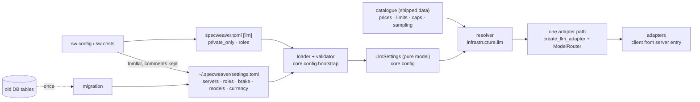

# C-FLOW-13 — Model Catalogue: One Central Place for LLM Settings

**Status**: APPROVED — approved by Steve Bula `[agreed 2026-09-26]` · **DAL**: C · **Story**: US-16 add-on "Centralized Model Table"
([paths](../../../stories/US-16.md)) · Decisions: [llm_settings_grilling_2026-09-26.md](../../../../analysis/llm_settings_grilling_2026-09-26.md)

| | |
|---|---|
| Absorbs | `D-FLOW-05` Model Catalogue Adoption (retired 2026-09-26) |
| Enables | `B-FLOW-05` brake values · `A-FLOW-01` model choice |
| Consumes | `D-FLOW-03` static routing · `C-FLOW-01` telemetry · `E-FLOW-01` config DB (migration source only) |
| Not touched | brake behaviour (`B-FLOW-05`) · measuring and choosing models (`A-FLOW-01`) · API keys' storage (env vars stay) |

## What it does

Every LLM call gets its model, server, sampling and price from one place: a machine file
`~/.specweaver/settings.toml`, a project `[llm]` section in `specweaver.toml`, and a shipped model
catalogue. `sw` commands write the same files. Nothing else holds an LLM setting.

## Why

Today the same kind of setting lives in about twelve places, and the copies disagree: the seeded
default models price at $0, profiles say 4096 output tokens while the seed says 8192, decomposition
always asks for `gemini-3-flash-preview`, 4 of 7 entry points drop the user's price overrides, and
routed calls in `sw run` skip the spend brake, the rate limit and the usage flush. A local server
(the GB10) cannot be configured at all: no adapter takes a server address.

## Architecture

| Piece | Lives in | Why there |
|---|---|---|
| `LlmSettings` models (servers, roles, brake, currency, model facts) | `core.config` | pure, importable by llm, flow, cli (`tach.toml`) |
| Loader, validator, writer, migration | `core.config.bootstrap` | the only module allowed file + DB + env I/O for settings |
| Catalogue data file + resolver | `infrastructure.llm` | read by adapters and telemetry without importing bootstrap |
| Adapter client construction from a server entry | `infrastructure.llm.adapters` | one place builds every client |

Layering, lowest to highest: catalogue defaults → machine file → project `[llm]` → `--model` for one
run. The project level may set only `private_only` and `[llm.roles]` `[agreed 2026-09-26]` (Q35):
a cloned repo must not be able to send code to its own server.

## Decisions

| # | Decision | Why |
|---|---|---|
| AD-1 | Files, not the DB, hold settings; the DB keeps only records (usage, spend) `[agreed 2026-09-26]` | readable in one look, reviewable, versioned with the project |
| AD-2 | Roles are written `model@server` in `[roles]` `[agreed 2026-09-26]` | one line says what runs where |
| AD-3 | Privacy is a property of the **server**, not the model | the same Qwen is private on the GB10 and public on a cloud host |
| AD-4 | Every client gets `base_url` explicitly from its server entry; `OPENAI_BASE_URL` is ignored | one stray env var would send private code to the cloud or cloud calls to the GB10 |
| AD-5 | Read with `tomllib`, write with `tomlkit` | tomlkit keeps the user's comments; tomllib is stdlib |
| AD-6 | Each file is validated alone, strictly (`extra="forbid"`), before layering | every error can name its own file; a typo cannot pass as a default |
| AD-7 | Catalogue seeded from models.dev (MIT, credited), version stamped, never fetched at runtime `[agreed 2026-09-26]` | its shape matches ours; runtime fetch is the anti-pattern |
| AD-8 | Prices stored in USD per 1M tokens; CHF only at display, with the dated manual rate `[agreed 2026-09-26]` | the providers' unit; history does not shift when the rate changes |

## Functional Requirements

| # | FR | Actor | Action | Outcome |
|---|-----|-------|--------|---------|
| FR-1 | Machine settings | Loader | SHALL read `specweaver_root()/settings.toml`; a missing file SHALL mean built-in defaults | a fresh install works; `SPECWEAVER_DATA_DIR` moves the file with the data |
| FR-2 | Project settings | Loader | SHALL read the `[llm]` section of the project's `specweaver.toml`, accepting only `private_only` and `[llm.roles]` | a project chooses; it cannot define servers or keys |
| FR-3 | One resolved setting | Resolver | SHALL resolve each call's model, server and sampling as catalogue → machine → project → `--model`; a role may be a string `"model@server"` or a table adding sampling overrides; `sw config show` SHALL print every value with its origin | one answer per call, and the user can see where it came from |
| FR-4 | Broken file refuses | Loader | SHALL refuse any command that resolves LLM settings on invalid TOML, an unknown key or a wrong type, naming the file, the key and the line; commands that call no LLM (e.g. `sw check`) are unaffected | a typo never becomes a silent default |
| FR-5 | Project cannot redirect | Loader | SHALL refuse a project file that sets a server, a `base_url` or an `api_key_env` | a cloned repo cannot send code elsewhere |
| FR-6 | Catalogue | Resolver | SHALL read per-model facts — price per 1M input/output tokens (USD), context size, max output, tool calling, whether output can be capped including thinking, sampling defaults — from the shipped catalogue, overridable by `[models."<id>"]` in the machine file | a new model is a data change, not a release |
| FR-7 | Servers | Adapters | SHALL build each client from its server entry — `base_url`, `api_key_env`, `max_parallel` — with an explicit `base_url`, and a server without a key SHALL be usable | the GB10 can be configured; keyless local servers work |
| FR-8 | Parallel limit per server | Adapter path | SHALL limit concurrent requests per **server** to its `max_parallel` | the GB10 and a cloud provider do not share one semaphore |
| FR-9 | Privacy rule | Resolver | SHALL refuse, before any call, a role that points at a server with `private = false` when the project sets `private_only = true`, naming the rule and the role | no silent fallback to the cloud |
| FR-10 | One adapter path | Factory, `ModelRouter` | SHALL obtain every adapter through the same resolver and wrapper, for direct and routed calls alike | routed calls stop skipping the brake, the limit and the usage flush |
| FR-11 | No hard-coded models | Handlers, workflows | SHALL take the model from the resolver — the step's role, else `[roles] default`; with neither set the command SHALL refuse, naming the role and the `sw config` command that sets it — there is no built-in default model `[agreed 2026-09-26]`; the 11 hard-coded fallback model names are removed | no step silently asks for a model the user never chose |
| FR-12 | One price source | Telemetry, `sw costs` | SHALL price every call from the catalogue plus machine overrides; no `default_costs` dict remains in any adapter; an unknown price SHALL be reported as unknown, not as 0 | the recorded number is right, or visibly unknown |
| FR-13 | Money in CHF | `sw costs` | SHALL show prices and month-to-date spend in CHF at `usd_to_chf`, with `rate_date`; without a rate it SHALL show USD and say the rate is unset | the user reads francs, and knows how old the rate is |
| FR-14 | One-time migration | Loader | SHALL, on first load, write today's `llm_profiles` and `llm_cost_overrides` into the machine file and each project's `llm_project_links` into that project's `specweaver.toml`, once, list every file it changed, then read the files only | nothing the user configured is lost; no second source remains; the user sees which files changed |
| FR-15 | Commands write the files | `sw config`, `sw costs` | SHALL write the machine or project file with `tomlkit`, keeping comments, instead of the DB | the commands and the file are one truth |
| FR-16 | Model for one run | `sw implement`, `sw run` | SHALL accept `--model <model@server>` for this run only | a quick trial needs no file edit |
| FR-17 | Brake values handed over | Resolver → brake | SHALL provide `[brake]` values (CHF and GPU-hour check-in intervals, agent turns) to the brake — **seam with `B-FLOW-05`**, test written as `xfail(strict=True)` until its redesign | the values live here; the behaviour lives there |
| FR-18 | Catalogue update | `scripts/update_model_catalogue.py` | SHALL regenerate the shipped catalogue from models.dev, keeping local additions, and stamp source, fetch date, ETag and repo commit; the committed file is the pin `[agreed 2026-09-27]` | an update is a reviewable diff, never a runtime fetch |

## Non-Functional Requirements

| # | NFR | Threshold / Constraint |
|---|-----|----------------------|
| NFR-1 | Load cost | Settings resolved once per command, under 50 ms for files under 20 KB `[agreed 2026-09-26]` |
| NFR-2 | No secrets written | No API key value appears in any settings file, log line or error message |
| NFR-3 | Offline | No network access to read settings or the catalogue |
| NFR-4 | One reader | Only `core.config.bootstrap` reads or writes the settings files; `tach` enforces it |
| NFR-5 | Versioned files | Both files and the catalogue carry `schema_version`; an unknown version refuses with an upgrade message |
| NFR-6 | Comments survive | A `sw` write leaves every existing comment and key order in the file unchanged |

## Where it plugs in

| FR | Data needed | Provider · surface | Verified how |
|---|---|---|---|
| FR-1 | data dir | `paths.specweaver_root() -> Path` | read `core/config/paths.py:28-41` |
| FR-2, FR-14 | project root | `proj.get("root_path")` from the project registry | read `bootstrap/settings_loader.py:198` |
| FR-10 | direct adapter path | `create_llm_adapter(settings, *, telemetry_project, cost_overrides)` | read `infrastructure/llm/factory.py:84-161` |
| FR-10 | routed adapter path | `ModelRouter(settings_provider, telemetry_project, cost_overrides)`; `get_for_task(task_type)` | read `infrastructure/llm/router.py:62-128`; routed collectors get no budget (`router.py:120`, `collector.py:60`) |
| FR-7 | client construction | `__init__(self, api_key: str \| None = None)` on all five adapters; none takes `base_url` | read `adapters/openai.py:71-79` and the other four |
| FR-8 | current limiter | `AsyncRateLimiterAdapter(wrapped, limit=3, timeout=30.0)`, semaphore keyed by `provider_name` | read `adapters/_rate_limit.py:15-39` |
| FR-12 | current pricing | `estimate_cost(model, usage, overrides)` returns 0.0 for unknown | read `infrastructure/llm/telemetry.py:61-90` |
| FR-14 | migration source | `LlmProfile`, `ProjectLlmLink`, `LlmCostOverride` | read `infrastructure/llm/store.py:21-66` |
| FR-15 | writer precedent | `tomlkit.parse` / `tomlkit.dumps` | read `workspace/project/tach_sync.py:86,116` |
| FR-17 | brake input | `SpendBudget(limit_usd, token_limit)` | read `infrastructure/llm/budget.py:49` — to be redesigned by `B-FLOW-05` |

## Risks

| Risk | Mitigation |
|---|---|
| Migration loses a setting | FR-14 test: every row of each table appears in the files; the DB is not deleted in this feature |
| pydantic-settings merges one source's file list shallowly (a project `[llm]` wipes the machine one) | one source per file, explicit layering (AD-6) |
| TOML errors carry no line number on Python 3.11–3.13 | line parsed from the message; key → line via the tomlkit document |
| A stale env var overrides the file invisibly | `sw config show` prints each value's origin (FR-3) |
| Catalogue goes stale | version stamp shown in `sw costs`; update is a deliberate command |
| Qwen tool calling on vLLM | parser `qwen3_xml`, not `qwen3_coder` (loops on long tool inputs); recorded in the catalogue entry note |

## Sub-features

| SF | Does | FRs | Depends on | Plan |
|----|------|-----|-----------|------|
| SF-01 | Settings models, loader, validator, layering, `sw config show` | FR-1, FR-2, FR-3, FR-4, FR-5 | — | [sf01](C-FLOW-13_sf01_implementation_plan.md) |
| SF-02 | Catalogue, server entries, adapters built from servers, per-server limit, privacy rule | FR-6, FR-7, FR-8, FR-9, FR-18 | SF-01 | [sf02](C-FLOW-13_sf02_implementation_plan.md) |
| SF-03 | One adapter path, hard-coded models removed, one price source, CHF | FR-10, FR-11, FR-12, FR-13 | SF-02 | ⬜ |
| SF-04 | Migration and commands writing the files | FR-14, FR-15 | SF-01 | ⬜ |
| SF-05 | `--model` for one run; brake values handed to `B-FLOW-05` | FR-16, FR-17 | SF-03 | ⬜ |

## Progress Tracker
| SF | Name | Depends On | Design | Impl Plan | Dev | Pre-Commit | Committed |
|----|------|-----------|--------|-----------|-----|------------|-----------|
| SF-01 | Settings and layering | — | ✅ | ✅ | ✅ | ✅ | ✅ |
| SF-02 | Catalogue, servers, privacy | SF-01 | ✅ | ✅ | ⬜ | ⬜ | ⬜ |
| SF-03 | Consumers switched over | SF-02 | ✅ | ⬜ | ⬜ | ⬜ | ⬜ |
| SF-04 | Migration and writers | SF-01 | ✅ | ⬜ | ⬜ | ⬜ | ⬜ |
| SF-05 | Run override, brake values | SF-03 | ✅ | ⬜ | ⬜ | ⬜ | ⬜ |
