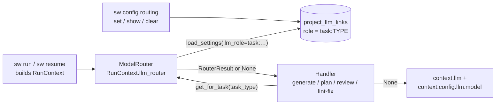

# D-FLOW-03 — Static Model Routing (Config-Driven)

**Status**: APPROVED. **COMPLETE** — SF-01 and SF-02 committed (SF-02: `27b03522`). · **Phase**: 3
· **Feature ID**: feature_3_14 (legacy numbering; the code comments call it 3.12b)

| | |
|---|---|
| Extends | the LLM layer: `create_llm_adapter`, `load_settings`, `project_llm_links` |
| Used by | every LLM-calling pipeline handler (generate, plan, review, lint-fix) |
| Not touched | adapters, telemetry logic, validation, pipeline YAML |

## What it does

Lets a user assign a model per task type — e.g. `review → claude-3-5-sonnet`,
`draft → gemini-3-flash`, `implement → gemini-3-1-pro` — instead of every pipeline step using the
one project adapter and model.

`TaskType` values map to named DB LLM profiles. At generation time each handler resolves a
`RouterResult` (adapter + model + temperature + max_tokens) for its task type and builds
`GenerationConfig` from it. No routing entry → the default profile, as before.

No AI, no dynamic learning — pure user configuration in SQLite.

**Same provider, several models.** Two task types may use one provider with different models
(e.g. `draft → gemini-3-flash-preview`, `implement → gemini-3-1-pro`). `ModelRouter` caches the
**adapter instance** per `(provider, api_key_hash)`, so one `GeminiAdapter` serves both: the model
name travels in `GenerationConfig.model`, not the adapter. Different providers get separate
instances (one `GeminiAdapter`, one `AnthropicAdapter`).

## Architecture



| Part | Role |
|---|---|
| `llm/router.py` | `RouterResult` + `ModelRouter` (adapter archetype) |
| `RunContext.llm_router` | the router, injected per run; `None` = no routing |
| handlers | resolve per task type, fall back to `context.llm`: `flow/_generation.py` (`_gen_config_from_context()`, `GenerateCodeHandler`, `GenerateTestsHandler`, `PlanSpecHandler._build_config()`), `flow/_review.py` (`ReviewSpecHandler`, `ReviewCodeHandler`), `flow/_lint_fix.py`. `flow/_draft.py`'s `DraftSpecHandler` was listed but makes no LLM calls |
| `_db_llm_mixin.py` | routing rows in `project_llm_links` |
| `sw config routing` | user surface (SF-02) |

Since moved (2026-09-25): `llm/router.py` → `infrastructure/llm/router.py`; `RunContext` →
`core/flow/handlers/run_context.py` (read as `context.model.llm_router`); the DB methods →
`infrastructure/llm/store.py` (async); the CLI group → `core/config/interfaces/cli.py`. Code blocks
below are as designed.

**Building blocks it reuses:**
- **`TaskType`** (`llm/models.py`): `DRAFT`, `REVIEW`, `PLAN`, `IMPLEMENT`, `VALIDATE`, `CHECK`,
  `UNKNOWN`. The string values are the routing keys (`TaskType.DRAFT.value == "draft"`,
  `TaskType.REVIEW.value == "review"`). Every handler already stamps `GenerationConfig.task_type`
  before `generate()`.
- **`create_llm_adapter(db, llm_role=...)`** (`llm/factory.py`): loads the profile for a role from
  `project_llm_links`, returns `(SpecWeaverSettings, adapter, GenerationConfig)`. Its
  telemetry-wrapped creation pattern (3.12) is reused.
- **`load_settings(db, project_name, llm_role=...)`** (`config/settings.py`): resolves a profile for
  `(project_name, llm_role)`, returning `SpecWeaverSettings` with its model, temperature,
  max_tokens, provider; falls back to `system-default` when no project link exists. The router calls
  `load_settings(db, project, llm_role=f"task:{task_type}")`; no `"task:review"` row → `ValueError`,
  which the router treats as "no routing → return None".
- **`project_llm_links`** (DB schema V10): `(project_name TEXT, role TEXT, profile_id INT)`. Routing
  rows use role `"task:<TaskType.value>"`, read through `load_settings()` with
  `llm_role="task:<task_type>"` — the same path `create_llm_adapter` uses.
- **`TelemetryCollector`** (`llm/collector.py`): `ModelRouter` wraps each new adapter at cache-fill
  time when `telemetry_project` is set; cached instances are already wrapped — no re-wrapping.
- **`RunContext`** (`flow/_base.py`): carries `llm: Any` and `config: Any`; `llm_router: Any = None`
  is additive. Handlers check `context.llm_router is not None` and prefer it.

Blueprint: `llm_routing_and_cost_analysis.md` §4.3.12b ("Config schema + router lookup in
handlers"). External tools: none — pure internal. DB schema unchanged, no migration.

## Decisions

### AD-1: New `llm/router.py` (adapter archetype)

`ModelRouter` lives in `llm/`, whose archetype is `adapter` (wraps external services); it wraps
factory + adapter creation. It consumes `config/` (DB + settings), which `llm/` may already do. It
forbids `loom/*` — the router never touches tools or atoms.

### AD-2: `RouterResult` NamedTuple

The handler needs the adapter **and** model/temperature/max_tokens. Returning only the adapter would
leave `GenerationConfig.model` at the project default.

```python
# llm/router.py
from typing import NamedTuple

class RouterResult(NamedTuple):
    adapter: Any          # LLMAdapter or TelemetryCollector
    model: str
    temperature: float
    max_output_tokens: int
    provider: str         # for logging / diagnostics
    profile_name: str     # for logging / diagnostics
```

### AD-3: `ModelRouter` class contract

```python
# llm/router.py
class ModelRouter:
    """Resolves the correct LLM adapter + settings per TaskType.

    Created once per pipeline run by the CLI/API layer.
    Injected into RunContext.llm_router.
    Caches adapter instances by (provider, api_key_hash).
    """

    def __init__(
        self,
        db: "Database",
        project_name: str,
        telemetry_project: str | None = None,
    ) -> None:
        self._db = db
        self._project_name = project_name
        self._telemetry_project = telemetry_project
        self._cache: dict[str, Any] = {}  # key: f"{provider}:{hash(api_key)}"

    def get_for_task(self, task_type: "TaskType") -> "RouterResult | None":
        """Return RouterResult for the given task_type, or None if no routing configured.

        Returns None → caller falls back to context.llm + context.config.llm.model.
        Never raises — all exceptions are caught and logged.
        """
        ...
```

**`get_for_task` internals:**

```python
role_key = f"task:{task_type.value}"  # e.g. "task:review"

try:
    settings = load_settings(self._db, self._project_name, llm_role=role_key)
except ValueError:
    # No routing entry for this task_type → return None (caller uses default)
    logger.debug("[routing] no entry for task_type=%s, using default", task_type.value)
    return None
except Exception:
    logger.warning("[routing] lookup failed for task_type=%s", task_type.value, exc_info=True)
    return None

cache_key = f"{settings.llm.provider}:{hash(settings.llm.api_key)}"
if cache_key not in self._cache:
    adapter_cls = get_adapter_class(settings.llm.provider)
    adapter = adapter_cls(api_key=settings.llm.api_key or None)
    if self._telemetry_project:
        adapter = TelemetryCollector(adapter, self._telemetry_project)
    self._cache[cache_key] = adapter

adapter = self._cache[cache_key]
logger.debug(
    "[routing] task_type=%s → profile (provider=%s, model=%s)",
    task_type.value, settings.llm.provider, settings.llm.model,
)
return RouterResult(
    adapter=adapter,
    model=settings.llm.model,
    temperature=settings.llm.temperature,
    max_output_tokens=settings.llm.max_output_tokens,
    provider=settings.llm.provider,
    profile_name="",  # populated from DB row name if needed
)
```

### AD-4: Handler integration pattern

Every handler that calls `context.llm` for generation:

```python
# Resolve routing (new pattern, same for all 3 handler files)
routed = context.llm_router.get_for_task(task_type) if context.llm_router else None
adapter = routed.adapter if routed else context.llm
config = GenerationConfig(
    model=routed.model if routed else context.config.llm.model,
    temperature=routed.temperature if routed else <handler_default_temperature>,
    max_output_tokens=routed.max_output_tokens if routed else context.config.llm.max_output_tokens,
    task_type=task_type,
)
```

The helpers `_gen_config_from_context()` (in `_generation.py`) and `_build_config()` (in
`PlanSpecHandler`) take an optional `RouterResult` and prefer it over `context.config`.

### AD-5: `ModelRouter` creation in CLI layer

Created in the CLI where `RunContext` is assembled, next to `create_llm_adapter()`, with the same
`db`, `project_name`, `telemetry_project`; injected into `RunContext.llm_router`.

```python
# cli/_helpers.py (or equivalent, wherever RunContext is built)
router = ModelRouter(db, active_project, telemetry_project=project_name)
context = RunContext(
    ...,
    llm=adapter,          # existing default adapter (fallback)
    llm_router=router,    # new: per-task routing
)
```

### AD-6: Reuse `project_llm_links` with `"task:"` namespace

Role key: `f"task:{task_type_value}"`, where `task_type_value` is the lowercase `.value` of
`TaskType` (`"draft"`, `"review"`, ...). Examples: `"task:review"`, `"task:implement"`,
`"task:plan"`. Distinct from the existing roles `"draft"`, `"review"`, `"search"` — no collision,
no migration.

DB access (in `_db_llm_mixin.py` or via `load_settings`):
```python
# To store a routing entry:
db.link_project_profile(project_name, f"task:{task_type}", profile_id)
# To read a routing entry (via existing load_settings):
settings = load_settings(db, project_name, llm_role=f"task:{task_type}")
# To delete a routing entry:
db.unlink_project_profile(project_name, f"task:{task_type}")  # NEW method needed
# To list all routing entries:
db.get_project_routing_entries(project_name)  # NEW method needed — SELECT WHERE role LIKE "task:%"
```

`unlink_project_profile` and `get_project_routing_entries` are new, added to `_db_llm_mixin.py` in
SF-01.

### AD-7: Unified LLM call interface — `generate(messages, config)` everywhere

Every handler calls:
```
generate(messages: list[Message], config: GenerationConfig) → LLMResponse
```
No handler passes a raw string to `generate()`. The interface is defined in `LLMAdapter`
(abstract base) and respected by all adapters and `TelemetryCollector`; routing needs it to work
uniformly across task types. Replaced: `LintFixHandler._llm_fix()` called `llm.generate(prompt)`
with a raw string, bypassing `GenerationConfig` and failing when telemetry was active
(`TelemetryCollector.generate()` requires both `messages: list[Message]` and
`config: GenerationConfig`).

## CLI Command Specification (SF-02)

All commands operate on the **active project**. Command group `sw config routing <subcommand>` — a
Typer sub-application added to `cli/config_commands.py`, following the existing command groups.

```
sw config routing set <task_type> <profile_name>
```
- `<task_type>`: one of `draft`, `review`, `plan`, `implement`, `validate`, `check`
- `<profile_name>`: name of an existing LLM profile in DB
- Effect: insert/replace `project_llm_links` row `(active_project, "task:<task_type>", profile_id)`
- Profile name not found: print error, exit non-zero

```
sw config routing show
```
- Table of all routing entries for the active project
- Columns: `Task Type | Profile | Provider | Model | Temperature`
- None configured: print "No routing configured. All tasks use the default profile."

```
sw config routing clear [<task_type>]
```
- Without `<task_type>`: clears all `"task:*"` routing entries for the active project
- With `<task_type>`: clears only that one entry
- Confirmation: "Cleared routing for review." / "Cleared all routing entries."

## Functional Requirements

| # | FR | Actor | Action | Outcome |
|---|-----|-------|--------|---------|
| FR-1 | Config mapping | User | Links a named LLM profile to a `TaskType` via CLI or API | Row inserted in `project_llm_links` with `role = "task:<task_type>"` |
| FR-2 | Per-step resolution | System | At LLM call time, resolves adapter **and model** using the step's `task_type` | Returns `RouterResult(adapter, model, temperature, max_tokens)` matching the linked profile; handler builds `GenerationConfig` from this |
| FR-3 | Transparent fallback | System | `task_type` has no routing entry in DB | `ModelRouter` returns `None`; handler falls back to `context.llm` + `context.config.llm.model` (pre-3.12b behavior) |
| FR-4 | CLI surface | User | `sw config routing set <task_type> <profile_name>` / `show` / `clear [task_type]` | DB updated; table displayed; confirmation printed |
| FR-5 | DB persistence | System | Routing config survives restarts | `project_llm_links` rows with `"task:"` prefix survive; readable on next `ModelRouter` call |
| FR-6 | Telemetry preserved | System | Routed adapter is wrapped in `TelemetryCollector` when telemetry is active | `UsageRecord.task_type` correctly set; `flush()` called at pipeline end |
| FR-7 | Same-provider multi-model | System | Two task types use same provider, different models (e.g. gemini-flash + gemini-pro) | One shared adapter instance per `(provider, api_key)` used for both; `GenerationConfig.model` differs between calls |

## Non-Functional Requirements

| # | NFR | Threshold / Constraint |
|---|-----|----------------------|
| NFR-1 | Backward compatibility | Zero behavior change for projects with no routing config in DB |
| NFR-2 | Adapter caching | `ModelRouter` caches adapter instances by `f"{provider}:{hash(api_key)}"`. No new adapter creation on second call for same provider+key |
| NFR-2b | Temperature resolution | **Profile-wins**: when a routing entry is active, `RouterResult.temperature` is used verbatim. Same model at different temperatures per task type (e.g. `gemini-3.1-pro` at `0.5` for spec writing, `0.2` for review) is explicitly supported. Handler-default temperatures apply only in the no-routing fallback path. |
| NFR-3 | Error handling | Profile not found in DB → log `WARNING "[routing] no entry for task_type=review, using default"` → return `None`. No exception propagated. |
| NFR-4 | Observability | Routing resolution logged at `DEBUG`: `"[routing] task_type=review → profile=claude-profile (provider=anthropic, model=claude-3-5-sonnet)"` |
| NFR-5 | DB compatibility | No schema migration required |

## Sub-features

| SF | Does | FRs | Depends on | Plan |
|----|------|-----|-----------|------|
| SF-01 | `llm/router.py` (`RouterResult` + `ModelRouter`); `RunContext.llm_router`; handlers prefer `RouterResult`; `unlink_project_profile()` + `get_project_routing_entries()`; CLI injects `ModelRouter` | FR-1 (DB write), FR-2, FR-3, FR-5, FR-6, FR-7 | — | [sf01](D-FLOW-03_sf01_implementation_plan.md) |
| SF-02 | `sw config routing` Typer sub-app: `set`, `show`, `clear` | FR-4 | SF-01 (the two new DB methods) | [sf02](D-FLOW-03_sf02_implementation_plan.md) |

SF-01 outputs: `RouterResult | None` per `get_for_task()` call; all existing tests pass unchanged
(fallback path when `llm_router=None`); new unit tests in `tests/unit/llm/test_router.py`. SF-02
outputs: `sw config routing set implement claude-profile` inserts the row and confirms; `show`
prints the table; `sw config routing clear [task_type]` removes row(s) and confirms; tests in
`tests/unit/cli/test_config_routing_commands.py`.

Order: SF-01 → SF-02, linear.

```
SF-01 (ModelRouter + DB + handlers)
  └──▶ SF-02 (CLI commands)
```

## Progress Tracker

| SF | Name | Depends On | Design | Impl Plan | Dev | Pre-Commit | Committed |
|----|------|-----------|--------|-----------|-----|------------|-----------|
| SF-01 | ModelRouter + DB + handler integration | — | ✅ | ✅ | ✅ | ✅ | ✅ |
| SF-02 | CLI routing commands | SF-01 | ✅ | ✅ | ✅ | ✅ | ✅ |
