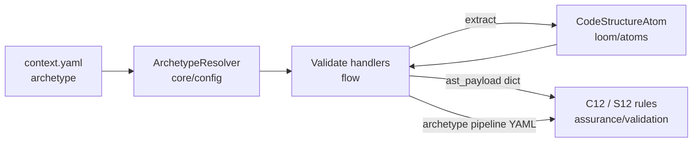

# B-INTL-01 — Archetype-Based Rule Sets

**Status**: APPROVED. **COMPLETE** — SF-01, SF-02, SF-03 committed. · **Feature ID**: 3.29 · **Phase**: 3

| | |
|---|---|
| Reads | `context.yaml` `archetype` field (e.g. `spring-boot`, `rust-axum`) |
| Touches | `flow` handlers · `loom/atoms` (`CodeStructureAtom`) · `assurance/validation` |
| Leaves to 3.30 | macro/annotation unrolling in `CodeStructure` |
| Blueprints | ArchUnit (Java); linter profiles (ESLint cascade) |

## What it does

Checks framework rules per component in a multi-language monorepo. The component's `archetype`
picks the validation profile for both the Spec and the code (AST), with no custom Python wrapper
per framework.

## Why this way

`docs/dev_guides/layer_isolation_and_di.md` forbids `assurance/` from using C-bindings
(`tree-sitter`) directly. So the `flow` engine runs `loom/atoms` for the OS/C-binding AST extraction and injects
the parsed, pure-data payload into `assurance/`. Validation stays pure logic; side effects stay in
`flow`.

Framework AST `.scm` extraction lives only in `loom/commons/language/<lang>/codestructure.py`.

## Architecture

| Part | Lives in |
|---|---|
| Archetype lookup + profile selection + payload injection | `flow` validation handlers (SF-01) |
| Framework marker queries (`.scm`) | `loom/commons/language/` (SF-02) |
| `C12` / `S12` pure-logic rules | `assurance/validation/rules/` (SF-03) |

## Decisions

| # | Decision | Rationale | Architectural Switch? |
|---|----------|-----------|----------------------|
| AD-1 | Dependency Injected AST | Violating `pure-logic` constraints causes cyclic dependency crashes. The `flow` orchestration layer extracts via Loom and injects payloads to Validation. | No |
| AD-2 | Rule Agnosticism | A unified `C12` rule prevents the codebase from scaling out to hundreds of framework-specific wrapper scripts. | No |

## Functional Requirements

| # | FR | Actor | Action | Outcome |
|---|-----|-------|--------|---------|
| FR-1 | Profile Orchestration | PipelineRunner | Parses the `context.yaml` archetype | Sets `validation_[spec|code]_[archetype].yaml` implicitly, defaulting on failure. |
| FR-2 | Framework AST Querying | Loom Commons / Atoms | Expands polyglot schemas | Extracts node markers (macros, annotations, inheritance) from frameworks into Dict/Json payloads. |
| FR-3 | Code Archetype Bounds | Validation Engine | Executes `C12_ArchetypeCodeBounds` via DI payload | Evaluates generated code framework mechanics against YAML `PARAM_MAP` configs. |
| FR-4 | Spec Archetype Bounds | Validation Engine | Executes `S12_ArchetypeSpecBounds` via text | Evaluates generated `Spec.md` schemas against required architecture (e.g., Ports, Adapters). |

## Non-Functional Requirements

| # | NFR | Threshold / Constraint |
|---|-----|----------------------|
| NFR-1 | Architectural Purity | `assurance/` MUST NOT import `tree_sitter` or `loom/*`. AST logic executes as pure matching against injected payloads. |
| NFR-2 | Open Source Lineage | Baseline Framework profiles (Spring, Django) are maintained inside SpecWeaver yaml templates; Proprietary profiles reside in user sub-folders. |

External dependencies: none — a pure architectural extension of internal engines.

## Guides owed

| Guide Topic | Description | Status |
|-------------|-------------|--------|
| adding_framework_guide.md | Where native OS tooling (QARunner) ends and SpecWeaver archetype configs begin; how users define parameter structures. | ⬜ To be written during Pre-commit |

## Sub-features

| SF | Does | FRs | Inputs → Outputs | Depends on | Plan |
|----|------|-----|------------------|-----------|------|
| SF-01 | Route YAML archetypes in `flow/runner.py` + `flow/_validation.py`; inject `CodeStructureAtom` payloads into rule params. | FR-1 | `context.yaml` topology → active pipelines + DI AST variables | none | [sf01](B-INTL-01_sf01_implementation_plan.md) |
| SF-02 | Framework `.scm` queries (annotations, decorators, traits) in `loom/commons/language/`. | FR-2 | file handles → serialized pure-data payloads | SF-01 | [sf02](B-INTL-01_sf02_implementation_plan.md) |
| SF-03 | `C12` + `S12` pure-logic rules in `assurance/validation/rules/`, matching parameters to DI payloads. | FR-3, FR-4 | payload dicts, YAML `PARAM_MAP` overrides → gate `RuleResult` findings | SF-01, SF-02 | [sf03](B-INTL-01_sf03_implementation_plan.md) |

## Progress Tracker

| SF | Name | Depends On | Design | Impl Plan | Dev | Pre-Commit | Committed |
|----|------|-----------|--------|-----------|-----|------------|-----------|
| SF-01 | Injection & Orchestrator | — | ✅ | ✅ | ✅ | ✅ | ✅ |
| SF-02 | Commons Framework Schema | SF-01 | ✅ | ✅ | ✅ | ✅ | ✅ |
| SF-03 | Archetype Validators     | SF-02 | ✅ | ✅ | ✅ | ✅ | ✅ |
