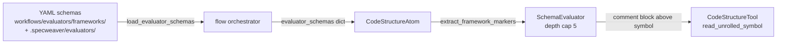

# B-INTL-02 — Macro & Annotation Evaluator

**Status**: APPROVED. **COMPLETE** — SF-01, SF-02, SF-03 committed. · **Feature ID**: 3.30 · **Phase**: 3

| | |
|---|---|
| Extends | Polyglot AST Extractor (`CodeStructureTool` / `CodeStructureAtom`, `extract_framework_markers`) |
| Blueprint | Feature 3.29 (Archetype-Based Rule Sets) — declarative YAML loaded from `workflows/pipelines/frameworks/` |
| Next | Feature 3.30a (framework plugin composition) |

## What it does

The LLM sees raw markers such as `#[derive(Clone)]` or `@RestController`, not what they do at
runtime. This feature unrolls them — Rust procedural macros, Kotlin compiler plugins, backend
annotations — into what they mean.

It evaluates the markers that `extract_framework_markers` already extracts (Java, Kotlin, Typescript,
Rust, Python — e.g. `@RestController`, `@PostMapping`, `impl Trait`) against modular, declarative
YAML framework schemas (e.g. Spring Boot, Quarkus, NestJS). An "unroll map" says, for example: "If
`@GetMapping(X)` is found, output `HTTP GET X`".

## Why not the compiler

Compiler calls (KSP, `cargo expand`) are OS-level and slow — too slow for quick agent loops (NFR-1).
A static YAML map is fast and isolated, the same pattern Feature 3.29 used for archetype rules.

## Architecture

The evaluator is pure: `commons/language` may not load YAML itself, so `flow` injects the schemas.

## Decisions

| # | Decision | Rationale | Architectural Switch? |
|---|----------|-----------|----------------------|
| AD-1 | Declarative YAML Unrolling vs Compiler API | Compiler interactions (KSP, `cargo expand`) violate NFR-1 (Performance) inside quick agent loops. Static mapping through YAML is how Feature 3.29 built isolated, fast Archetype rules. | No |

## Functional Requirements

| # | FR | Actor | Action | Outcome |
|---|-----|-------|--------|---------|
| FR-1 | Evaluate Framework Macros | System | Evaluates AST markers against declarative YAML framework schemas. | Translates raw decorators/bases into unrolled text representations. |
| FR-2 | Multi-Language Support | System | Supports major framework libraries across Java, Kotlin, TS, Python, and Rust. | Schemas for Spring Boot, Quarkus, NestJS, FastAPI, and Actix are evaluated correctly. |
| FR-3 | CodeStructureTool Integration | Agent | Calls `read_unrolled_symbol` intent | The tool delegates to the schema evaluator, appending the unrolled logic to the symbol. |
| FR-4 | Directory Hot-Loading | System | Discovers custom `.yaml` schema overrides residing in arbitrary ecosystem directories. | Evaluates against user-supplied definitions without recompilation. |
| FR-5 | Cascading Unrolling | System | Resolves compounded schema definitions iteratively. | Prevents LLMs from missing nested meaning during recursive framework behaviors. |

## Non-Functional Requirements

| # | NFR | Threshold / Constraint |
|---|-----|----------------------|
| NFR-1 | Performance | Evaluation runs via in-memory dictionary lookups off the tree-sitter AST, executing in < 10ms. No OS shell-outs. |
| NFR-2 | Graceful Degradation | If an annotation is not mapped in the schema, it falls back to exposing the raw signature. |
| NFR-3 | Extensibility | Framework schemas MUST be modular YAML files so engineers can add custom internal frameworks easily. |
| NFR-4 | Schema Security Boundaries | The YAML evaluation engine MUST remain data-declarative. It MUST NOT parse or `eval()` any dynamic execution bindings from untrusted definitions. |
| NFR-5 | Recursion Protection | The engine MUST bound cyclic parsing (e.g. `A` unrolls to `B`, `B` unrolls to `A`) with a hard cap (max depth 5), preventing OOM infinite loops. |

External dependencies: none new — tree-sitter (latest) already does the CST extraction.

## Guides owed

| Guide Topic | Description | Status |
|-------------|-------------|--------|
| Adding Custom Frameworks | How developers map their own proprietary ORM or APIs into YAML Unroll Schemas. | ⬜ To be written during Pre-commit |

Written in SF-03 as `docs/dev_guides/adding_framework_guide.md` §1b.

## Sub-features

| SF | Does | FRs | Inputs → Outputs | Depends on | Plan |
|----|------|-----|------------------|-----------|------|
| SF-01 | Core Schema Evaluator Engine: `commons/language/evaluator.py` turns `extract_framework_markers()` output + YAML maps into readable runtime strings. | FR-1, FR-2 | AST framework dict, YAML mapping → text (e.g. `Endpoint: GET /api`) | none | [sf01](B-INTL-02_sf01_implementation_plan.md) |
| SF-02 | Native Core Framework Libraries: default schemas for Java/Kotlin (Spring Boot, Quarkus), TS (NestJS), Python (FastAPI, Django), Rust (Actix). | FR-3, FR-5 | framework API docs → declarative YAML maps | SF-01 | [sf02](B-INTL-02_sf02_implementation_plan.md) |
| SF-03 | Tool Intent & Guide Publishing: `read_unrolled_symbol` on `CodeStructureTool`; developer guide for onboarding new frameworks. | — | evaluator engine → agent JSON schema, published guide | SF-02 | [sf03](B-INTL-02_sf03_implementation_plan.md) |

FR ownership follows the plans (recorded 2026-08-17): SF-01 owns FR-1, FR-2; SF-02 owns FR-3, FR-5.
FR-4 is delivered by SF-01's `load_evaluator_schemas`.

## Progress Tracker

| SF | Name | Depends On | Design | Impl Plan | Dev | Pre-Commit | Committed |
|----|------|-----------|--------|-----------|-----|------------|-----------|
| SF-01 | Core Schema Evaluator Engine | — | ✅ | ✅ | ✅ | ✅ | ✅ |
| SF-02 | Native Core Framework Libraries | SF-01 | ✅ | ✅ | ✅ | ✅ | ✅ |
| SF-03 | Tool Intent & Guide Publishing | SF-02 | ✅ | ✅ | ✅ | ✅ | ✅ |
