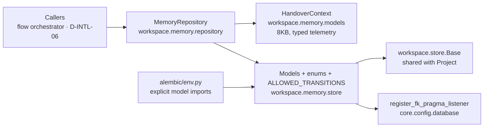

# B-INTL-09 — Agent Memory Bank

**Status**: APPROVED. **COMPLETE** — SF-01, SF-02, SF-03, SF-04 committed (🟢 Completed). ·
**Phase**: 3 · **Feature ID**: B-INTL-09

| | |
|---|---|
| Story | `US-28` (Agent-Native Issue & State Tracker) |
| Absorbs | former `C-EXEC-05` (Issue Tracker Atoms) and `B-INTL-10` (Agentic Workflow State Ledger) |
| Used by | `D-INTL-06` (Context Hydration & Handover) — reads what this feature writes |
| Integrates with | the existing CQRS SQLite engine |

## What it does

The persistent SQLite backend of the Agent Memory Bank. It stores tasks, epics, a task-dependency
DAG, an audit trail of state changes and defects in the `workspace` module, behind one
`MemoryRepository`. The repository gives CRUD, a formal state machine, Optimistic Concurrency
Control (OCC), a circuit breaker, zombie recovery (heartbeats) and upstream DAG propagation.

It stops context loss between AI agents: session state, active tasks and blockers survive a reboot,
so one agent can hand a task to the next.

## Why this way

- **Not the Knowledge Graph** (`graph` module). It loads the whole dataset into a
  `networkx.DiGraph` in RAM — wrong for dynamic task tracking, and built for code, not issues (AD-3).
- **Not `ActiveState`.** That singleton table cannot support a multi-agent fan-out; it must be
  refactored to the new `worker_id` locking approach. (It still exists in `workspace/store.py`.)
- **In `workspace/`,** not `intelligence/` or `graph/`: per `architecture_reference.md`, physical
  project state lives in `workspace/` (AD-1).
- **One shared `Base`.** The codebase has a separate `Base(DeclarativeBase)` per domain
  (`workspace/store.py`, `core/flow/store.py`, `infrastructure/llm/store.py`). Memory models reuse
  `workspace.store.Base` so cross-table ForeignKeys work (e.g., `Task → Project`) (AD-12).
- **FK pragma on async connections.** The sync `Database.connect()` sets `PRAGMA foreign_keys=ON`;
  the async `create_async_engine()` factory did not, so async connections ignored FK constraints and
  every CASCADE. A `connect` event listener now sets it (AD-13, NFR-7).

## Architecture

| Part | Lives in |
|---|---|
| Models `Task`, `Epic`, `TaskDependency` (DAG), `StateTransition`, `Defect`; enums; transition matrix | `src/specweaver/workspace/memory/store.py` |
| `MemoryRepository` | `workspace/memory/repository` |
| `HandoverContext` (Pydantic) | `workspace/memory/models.py` |
| Domain errors | `workspace/memory/errors.py` |
| FK pragma listener | `core.config.database` |
| Model registration for autogeneration | `alembic/env.py` |

Database engine: `sqlalchemy[asyncio]` + `aiosqlite` via the CQRS queue in
`specweaver.core.config.database`.

| Tool | Version | Key API Surface | Source |
|------|---------|----------------|--------|
| SQLAlchemy | >=2.0.0 | `AsyncSession`, `DeclarativeBase`, `event` — compat confirmed | pyproject.toml |
| aiosqlite | >=0.20.0 | Async connection | pyproject.toml |
| Alembic | * | Migration generation | pyproject.toml |
| Pydantic | * | BaseModel, Field | pyproject.toml |

## Handoff boundary: B-INTL-09 ↔ D-INTL-06

The two MVS features of US-28. Their integration surface is the `handover_context` JSON field.

| Concern | Owner | Responsibility |
|---------|-------|---------------|
| **Schema definition** (`handover_context` column) | B-INTL-09 | Defines the JSON column on the `Task` model. |
| **Write-side validation** (Pydantic, 8KB limit) | B-INTL-09 | `MemoryRepository` enforces data integrity on WRITE. Rejects malformed or oversized payloads before they enter the DB. Truncates stack traces to last 2000 chars. |
| **Context truncation** (cleanup on ARCHIVED) | B-INTL-09 | Sets `handover_context = NULL` when a task reaches terminal `ARCHIVED` state. |
| **Read-side retrieval** (fetching active context) | D-INTL-06 | Queries the Memory Bank for the current agent's active tasks, blockers, and accumulated context. |
| **Prompt formatting** (injection into LLM system message) | D-INTL-06 | Structures the retrieved context into the LLM prompt template, managing token budgets. |
| **Handover protocols** (when/what to hand over) | D-INTL-06 | Defines the rules for when an agent should save context and how the next agent bootstraps from it. |

> **Rule:** B-INTL-09 ensures only valid, bounded data enters the database. D-INTL-06 ensures the
> data is correctly retrieved, formatted, and injected into the agent's prompt. Neither feature
> crosses the other's boundary.

**Import path (AD-21):** D-INTL-06 imports `MemoryRepository` from `workspace.memory.store`.
`workspace/context.yaml` does not forbid imports from `intelligence/`, and `workspace` is a
foundation layer for higher layers to consume. The implementing agent MUST still verify the path
against `tach.toml` before writing code.

## State Transition Matrix

`MemoryRepository` MUST enforce this matrix. Any transition not marked ✅ raises
`IllegalStateTransitionError`.

| From ↓ \ To → | PENDING | IN_PROGRESS | DONE | BLOCKED | UPSTREAM_BLOCKED | ARCHIVED |
|----------------|---------|-------------|------|---------|-----------------|----------|
| **PENDING** | — | ✅ acquire | ❌ | ✅ circuit breaker | ✅ propagation | ❌ |
| **IN_PROGRESS** | ✅ release/zombie | — | ✅ complete | ✅ agent fails | ❌ | ❌ |
| **DONE** | ❌ | ✅ PR rejection | — | ❌ | ❌ | ✅ cleanup |
| **BLOCKED** | ✅ manual unblock | ❌ | ❌ | — | ❌ | ✅ abandon |
| **UPSTREAM_BLOCKED** | ✅ downstream resolved | ❌ | ❌ | ❌ | — | ✅ abandon |
| **ARCHIVED** | ❌ | ❌ | ❌ | ❌ | ❌ | — |

## Decisions

All marked architectural switches were approved by User on 2026-05-05.

| # | Decision | Rationale | Architectural Switch? |
|---|----------|-----------|----------------------|
| AD-1 | Place schema in `workspace/memory/store.py` | Physical project state belongs in `workspace/` according to DDD rules. Option 2 selected. | No |
| AD-2 | Use DAG Junction Table instead of Tree | Allows multiple parent Epics to depend on a single shared Sub-Task, deduplicating LLM agent work. | Yes — approved by User on 2026-05-05 |
| AD-3 | Do not reuse Knowledge Graph | Graph uses `networkx` RAM loading and is semantically designed for code, not issues. | Yes — approved by User on 2026-05-05 |
| AD-4 | Heartbeat Lock Resilience | Essential to prevent zombie tasks when agents reboot and lose UUIDs. | Yes — approved by User on 2026-05-05 |
| AD-5 | Terminal Context Truncation | Set `handover_context = NULL` on `ARCHIVED` (not `DONE`) to prevent endless JSON string bloat without risking data loss on PR rejection. | Yes — approved by User on 2026-05-05 |
| AD-6 | Optimistic Concurrency (OCC) | `version` column on `Task` prevents dual-acquisition when 2 agents poll a dead lock simultaneously. | Yes — approved by User on 2026-05-05 |
| AD-7 | Recursive DAG Protection | `MemoryRepository` runs a `WITH RECURSIVE` query before edge insertion to prevent hallucinated cycles crashing the Flow Engine. | Yes — approved by User on 2026-05-05 |
| AD-8 | Defect State Invariants | Blocks transition to `DONE` if `OPEN` defects exist, preventing orphaned blockers and impossible states. | Yes — approved by User on 2026-05-05 |
| AD-9 | 3-Strike Circuit Breaker | `attempt_count` column limits automated retries to 3 before forcing `BLOCKED`. Protects against burning thousands of dollars of API credits on impossible tasks. | Yes — approved by User on 2026-05-05 |
| AD-10 | Strict FK Cascades | `ON UPDATE CASCADE` ensures tasks survive CLI project renaming instead of leaving thousands of orphans. | Yes — approved by User on 2026-05-05 |
| AD-11 | Upstream State Propagation | Bubbles `BLOCKED` states to upstream parents as `UPSTREAM_BLOCKED` to prevent silent queue deadlocks. | Yes — approved by User on 2026-05-05 |
| AD-12 | Shared DeclarativeBase | Memory models MUST import `Base` from `workspace.store` — NOT define a new `DeclarativeBase`. Required for FK cross-references and Alembic discovery. | Yes — approved by User on 2026-05-05 |
| AD-13 | Async PRAGMA Enforcement | Register `@event.listens_for(engine.sync_engine, "connect")` to execute `PRAGMA foreign_keys=ON`. Without this, all CASCADE rules are silently ignored by async connections. | Yes — approved by User on 2026-05-05 |
| AD-14 | Transactional OCC with Backoff | OCC SELECT+UPDATE must execute within a single `session.begin()` to prevent NullPool connection split. Retries use exponential backoff with jitter to prevent thundering herd livelock. | Yes — approved by User on 2026-05-05 |
| AD-15 | Formal State Machine | Exhaustive State Transition Matrix enforced at application layer. Illegal transitions raise `IllegalStateTransitionError`. | Yes — approved by User on 2026-05-05 |
| AD-16 | Observability & Audit Trail | `StateTransition.reason` column for queryable audit. Structured logging on all critical paths (OCC retries, circuit breakers, propagation). | Yes — approved by User on 2026-05-05 |
| AD-17 | Explicit Composite Indexes | 5 indexes on hot-path columns prevent full table scans at scale (50K+ tasks). Without them, zombie recovery and task acquisition degrade quadratically. | Yes — approved by User on 2026-05-05 |
| AD-18 | Epic as Grouping Container | Epic has a simple OPEN/CLOSED status, no state machine or heartbeat. Task.epic_id is nullable — tasks can exist independently. Keeps the Epic model lean. | Yes — approved by User on 2026-05-05 |
| AD-19 | Bounded TransitionReason Enum | `StateTransition.reason` is restricted to a 12-value enum, not free-text. Prevents unsearchable audit trails from inconsistent agent-written strings. | Yes — approved by User on 2026-05-05 |
| AD-20 | Explicit Alembic Model Import | `alembic/env.py` must explicitly import all memory models so they register to `WorkspaceBase.metadata`. Without this, autogeneration produces empty migrations. | Yes — approved by User on 2026-05-05 |
| AD-21 | D-INTL-06 Import Path Verification | D-INTL-06 must import from `workspace.memory.store`. Implementing agent must verify against `tach.toml` that `intelligence → workspace` is an allowed dependency direction. | Yes — approved by User on 2026-05-05 |

## Functional Requirements

| # | FR | Actor | Action | Outcome |
|---|-----|-------|--------|---------|
| FR-1 | Schema Definition | System | Define SQLAlchemy models for `Task`, `Epic`, `StateTransition` (with `reason` bounded to `TransitionReason` enum), and `Defect`. Import `Base` from `workspace.store` (do NOT define a new DeclarativeBase). FK links to `projects.name` with explicit `onupdate='CASCADE', ondelete='CASCADE'`. **Task columns:** `id` (UUID PK), `project_name` (FK), `epic_id` (FK nullable), `title`, `description`, `status`, `assigned_worker_id`, `locked_at`, `last_heartbeat_at`, `handover_context` (JSON), `version` (int, OCC), `attempt_count` (int), `created_at`, `updated_at`. **Epic columns:** `id` (UUID PK), `project_name` (FK), `title`, `description` (nullable), `status` (OPEN/CLOSED), `created_at`, `updated_at`. Epic is a grouping container — no state machine, no heartbeat. Task.epic_id is nullable (tasks can exist without an Epic). **TransitionReason enum:** `ACQUIRED`, `RELEASED`, `COMPLETED`, `ZOMBIE_TIMEOUT`, `CIRCUIT_BREAKER`, `MANUAL_UNBLOCK`, `PR_REJECTION`, `UPSTREAM_BLOCKED`, `UPSTREAM_CLEARED`, `AGENT_FAILURE`, `ABANDONED`, `ARCHIVED`. **Indexes:** `idx_task_status_project` on (status, project_name), `idx_task_heartbeat` on (status, last_heartbeat_at), `idx_task_worker` on (assigned_worker_id), `idx_dep_child` on (child_task_id), `idx_dep_parent` on (parent_task_id). | Entities share MetaData registry with Project, are immune to CLI rename wipeouts, and support full audit trails. All hot queries are indexed. |
| FR-2 | DAG Topology | System | Define a `TaskDependency` many-to-many junction table linking `parent_task_id` and `child_task_id`. | A single task can unblock multiple parents, preventing duplicate agent work. |
| FR-3 | Heartbeat Resilience | System | Define `assigned_worker_id`, `status`, `locked_at`, and `last_heartbeat_at` columns on `Task`. | System tracks which agent owns which task to prevent race conditions. |
| FR-4 | Repository API | System | Implement `MemoryRepository` with: transactional OCC `acquire_task` (SELECT + UPDATE in single `session.begin()`), `WITH RECURSIVE` cycle checks on dependency insertion, Pydantic context validation (8KB limit), state transition matrix enforcement, and defect invariants preventing `DONE` if `OPEN` defects exist. All critical operations must emit structured log events. | Flow engine can query active context securely without raw SQL. |
| FR-5 | Zombie Recovery | Flow Engine | Query tasks where `now() - last_heartbeat_at > 15_minutes` and reset to `PENDING`. Increment `attempt_count`. | Dead locks are automatically recycled. |
| FR-6 | Alembic Integration | System | Add `from specweaver.workspace.memory.store import Task, Epic, TaskDependency, StateTransition, Defect` to `alembic/env.py` so models register to `WorkspaceBase.metadata` before autogeneration. Register a `@event.listens_for(engine.sync_engine, "connect")` callback that executes `PRAGMA foreign_keys=ON` on every new async connection. Generate migration. | DB is structurally updated. FK enforcement is guaranteed in async. All memory models are discoverable by Alembic. |
| FR-7 | Cleanup Strategy | System | When a `Task` status transitions to terminal `ARCHIVED`, execute a trigger/update to set `handover_context = NULL`. | Prevents JSON bloat over time while preserving relational history. Data is not lost during `DONE` rejection cycles. |
| FR-8 | Circuit Breaker | System | If `attempt_count > 3` upon Zombie Recovery, auto-transition task to `BLOCKED` and raise a `Defect` with reason `"circuit_breaker: max retries exceeded"`. | Prevents infinite retry loops from burning LLM API credits. |
| FR-9 | Deadlock Propagation | System | When a task becomes `BLOCKED`, dynamically flag all upstream parent tasks as `UPSTREAM_BLOCKED`. When the blocker is resolved and transitions back to `PENDING`, reverse-propagate to clear `UPSTREAM_BLOCKED` on parents. | Prevents silent queue deadlocks and surfaces critical paths to the user. |

## Non-Functional Requirements

| # | NFR | Threshold / Constraint |
|---|-----|----------------------|
| NFR-1 | Concurrency | `database is locked` errors must be mitigated using `AsyncSession`, the CQRS engine, and Optimistic Concurrency Control (`version` column). OCC read-then-write must execute within a single `async with session.begin()` transaction. Retry logic must use exponential backoff with jitter (`sleep(random(0.1, 0.5) * 2^attempt)`). |
| NFR-2 | Architectural Placement | Code MUST reside in `src/specweaver/workspace/memory/store.py`. Must import `Base` from `workspace.store`, not define a new `DeclarativeBase`. **[proof: arch — tach/lint gate, not pytest]** |
| NFR-3 | Type Safety | All SQLAlchemy mapped columns must use Mapped[T] strict typing (SQLAlchemy 2.0 style). |
| NFR-4 | Zombie Timeout | Lock heartbeat timeout is strictly 15 minutes. |
| NFR-5 | Context Structure | `handover_context` must be strictly typed JSON, bounded to factual telemetry (files touched, errors hit) to prevent hallucination transfer. |
| NFR-6 | Token Protection | `MemoryRepository` must enforce an 8KB hard limit on `handover_context` writes, truncating stack traces to the last 2000 chars to prevent 400 Payload LLM crashes. |
| NFR-7 | FK Enforcement | Every async SQLite connection must execute `PRAGMA foreign_keys=ON` via a SQLAlchemy engine event listener. Without this, all CASCADE rules are silently ignored. |
| NFR-8 | Observability | Every critical `MemoryRepository` operation must emit structured logs: `WARNING` on OCC retry, `ERROR` on circuit breaker activation, `INFO` on upstream propagation, `DEBUG` on heartbeat pulses. |
| NFR-9 | Query Performance | All hot-path queries (zombie scan, task acquisition, dependency traversal) must use explicit composite indexes. Zero full table scans at 50K+ rows per project. |

## Developer guide

| Guide Topic | Description | Status |
|-------------|-------------|--------|
| Agent Memory State Tracking | How to use `MemoryRepository` to acquire tasks, pulse heartbeats, and handle OCC retries. | Written: `docs/dev_guides/agent_memory_state_tracking.md` |

## Sub-features

SF-03 and SF-04 depend only on SF-02 and could run in parallel.

| SF | Does | FRs | Depends on | Plan |
|----|------|-----|-----------|------|
| SF-01 | Strict OCC/Cascade entity classes reusing `Base` from `workspace.store`: Task (all columns/indexes), Epic (OPEN/CLOSED), TaskDependency (indexed FKs), StateTransition (bounded `TransitionReason`), Defect. PRAGMA listener, explicit model imports in `alembic/env.py`, the migration in `alembic/versions/`. | FR-1, FR-2, FR-3, FR-6 | — | [sf01](B-INTL-09_sf01_implementation_plan.md) |
| SF-02 | `MemoryRepository` core: `create_task`, `get_task`, `list_tasks`, `transition_state` (matrix + defect invariants: no `DONE` with `OPEN` defects), basic `update_handover_context`, context cleanup on `ARCHIVED` (`mark_archived`). Structured logging on state transitions. | FR-4 (core CRUD + state matrix + defect invariants), FR-7 | SF-01 | [sf02](B-INTL-09_sf02_implementation_plan.md) |
| SF-03 | `insert_dependency` (`WITH RECURSIVE` cycle check), `acquire_task` (transactional OCC + exponential backoff + jitter), `update_handover_context` (Pydantic `HandoverContext`, 8KB truncation). | FR-4 (DAG cycle checks + OCC acquire + Pydantic context validation) | SF-02 | [sf03](B-INTL-09_sf03_implementation_plan.md) |
| SF-04 | `recycle_zombies` (heartbeat scan + attempt_count increment), 3-Strike `circuit_breaker` (auto-BLOCKED + Defect creation), `propagate_blocked` (`BLOCKED` → `UPSTREAM_BLOCKED` upstream cascade), `clear_upstream_blocked` (reverse cascade on unblock). Structured logging on all resilience events. | FR-5, FR-8, FR-9 | SF-02 | [sf04](B-INTL-09_sf04_implementation_plan.md) |

## Progress Tracker

| SF | Name | Depends On | Design | Impl Plan | Dev | Pre-Commit | Committed |
|----|------|-----------|--------|-----------|-----|------------|-----------|
| SF-01 | SQLAlchemy Schema & Alembic Definitions | — | ✅ | ✅ | ✅ | ✅ | ✅ |
| SF-02 | Core CRUD & State Machine | SF-01 | ✅ | ✅ | ✅ | ✅ | ✅ |
| SF-03 | DAG & Context Validation | SF-02 | ✅ | ✅ | ✅ | ✅ | ✅ |
| SF-04 | Resilience & Recovery | SF-02 | ✅ | ✅ | ✅ | ✅ | ✅ |

## Proof

Tests were written under `INT-US-28`, the integration contract that consumed this feature, and
credited only there, so `check_fr_coverage.py B-INTL-09` read 9 requirements with zero cited tests.
The attribution moved here on 2026-08-13 (`TECH-017` SF-01); no requirement was re-worded and no test
changed. Full finding: `docs/analysis/integration_contract_proof_matrix.md` → `INT-US-28`.

Each test was read against each requirement before it was cited. The `Proves:` citations:

| Requirement | Proving tests in `tests/integration/workspace/test_memory_integration.py` (26 tests) |
|---|---|
| FR-2 DAG topology | `test_int_4_dag_resolution`, `test_int_10_deep_dag_cycle_protection`, `test_int_20_diamond_dependency_propagation` |
| FR-3 heartbeat resilience | `test_e2e_7_heartbeat_survival`, `test_e2e_8_pulse_heartbeat_storm` |
| FR-4 repository API / OCC `acquire_task` | `test_int_9_occ_concurrent_race`, `test_int_16_recycle_zombies_concurrent_occ_conflict` |
| FR-5 zombie recovery | `test_int_2_zombie_reaper`, `test_int_11_zombie_reaper_full_cycle`, `test_e2e_9_zombie_reaping_boundary_jitter` |
| FR-8 circuit breaker | `test_int_6_circuit_breaker`, `test_int_12_circuit_breaker_three_strikes` |
| FR-9 deadlock propagation | `test_int_8_upstream_cascading_failure`, `test_int_17_upstream_propagation_cascade`, `test_int_18_reverse_propagation_partial`, `test_int_19_reverse_propagation_full_clear` |

- **FR-7** is proven in `tests/unit/workspace/test_memory_repository_core.py:700`, docstringed
  `"""FR-7: Transition to ARCHIVED sets handover_context = None."""`. The gate skips any file that
  does not **name the story**, so the file now carries `Proves: B-INTL-09 FR-7, NFR-8`. Rule: an
  uncited proof is fixed by naming the capability in the file that already proves it, not by
  citing harder here. "Uncited" is not "untested".
- **FR-1 (schema definition) and FR-6 (alembic integration) remain uncited**, not yet assessed
  either way, and are left visible: `check_fr_coverage.py B-INTL-09` reports `BLOCKED`.
