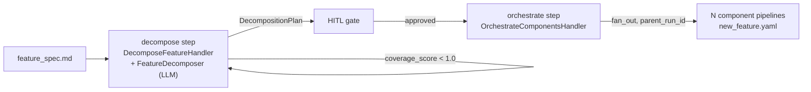

# C-INTL-01 — Automated iterative decomposition (multi-level)

**Status**: APPROVED. SF-02 pre-commit complete; SF-01 in dev (see Progress Tracker). · **Feature ID**:
3_24 (3.24) · **Phase**: 3

| | |
|---|---|
| Touches | `pipeline` and `flow` runners · `drafting/decomposition.py` · CLI |
| Not touched | unrelated feature areas |
| Moved out | FR-3 component fan-out → `C-FLOW-12`; recursive (nested) decomposition → `C-INTL-07` |
| Blueprints | `docs/analysis/methodology_open_research.md` §1 (Automated Decomposition) · `docs/analysis/future_capabilities_reference.md` §18 |

## What it does

Decomposes a feature into sub-features and components inside the `flow` engine, instead of building
component specs by hand. Decomposition runs in an automated loop with quality gates (DMZ-style) and
fans out until every component is mapped.

Every structural generation step pauses for HITL review — never auto-decompose without verification.

## Starting point

- `drafting/decomposition.py` already has `ComponentChange`, `IntegrationSeam`, `DecompositionPlan`;
  no `DecomposeHandler` ran it as a recursive pipeline.
- The `feature_decomposition` pipeline runs draft->validate->decompose. The new orchestration uses
  `loop_back` (in the runner or a macro-pipeline) to handle decomposition results.
- Orchestration lives in `flow/`, within `tach.toml` and the existing layer bounds.

## Design rules

1. **Global vs local maxima.**
   - The *L2 Architect Agent* is exempt from feature size limits (`> 5 FRs`). In the `plan` and
     `decompose` steps it takes the whole scope, to find the global optimum (shared data models, core
     modules).
   - *L4 Developer Agents* are confined to their Component Spec (local scope). They optimize locally;
     the `ValidationGate` stops them from changing cross-cutting architecture.
2. **Mock-first interfaces.** Slicing uses the `IntegrationSeam` structs from the decompose step.
   Interfaces (API endpoints, public class signatures, events) are defined and agreed *before* any
   sub-feature code is generated (`future_capabilities_reference.md` §7).
3. **Granularity threshold.** A sub-feature is split again if it fails the "Agent-Sized Heuristic":
   e.g. $>5$ FRs, $>3$ modules touched, or $>1$ external API.

## Architecture

## Decisions

| # | Decision | Rationale | Architectural Switch? |
|---|----------|-----------|----------------------|
| AD-1 | Use Pipeline `auto` / `hitl` Gates | The flow engine already supports gating. We rely on standard `StepResult` / Gate configurations instead of a bespoke runner | No |
| AD-2 | Automated Recursive Spawn | `flow/runner.py` will allow a pipeline step to dynamically queue new L3 sub-pipelines | No |

**AD-2 is not built as recursion.** The title (*multi-level*), AD-2 and the split heuristic describe
feature → sub-features → components, but `DecompositionPlan.components` is a flat
`list[ComponentChange]` with no nesting. Nesting is a schema change, not a control-flow one; it is
**`C-INTL-07`** (minted 2026-08-13).

## Functional Requirements

| # | FR | Actor | Action | Outcome |
|---|-----|-------|--------|---------|
| FR-1 | Execution | System | Parses a Feature Spec and triggers `drafting/decomposition.py` | A `DecompositionPlan` object is produced containing component changes and integration seams. |
| FR-2 | Decision Gate | System | Presents the decomposition plan | A HITL gate waits for user approval/rejection. |
| FR-4 | Quality Automation | System | Applies standard 10-test battery (Structure Tests 1-5 + Code Quality) against each Component Spec | The pipeline advances only if all gates pass. |
| FR-5 | Coverage Check | System | Verifies that the resulting combined components cover 100% of the Feature Spec's Blast Radius | Will signal ERROR or Loop Back if coverage is incomplete. |

**FR-3 descoped 2026-08-13 (`TECH-046`).** It read: *"Component Fan-out — automatically spawns a
sub-pipeline iteration (generate Component Spec) for each approved component; N individual L3
pipelines are launched."* No plan carried it. The row is deleted, not annotated, as
`check_fr_coverage.py`'s failure message instructs. Per-component spec synthesis and race-hardened
fan-out are **`C-FLOW-12`**, sequenced behind `C-EXEC-07` and `TECH-014`.

## Non-Functional Requirements

| # | NFR | Threshold / Constraint |
|---|-----|----------------------|
| NFR-1 | Resilience | 3-strikes loop rule on failures before hard aborting |
| NFR-2 | Interactivity | Must allow HITL feedback injection for re-generation of rejected planes |

External dependencies: Tree-sitter (current) for code parsing; compat confirmed.

## Guides owed

| Guide Topic | Description | Status |
|-------------|-------------|--------|
| Pipeline Multi-Spawning | How to write YAML pipelines that fan-out recursive sub-pipelines | ⬜ To be written during Pre-commit |

## Sub-features

| SF | Does | FRs | Inputs → Outputs | Depends on | Plan |
|----|------|-----|------------------|-----------|------|
| SF-01 | Hierarchical Orchestration Engine Support: multi-pipeline spawning / dynamic `fan_out` in `flow/runner.py`, triggered from a Decomposition plan. | FR-1, FR-3 | parsed `DecompositionPlan` + target pipeline (e.g. `new_feature.yaml`) → pipeline runs logged in `flow.store` | none | [sf01](C-INTL-01_sf01_implementation_plan.md) |
| SF-02 | Verified Iterative Loop & Traceability Enforcement: DMZ-style retry loop, HITL presentation, Blast Radius coverage mapping. | FR-2, FR-4, FR-5 | generated component specs + top-level Feature Spec → 100% coverage assertion, loop control (3-strikes) | SF-01 | [sf02](C-INTL-01_sf02_implementation_plan.md) |

## Progress Tracker

| SF | Name | Depends On | Design | Impl Plan | Dev | Pre-Commit | Committed |
|----|------|-----------|--------|-----------|-----|------------|-----------|
| SF-01 | Hierarchical Orchestration Support | — | ✅ | ✅ | ⬜ | ⬜ | ⬜ |
| SF-02 | Verified Iterative Loop | SF-01 | ✅ | ✅ | ✅ | ✅ | ⬜ |
