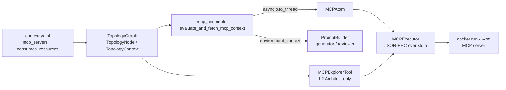

# C-INTL-02 — Common MCP Client Architecture

**Status**: APPROVED · **Feature ID**: 3.32c · **Phase**: 3

| | |
|---|---|
| Touches | `context.yaml`, the `TopologyGraph`, `ContextAssembler` |
| Used by | the L2 Architect (MCP Explorer tool); generation and review prompts |
| Tracked debt | `TECH-063` (the container-runtime guard on `MCPAtom`) |
| Not touched | SpecWeaver validation logic; downstream domain engines |

## What it does

Pulls schemas from external infrastructure through the Model Context Protocol: JSON-RPC over
`stdio`. Servers are declared in a boundary's `context.yaml`. Before an LLM step, the resources the
boundary `consumes_resources` are fetched and injected into the prompt as a
`<environment_context>` block.

Constraints:

- Use the Pre-Fetched Context Envelope pattern — no system-prompt token saturation.
- No bare `npx` execution.

## Why this way

- **Pre-fetch, not tool calls.** Removes tool-call latency and token bloat.
- **Container only.** Runs each server via `docker run -i --rm`, an isolated process: blocks RCE
  and Node zombie (database) connection exhaustion.
- **No `mcp` SDK.** The `mcp` PyPI package forces async thread-pooling; the executor layer is
  `async_ready: false`.

## Architecture

| Part | Lives in |
|---|---|
| `mcp_servers`, `consumes_resources` on `TopologyNode` / `TopologyContext` | `assurance/graph/topology.py` |
| Vault audit (tracked `vault.env` aborts the run) | `core/flow/engine/security.py`, called by the runner |
| `MCPExecutor` (stdio JSON-RPC) + `MCPAtom` | `sandbox/mcp/core/` |
| Pre-fetch assembler | `core/flow/handlers/mcp_assembler.py` |
| `MCPExplorerTool` + `ArchitectMCPInterface` | `sandbox/mcp/interfaces/` |

**Since moved** (2026-09-25 check): the plans name `loom/commons/mcp`, `loom/atoms/mcp` and
`loom/tools/mcp`; TECH-01 consolidated them into `sandbox/mcp/core` and `sandbox/mcp/interfaces`.
The `ContextProvider` abstract layer the design started from is in
`src/specweaver/workspace/context/provider.py`. Reference architecture (Red-Team investigation):
`docs/architecture/mcp_architecture_design.md` — no longer in the repo.

External tools:

| Tool | Version | Key API Surface | Source |
|------|---------|----------------|--------|
| Model Context Protocol | 1.0.0 | JSON-RPC Client over Stdio | Anthropic |

| Tool | Min Version | Key API Surface | Compat Confirmed | Notes |
|------|------------|----------------|-----------------|-------|
| Docker | v20+ | `docker run -i --rm` | Y | Standard platform prerequisite. |

## Decisions

| # | Decision | Rationale | Architectural Switch? |
|---|----------|-----------|----------------------|
| AD-1 | Pre-Fetched Envelopes | Eliminates tool-call LLM latency and token bloat | No |
| AD-2 | Docker Mandate | Solves RCE & Node zombie connection exhaustion | No |

## Functional Requirements

| # | FR | Actor | Action | Outcome |
|---|-----|-------|--------|---------|
| FR-1 | Parse Constraints | Workspace Parser | Read the `mcp_servers` block from `context.yaml`. | System extracts remote execution targets. |
| FR-2 | Execute Stdio | Context Assembler | Boot external MCP server using `docker run -i --rm`. | System establishes a JSON-RPC pipeline over `stdio`. |
| FR-3 | Pre-Fetch Context | Context Assembler | Submit `read_mcp_resource` JSON-RPC requests per the boundary `consumes_resources` array. | Extracts accurate schema string states from the external MCP. |
| FR-4 | Inject Envelope | LLM Adapter | Inject the serialized context strings into the `<environment_context>` prompt block. | Provides zero-latency reality checkpoints directly to the agent prompt. |

## Non-Functional Requirements

| # | NFR | Threshold / Constraint |
|---|-----|----------------------|
| NFR-1 | Token Bloat Prevention | Must explicitly use the Pre-Fetch Resource pattern. Forbid global tool injection into LLM prompts. |
| NFR-2 | Process Isolation | MCP Executions MUST run through Docker via `docker run -i --rm` (No bare CLI Node.js execution). |

## Guides owed

| Guide Topic | Description | Status |
|-------------|-------------|--------|
| MCP Implementation | Guide on structuring `context.yaml` MCP injections. | ⚪ To be written during Pre-commit |

## Sub-features

| SF | Does | FRs | Depends on | Plan |
|----|------|-----|-----------|------|
| SF-01 | `mcp_servers` / `consumes_resources` in the boundary schema; `.specweaver/vault.env` token binding that never leaks. In: `context.yaml`. Out: updated boundary config models. | FR-1 | — | [sf01](C-INTL-02_sf01_implementation_plan.md) |
| SF-02 | `MCPExecutor` (stdio JSON-RPC subprocess) + `MCPAtom`, inside the `context.yaml` isolation boundaries. In: Docker launch command. Out: a live JSON-RPC Atom. | FR-2 | SF-01 | [sf02](C-INTL-02_sf02_implementation_plan.md) |
| SF-03 | Pre-fetch assembler in the flow handlers (allowed to run Atoms): reads `consumes_resources`, runs `MCPAtom`, binds the envelope to the LLM step. | FR-3, FR-4 | SF-02 | [sf03](C-INTL-02_sf03_implementation_plan.md) |
| SF-04 | `MCPExplorerTool`: MCP `resources/list` for L2 Architect roles only, so they map URIs to `context.yaml` dependencies without loading heavy schemas. Out: a light URI array. | FR-1 | SF-02 | [sf04](C-INTL-02_sf04_implementation_plan.md) |

Order: SF-01 → SF-02 → SF-03 and SF-04 in parallel.

Planned locations, since moved (see Architecture): SF-02 `loom/commons/mcp/executor.py` +
`loom/atoms/mcp/atom.py`; SF-03 `flow/handlers.py`; SF-04 `loom/tools/mcp/tool.py`.

## Progress Tracker

| SF | Name | Depends On | Design | Impl Plan | Dev | Pre-Commit | Committed |
|----|------|-----------|--------|-----------|-----|------------|-----------|
| SF-01 | Context YAML & Vault Bindings | — | ✅ | ✅ | ✅ | ✅ | ✅ |
| SF-02 | MCP Execution Atom | SF-01 | ✅ | ✅ | ✅ | ✅ | ✅ |
| SF-03 | The Pre-Fetch Assembler | SF-02 | ✅ | ✅ | ✅ | ✅ | ⚪ |
| SF-04 | MCP Explorer Tool | SF-02 | ✅ | ✅ | ⚪ | ⚪ | ⚪ |

The tracker lags the code: SF-03 (`mcp_assembler.py`, wired into `generation.py` and `review.py`)
and SF-04 (`sandbox/mcp/interfaces/tool.py`) are on `main`, and the topic entry marks the feature ✅.
