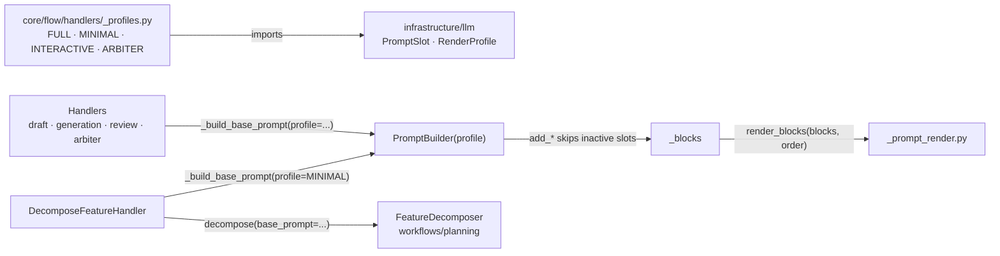

# C-INTL-05 — Configurable Prompt Render Profiles

**Status**: APPROVED. **COMPLETE** — SF-01, SF-02, SF-03 committed (`0be66689`, 2026-05-16). ·
**Parent Story**: US-4 (Context-Aware Flow Orchestration) · **Feature ID**: C-INTL-05

| | |
|---|---|
| Touches | `infrastructure/llm/` (mechanism) · `core/flow/handlers/base.py` + `_profiles.py` (policy) |
| Used by | `C-INTL-04` (`summary` slot) · `B-FLOW-04` (`rag_context`) · `A-INTL-04` (`consolidated_memory`) · `D-INTL-07` (`questionnaire_state`) |
| Not touched | `sandbox/*`, `validation/`, `config/` |

`D-INTL-07` (Agentic Interview Drafting) row corrected `[agreed 2026-08-27]`: it named `D-INTL-04`, retired into
`D-INTL-07` as its bootstrap rubric. A forward dependency naming a dead id is a claim somebody would
act on, which is the one case a delivered design is edited.

## What it does

Each prompt is built from a **profile**: which block slots are active, and in what order they render.

- **Mechanism** (`infrastructure/llm/`): `PromptSlot` — a `str` Enum of every block slot — and
  `RenderProfile` — a frozen dataclass of `name`, `active_slots`, `order`. Domain-agnostic.
- **Policy** (`core/flow/handlers/_profiles.py`): four named profiles (`FULL`, `MINIMAL`,
  `INTERACTIVE`, `ARBITER`) saying which handler gets which context.

This Mechanism/Policy split keeps infrastructure adapters free of domain knowledge (DDD). Zero new
external dependencies.

## Why not the hardcoded sequence

`_prompt_render.py` rendered 6 ordered tags (`instructions`, `dictator-overrides`,
`project_metadata`, `constitution`, `standards`, `plan`), then handled `topology`, `file`,
`mentioned`, `context` and `reminder` inline — **11 distinct block types**. Every new context source
had to edit that list (an Open-Closed violation). `_build_base_prompt()`'s `include_rules: bool` was a
primitive switch that implicitly selected a profile, and `arbiter.py` and `decomposer.py` bypassed
`_build_base_prompt()` entirely (maintenance islands).

The code already held 4 implicit profiles:

1. **FULL** — constitution + standards + memory + plan + topology (generators, reviewers)
2. **INTERACTIVE** — metadata + memory, no strict rules (drafter)
3. **MINIMAL** — instructions + metadata only (decomposer, planner)
4. **ARBITER** — instructions + context only, no rules/memory (arbiter)

Profiles name them. A new slot for C-INTL-04 / B-FLOW-04 / A-INTL-04 / D-INTL-07 is one enum variant,
no render change. The formalized "2-Tier Handover" builder API was dropped: tier semantics are domain
knowledge, and slot membership already controls tier inclusion (AD-7).

Prior art: LangChain `ChatPromptTemplate` (composable sections, `MessagesPlaceholder`,
`configurable_fields`); Aider's Repo Map (budget-based context scaling — validates SpecWeaver's
`_compute_auto_scale` proportional truncation); DSPy Signatures (typed declared inputs — validates the
`PromptSlot` enum). All 2025.

## Architecture

| Caller | Profile |
|---|---|
| `handlers/draft.py` (was `include_rules=False`) | `RenderProfile.INTERACTIVE` |
| `handlers/generation.py` — code gen (+ plan, topology), test gen, plan | `RenderProfile.FULL` |
| `handlers/review.py` — spec review (+ topology), code review | `RenderProfile.FULL` |
| `handlers/arbiter.py` (was direct `PromptBuilder()` without rules) | `RenderProfile.ARBITER` |
| `workflows/planning/decomposer.py` (was direct `PromptBuilder()` + instructions + metadata only) | `RenderProfile.MINIMAL` |

Reused as is: `_ContentBlock` (extended with the slot), `_render_tagged_blocks()`, `render_files()` /
`_render_mentioned()`, the hybrid priority-based truncation engine (profile-agnostic),
`PromptBuilder.clone()` (extended to copy the profile). Line refs are in the SF-02 and SF-03 plans.

Boundaries (`context.yaml`):

- `infrastructure/llm/context.yaml`: archetype `adapter`, consumes `specweaver/config`, forbids
  `specweaver/sandbox/*`. The mechanism types live here.
- `core/flow/handlers/`: archetype `orchestrator`, consumes `specweaver/llm`. The policy constants
  live here — the existing IoC pattern (like `skeleton_files` injection).
- `workflows/planning/context.yaml`: archetype `orchestrator`, consumes `specweaver/llm`, **NOT**
  `specweaver/flow`. So `FeatureDecomposer` receives a pre-built `PromptBuilder` from
  `DecomposeFeatureHandler` (in `core/flow/handlers/`) and never calls `_build_base_prompt()`.
- No new module dependencies.

Dependencies: Python stdlib `enum` (3.11+, `str` Enum; the project runs Python 3.13) and Pydantic v2
(2.x, already in `pyproject.toml`; BaseModel optional). No new external dependency.

## Decisions

| # | Decision | Rationale | Architectural Switch? |
|---|----------|-----------|----------------------|
| AD-1 | **Mechanism/Policy Split**: `PromptSlot` enum + `RenderProfile` dataclass (mechanism) live in `infrastructure/llm/`. Named profile constants (policy) live in `core/flow/handlers/_profiles.py` | DDD: infrastructure provides domain-agnostic mechanisms; the orchestrator layer encodes workflow policy. Follows the `skeleton_files` IoC pattern. No new `consumes`/`forbids` — `flow` already consumes `llm` | No |
| AD-2 | `PromptSlot` is a `str` Enum where the string value IS the XML tag name | `PromptSlot.CONSTITUTION = "constitution"`: `block.kind = slot.value` is a direct, type-safe comparison, no mapping layer. **It does NOT carry sequence metadata.** `RenderProfile.order` is the sole source of truth for rendering sequence | No |
| AD-3 | `RenderProfile` is a frozen dataclass with `name: str`, `active_slots: frozenset[PromptSlot]`, `order: tuple[PromptSlot, ...]` | Immutable. Knows slots and ordering, not workflow semantics | No |
| AD-4 | `_build_base_prompt()` signature changes from `include_rules: bool` to `profile: RenderProfile` with a default of the `FULL` constant | Self-documenting. The old boolean mapped to exactly 2 profiles (FULL vs INTERACTIVE) | No |
| AD-5 | `ArbitrateVerdictHandler` calls `_build_base_prompt(profile=ARBITER)` instead of constructing `PromptBuilder()` ad-hoc | Both live in `core/flow/handlers/` — a legal same-layer refactoring | No |
| AD-6 | `DecomposeFeatureHandler` (in `core/flow/handlers/`) pre-builds the PromptBuilder via `_build_base_prompt(profile=MINIMAL)` and injects it into `FeatureDecomposer.decompose(base_prompt=...)` | DDD IoC: `workflows/planning/` does NOT consume `specweaver/flow`. Same pattern as `skeleton_files` and `project_metadata` injection | No |
| AD-7 | **No tier-specific methods** on `PromptBuilder`. The 2-Tier Handover standard is enforced by profile slot membership, not by `add_tier1/2_context()` methods | The "2-Tier Handover" is domain knowledge from D-INTL-06; `PromptBuilder` stays domain-agnostic. Callers use `add_context()` with a priority; the profile controls which slots render | No |

## Functional Requirements

| # | FR | Actor | Action | Outcome |
|---|-----|-------|--------|---------|
| FR-1 | PromptSlot Enum Registry | `infrastructure/llm/` | Define all valid prompt block slots as a `str` Enum where the string value IS the XML tag name (e.g., `PromptSlot.CONSTITUTION = "constitution"`). No implicit `kind ↔ slot` mapping — `block.kind = slot.value` is a direct, type-safe comparison | Adding a new slot requires only a new enum variant; no changes to render logic |
| FR-2 | RenderProfile Mechanism | `infrastructure/llm/` | Define the `RenderProfile` frozen dataclass (mechanism) with `name`, `active_slots`, and `order` fields | Domain-agnostic type definition; contains no workflow-specific knowledge |
| FR-3 | Named Profile Constants (Policy) | `core/flow/handlers/_profiles.py` | Define 4 named profile constants (`FULL`, `MINIMAL`, `INTERACTIVE`, `ARBITER`) that declare which `PromptSlot`s are active and their rendering order | Profile constants encode workflow orchestration policy and live in the orchestrator layer, not infrastructure |
| FR-4 | Profile-Driven Rendering | `_prompt_render.py` | Two-phase rendering: (1) Build-time: `add_*` methods skip inactive slots, so only active blocks are stored in `_blocks`. (2) Render-time: `render_blocks()` accepts the profile's `order: tuple[PromptSlot, ...]` alongside the blocks list and iterates over slots in that sequence, replacing the hardcoded `ordered_tags` list | `render_blocks(blocks, order)` renders blocks in profile-defined sequence |
| FR-5 | PromptBuilder Profile Initialization | `PromptBuilder.__init__()` | Accept an optional `profile: RenderProfile | None` parameter (default `None`). When `None`, all slots are active with current hardcoded ordering. Inactive slot additions emit `logger.debug()`. **I/O-bound `add_*` methods (`add_file`, `add_mentioned_files`) MUST early-return before any disk I/O when the slot is inactive.** Modify `add_context` to accept `slot`. **`PromptBuilder.clone()` MUST explicitly propagate `self._profile` to the new instance** | All `add_*` methods validate slot activity via `_is_slot_active()`. Clones inherit the exact profile state of their parent |
| FR-6 | `_build_base_prompt()` Refactoring | `core/flow/handlers/base.py` | Replace the `include_rules: bool` parameter with `profile: RenderProfile` | All handler callsites pass an explicit profile constant instead of a boolean flag |
| FR-7 | Arbiter Handler Unification | `ArbitrateVerdictHandler` | Replace direct ad-hoc `PromptBuilder()` construction with `_build_base_prompt(profile=ARBITER)` | Arbiter handler flows through the centralized assembly function |
| FR-8 | Decomposer IoC Injection | `DecomposeFeatureHandler` + `FeatureDecomposer` | `DecomposeFeatureHandler` calls `_build_base_prompt(profile=MINIMAL)` and passes the resulting `PromptBuilder` into `FeatureDecomposer.decompose(base_prompt=...)` via DI | Decomposer receives a pre-built PromptBuilder; no illegal `workflows/planning/` → `core/flow/handlers/` dependency |
| FR-9 | Backward Compatibility | All callers | Existing `PromptBuilder()` construction without a profile parameter uses an internal all-slots-active default (no import from `core/flow/`). Emits a deprecation `logger.warning()` to encourage explicit profile adoption | Zero breaking changes for callers that don't opt into profiles. Deprecation path documented |

FR-9 as built: the default is `_DEFAULT_PROFILE` and the deprecation is a `DeprecationWarning` via
`warnings.warn` (SF-02). SF-03 removed `include_rules` and made `decompose(base_prompt=...)` required —
two HITL-approved breaks of internal-only signatures; `PromptBuilder()` compatibility is unaffected.

## Non-Functional Requirements

| # | NFR | Threshold / Constraint |
|---|-----|----------------------|
| NFR-1 | Performance | Zero measurable latency regression. Enum lookup is O(1). **Critical**: Expensive context gathers MUST be pre-gated by checking `slot in profile.active_slots` to avoid blocking I/O for inactive slots. This applies both to `_build_base_prompt` (DB hydration) AND to `add_*` methods with disk I/O (`add_file`, `add_mentioned_files`) |
| NFR-2 | Architectural Boundary | Mechanism types (`PromptSlot`, `RenderProfile`) in `infrastructure/llm/`. Policy constants (profile instances) in `core/flow/handlers/_profiles.py`. `infrastructure/llm/context.yaml` MUST add `PromptSlot` and `RenderProfile` to the `exposes` list. No new `consumes` or `forbids` entries required **[proof: arch — tach/lint gate, not pytest]** |
| NFR-3 | Test Coverage | 70–90% coverage on new code. All 4 profiles must have dedicated unit tests verifying correct slot inclusion/exclusion. Additionally: 2 integration tests verifying profile × truncation interaction (MINIMAL under tight budget, FULL with priority-based slot dropping) **[proof: meta — rule about tests, docs or the diff]** |
| NFR-4 | Backward Compatibility | `PromptBuilder()` without profile argument must produce identical output to current behavior |
| NFR-5 | Extensibility | Adding a new prompt slot using **standard tagged block rendering** requires: (a) one new `PromptSlot` enum entry, (b) adding it to relevant profiles. Zero changes to `_prompt_render.py`. Slots requiring **custom rendering logic** (e.g., custom XML attributes, per-item formatting) additionally need a dedicated render function in `_prompt_render.py` |

Guide: [adding_prompt_slots.md](../../../../dev_guides/adding_prompt_slots.md) — how to add a
`PromptSlot` variant and register it in the profiles.

## Sub-features

| SF | Does | FRs | Depends on | Plan |
|----|------|-----|-----------|------|
| SF-01 | `PromptSlot` + `RenderProfile` (`__post_init__` enforces `set(order) == active_slots`) in `infrastructure/llm/_prompt_profiles.py`; the 4 constants in `core/flow/handlers/_profiles.py`. Pure data, zero side effects. | FR-1, FR-2, FR-3, FR-9 | — | [sf01](C-INTL-05_sf01_implementation_plan.md) |
| SF-02 | Profile-aware `PromptBuilder`, profile-driven `render_blocks()`, `_build_base_prompt()` takes `profile: RenderProfile`. | FR-4, FR-5, FR-6 | SF-01 | [sf02](C-INTL-05_sf02_implementation_plan.md) |
| SF-03 | Every callsite (8+) passes an explicit profile; arbiter uses `_build_base_prompt(profile=ARBITER)`; decomposer gets its builder via DI. | FR-7, FR-8 | SF-02 | [sf03](C-INTL-05_sf03_implementation_plan.md) |

SF-01 profile slots:

- `FULL`: All slots
- `MINIMAL`: `{INSTRUCTIONS, METADATA, TOPOLOGY}`
- `INTERACTIVE`: `{INSTRUCTIONS, DICTATOR_OVERRIDES, METADATA, PLAN, TOPOLOGY, FILE, MENTIONED, CONTEXT, REMINDER, AGENT_MEMORY}`
  (all slots except `CONSTITUTION` and `STANDARDS`)
- `ARBITER`: `{INSTRUCTIONS, CONTEXT}`

## Progress Tracker

| SF | Name | Depends On | Design | Impl Plan | Dev | Pre-Commit | Committed |
|----|------|-----------|--------|-----------|-----|------------|-----------|
| SF-01 | Slot Registry & Profile Mechanism | — | ✅ | ✅ | ✅ | ✅ | ✅ |
| SF-02 | Profile-Driven Rendering & Builder Refactoring | SF-01 | ✅ | ✅ | ✅ | ✅ | ✅ |
| SF-03 | Caller Migration & Unification | SF-02 | ✅ | ✅ | ✅ | ✅ | ✅ |
