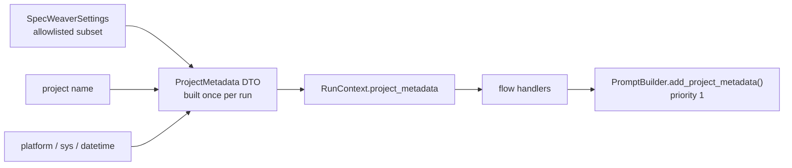

# D-INTL-05 — Project Metadata Injection

**Status**: APPROVED · **COMPLETE** and committed 2026-03-29 · **Phase**: 3 · **Feature ID**:
feature_3_15 (the text called it Feature 3.13)

| | |
|---|---|
| Touches | `PromptBuilder`, the configuration module, `RunContext`, flow handlers |
| Not touched | core LLM adapters, backend dispatch |
| Related | Feature 3.5 detects the target codebase's languages; this feature does not |

## What it does

The LLM lacks environmental context. This feature adds a concise `<project_metadata>` block to the
system prompt:

- project name and root archetype;
- language target (Python/OS version);
- current date/time;
- an allowlisted slice of active configuration (LLM profile, validation thresholds).

The block must stay small so it does not eat the context window.

Inspired by Aider's `get_platform_info()`, which tells the LLM the operating system, language
version and commit hashes, so it avoids syntax incompatible with the user's environment.

## Architecture

`PromptBuilder` (`src/specweaver/llm/prompt_builder.py`) is the one place system prompts are
assembled, as XML-tagged blocks with priority levels. The feature adds `add_project_metadata()` and a
new `_ContentBlock`. Config comes from `SpecWeaverSettings`, the project name from the database, OS
and Python version from the standard `platform` and `sys` modules.

| Tool | Version | Key API Surface |
|------|---------|----------------|
| Python `platform` / `sys` | Built-in | `python_version()`, `system()` |
| datetime | Built-in | `datetime.now()` |

## Decisions

| # | Decision | Rationale | Architectural Switch? |
|---|----------|-----------|----------------------|
| AD-1 | Add `add_project_metadata` directly to `PromptBuilder` | Keeps prompt assembly logic centralized. No new module for simple string interpolation. | No |
| AD-2 | Centralized `ProjectMetadata` DTO | Handlers should not each re-query the DB. `PipelineRunner` creates the DTO once and caches it in the flow context. | No |
| AD-3 | Explicit "Language Target" = Environment | "Language target" means the OS/Python system version of the execution environment. It does NOT detect target codebase languages (already covered by Feature 3.5). | No |

AD-2 as built: the plan's HITL review moved DTO creation into `RunContext.__init__`, so single-shot
commands get it too, not only pipelines.

## Functional Requirements

| # | FR | Actor | Action | Outcome |
|---|-----|-------|--------|---------|
| FR-1 | Build Metadata DTO | PipelineRunner / Config | Create `ProjectMetadata` once per run | A single DTO containing project name, archetype, safe strictly-allowlisted config, OS (`platform`), Python version (`sys.version`), and Date is assembled and attached to the run state. |
| FR-2 | Inject into Prompt | PromptBuilder | Call `.add_project_metadata()` | A `<project_metadata>` XML block is added to the prompt at priority 1 using the pre-assembled DTO. |
| FR-3 | Provide safe config | Flow Handlers | Pass `ProjectMetadata` to `PromptBuilder` | Handlers inject the DTO without manually fetching project parameters or scrubbing API keys. |

## Non-Functional Requirements

| # | NFR | Threshold / Constraint |
|---|-----|----------------------|
| NFR-1 | Token Budgeting | The metadata block should be concise (around 100-200 tokens typically). **[proof: none — unfalsifiable as written]** |
| NFR-2 | Stability | Core prompts should not break if a property (like project Name) is temporarily unavailable. |
| NFR-3 | Zero Secret Leakage | The injected config MUST use a strict allowlist. Full Pydantic `model_dump_json()` on `SpecWeaverSettings` is FORBIDDEN as it leaks `api_key` to the LLM backend. |

## External Dependencies

| Tool | Min Version | Key API Surface | Compat Confirmed | Notes |
|------|------------|----------------|-----------------|-------|
| Python Standard Lib | 3.11+ | `sys.version_info`, `platform.system` | Y | Standard |

## Sub-features

Single feature, no decomposition.

| SF | Does | FRs | Depends on | Plan |
|----|------|-----|-----------|------|
| SF-01 | Metadata Injection: `PromptBuilder` accepts and formats project metadata; handlers/orchestrators provide it. Input: current `SpecWeaverSettings`, project name from context, system state. Output: `<project_metadata>` tag in the LLM prompt. | FR-1, FR-2, FR-3 | — | [plan](D-INTL-05_implementation_plan.md) |

## Progress Tracker

| SF | Name | Depends On | Design | Impl Plan | Dev | Pre-Commit | Committed |
|----|------|-----------|--------|-----------|-----|------------|-----------|
| SF-01 | Metadata Injection | — | ✅ | ✅ | ✅ | ✅ | ✅ |
