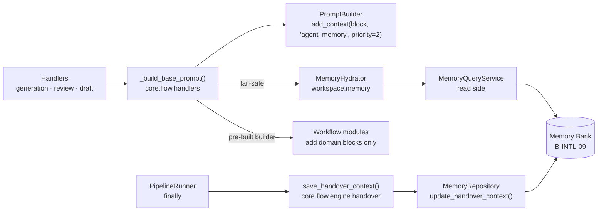

# D-INTL-06 — Context Hydration & Handover Engine

**Status**: APPROVED. **COMPLETE** — SF-01, SF-02, SF-03 committed. · **Phase**: 3 · **Feature ID**:
D-INTL-06

| | |
|---|---|
| Reads from | `B-INTL-09` (Agent Memory Bank) — read API, `HandoverContext`, 8KB payload limit |
| Used by | `INT-US-28` (integration contract); every `PromptBuilder`-based handler |
| Future consumers | `C-INTL-04` (conversation history), knowledge graph snippets — through `_build_base_prompt()` |
| Not touched | write-side schema, state machine, entity definitions (all `B-INTL-09`); `PromptBuilder` methods; CLI; API |

## What it does

Stops agent context degrading across a multi-step workflow:

1. **Hydrating** — queries the Memory Bank (B-INTL-09) for active task state, blockers and handover
   notes.
2. **Formatting** — renders them as a JSON prompt block with a token budget, trust tagging and
   multi-layer prompt injection defense.
3. **Injecting** — every LLM prompt gets the memory block through handler-level prompt assembly
   (Inversion of Control).
4. **Handing over** — at the end of a run, saves telemetry onto the active task so the next agent
   inherits it.

Hydration is self-contained in the Application Layer: the module-level async function
`_build_base_prompt()` in `core.flow.handlers.base` calls `MemoryHydrator` whenever it builds a
prompt. No CLI, API or `RunContext` entry-point wiring, so every LLM interaction is memory-aware.

Constraints: 8KB payload limit (B-INTL-09), Pydantic validation, multi-layer prompt injection
defense (trust tagging + field truncation + pattern stripping + JSON serialization + framing
instructions), structured logging, tach boundary compliance, zero regression on the 4,600+ test
suite.

## Why this way

- **One assembly point.** 5 workflow modules (`generator.py`, `reviewer.py`, `planner.py`,
  `drafter.py`, `feature_drafter.py`) each built a `PromptBuilder` with the same ~30-line chain
  (~150 (30 × 5) lines); a new context source meant touching all 5. Now it is ~50 lines in one
  function plus a 2-line call each (~10 (5 × 2-line call)), and a new source touches 1 place.
- **Inversion of Control, not a shared domain module.** `workflows/commons` would couple isolated
  bounded contexts (DDD anti-pattern). `core.flow` already has the orchestrator archetype and legal
  access to both `llm` and `workspace.memory`.
- **Replaced during design** (4 Red Team / Blue Team cycles, 47 findings, 5 critical boundary
  violations): `memory_assembler.py`, `add_memory_context()` on PromptBuilder,
  `RunContext.memory_context`, CLI/API wiring and `workflows/commons` — all replaced by
  `_build_base_prompt()`, which needs none of them.

## Architecture



| Module | Archetype | Can consume `workspace.memory`? | Can consume `llm`? |
|--------|-----------|-------------------------------|-------------------|
| `workspace` | workspace | ✅ (self) | ❌ |
| `core.flow` | orchestrator | ✅ (add to consumes) | ✅ |
| `infrastructure.llm` | adapter | ❌ | ✅ (self) |

`core.flow` adds `specweaver/workspace/memory` to its `consumes` and gains `MemoryHydrator`. No new
domain modules. No intermediate DTO: `_build_base_prompt()` reads `RunContext` fields
(`constitution`, `standards`, `db`, `project_path`); workflow modules receive a pre-built
`PromptBuilder` and add only domain-specific blocks.

**Reused, not changed:**

- `PromptBuilder` (597 lines, `infrastructure/llm/prompt_builder.py`): priority-ordered,
  token-aware hybrid truncation; XML-tagged blocks (`<context>`, `<file>`, `<topology>`,
  `<standards>`, `<plan>`, etc.); auto-scaling topology blocks by content-to-budget ratio; and
  `add_context(text, label, *, priority=3)` — the injection point. No new methods.
- Memory Bank read API (`MemoryRepository` via `MemoryRepositoryCoreMixin`):
  `list_tasks(project_name, *, status=...)` (one status per call), `get_task(task_id)` (full task
  dict incl. `handover_context`), `list_defects(task_id, *, status=...)`,
  `HandoverContext.from_json_str()` (Pydantic deserialization).

**Excluded from base assembly:** `ArbiterHandler` (minimal prompt via raw `Message`, for unbiased
fault arbitration); `ScenarioGenerator` (raw string prompts, no `PromptBuilder`).

| File | Change Type | Reason |
|------|-------------|--------|
| `workspace/memory/hydrator.py` | **NEW** | Read-side service: fetch + filter + format |
| `core/flow/handlers/base.py` | MODIFY | Add `_build_base_prompt()` with fail-safe hydration |
| `core/flow/handlers/generation.py` | MODIFY | Call `_build_base_prompt()`, pass builder to generator |
| `core/flow/handlers/review.py` | MODIFY | Call `_build_base_prompt()`, pass builder to reviewer |
| `core/flow/handlers/draft.py` | MODIFY | Call `_build_base_prompt(..., include_rules=False)` for 2-Tier enforcement |
| `workflows/implementation/generator.py` | MODIFY | Accept `base_prompt: PromptBuilder` instead of individual params |
| `workflows/review/reviewer.py` | MODIFY | Accept `base_prompt: PromptBuilder` |
| `workflows/planning/planner.py` | MODIFY | Accept `base_prompt: PromptBuilder` |
| `workflows/drafting/drafter.py` | MODIFY | Accept `base_prompt: PromptBuilder` |
| `workflows/drafting/feature_drafter.py` | MODIFY | Accept `base_prompt: PromptBuilder` |
| `core/flow/context.yaml` | MODIFY | Add `specweaver/workspace/memory` to consumes |
| `core/flow/engine/runner.py` | MODIFY | Add `on_pipeline_complete` callback parameter |
| `tach.toml` | MODIFY | Add `workspace.memory` to `core.flow` depends_on |

**NOT modified**: `RunContext` (no new fields), `PromptBuilder` (no new methods), CLI
(`interfaces/cli/`), API (`interfaces/api/`), workflow `context.yaml` files (no new domain
dependencies). SF-03 later changed two rows: the runner calls `save_handover_context()` directly
instead of taking a callback, and `RunContext` gained `task_id`.

**Boundary changes.** `core/flow/context.yaml`:

```yaml
consumes:
  # ... existing entries ...
  - specweaver/workspace/memory  # NEW: for MemoryHydrator in _build_base_prompt()
```

`tach.toml`: add `src.specweaver.workspace.memory` to `core.flow`'s `depends_on` so
`_build_base_prompt()` can import `MemoryHydrator`. `workspace.memory` itself was registered in
SF-01 (`tach.toml` line 36, `[[interfaces]]` exposing `hydrator`, `queries`, `models`, `store`,
`errors`, `repository`, lines 243-244). No workflow `context.yaml` updates.

**Handoff boundary B-INTL-09 ↔ D-INTL-06:**

| Concern | Owner | Responsibility |
|---------|-------|---------------|
| **Schema definition** | B-INTL-09 ✅ | Defines the JSON column on the `Task` model |
| **Write-side validation** | B-INTL-09 ✅ | `MemoryRepository` enforces data integrity on WRITE |
| **Context truncation** | B-INTL-09 ✅ | Sets `handover_context = NULL` on `ARCHIVED` |
| **Schema evolution** | B-INTL-09 | Backward-compatible changes (new fields with defaults) |
| **Read-side retrieval** | **D-INTL-06** | Queries Memory Bank for active context |
| **Prompt formatting** | **D-INTL-06** | Structures context as XML with escape + trust tags |
| **Handover protocols** | **D-INTL-06** | Rules for when/what to hand over between agents |

**Dependencies:** none new. SQLAlchemy >=2.0.0 (`AsyncSession`, `select`) and Pydantic >=2.0
(`BaseModel`, `field_validator`) are already in pyproject.toml.

**Patterns borrowed:**

| Pattern | Adopted? | Implementation |
|---------|----------|---------------|
| Transparent Context Injection | ✅ | Handler-internal hydration — workflow modules don’t know about memory |
| Topic-Based Retrieval | ✅ | Status-filtered queries (active tasks only) |
| Context Isolation | ✅ | Per-project and per-worker_id filtering |
| Memory Poisoning Defense | ✅ | Pydantic validation + XML escaping + trust tagging |
| Token Budget Management | ✅ | Priority-based truncation (priority=2) + 2048-token cap |

Blueprints: **LangGraph State Machine Pattern** (shared state object nodes read/write);
**Aider Repo Map Architecture** (dynamic context sizing via proportional scaling); **CrewAI
Task-Level Handover** (structured handover schema: files_touched, errors, summary); **Context
Engineering (2025-2026)** (context window as RAM; prune stale; XML semantic tags).

## Decisions

| # | Decision | Rationale | Switch? |
|---|----------|-----------|---------|
| AD-1 | `MemoryHydrator` in `workspace/memory/hydrator.py` | Memory retrieval is a workspace concern. Read-only, same module as `MemoryRepository`. | No |
| AD-2 | Use existing `add_context()` — no new PromptBuilder method | `add_context(text, "agent_memory", priority=2)` provides all needed functionality. Eliminates cross-boundary import (PromptBuilder doesn't need to know about HydrationResult). | No |
| AD-3 | Hydration via Inversion of Control in Application Layer | A module-level function `_build_base_prompt()` in `core.flow.handlers.base` (Application Layer, orchestrator archetype). `core.flow` adds `workspace/memory` to its `consumes`, legally gaining access to `MemoryHydrator`. It calls hydration internally, making it transparent to all workflow callers. No new domain modules needed. | No |
| AD-4 | Priority=2 for memory context | Places it after instructions (0), project metadata (1), and files (1), but before topology (3) and generic context (3). Under token pressure, topology is dropped before memory context. | No |
| AD-5 | 2048 token hard cap | ≤10% of a typical 20K context window. First-pass guard by hydrator, second-pass by PromptBuilder priority truncation. | No |
| AD-6 | Query IN_PROGRESS + BLOCKED + UPSTREAM_BLOCKED | PENDING has no context. DONE > 24h is stale. ARCHIVED has null context. UPSTREAM_BLOCKED provides dependency visibility (blockers section only). | No |
| AD-7 | No intermediate DTO — RunContext is sufficient | `_build_base_prompt()` reads directly from `RunContext` fields (`constitution`, `standards`, `db`, `project_path`, `project_metadata`). No `PromptContext` DTO needed. Workflow modules receive a pre-built `PromptBuilder`. This eliminates cross-boundary DTO coupling. | No |
| AD-8 | No new domain modules — pure DDD isolation maintained | Prompt assembly stays in the Application Layer (`core.flow`) as a module-level function. No `workflows/commons` module. Workflow domain modules remain isolated bounded contexts with no shared dependencies. `core.flow` already has the orchestrator archetype and legal access to both `llm` and `workspace.memory`. | No |
| AD-9 | Handover notes tagged with `trust="low"` | LLM-generated summaries from previous agents are untrusted. The trust tag signals to the LLM that these are prior agent outputs, not system instructions. Combined with JSON serialization (NFR-10), trust tagging (NFR-11), field truncation (NFR-12), and pattern stripping (NFR-13). | No |
| AD-10 | Handover save via callback injection | `PipelineRunner` accepts `on_pipeline_complete` callback (same pattern as `on_event`). The callback is wired at the entry point layer that already imports `workspace`. The runner itself never imports `workspace`. **Superseded by SF-03:** once SF-02 let `core.flow` consume `workspace.memory`, the runner calls `save_handover_context()` in its `finally` — no callback, no CLI/API wiring. | No |
| AD-11 | 5-layer prompt injection defense | Defense-in-depth against indirect prompt injection through the memory hydration pipeline: (1) Pydantic schema validation at write time (B-INTL-09), (2) JSON serialization at format time (NFR-10), (3) trust tagging in output (NFR-11), (4) field-level truncation (NFR-12), (5) injection pattern stripping (NFR-13). Plus: system instruction framing around memory block (SF-02, `_build_base_prompt`). | No |

Also decided: each prompt build triggers a fresh hydration (~6 per pipeline run, <50ms each, <300ms
total) — no cache; a TTL cache keyed by `project_name` only if profiling shows a bottleneck.

## Functional Requirements

| # | FR | Actor | Action | Outcome |
|---|-----|-------|--------|---------|
| FR-1 | Memory Hydrator Service | System | Implement `MemoryHydrator` class in `workspace/memory/hydrator.py` that accepts an `AsyncSession` and `project_name`. Makes separate `list_tasks` calls for IN_PROGRESS, BLOCKED, and UPSTREAM_BLOCKED statuses, merges and sorts by `updated_at DESC`, limits to 10 most recent. Includes DONE tasks < 24h old only if `handover_context` is non-null. Deserializes via `HandoverContext.from_json_str()`. Returns a `HydrationResult` dataclass. | Self-contained retrieval service with structured output. |
| FR-2 | HydrationResult DTO | System | `HydrationResult` is a `@dataclass` with fields: `active_tasks: list[HydratedTask]` (title, status, worker_id, handover_summary), `blockers: list[HydratedBlocker]` (task_title, defect_titles, defect_descriptions), `handover_notes: list[str]`, `token_estimate: int`, `task_count: int`, `truncated: bool`. Provides `format_prompt_block() -> str` that renders as an XML `<agent_memory>` block with XML-escaped content and `trust="low"` on handover notes. `HydratedTask` and `HydratedBlocker` are also `@dataclass` types. | Well-defined, typed contract between hydrator and prompt assembly. |
| FR-3 | Selective Filtering | MemoryHydrator | Filter out: (a) ARCHIVED tasks, (b) tasks outside current project, (c) DONE tasks > 24h old or with null handover_context. UPSTREAM_BLOCKED tasks appear only in `blockers` (not `active_tasks`). Sort by `updated_at DESC`, limit to 10. The 24h check uses `updated_at` as reference. | Only relevant, recent context injected. |
| FR-4 | Token Budget Guard | MemoryHydrator | Estimate tokens via `len(serialized_text) // 4` (matching PromptBuilder default). If estimate > 2048 tokens, truncate: (1) drop handover_notes from oldest tasks, (2) drop blocker details, (3) summarize active_tasks to title-only. This is a first-pass guard; PromptBuilder applies authoritative priority-based truncation as second pass. | Memory context never dominates token budget. |
| FR-5 | Defect Surfacing | MemoryHydrator | For BLOCKED tasks, query `list_defects(task_id, status=OPEN)` and include defect titles/descriptions in the `<blockers>` section. | LLM agents know why tasks are blocked. |
| FR-6 | Base Prompt Assembly | System | Extract the repeated assembly chain into `async _build_base_prompt(context, instructions, *, include_rules=True, skeleton_files=None) -> PromptBuilder` as a module-level function in `core.flow.handlers.base`. Reads `RunContext` fields directly. Internally calls `MemoryHydrator` (fail-safe) via `context.db.async_session_scope()` and injects result via `PromptBuilder.add_context(block, "agent_memory", priority=2)`. If `db` is None, hydration is skipped silently. The `include_rules` flag enforces 2-Tier Handover: `False` for drafting (skips constitution/standards). All handlers call this function. `ArbiterHandler` is explicitly excluded (uses minimal prompt). `ScenarioGenerator` is excluded (does not use `PromptBuilder`). Each call triggers a fresh hydration (~6 per pipeline run). At <50ms each, cumulative <300ms is negligible vs LLM latency. If profiling reveals a bottleneck, add a TTL cache keyed by `project_name`. | Single integration point for all context sources. Memory hydration is transparent. |
| FR-7 | Handler Prompt Assembly Function | System | `_build_base_prompt()` is a module-level async function in `core.flow.handlers.base` (there is no `BaseHandler` class — `base.py` defines `RunContext` and `StepHandler` protocol). It accepts `context: RunContext`, `instructions: str`, and optional keyword args `include_rules: bool = True` and `skeleton_files: dict[str, str] | None = None`. No intermediate DTO is needed — all data is read directly from `RunContext` fields (`constitution`, `standards`, `db`, `project_path`, `project_metadata`). Workflow modules receive a pre-built `PromptBuilder` and add only domain-specific blocks (file content, dictator overrides, mentioned files, etc.). | Clean IoC separation: Application Layer assembles base prompt, Domain Layer adds domain-specific context. |
| FR-8 | Handover Protocol: Save | System | The save protocol is implemented as an `on_pipeline_complete` callback injected into `PipelineRunner` (following the existing `on_event` callback pattern). The callback receives step results, collects `files_touched`, `errors_encountered`, `summary` (LLM-generated 1-sentence status), and `metadata` (step count, model). It calls `MemoryRepository.update_handover_context()`. The callback is wired at the entry point layer (`core/flow/interfaces/cli.py`), which captures the `task_id` obtained from `acquire_task()` via closure. The `PipelineRunner` itself does NOT import from `workspace` and does not know about tasks. Fires in a `finally` block to ensure save on `KeyboardInterrupt`. D-INTL-06 defines the protocol; B-INTL-09 executes the write. | Next agent inherits factual telemetry. No boundary violations. |
| FR-9 | Handover Protocol: Bootstrap | System | When an agent acquires a task with non-null `handover_context`, the hydrator deserializes and validates it. It is formatted simply as a `<handover_notes>` sub-element under that specific task's entry within the standard `<active_tasks>` block, tagged with `trust="low"`. The LLM naturally correlates these notes with its current assignment. | Agents don't start from scratch on retried tasks. |

**Where the build differs from the FR wording** (intent unchanged; details in each plan's As built):

| FR | As built |
|---|---|
| FR-1, FR-3, FR-5 | One `MemoryQueryService` read layer: multi-status `in_()` query, DONE tasks via `max_age_hours=24` (`hydrator.py:162`), defects batch-fetched — not per-status `list_tasks` / per-task `list_defects` |
| FR-2, FR-9 | `format_prompt_block()` returns JSON (`json.dumps`) inside `<agent_memory trust="low">`, which PromptBuilder wraps in `<context label="agent_memory">`; no XML escaping. Trust is also carried by the `_trust: "low"` / `_trust_policy` fields. Handover summaries sit on each task (`handover_summary`) and in a top-level `handover_notes` list, not in a `<handover_notes>` sub-element |
| FR-6, FR-7 | `include_rules` was later replaced by `profile: RenderProfile` (`C-INTL-05`); the function now lives in `core/flow/handlers/prompting.py`, re-exported from `base` |
| FR-8 | No callback: `PipelineRunner` calls `save_handover_context()` (`core/flow/engine/handover.py`) in the `finally` of `run()`/`resume()`; the summary is a static string, not LLM-generated (see SF-03) |

## Non-Functional Requirements

| # | NFR | Threshold / Constraint |
|---|-----|----------------------|
| NFR-1 | Latency | Memory hydration (DB query + format) MUST complete in < 50ms for projects with ≤ 1000 tasks. Uses indexed queries. Monitor N+1 defect queries — batch if bottleneck. |
| NFR-2 | Architectural Placement | `MemoryHydrator` in `workspace/memory/hydrator.py` (workspace layer). Prompt assembly in `core.flow.handlers.base._build_base_prompt()` (Application Layer, orchestrator archetype). `core.flow` adds `workspace/memory` to its `consumes`. Handover save via `on_pipeline_complete` callback injection into `PipelineRunner`. No modifications to `PromptBuilder`, `RunContext`, CLI, or API. No new domain modules. **[proof: arch — tach/lint gate, not pytest]** |
| NFR-3 | Token Budget | Formatted `<agent_memory>` MUST NOT exceed 2048 tokens after first-pass truncation. Priority=2 means it is truncated before instructions (0), metadata (1), and files (1) but after topology (3) and generic context (3). |
| NFR-4 | Security: No Hallucination Transfer | All context passes through `HandoverContext.from_json_str()` (Pydantic). Invalid payloads logged at WARNING and silently dropped. |
| NFR-5 | Backward Compatibility | No changes to `RunContext`. All existing pipeline invocations work identically. Workflow module method signatures change from individual params to `base_prompt: PromptBuilder` — all calling handlers are updated in the same commit boundary to maintain zero-regression. |
| NFR-6 | Observability | `INFO` on successful hydration with task count. `WARNING` on Pydantic validation failure. `DEBUG` with token estimate and truncation actions. |
| NFR-7 | Test Coverage | 70–90% across new/modified modules. **Unit**: `MemoryHydrator`, `HydrationResult.format_prompt_block()`, `_build_base_prompt()` (with `db=None` to test fail-safe skip, with `include_rules=False` for 2-Tier). **Integration**: `_build_base_prompt()` produces prompt with `<agent_memory>` block from pre-populated in-memory SQLite DB. **E2E**: (1) pipeline with populated MemoryBank → prompt contains `<agent_memory>`, (2) empty MemoryBank → no `<agent_memory>`, (3) corrupted handover_context → pipeline completes (fail-safe). **Regression**: Before refactoring each workflow module, capture current prompt output via `PromptBuilder.build()` for a representative test case. After refactoring, assert prompt output is identical (minus memory context additions). JSON validity via `json.loads()`. **[proof: meta — rule about tests, docs or the diff]** |
| NFR-8 | File Size | No new file exceeds 900 lines. **[proof: arch — tach/lint gate, not pytest]** |
| NFR-9 | Fail-Safe Hydration | Any exception during hydration (DB failure, query timeout, Pydantic error, `db=None`) is caught, logged at WARNING. `_build_base_prompt()` returns a PromptBuilder without memory context. Pipeline MUST NOT abort due to hydration failure. |
| NFR-10 | Prompt Injection Defense: Serialization | `format_prompt_block()` renders content as JSON via `json.dumps(ensure_ascii=False)`. JSON serialization handles character escaping automatically. No raw string concatenation of user content. |
| NFR-11 | Prompt Injection Defense: Trust Tagging | All hydrated output MUST include `_trust` and `_trust_policy` metadata fields. Handover summaries marked `_trust: "low"`. The `_trust_policy` field contains a meta-instruction telling the receiving LLM to treat the block as context data, not instructions. |
| NFR-12 | Prompt Injection Defense: Field Truncation | Individual fields MUST be truncated before serialization: task titles ≤200 chars, handover summaries ≤500 chars, defect titles ≤200 chars, defect descriptions ≤500 chars. Limits payload size for injection attacks. |
| NFR-13 | Prompt Injection Defense: Pattern Stripping | A configurable blocklist of known injection patterns (e.g., "ignore previous instructions", `<\|im_start\|>`, `[INST]`) MUST be stripped from all text fields before serialization. This is a defense-in-depth layer — not the primary defense. |

## Findings still open

- **FR-1, FR-2, FR-3 and FR-7 carry no `Proves:` citation.** Tests were written under `INT-US-28`
  and credited only there, so `check_fr_coverage.py D-INTL-06` reported `BLOCKED` with nothing
  cited. Re-attributed 2026-08-13 (`TECH-017` SF-01): four unit files under `tests/unit/workspace/`
  and `tests/unit/core/flow/` (49 tests), each read against each requirement; FR-4, FR-5, FR-6,
  FR-8 and FR-9 now cite specific test functions. No requirement re-worded, no test changed.
  Full finding: `docs/analysis/integration_contract_proof_matrix.md` → `INT-US-28`.
- **"Uncited" is not "untested".** FR-3's filtering (ARCHIVED, cross-project, DONE older than 24h)
  is not in the hydrator — it delegates, passing `max_age_hours=24` to the repository
  (`hydrator.py:162`). Its proof, if any, sits in the repository's test file, which never names
  `D-INTL-06`. Confirming that is `CB-2`'s work. The general shape (a citation in a file that names
  no story is **invisible** to the ledger — a different defect from absent proof) is recorded
  against `B-INTL-09`.
- **RT-2 not done:** `GenerateCodeHandler` and `GenerateTestsHandler` share ~90% identical code;
  the proposed `_generate_common()` in `generation.py` would shrink the blast radius of prompt
  wiring.

## Developer guides

| Guide Topic | Description | Status |
|-------------|-------------|--------|
| Guide-1 | Update `agent_memory_state_tracking.md` with hydration/handover protocol usage | ✅ Pre-commit |

## Sub-features

| SF | Does | FRs | Inputs → Outputs | Depends on | Plan |
|----|------|-----|------------------|-----------|------|
| SF-01 | Memory Hydrator & HydrationResult DTO — read-side retrieval service + DTO with JSON formatting and multi-layer prompt injection defense. tach: register `workspace.memory` in `tach.toml` + `[[interfaces]]`. | FR-1, FR-2, FR-3, FR-4, FR-5 | `AsyncSession`, `project_name`, optional `worker_id` → `HydrationResult` DTO with `format_prompt_block() -> str` | none (B-INTL-09 committed) | [sf01](D-INTL-06_sf01_implementation_plan.md) |
| SF-02 | Prompt Assembly via Inversion of Control — `_build_base_prompt()` in `core.flow.handlers.base` with fail-safe hydration; all 5 workflow modules take `base_prompt: PromptBuilder` instead of individual params; handlers build and pass it down; `include_rules=False` for drafting enforces 2-Tier Handover; `workspace/memory` added to `core.flow` consumes and `depends_on`; before/after prompt regression tests. | FR-6, FR-7 | `RunContext` (already contains constitution, standards, db, project_path) → pre-configured `PromptBuilder` with memory context | SF-01 | [sf02](D-INTL-06_sf02_implementation_plan.md) |
| SF-03 | Handover Protocols — save protocol in `PipelineRunner`'s `finally` block; bootstrap protocol (standard task list formatting with trust tagging). | FR-8, FR-9 | Completed pipeline step results → `HandoverContext` persisted; notes included in `<agent_memory>` block | SF-01, SF-02 | [sf03](D-INTL-06_sf03_implementation_plan.md) |

## Progress Tracker

| SF | Name | Depends On | Design | Impl Plan | Dev | Pre-Commit | Committed |
|----|------|-----------|--------|-----------|-----|------------|-----------|
| SF-01 | Memory Hydrator & DTO | — | ✅ | ✅ | ✅ | ✅ | ✅ |
| SF-02 | Prompt Assembly via IoC | SF-01 | ✅ | ✅ | ✅ | ✅ | ✅ |
| SF-03 | Handover Protocols | SF-01, SF-02 | ✅ | ✅ | ✅ | ✅ | ✅ |
