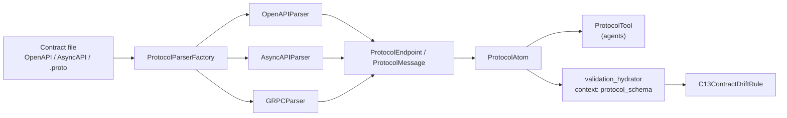

# A-VAL-01 — Protocol & Schema Analyzers

**Status**: APPROVED · **Legacy Feature ID**: 3.31 · **Phase**: 3 · **Feature ID**: A-VAL-01

| | |
|---|---|
| Extends | the CodeStructure framework; the `assurance/validation` engine |
| Used by | rule C13 (contract drift); `validation_hydrator` fills `protocol_schema` through `ProtocolAtom` |
| Not touched | `protoc` / C++ build extensions; programming-language AST extractors |

## What it does

Parses OpenAPI, AsyncAPI and gRPC `.proto` contracts structurally and checks that backend API code
matches them. Target: contract drift across microservices.

Parsing uses pure Python: `ruamel.yaml` for YAML, `proto-schema-parser` for `.proto`. No `protoc`, no
C++ build extensions, no compile step. Integration into the existing `assurance/validation` engine stays
lightweight.

## Why this way

- **Own module, not the code extractors.** AST extraction for programming languages uses `tree-sitter`
  in `core/loom/commons/language/` behind the CodeStructure interface. YAML and `.proto` do not fit a
  code interface, so they get `commons/protocol`, designed for APIs.
- **Not official `protobuf`.** It cannot parse `.proto` at runtime without the external `protoc`
  generation binary.
- **Not `tree-sitter-proto`.** It needs a native `.so` build, which crashes CI/CD sandboxes that lock
  GCC builds. `proto-schema-parser` is the pure-Python fallback, and the one used.
- **Reuse `ruamel.yaml`** — already in `pyproject.toml`.

## Architecture

| Part | Lives in (now) |
|---|---|
| Models, `ProtocolSchemaInterface`, the three parsers, the factory | `src/specweaver/sandbox/protocol/core/` (archetype `adapter`) |
| `ProtocolAtom` | `src/specweaver/sandbox/protocol/core/atom.py` |
| `ProtocolTool` | `src/specweaver/sandbox/protocol/interfaces/tool.py` |
| C13 rule | `src/specweaver/assurance/validation/rules/code/c13_contract_drift.py` |

**Since moved** (2026-05-03, `7b35a900`, TECH-01 sandbox consolidation): the plans name
`core/loom/commons|atoms|tools/protocol`; all now live under `sandbox/protocol/`.

## Dependencies

| Tool | Version | Key API Surface | Notes |
|------|---------|----------------|-------|
| ruamel.yaml | >=0.18 | Schema deserialization | Already in project |
| proto-schema-parser | >=0.5.0 (research: >=latest) | `Parser().parse(txt)` | Pure Python parser; compat confirmed. In `pyproject.toml`. |
| tree-sitter-proto | >=2.0 (research: >=latest) | tree-sitter grammar | Compat confirmed; not used (see Why) |

Blueprint references: none specific from ORIGINS.md beyond general drift-prevention alignment.

## Decisions

| # | Decision | Rationale | Architectural Switch? |
|---|----------|-----------|----------------------|
| AD-1 | Create `core/loom/commons/protocol` | Splits interface schemas (OpenAPI/proto) out of programming code (Python/Rust) AST Extractors. | Yes — approved by steve on 2026-04-18 |
| AD-2 | Avoid official `protobuf` | Official library does not parse `.proto` at runtime without external `protoc` generation binary overhead. | No |

## Functional Requirements

| # | FR | Actor | Action | Outcome |
|---|-----|-------|--------|---------|
| FR-1 | Parse YAML schemas | System | Uses `ruamel.yaml` to read OpenAPI and AsyncAPI | Abstract endpoint and message dictionaries are extracted |
| FR-2 | Parse Proto schemas | System | Uses `tree-sitter-proto` (or `proto-schema-parser`) to extract `.proto` AST | Service and RPC skeletons and message payloads are extracted |
| FR-3 | Implement Interface | System | Provides `ProtocolSchemaInterface` mapping | Unifies YAML and `.proto` output into standard components, endpoints, and schema models |
| FR-4 | Implement Engine Connectors | System | Provides `ProtocolTool` and `ProtocolAtom` | Maps `ProtocolSchemaInterface` into Flow engine capabilities |
| FR-5 | Catch Contract Drift | Validation | Compares Code ASTs against Protocol definitions | Emits ERRORs on missing/mismatched signatures |

## Non-Functional Requirements

| # | NFR | Threshold / Constraint |
|---|-----|----------------------|
| NFR-1 | Speed / Overhead | Parsing must be < 50ms per file to avoid blocking pipeline. |
| NFR-2 | Build Toolchains | Must operate fully natively without requiring `protoc` or C++ binary extensions. |
| NFR-3 | Compatibility | Output models must natively match/compare against `core/loom/commons/language` AST nodes. |

## Developer guides

| Guide Topic | Description | Status |
|-------------|-------------|--------|
| Protocol Analyzers | Integrating new schemas/protocols into `commons/protocol` | ⬜ To be written during Pre-commit |

## Sub-features

| SF | Does | FRs | In → Out | Depends on | Plan |
|----|------|-----|----------|-----------|------|
| SF-01 | `commons/protocol` core boundaries + YAML extractors | FR-1, FR-3 | OpenAPI / AsyncAPI raw file content → normalized Protocol Schema DTOs (Endpoints, Messages) | — | [sf01](A-VAL-01_sf01_implementation_plan.md) |
| SF-02 | `.proto` parsing behind `ProtocolSchemaInterface` | FR-2 | raw `.proto` definitions → DTOs mapped from RPC services | SF-01 | [sf02](A-VAL-01_sf02_implementation_plan.md) |
| SF-03 | Exposes the extractors to the Validation and Review layer via engine Atoms | FR-4 | file intents from LLM adapters → extracted schema nodes returned to orchestrator context | SF-01, SF-02 | [sf03](A-VAL-01_sf03_implementation_plan.md) |
| SF-04 | `ValidationEngine` rule (e.g. `C13_Contract_Drift.py`) asserts backend code matches Protocol payloads | FR-5 | AST code nodes + Protocol Schema nodes → findings (PASS or ERROR) | SF-03 | [sf04](A-VAL-01_sf04_implementation_plan.md) |

## Progress Tracker

| SF | Name | Depends On | Design | Impl Plan | Dev | Pre-Commit | Committed |
|----|------|-----------|--------|-----------|-----|------------|-----------|
| SF-01 | ProtocolSchemaInterface & YAML Parsers | — | ✅ | ✅ | ✅ | ✅ | ✅ |
| SF-02 | gRPC Protobuf Parser | SF-01 | ✅ | ✅ | ✅ | ✅ | ✅ |
| SF-03 | Core Flow Engine Alignment (Atom/Tool) | SF-01, SF-02 | ✅ | ✅ | ✅ | ✅ | ✅ |
| SF-04 | Contract Drift Validation Rules | SF-03 | ✅ | ✅ | ✅ | ✅ | ⬜ |

SF-04's Committed cell lags: C13 landed in `b3037104` (2026-04-18). The topic file marks A-VAL-01 ✅.
