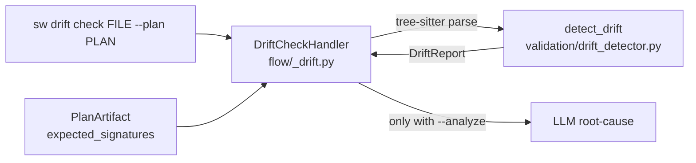

# B-VAL-01 — AST Drift Detection & AI Root-Cause Analysis

**Status**: APPROVED. **COMPLETE** — SF-01, SF-02 committed. · **Feature ID**: 3.14a · **Phase**: 3

| | |
|---|---|
| Builds on | Feature 3.14 (Artifact Lineage UUIDs, `# sw-artifact`) · Phase 3.6 structured Plan JSON |
| Touches | validation pipeline · flow engine |
| Not touched | real-time background file watching |
| Blueprints | none in ORIGINS.md beyond the high-level roadmap |

## What it does

Parses the code's AST and compares it with the structured Plan — the spec's intent as JSON. Reports
where humans made the code drift from the plan, and which planned parts are missing (coverage gaps).
With `--analyze`, an LLM explains the root cause of each violation.

The core AST check uses no LLM, so it stays fast and the feedback loop stays tight.

## Why this way

- AST parsing already exists (`standards/tree_sitter_base.py`); the detector reuses it.
- `validation/` is the pure-logic layer for spec/code rules, so the detector lives there as
  `validation/drift_detector.py`.
- `flow/` dispatches commands and logs LLM calls, so LLM pinpointing is an orchestration handler
  (`flow/_drift.py`). Orchestrating `validation` + `llm` from `flow/` breaks no boundary rule.

## Architecture

## Decisions

| # | Decision | Rationale | Architectural Switch? |
|---|----------|-----------|----------------------|
| AD-1 | Put detector logic in `validation/` | Pure-logic component that compares AST to an expected criteria. Matches existing `validation/rules` pattern. | No |
| AD-2 | Put LLM integration in `flow/_drift.py` | `validation` layer forbids `llm` imports. Orchestration happens in the `flow/` runner. | No |
| AD-3 | Explicit `--analyze` flag | LLM analysis can be expensive. Fast structural static checking must be the default. | No |
| AD-4 | Structural Baseline via Phase 3.6 Plan | Extracts the structured JSON Plan instead of markdown parsing or AST caching. Ensures "Spec is truth" architecture. | No |
| AD-5 | `--plan` is a **required** option; `sw drift check` does no lineage lookup | Chosen in the SF-02 plan: *"This keeps it 100% fast, avoids globbing, and is explicit."* | No |

## Functional Requirements

| # | FR | Actor | Action | Outcome |
|---|-----|-------|--------|---------|
| FR-1 | AST Extraction | System | SHALL extract the Abstract Syntax Tree (AST) of the target file using `tree_sitter` | AST representation is produced for analysis |
| FR-3 | Drift Detection | System | SHALL detect structural mutations in the AST compared to the baseline spec expectations | A list of drift findings is produced |
| FR-4 | Gap Analysis | System | SHALL evaluate coverage by verifying AST nodes corresponding to spec scenarios exist | Missing scenarios are reported as coverage gaps |
| FR-5 | Root-Cause Analysis | System | SHALL trigger LLM root-cause analysis on detected drift ONLY when `--analyze` is passed | Explains why the drift happened |
| FR-6 | Drift CLI | Developer | SHALL run `sw drift check <file> [--analyze]` | Initiates structural inspection pipeline |

**FR-2 (Baseline Fetch) is deleted** (2026-08-17, from `INT-US-10-SF01-MIG`, per the `TECH-046`
precedent). It promised to fetch the plan "via the file's lineage UUID"; `sw drift check` never does
that — `--plan` is required (AD-5) and the handler reads `step.params["plan_path"]`. FR-1, FR-3..FR-6
keep their numbers so existing citations stay valid.

The lineage mechanism exists on another command: `_resolve_plan_by_lineage` in
`assurance/validation/interfaces/cli_drift.py` reads the file's `# sw-artifact` uuid, looks up its
`parent_id` in `flow_artifact_events`, and matches it against each candidate plan's uuid.
`_plan_declaring` backs it up by matching `expected_signatures` path text in three spellings. Both
serve only **`sw drift check-rot`** (`B-VAL-02`'s pre-commit interceptor) via `_target_has_drifted`.
Wiring them into `sw drift check` is a small change, not a build.

Lesson (same shape as `TECH-062`): a descope recorded in the plan but not the FR table is invisible to
every gate — `check_fr_sweep.py` sees an uncited FR, never a contradicted one.

## Non-Functional Requirements

| # | NFR | Threshold / Constraint |
|---|-----|----------------------|
| NFR-1 | Performance | AST drift check execution (without `--analyze`) MUST take < 500ms |
| NFR-2 | Safety | Must be strictly read-only; never mutate source files or specification files |

## External dependencies

| Tool | Min Version | Key API Surface | Compat Confirmed | Notes |
|------|------------|----------------|-----------------|-------|
| tree-sitter | 0.22 (0.22+) | `.parse()`, node queries, AST node traversal | Yes | Python package; pre-installed for the `standards/` feature |

## Sub-features

| SF | Does | FRs | Inputs → Outputs | Depends on | Plan |
|----|------|-----|------------------|-----------|------|
| SF-01 | AST Drift & Coverage Engine: pure-logic AST parse + comparison with the plan. No LLM. | FR-3, FR-4 | source file path + its parent Spec constraints (via `models`) → structured drift and coverage findings | none | [sf01](B-VAL-01_sf01_implementation_plan.md) |
| SF-02 | Flow Integration & CLI (`sw drift`): expose the detector to pipelines and the CLI; opt-in LLM root cause. | FR-1, FR-5, FR-6 | CLI args, SF-01 findings → pipeline step, terminal output, LLM root cause on request | SF-01 | [sf02](B-VAL-01_sf02_implementation_plan.md) |

## Progress Tracker

| SF | Name | Depends On | Design | Impl Plan | Dev | Pre-Commit | Committed |
|----|------|-----------|--------|-----------|-----|------------|-----------|
| SF-01 | AST Drift Engine | — | ✅ | ✅ | ✅ | ✅ | ✅ |
| SF-02 | Flow Integration & CLI | SF-01 | ✅ | ✅ | ✅ | ✅ | ✅ |
