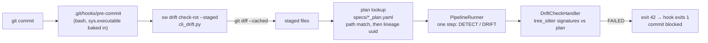

# B-VAL-02 — Bi-Directional Spec Rot Interceptor

**Status**: APPROVED · **Phase**: 3 · **Feature ID**: B-VAL-02 (legacy 3.23)

| | |
|---|---|
| Reuses | the drift engine (`DriftCheckHandler`, `drift_detector`) — shared with `B-VAL-01` |
| Pattern | `cli/drift.py` single-step pipeline (`PipelineDefinition.create_single_step` + `PipelineRunner`) |
| Guide | [`docs/dev_guides/spec_rot_pre_commit_workflow.md`](../../../../dev_guides/spec_rot_pre_commit_workflow.md) — install the hook, what its errors mean, resolving a block by updating Spec/Code |
| Not touched | existing pipelines, internal LLM flows, validation state, out-of-scope system modules |

## What it does

Solves the "2nd-Day Problem": a git pre-commit hook blocks builds/commits when a staged file's code
structure has drifted from its spec, so hot-fixes cannot leave the documentation behind.

- `sw hooks install --pre-commit` writes `.git/hooks/pre-commit`.
- The hook runs `sw drift check-rot --staged`.
- Each staged file with a matching plan runs through a one-step `DETECT`/`DRIFT` pipeline.
- Drift → exit `42` → the hook aborts the commit.

Deterministic: no LLM/AI calls in the check.

## Architecture

| Part | Lives in |
|---|---|
| `sw hooks install`, `HOOK_TEMPLATE` | `workspace/project/interfaces/cli_hooks.py` |
| `sw drift check-rot` | `assurance/validation/interfaces/cli_drift.py` |
| Drift step | `core/flow/handlers/drift.py` → `drift_detector` |

`cli` may not import from `loom/*`, so the CLI cannot call `CodeStructureTool` or the AST
extraction utilities directly. It builds a one-step pipeline and runs it with `PipelineRunner`, as
`cli/drift.py` already did. `c09_traceability.py` showed that tree-sitter-parsed source bytes support
structural detection of `@trace` nodes; the rot path does not use it (see FR-5 below).

**How it matches today** (corrected 2026-08-17, `INT-US-01-SF03-MIG`; all eight FRs are cited and
each is behind a killed mutant — `check_fr_coverage.py B-VAL-02` exits 0):

- **FR-5** — signatures come from `DriftCheckHandler`, which parses with `tree_sitter` directly and
  extracts them in `drift_detector._extract_signatures` — Python only. **There is no `AstAtom` class
  anywhere in `src/`** (the Polyglot AST Extractor of Feature 3.22 was the plan). No `@trace`
  metadata reaches the check: `extract_traceability_tags` is real and reached from
  `workspace/analyzers/factory.py`, but nothing on the `check-rot` path calls it. Both clauses
  struck; the signature clause stands and is cited. FR-5's mutant is **shared with `B-VAL-01`
  FR-1** — both die when the tree-sitter parse gets empty bytes, since both go through the same
  handler. One mutant, two capabilities; the second citation is not independent evidence (also
  disclosed in the test file).
- **FR-6** — reads plans, not `Spec.md`. It globs `specs/*_plan.yaml` and matches a plan to a file
  by an `expected_signatures` key naming the path (three spellings), else by lineage:
  `_resolve_plan_by_lineage` reads the file's `# sw-artifact` uuid, finds its `parent_id` in
  `flow_artifact_events`, and matches it against each plan's own uuid. Same intent, a more precise
  mechanism than "traceability tags" — and the lineage resolver `B-VAL-01` FR-2 described and
  never got.
- **FR-8** — the exit code is **42, not 1**. The interceptor calls `sys.exit(42)`; the hook matches
  `if [ $exit_code -eq 42 ]`. 42 separates "drift detected" from "the command itself failed", which
  `1` cannot. The table keeps the declared behaviour (non-zero, deterministic, blocks the commit):
  hook and command have to agree, and that agreement is the requirement.
- Commands as built: `sw hooks install` (FR-1's `sw githook install`) and `sw drift check-rot`
  (FR-2's `sw check-rot`). Staged files are read with `--diff-filter=ACM`.

Debug output of `_target_has_drifted` goes through `logger.debug`. Three stray `DEBUG …` console prints on the pre-commit
path (`DEBUG TARGET STR`, `DEBUG SKIP`, `DEBUG PIPELINE`) were replaced; no test asserted on them.

## Decisions

| # | Decision | Rationale | Architectural Switch? |
|---|----------|-----------|----------------------|
| AD-1 | Native pre-commit hook | Stops the developer at the local commit, the exact entry point. | No |
| AD-2 | CLI flow delegation | Standard SpecWeaver pattern; keeps loom usage out of the CLI boundary. | No |

## Functional Requirements

| # | FR | Actor | Action | Outcome |
|---|-----|-------|--------|---------|
| FR-1 | Deploy Hook | CLI Command | executes `sw githook install --pre-commit` | The system SHALL create/overwrite the `.git/hooks/pre-commit` shell script in the project workspace. |
| FR-2 | Trigger Interceptor | Git Pre-commit | executes `sw check-rot --staged` | The system SHALL intercept the active commit attempt. |
| FR-3 | Stage Filtering | Interceptor Command | evaluates the current git index | The system SHALL identify all staged target files using `git diff --cached --name-only` and skip out-of-scope files. |
| FR-4 | Pipeline Delegation | Interceptor Command | delegates to engine | The system SHALL execute a dynamic one-step pipeline `DETECT ROT` targeting `StepTarget.DRIFT`. |
| FR-5 | Extract Signatures | Rot Handler | analyzes staged AST | The system SHALL extract method signatures from each staged file's AST. |
| FR-6 | Read Specs | Rot Handler | reads requirement sources | The system SHALL correctly locate and load the associated `Spec.md` requirements tied to the AST objects via traceability tags. |
| FR-7 | Correlate Drift | Rot Handler | matches AST against Spec | The system SHALL emit a FAILED `StepResult` with severity ERROR if divergence between the Code AST structure and the Spec.md contract is detected. |
| FR-8 | Block Commit | Interceptor Command | reads the pipeline result | The system SHALL exit with a non-zero deterministic code (`1`) to explicitly abort the git commit process if `StepResult` is FAILED. |

## Non-Functional Requirements

| # | NFR | Threshold / Constraint |
|---|-----|----------------------|
| NFR-1 | Latency | The `check-rot` command MUST execute within `<500ms` for average commits. No LLM calls allowed. |
| NFR-2 | Architectural Bounds | The `cli` layer MUST NOT directly import or execute AST parsing tools from `loom/*`, utilizing the `PipelineRunner` mechanism instead. **[proof: arch — tach/lint gate, not pytest]** |
| NFR-3 | Compatibility | The generated pre-commit hook MUST be compatible with standard POSIX bash shells (applicable to macOS, Linux, and Windows Git Bash environments). |

## External Dependencies

| Tool | Min Version | Key API Surface | Compat Confirmed | Notes |
|------|------------|----------------|-----------------|-------|
| `tree-sitter` | Current | `Parser`, AST nodes | Yes | Pre-existing in `loom/commons`; declared in `pyproject.toml` |
| `git` | Standard | `.git/hooks/pre-commit` | Yes | Standard CLI usage |

Blueprint: extends the BDD and BDD-traceability concepts in `ORIGINS.md`; respects the Architecture
Reference bounds for CLI/Loom.

## Sub-features

| SF | Does | FRs owned | Depends on | Plan |
|----|------|-----------|-----------|------|
| SF-01 | `sw hooks install` + the `sw drift check-rot --staged` entry point | FR-3, FR-5, FR-6, FR-7 | — | [sf01](B-VAL-02_sf01_implementation_plan.md) |
| SF-02 | The check itself: staged files → plan → one-step drift pipeline → exit 42 | FR-1, FR-2, FR-4, FR-8 | SF-01 | [sf02](B-VAL-02_sf02_implementation_plan.md) |

FR ownership was recorded 2026-08-17 under `specweaver-dev` §3.2c (`INT-US-01-SF03-MIG`). The
original scope split was SF-01 = [FR-1, FR-2, FR-3], SF-02 = [FR-4, FR-5, FR-6, FR-7, FR-8].

## Progress Tracker

| SF | Name | Depends On | Design | Impl Plan | Dev | Pre-Commit | Committed |
|----|------|-----------|--------|-----------|-----|------------|-----------|
| SF-01 | CLI Command + Git Hook Deployment | — | ✅ | ✅ | ✅ | ✅ | ✅ |
| SF-02 | Dynamic Flow Handler (Detect Rot) | SF-01 | ✅ | ✅ | ⬜ | ⬜ | ⬜ |
