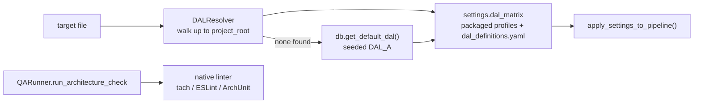

# C-VAL-03 — Dynamic Risk-Based Rulesets (DAL)

**Status**: APPROVED · **Phase**: 3 · **Feature ID**: 3.20b

| | |
|---|---|
| Standards | DO-178C / ISO 26262 risk-based testing |
| Outsources | Freedom-from-Interference (FFI) boundary checks to native linters (Tach, ArchUnit, ESLint) |
| Proof ticket | `TECH-041` |

## What it does

Supports "Mixed Criticality" systems: some modules need aerospace-grade validation (DAL A), others
are basic startup scripts (DAL E).

- Each module declares its tier in `context.yaml`.
- "Fractal Resolution" finds the tier per file: the nearest declaration at or above it.
- A project's `.specweaver/dal_definitions.yaml` deep-merges over the standard corporate safety
  matrix to override execution profiles.
- FFI boundary checks run through the native linter of each language.

## Architecture

| Part | Lives in (as planned; see plans for moves) |
|---|---|
| `DALLevel` enum | `src/specweaver/commons/enums/dal.py` (moved there from `config/dal.py` in SF-05) |
| Impact matrix + deep merge | `src/specweaver/config/settings.py` |
| `DALResolver` (O(1) cached directory walk) | `src/specweaver/config/dal_resolver.py`, called from `flow/_validation.py` |
| `default_dal` column | `config/_schema.py` (`SCHEMA_V13`) |
| HARA proposal | `src/specweaver/drafting/decomposition.py` + `feature_drafter.py` |
| Polyglot FFI adapters | `src/specweaver/loom/commons/qa_runner/{language}/runner.py` |

The generic `run_architecture_check` interface came from 3.20a; SF-05 adds the Java and TS adapters.

The first layout — `DALLevel(str, Enum)` in `src/specweaver/validation/models.py`, a `resolve_dal()`
walker in `src/specweaver/validation/pipeline.py`, merge via `pydantic-settings` — was replaced by
the table above: `config` sits below `validation`, so the enum and resolver cannot live there
without a cycle, and Pydantic has no native deep merge.

**Since moved** (noted 2026-09-25): `DALResolver` → `src/specweaver/core/config/dal_resolver.py`;
`decomposition.py` → `src/specweaver/workflows/planning/`; the QA runner factory →
`src/specweaver/sandbox/qa_runner/core/factory.py`.

## External dependencies

| Tool | Min Version | Key API Surface | Compat Confirmed | Notes |
|------|------------|----------------|-----------------|-------|
| pydantic | 2.12 | `deep_merge=True` | Yes | Config merging and schema enforcement. SF-01 found no native `deep_merge=True`; a custom `deep_merge_dict()` is used. |
| Native Linters | Any | `QARunner` Interface | Yes | ArchUnit (Java), ESLint (TS), Tach (Python) handle FFI constraints. |

## Decisions

| # | Decision | Rationale | Architectural Switch? |
|---|----------|-----------|----------------------|
| AD-1 | **Override vs Replace** | A project's `dal_definitions.yaml` MUST be deep-merged over the SpecWeaver defaults, never replace them. Otherwise a team can delete 14 critical safety checks by omission. | No |
| AD-2 | **Deterministic Rules vs LLMs** | DAL FFI validation MUST be 100% deterministic (Tach, ArchUnit). An LLM in validation disqualifies the pipeline from ISO 26262 / DO-178C compliance. | No |
| AD-3 | **Outsourcing Polyglot FFI** | SpecWeaver orchestrates, it does not execute. It translates `context.yaml` boundaries into native linter configs (e.g. `ArchUnit`) and runs them via `QARunner` — no polyglot AST parser. | Yes — approved by user on 2026-04-04 |
| AD-4 | **Generative HARA Governance** | Agents propose a module's DAL using HARA (data/topology heuristics); a human architect approves via HITL before it is committed to `context.yaml`. | No |

## Functional Requirements

| # | FR | Actor | Action | Outcome |
|---|-----|-------|--------|---------|
| FR-1 | Assignment | Module | Declares `operational.dal_level: DAL_<X>` in its `context.yaml` | A module's risk tier lives next to the module, in the file that already describes it |
| FR-2 | Governance | Agent, then Architect | Proposes a DAL per component during decomposition, for a human to approve | A criticality rating is always *proposed explicitly* and never arrived at by omission |
| FR-3 | Resolution | `ValidationRunner` | Resolves the applicable DAL by walking up the directory tree per target file | A tier declared once at a boundary governs everything beneath it — nobody annotates every file |
| FR-4 | Impact Matrix | Project | Supplies `.specweaver/dal_definitions.yaml`, deep-merged over the standard domain profiles | Rules can be augmented or disabled (`Rule_X: null`) without forking the packaged matrix |
| FR-5 | FFI Isolation | `QARunner` | Runs the native boundary linter against the target project and merges its findings with per-file `forbids` | Cross-boundary isolation is outsourced to tools that already do it, and both sources are reported as one |

The FR table replaced prose `**FR1 …**` bullets on 2026-08-17 (`specweaver-dev` §3.2c, from
`INT-US-25-SF01-MIG`): `check_fr_coverage.py` and `check_fr_sweep.py` only read `| FR-N |` rows.
Wording preserved.

## Non-Functional Requirements

Kept as bullets, not `| NFR-n |` rows: a table row would enter the NFR sweep, and none of these
has a cited test yet.

- **NFR1:** LLMs are forbidden in the FFI validation loop (must stay deterministic).
- **NFR2:** Deep merges are schema-validated after the merge, so no rule is silently corrupted
  (Semantic Ambiguity).
- **NFR3:** The Polyglot mandate: `dev_guides` must enforce native boundary linters for all newly
  supported languages.

## Proof

Mutation kills: FR-1 and FR-3 fail 17 files each; FR-5 fails 15; FR-4 fails 1.

- **FR-2** — the teeth are the *required* `proposed_dal` on `ComponentChange`. A `default=DALLevel.DAL_E`
  mutant passed the whole suite: `DAL_E` is the **lowest** tier, so an omitted field would rate every
  component least-critical with no architect shown a proposal.
  `test_a_component_without_a_proposed_dal_is_rejected` closes it. A default is not neutral when the
  field is a risk tier. Its unit citation asserts the proposal is made, which is where the behaviour
  lives.
- **FR-3** — mutant: stop the walk at the target's own directory. The resolver still works for any
  directory declaring its own tier and silently strips inheritance from most of the tree.
- **FR-1, FR-3** — e2e.
- **FR-4** — `test_dal_merge.py` only proved the override parses (`is_enabled("S01") is False`).
  `tests/integration/core/flow/handlers/test_dal_definitions_disable_a_rule.py` proves the rule
  stops running: the same module validates against 10 rules with no file and 9 with one disabling
  `C08`. Mutating either end (project file never read; tier constraints never merged) fails it.
  One test is thin for a requirement that can **disable** rules in a safety matrix; recorded as thin.
- **FR-5** — `test_tach_and_forbids_merged` patches `_run_tach_check`, which mocks the claim itself.
  `tests/integration/sandbox/language/test_boundary_linter_merge.py` runs real `tach` over a real
  project beside a real `forbids` entry and asserts both kinds of finding return from one call.
  Dropping either source, or skipping the linter, fails it.

Added 2026-08-19 under `TECH-041`: *"`C-VAL-03` is `✅` and its DAL override is proven link by link,
never as a chain."*

## Sub-features

| SF ID | Name | Description | Status |
|:---|:---|:---|:---|
| **SF-01** | DAL Schema & Pydantic Impact Matrix Merge | `DALLevel` enum; deep-merge `dal_definitions.yaml` over base profiles. | [x] Complete |
| **SF-02** | Fractal Resolution Engine | `O(1)` cached directory walk in `ValidationRunner` mapping each target file to its closest `context.yaml` DAL. | [x] Complete |
| **SF-03** | Validation Override Consolidation (Cleanup) | Drop the legacy SQLite `validation_overrides` tables; resolve only through DAL impact matrices and rule sub-pipeline inheritance. | [x] Complete |
| **SF-04** | Generative HARA (AI Governance Proposal) | `/design` scaffolding: LLMs analyze topological edges/data to propose a DAL, requiring HITL approval. | [ ] Pending |
| **SF-05** | Polyglot Architecture Configs | Concrete adapters (`JavaRunner` -> ArchUnit, `TypeScriptRunner` -> ESLint) that generate their config from `context.yaml` constraints and the active DAL string. | [x] Complete |

## Progress Tracker
- [x] Requirements Finalized
- [x] SF-01 Implementation Plan ✅
- [x] SF-01 Implementation
- [x] SF-02 Implementation Plan ✅
- [x] SF-02 Implementation ✅
- [x] SF-03 Implementation Plan ✅
- [x] SF-03 Implementation ✅ (Dev ✅, Pre-Commit ✅, Committed ✅)
- [x] SF-04 Implementation Plan ✅
- [x] SF-04 Implementation ✅ (Pre-Commit ✅, Committed ✅)
- [x] SF-05 Implementation Plan ✅
- [x] SF-05 Implementation ✅ (Dev ✅, Pre-Commit ✅, Committed ✅)
