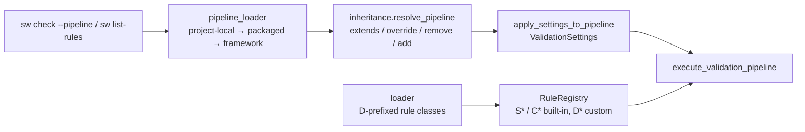

# D-VAL-02 — Custom Rule Paths

**Status**: ✅ Delivered — this document is a **record**, not a plan. · **Epic**: Topic 05
(Validation) · **Legacy**: 3.4 · **Feature ID**: D-VAL-02

Created 2026-08-17 under `INT-US-25-SF01-MIG`. The capability shipped with an implementation plan and
**no design document**, so no requirement existed in the ledger's form and neither sweep had anything
to count.

## What it does

The validation battery stops being a fixed list. A project declares its own pipelines in YAML, inherits
from packaged ones with `extends` / `override` / `remove` / `add`, drops its own `D`-prefixed rule
classes into a directory, and overrides all of it locally — without changing SpecWeaver.

Why: a project's assurance rules are the project's business. Adopting SpecWeaver should not mean
adopting its opinions.

## Architecture

| Component | Does |
|---|---|
| `ValidationPipeline` / `ValidationStep` | the validation sub-pipeline model — separate from the orchestration `PipelineStep` |
| `inheritance.resolve_pipeline` | flattens `extends` / `override` / `remove` / `add` |
| `pipeline_loader` | three-tier lookup: project-local → packaged → framework plugin |
| `loader` | discovers and registers custom rule classes |
| `sw list-rules`, `--pipeline` | list rules; choose a pipeline |
| `apply_settings_to_pipeline()` | bridges stored settings onto a resolved pipeline |

**Complete:** 10 components, 2181 tests at delivery. Build detail: the
[implementation plan](D-VAL-02_implementation_plan.md).

## Functional Requirements

Written 2026-08-17 under `specweaver-dev` §3.2c, on contact from `INT-US-25-SF01-MIG` — from why the
capability exists, not from an inventory of its modules. Each is behind a killed mutant.

| # | FR | Actor | Action | Outcome |
|---|-----|-------|--------|---------|
| FR-1 | A pipeline can be defined by difference | Project | Declares `extends` with `override`, `remove` and `add` against a packaged pipeline | A project states what it wants *changed*, instead of restating a whole battery to alter one step |
| FR-2 | A cyclic `extends` chain is refused | System | Resolves a pipeline whose inheritance loops | The chain is reported by name, rather than recursing until the interpreter stops it |
| FR-3 | A project's own rules run | Project | Drops `D`-prefixed rule classes into a rules directory | Rules SpecWeaver has never seen are discovered, validated and registered |
| FR-4 | Stored settings reach the resolved pipeline | System | Applies `ValidationSettings` onto a pipeline | A rule disabled or re-thresholded in settings is disabled or re-thresholded in the run — the two configuration systems agree |
| FR-5 | The project's copy wins | Project | Places `<name>.yaml` in `.specweaver/pipelines/` | The local definition takes precedence over the packaged and framework ones, so an override is a file rather than a fork |

**Mutant reach** (test files failed by each FR's mutant):

| FR | Files | Note |
|---|---|---|
| FR-1 | 71 | Widest in the whole migration. Disabling `remove` alone breaks the packaged pipelines that build themselves by inheritance, and almost every validation path runs through one. The load-bearing beam. |
| FR-4 | 20 | |
| FR-5 | 13 | |
| FR-3 | 4 | |
| FR-2 | 3 | Narrowest — and the only guard against a stack overflow in a user-supplied file |

The topic entry lists ten components as equals. This spread shows they are not.

## Non-Functional Requirements

None declared. No threshold for this capability is recorded anywhere in the repository; inventing one
now would add a row nothing checks. Stated rather than left blank, per §3.2c.
