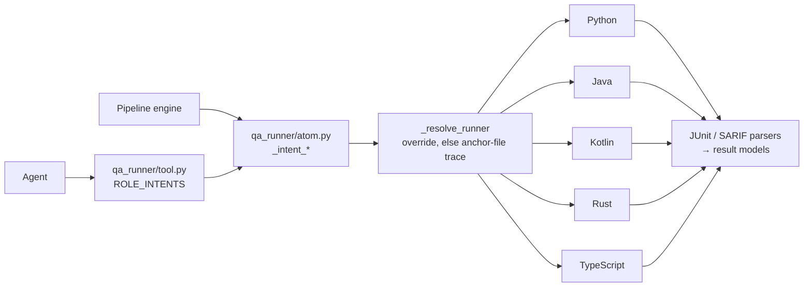

# D-VAL-03 — Polyglot QARunner Interface

**Status**: APPROVED · **Phase**: 3 · **Feature ID**: 3.19

| | |
|---|---|
| Languages | Python, Kotlin, Java, Rust, TypeScript (React) |
| Used by | Atoms (engine-internal rules) and Tools (agent-facing actions) |
| Protocols | JUnit XML (tests), SARIF (lint, compile), DAP `OutputEvent` (debug) |

## What it does

Turns `QARunnerInterface` from Python-only into a polyglot runner. One runner per language wraps
that language's tooling (`cargo`, `gradlew`, `mvn`, `npm`/`jest`, `pytest`).

- Five intents: test, lint, complexity, **compile**, **debug**.
- Results parse into `TestRunResult`, `LintRunResult` and `ComplexityRunResult` via JUnit XML and
  SARIF.
- Compiler and debugger stderr goes back to the LLM agent the same way.
- Agents trigger `compile` and `debug` themselves through the tool
  (`src/specweaver/loom/tools/qa_runner/tool.py`), just as the pipeline engine does through atoms.

## Architecture

Starting point: `PythonQARunner` (`src/specweaver/loom/commons/qa_runner/python.py`) called `pytest`
and `ruff` directly. New modules (`rust.py`, `java.py`, `kotlin.py`, `typescript.py`) in
`src/specweaver/loom/commons/qa_runner/` implement the expanded interface; SF-04 splits each into a
package (`java/runner.py`, `java/parsers.py`).

**Runner resolution.** `_resolve_runner` picks the runner and build-tool variant:

1. an explicit override in the target directory's `context.yaml` or the Database Config;
2. else **target-aware structural tracing** — scan up from the file or directory being run for an
   anchor file. `src/native/rust_lib.rs` → nested `Cargo.toml` → Rust Cargo runner;
   `tests/test_py.py` → root `pyproject.toml` → Python runner.

This supports mixed workspaces, such as Python projects with Rust extensions.

**CLI patterns.** The runners MUST run exactly these (JUnitParser / SARIF-tools parse the outputs):

| Toolchain | Compile | Test | Lint |
|---|---|---|---|
| Rust (Cargo) | `cargo build` | see below | `cargo clippy --message-format=json` |
| Java/Kotlin (Gradle) | `gradlew classes` / `gradlew assemble` | `gradlew test` (JUnit in `build/test-results/test/`) | `gradlew detekt --report sarif...` / `gradlew pmdMain` (SARIF plugin) |
| Java/Kotlin (Maven) | `mvn compile` | `mvn test` (JUnit in `target/surefire-reports/`) | `mvn detekt:check` (SARIF) / `mvn pmd:pmd` (SARIF) |
| TypeScript (NPM) | `tsc --noEmit` or `npm run build` | `jest --reporters=default --reporters=jest-junit` | `eslint -f sarif -o eslint.sarif` |

Rust test: `cargo test -- --format=json | cargo2junit > junit.xml`. The pipe breaks the sandbox's
no-pipes rule, so SF-03 runs `cargo2junit` as a separate subprocess.

Blueprint references: none stated.

## Decisions

| # | Decision | Rationale | Architectural Switch? |
|---|----------|-----------|----------------------|
| AD-1 | Dedicated Package Sub-Modules | Run logic, parsers and interfaces in per-language folders (e.g. `java/runner.py`, `java/parsers.py`) prevent God-class bloat as lint/test logic diversifies. | Yes |
| AD-2 | E2E Subprocess Mocking | Mocked subprocess outputs let the full runner battery be tested on a Python-only local machine or CI. | No |

## Functional Requirements

| # | FR | Actor | Action | Outcome |
|---|-----|-------|--------|---------|
| FR-1 | Unified Interface Refactor | System | Update `interface.py` | The bounds encompass Test, Lint, Complexity, **Compile**, and **Debug** — every runner implements all five or is not a runner. |
| FR-2 | Agent-facing Tools | Agent | Update `qa_runner/tool.py` | LLM agents gain permissioned access to trigger `compile()` and `debug()` through the Loom Sandbox, with the same Black Box resolution patterns. |
| FR-3 | Python Support | System | Align `PythonQARunner` | Python executes tests, linting, complexity, compiling, and debugging by conforming to the new unified data models. |
| FR-4 | Rust Support | System | Build `RustRunner` | Rust executes tests, linting, compiling, complexity via `cargo` wrappers mapping to generic bounds. |
| FR-5 | Java Support | System | Build `JavaRunner` | Java executes tests, compilation, linting via Maven (`mvn compile/test/pmd`) and Gradle, mapping outputs. |
| FR-6 | Kotlin Support | System | Build `KotlinRunner` | Kotlin executes tests, compilation, complexity via Gradle/Maven and `detekt` pushing SARIF maps. |
| FR-7 | TypeScript Support| System | Build `TypeScriptRunner`| TS executes tests, compiling, linting/complexity via `tsc`, `jest-junit` and `eslint` SARIF formatters. |

Two rows changed on 2026-08-17 (`INT-US-03-SF01-MIG`):

- **FR-8 (E2E Testing) deleted.** "Every runner class must be rigorously tested" is about the test
  suite, not the product. Its negation is an absent test, which `check_fr_coverage.py` already
  refuses at closure. The obligation lives in the gate.
- **FR-1's second clause struck** — see Risks. It claimed *"the Data Models are expanded to support
  `stacktrace: str`, `rule_uri: str`, etc."* A clause about fields that are declared but never
  populated cannot be falsified by any mutant (deleting the field breaks no caller), which under
  §3.2c is worse than silence. **The remaining clause is strongly proven**: renaming `run_compiler`
  on the abstract base fails 228 tests and 11 collections.

## Non-Functional Requirements

| # | NFR | Threshold / Constraint |
|---|-----|----------------------|
| NFR-1 | Performance | Parsers MUST resolve external CLI results securely and within the defined timeout bounds. |
| NFR-2 | Testability | Tests for all 5 runners MUST mock subprocess shell executions, so CI needs no Java/Rust/Node install. **[proof: meta — rule about tests, docs or the diff]** |
| NFR-3 | Graceful Degradation | If a runner cannot parse a SARIF/JUnit file (e.g., compile error prevented generation), it MUST dump the raw stderr into a generic `TestFailure` block instead of crashing the flow engine, feeding compile failures straight to the LLM agent. |

## External Dependencies

| Tool | Min Version | Key API Surface | Compat Confirmed | Notes |
|------|------------|----------------|-----------------|-------|
| `junitparser` | 3.1.2| `JUnitXml.fromfile()` | Yes | Required for test parsing |
| `sarif-tools` | 1.0.0| `SARIF` schema models | Yes | Required for linting logs |

## Risks

**`stacktrace` and `rule_uri` are declared and never written.** `TestFailure`, `LintError` and
`DebugRunResult` in `commons/qa.py` each declare one or both, defaulted to `""`. No assignment to
`stacktrace=` or `rule_uri=` exists in `src/` or `tests/`. `arbiter.py` reads
`f.get("stacktrace", "")` and so always reads the empty string.

`rule_uri` is the substantive half. FR-5, FR-6 and FR-7 promise SARIF (`pmd:pmd
-Dpmd.format=sarif`, `detekt`, eslint's SARIF formatter), and `sandbox/language/core/sarif.py` parses
it — each `LintError` from `ruleId`, the message and the physical location. It never reads the rule
descriptor's `helpUri`, the link that makes a finding *actionable*. The pipeline asks for SARIF,
receives the URI, and drops it.

Populating `rule_uri` from `helpUri` is a real improvement and is **not ticketed here**: it changes
what agents receive in a lint report, which is a scope decision.

## Sub-features

| SF | Does | FRs | Depends on | Plan |
|----|------|-----|-----------|------|
| SF-01 | Core Interface, Compilers & Python/TS Handlers. `interface.py` and `qa_runner/tool.py` gain stacktrace/SARIF bounds and `compile`/`debug`; aligns `PythonQARunner`; adds `TypeScriptRunner`. Inputs: polyglot parameters simulating agents requesting builds/tests. Outputs: compile/debug/test/lint/complexity runners validated against mock JUnit/SARIF files. | FR-1, FR-2, FR-3, FR-7, FR-8 | — | [sf01](D-VAL-03_sf01_implementation_plan.md) |
| SF-02 | JVM Handlers (Java & Kotlin). `JavaRunner` and `KotlinRunner` over Gradle (`gradlew`), Maven (`mvn`), detekt and PMD. Validated with mock JVM fail/pass payloads. | FR-5, FR-6, FR-8 | SF-01 | [sf02](D-VAL-03_sf02_implementation_plan.md) |
| SF-03 | Rust Handler. `RustRunner` over Cargo and Clippy, mapping `cargo build` exits to the generic bounds. | FR-4, FR-8 | SF-01 | [sf03](D-VAL-03_sf03_implementation_plan.md) |
| SF-04 | Polyglot Submodule Architecture Refactor — see below. Input: the unified runner files. Output: per-language package modules. | FR-1 | SF-02, SF-03 | [sf04](D-VAL-03_sf04_implementation_plan.md) |

SF-04 scope:

- Split the god-classes (`java.py`, `kotlin.py`, `rust.py`) into package submodules
  (`java/runner.py`, `java/parsers.py`); move their unit and integration tests into
  `tests/unit/.../java/`.
- **Rewrite `_parse_detekt_complexity` and `_parse_pmd_complexity` to read structural SARIF
  properties instead of regex scraping**, which breaks on compiler upgrades.
- **Evaluate and backfill E2E and unit test gaps across the Java/Kotlin/Rust handlers** for full
  parity and structural coverage.

The FR-8 cells record the original ownership; FR-8 has since been deleted (above).

Execution order:

1. SF-01 (Core Interface, Compilers & Python/TS)
2. SF-02 (JVM Handlers) and SF-03 (Rust Handler) in parallel (both depend only on SF-01)
3. SF-04 (Polyglot Submodule Architecture Refactor)

## Progress Tracker

| SF | Name | Depends On | Design | Impl Plan | Dev | Pre-Commit | Committed |
|----|------|-----------|--------|-----------|-----|------------|-----------|
| SF-01 | Core Interface & Python/TS | — | ✅ | ✅ | ✅ | ✅ | ✅ |
| SF-02 | JVM Handlers (Java & Kotlin)| SF-01 | ✅ | ✅ | ✅ | ✅ | ✅ |
| SF-03 | Rust Handler | SF-01 | ✅ | ✅ | ✅ | ✅ | ✅ |
| SF-04 | Submodule Refactoring | SF-02, SF-03 | ✅ | ✅ | ⬜ | ⬜ | ⬜ |

**Next**: SF-04 Dev ([plan](D-VAL-03_sf04_implementation_plan.md)).
