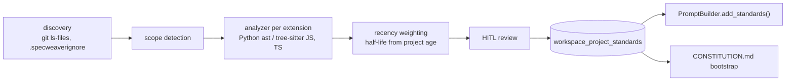

# E-VAL-02 — Auto-Discover Standards

**Status**: ✅ Delivered — this document is a **record**, not a plan. · **Epic**: Topic 05
(Validation) · **Legacy**: 3.5 · **Created**: 2026-08-17 under `INT-US-01-SF03-MIG` — the capability
shipped with an implementation plan and **no design document**, so none of its requirements existed
in the ledger's form.

Plan: [E-VAL-02_implementation_plan.md](E-VAL-02_implementation_plan.md)

## What it does

`sw standards scan` reads a project's own code and derives the conventions it follows — naming,
error handling, type hints, docstring style, test patterns, import patterns — for Python, JavaScript
and TypeScript.

- Results are stored per project *and per scope* in `workspace_project_standards`.
- They are injected into generation prompts through `PromptBuilder.add_standards()`.
- `CONSTITUTION.md` bootstrap is the human-readable side of the same data.

**Why:** mimicry over instruction. An agent writing into an existing codebase should match it, and
nobody should have to write the conventions down first.

This record first named the command `sw scan --standards`; the code has a separate `sw standards scan`
(`sw scan` stays context.yaml-only).

Delivered in four sub-phases (Python analyzer; scanner + CLI + DB; JS/TS analyzers; constitution
bootstrap), 2774 tests at delivery.

## Architecture

Module layout, file-discovery chain and scope resolution: see the plan.

## Functional Requirements

Written 2026-08-17 under `specweaver-dev` §3.2c, on contact from `INT-US-01-SF03-MIG`, from **why
the capability exists** — the agent should write code that looks like this project's, and learn that
by reading rather than being told — not from an inventory of modules. Each is behind a killed mutant.

| # | FR | Actor | Action | Outcome |
|---|-----|-------|--------|---------|
| FR-1 | Read the code that represents the project | System | Discovers source files, preferring what git tracks, and honours `.specweaverignore` | Vendored, generated and ignored code cannot teach the agent conventions the project does not hold |
| FR-2 | Derive conventions per language | System | Routes each file to the analyzer for its extension and extracts by category | Python, JavaScript and TypeScript each yield their own standards rather than one averaged set |
| FR-3 | Recent code counts for more | System | Weights each file by age against a half-life derived from the project itself | A convention the project has moved away from does not outvote the one it moved to |
| FR-4 | Conventions are scoped, not global | System | Detects scopes and stores standards per scope | A monorepo's modules keep their own style instead of being flattened into a house average |
| FR-5 | Discovered standards persist | System | Upserts each `(project, scope, language, category)` into `workspace_project_standards` | A later run reads the standards back with their content and confidence, rather than rediscovering them |
| FR-6 | The agent is told, without being asked | Engine | Injects stored standards into the generation prompt | Conventions reach the model that writes the code — discovery nothing consumes is inert |
| FR-7 | A project with nothing to learn from still gets guidance | System | Falls back to built-in defaults when extraction yields nothing and the mode is `best_practice` | A greenfield project is given good practice instead of silence |

## Non-Functional Requirements

None declared. No measured threshold is recorded anywhere in the repository, and inventing one now
would add a row nothing checks. Stated rather than left blank, per §3.2c.

## Proof

| FR | Mutant | Fails |
|---|---|---|
| FR-1 | `.specweaverignore` no longer applied — discovery swells with everything the project excluded | 41 test files (the widest) |
| FR-4 | no scopes detected — every standard collapses to one bucket | 27 |
| FR-5 | store `json.dumps({})` instead of the discovered content — the row is still written, counted and has its confidence, but carries nothing | 4 files |

**FR-5 needed a second mutant.** The first removed `await self.session.flush()` from
`upsert_standard`, and the suite passed: an **equivalent mutant** — the session commits later anyway,
so the probe changed no behaviour. A test that counts rows cannot tell a populated standard from an
empty one; stopping at the first mutant would have misreported a coverage gap.
