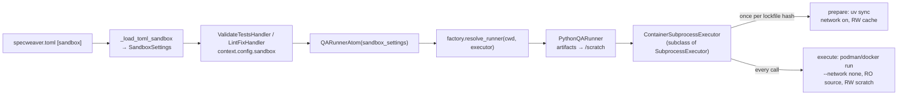

# B-EXEC-01 — Ephemeral Podman Sub-Containers

**Status**: APPROVED. **COMPLETE** — SF-01..SF-04 committed (`68c34359`, `7e31ea9b`, `8046f12c`,
`a2143124`). · **Phase**: Design · **Feature ID**: B-EXEC-01

| | |
|---|---|
| Delivers | US-9 Zero-Trust Sandbox Sub-Story Add-On: Containerized Isolation |
| Routes | `QARunnerAtom` (US-3 Core / `D-VAL-01`, `D-VAL-03`) |
| Touches | `sandbox.qa_runner` (atom/factory/interface + language runners), `sandbox.execution` (new executor beside `SubprocessExecutor`), `core.config` (new `[sandbox]` section) |
| Reuses | `SubprocessExecutor`, `WorkspaceBoundary`, `D-EXEC-01` Podman/Docker CLI conventions |
| Used by (future) | `E-EXEC-02` (Air-Gapped Network Egress Control), `A-EXEC-01` (Extreme Execution Paranoia / Black Box Ledgers) — may attach to the `ContainerSubprocessExecutor`/mount contract; not sub-features, no work exists |
| Not touched | `C-EXEC-02`'s `BashActionAtom` (host-side `.specweaver/scripts/`), the `sw serve` deployment container, the filesystem/git/code_structure/mcp tool families |

Standalone capability, not an integration contract. `INT-US-09` (the Base Integration Contract for
US-9, integrating `US-5 Core` + `E-EXEC-01` + `C-EXEC-02` per `master_story_roadmap.md`'s Core
Required list) is separate and not designed. This work was first built under a mis-scoped
`INT-US-09 SF-01` label and re-homed here with no code changes.

## What it does

Runs QA Runner execution (tests, lint, complexity, compile, architecture check) inside an
ephemeral Podman/Docker container instead of on the host. The source tree is mounted read-only; a
separate scratch volume is the only writable place, for test artifacts.

Opt-in: `execution_mode` defaults to `"host"` (`execution_mode: host`), so bare-host installs and CI
keep working unchanged. Once set to `"container"`, a missing engine fails
the run with an actionable error — never a silent fallback to host.

## Why

LLM-generated test/lint code is a Remote Code Execution exposure. Without this feature
`QARunnerAtom` resolves a language runner (`PythonQARunner`) that shells out via
`SubprocessExecutor` against the host `cwd` with full read/write access, so untrusted code can read
or corrupt anything the SpecWeaver process can reach. `E-EXEC-01`'s design names closing this "the
foundational prerequisite for US-9". A container with RO source and RW scratch bounds the blast
radius.

**Why not `D-EXEC-01`'s container.** The repo-root `Containerfile`/`compose.yaml` containerize the
whole `sw serve` process (one long-lived container, project bind-mounted read-write at
`/projects`). No podman/docker Python SDK is in `pyproject.toml` or `src/`;
`workspace/project/scaffold.py` has no container scaffolding. B-EXEC-01 is a new, separate
ephemeral mechanism that reuses D-EXEC-01's CLI/image conventions, not its Containerfile or
compose flow.

**Why no Python SDK.** `podman-py` and `docker-py` are maintained, but a second client library
adds nothing over the CLI: `SubprocessExecutor` invokes either engine with an identical flag set.
An SDK means two divergent socket/auth paths, and `podman-py`'s maintainers flag incomplete
docker-py drop-in compatibility. `pyproject.toml` is unchanged.

No external blueprint in `docs/ORIGINS.md` — an original SpecWeaver design. `ORIGINS.md`'s
"Archon" entries concern git-worktree isolation (`D-EXEC-02`), a different capability.

## Architecture

| Part | Lives in | SF |
|---|---|---|
| `ContainerSubprocessExecutor`, `ContainerEngineUnavailableError` | `sandbox/execution/container_executor.py` | SF-01 |
| `ContainerMounts` | `sandbox/execution/models.py` | SF-01 |
| DI seam: `resolve_runner(executor=)`, `QARunnerAtom(sandbox_settings=)` | `sandbox/qa_runner/core/{factory,atom}.py` | SF-02 |
| Artifact redirection, tach pre-check skip | `sandbox/language/core/python/runner.py` | SF-02 |
| `SandboxSettings` + `[sandbox]` loader | `core.config` | SF-02, SF-03 |
| Handler wiring, `.gitignore` scaffold, `Containerfile.sandbox` | `core/flow/handlers`, `workspace/project/scaffold.py`, repo root | SF-04 |

**The swap point.** `QARunnerAtom` resolves a `QARunnerInterface` via `factory.resolve_runner(cwd)`
and dispatches by `intent` (`run_tests`, `run_linter`, `run_complexity`, `run_compiler`,
`run_debugger`, `run_architecture_check`); it never touches subprocess. Every `PythonQARunner`
method builds an argv and calls `self._executor.execute(cmd, timeout_seconds=...)` exactly once,
and its constructor already takes `executor: SubprocessExecutor | None = None`. Routing goes in
there without touching result parsing (`TestRunResult`, `LintRunResult`, ...).

**`SubprocessExecutor`** is the mandated subprocess boundary
(`.execute(cmd, *, timeout_seconds=None, extra_env=None, cwd_override=None, input_text=None) -> SubprocessResult`).
It owns timeout handling (SIGTERM→grace→SIGKILL), env-var allowlisting, credential stripping and
path containment (`_validate_cwd`). It has no container concept; its limits are OS-level
(`rlimit`/Win32 Job Objects via `PlatformLimiter`). All spawning still goes through it — with a
`podman`/`docker run ...` argv.

**House-style precedent — `C-EXEC-02`'s `BashActionAtom`**
(`src/specweaver/sandbox/execution/core/atom.py`): builds its own `SubprocessExecutor` per call with
`ResourceLimits(max_memory_bytes=2_147_483_648, max_processes=128)`, reuses
`WorkspaceBoundary.validate_path()`, and lives in its own submodule (`execution/core/`) with its own
`context.yaml` rather than modifying `execution/executor.py`. Its design names `B-EXEC-01` as the
future consumer of this swap point. B-EXEC-01 likewise wraps `SubprocessExecutor`, not rewrites it.

**Boundaries.**
- Anti-patterns (`docs/architecture/06_lessons_and_future/anti_patterns.md`): "Putting
  tool-consuming code in `commons/`" and "Creating parallel security classes (e.g.
  `WorkspaceBoundary`)". So the new component lives in the already-`sandbox`-internal, tach-exposed
  `execution` module and reuses `WorkspaceBoundary`/`ResourceLimits`.
- `tach.toml`, `docs/architecture/03_system_topology/hard_dependency_rules.md`: only `core.flow`
  reaches into `sandbox`, only via atoms. Within `sandbox`, `commons`-tier leaves forbid
  `tools`/`atoms`. `sandbox` already `depends_on` `specweaver.core.config`, so a `[sandbox]` config
  section is legal. `execution` is already exposed; no new `[[interfaces]]` entry.

**External dependencies** — no new Python package:

| Tool | Min Version | Key API Surface | Notes |
|------|------------|----------------|-------|
| Podman CLI | 4.0 | `run --rm --read-only --tmpfs --pids-limit --network none -v SRC:/workspace:ro -v SCRATCH:/scratch:rw --cap-drop ALL --security-opt no-new-privileges --user UID:GID IMAGE ...` | Preferred (AD-6): rootless, no shared root daemon, smaller default capability set. [Podman docs](https://docs.podman.io/en/latest/markdown/podman-run.1.html) |
| Docker CLI | 20.10 | Same flag surface (`docker run` is flag-compatible with `podman run` here) | Supported fallback; `dockerd` runs as root — a weaker boundary, documented. [Docker run reference](https://docs.docker.com/reference/cli/docker/container/run/) |

Compatibility confirmed for both.

## Decisions

| # | Decision | Architectural Switch? |
|---|----------|----------------------|
| AD-1 | `ContainerSubprocessExecutor` **subclasses** `SubprocessExecutor` (flat under `sandbox/execution/`); `execute()` wraps `cmd` into a `podman`/`docker run` argv and delegates to `super().execute(wrapped_cmd, ...)` for spawn, timeout, env stripping and result. | No |
| AD-2 | `factory.resolve_runner(cwd)` and `QARunnerAtom.__init__` gain an optional sandbox-mode parameter (from `[sandbox]` config) that injects `ContainerSubprocessExecutor` instead of the host `SubprocessExecutor`. | No |
| AD-3 | Reuse `WorkspaceBoundary` for source-root and scratch-root containment. | No |
| AD-4 | Reuse `BashActionAtom`'s `ResourceLimits` values (2 GiB memory / 128 processes) as the container's default ceiling. | No |
| AD-5 | Redirect pytest/coverage/lint artifacts (`.pytest_cache`, `.coverage`, `--junitxml`, `PYTHONDONTWRITEBYTECODE=1`) to the scratch mount via env/CLI flags at the `PythonQARunner` call site. | No |
| AD-6 | Prefer rootless Podman when both engines exist; Docker is a supported fallback, documented as weaker (root daemon). | No |
| AD-7 | Toolchain in two phases: **prepare** (network on, `uv sync` from the project lockfile into a persistent project-keyed cache volume) and **execute** (cache RO + source RO, `--network none`). | No |
| AD-8 | Deterministic `--name` (from the run-id); idempotent `podman/docker rm -f <name>` before start and in a `finally` after — not `--rm` alone. | No |
| AD-9 | The QA-execution container is always `--network none`, no exceptions, for every intent. Network happens only in AD-7's prepare phase, never in the container running LLM-generated code. | No |

Why each:

- **AD-1** — `PythonQARunner.__init__(cwd, executor: SubprocessExecutor | None = None)` is typed to
  the concrete class, not a protocol. A composition-only wrapper could not satisfy that under strict
  mypy without widening a stable signature. Subclassing is Liskov-substitutable here (same result
  contract, different spawn target) and delegates rather than duplicates, so it is not a "parallel
  security class". CLI-via-`SubprocessExecutor` covers the whole flag surface with one code path for
  both engines.
- **AD-2** — `PythonQARunner.__init__(cwd, executor=None)` already has the DI seam; extending the
  call sites is additive and keeps NFR-7.
- **AD-3** — the anti-pattern list forbids parallel security classes.
- **AD-4** — no second, divergent limits schema for the same concern.
- **AD-5** — the source mount is read-only; research named this the top practical gotcha.
- **AD-6** — keeps D-EXEC-01's "supports both" posture, explicit about the security delta.
- **AD-7** — gets the target project's toolchain (pytest/ruff/tach/mypy, etc.) into the container
  without a reinstall per call. The prepare phase runs only trusted, project-declared dependency resolution, never
  LLM-generated code. It is gated by a hash of `uv.lock`/`pyproject.toml` against a stamp file; `uv
  sync` re-runs only when it changes — otherwise every run pays a full reinstall, defeating NFR-1.
  A cache volume, not the host `.venv`, because a Windows/macOS-built virtualenv is
  binary-incompatible with a Linux container base image.
- **AD-8** — `--rm` removes only on graceful exit. On timeout `SubprocessExecutor`'s SIGTERM→SIGKILL
  kills the local CLI client, not the container it spawned. The pre-start `rm -f` clears a
  same-named leftover from a crashed run. This makes FR-8/NFR-6's "guaranteed cleanup" true.
- **AD-9** — resolves the conflict between NFR-3 (default-deny network for untrusted code) and
  AD-7's need for `uv sync` to reach a package index.

Confirmed with user: container mode is opt-in and fails closed; non-root `--user` mapping (NFR-4)
is in scope, not deferred.

## Functional Requirements

| # | FR | Actor | Action | Outcome |
|---|-----|-------|--------|---------|
| FR-1 | Container Routing | QARunnerAtom | The system SHALL route test/lint/complexity/compile/architecture-check execution through a new container-aware executor when `execution_mode: "container"` is configured | Commands run inside an ephemeral Podman/Docker container instead of directly on the host |
| FR-2 | Read-Only Source Mount | Container Executor | The system SHALL bind-mount the project source tree read-only into the container | The container process cannot write to any path under the mounted source root |
| FR-3 | Writable Scratch Mount | Container Executor | The system SHALL bind-mount a dedicated scratch directory read-write into the container, isolated from the source mount | Test artifacts (coverage data, JUnit XML, `.pytest_cache`) are writable only under the scratch path |
| FR-4 | Artifact Path Redirection | PythonQARunner | The system SHALL redirect all known artifact-writing paths (`COVERAGE_FILE`, `--junitxml`, `--cache-dir`/`PYTHONDONTWRITEBYTECODE`) into the scratch mount via explicit CLI/env overrides | No write attempt targets the read-only source mount during a normal run |
| FR-5 | Result Contract Parity | Container Executor | The system SHALL return the container's exit code, stdout, and stderr through the existing `SubprocessResult` contract unchanged | `QARunnerAtom`'s existing parsing logic (`TestRunResult`, `LintRunResult`, etc.) requires no modification |
| FR-6 | Dual-Engine Support | Container Executor | The system SHALL support both Podman and Docker as interchangeable engines, auto-detecting whichever is present on `PATH` (preferring rootless Podman when both are available — see AD-6) | Container mode works on hosts with either engine installed |
| FR-7 | Fail-Closed on Missing Engine | Container Executor | When `execution_mode: "container"` is set but neither a functional `podman` nor `docker` binary is detected, the system SHALL fail the QA run with an actionable error naming the missing engine | The run never silently downgrades to unsandboxed host execution once container mode is explicitly enabled |
| FR-8 | Guaranteed Cleanup | Container Executor | The system SHALL remove the ephemeral container after every execution, including on timeout or crash | No orphaned containers remain after a QA run, verified via `podman/docker ps -a` |
| FR-9 | Opt-In Default | Configuration | The system SHALL default `execution_mode` to `"host"` and only route through the container executor when explicitly configured to `"container"` | Existing installs, CI pipelines, and test suites are unaffected until an operator opts in |

## Non-Functional Requirements

| # | NFR | Threshold / Constraint |
|---|-----|----------------------|
| NFR-1 | Performance | Added container start/stop overhead SHALL NOT exceed 2000 ms per QA invocation on a host with the sandbox image already pulled/cached (warm-image path only; first-pull cost is excluded and documented separately). |
| NFR-2 | Security — mount isolation | The container's root filesystem SHALL be mounted read-only (`--read-only`) except for the explicit scratch bind mount and a `/tmp` tmpfs; no other writable path SHALL exist inside the container. |
| NFR-3 | Security — network egress | Container network SHALL default to `--network none` (no egress) for all QA runs under this contract; any exception (e.g. a configurable, audited network allowlist) is out of scope for B-EXEC-01 and belongs to a separate future capability (`E-EXEC-02`, Air-Gapped Network Egress Control) if one is designed. |
| NFR-4 | Security — privilege | The container SHALL run as a non-root user, with `--cap-drop ALL` and `--security-opt no-new-privileges:true` set unconditionally. |
| NFR-5 | Resource limits | The container SHALL enforce a memory ceiling and a process/pid ceiling. Defaults SHALL match the existing `BashActionAtom` precedent (2 GiB memory, 128 processes) for consistency rather than introducing a new limits schema (see AD-4). A CPU ceiling is intentionally NOT set by B-EXEC-01 — `BashActionAtom` sets none either — and is flagged as a candidate hardening item for any future network/paranoia-focused capability, not silently omitted. |
| NFR-6 | Cleanup guarantee | 100% of ephemeral containers SHALL be removed after execution (success, failure, or timeout) — verified in integration tests by asserting empty `podman/docker ps -a` output after each run. Removal SHALL NOT rely on the `--rm` flag alone (see AD-8). |
| NFR-7 | Backward compatibility | With `execution_mode` left at its default (`"host"`), zero behavior change SHALL occur — all existing QA runner unit/integration/e2e tests SHALL pass unmodified. |
| NFR-8 | Observability | Every containerized QA run SHALL log the resolved engine (`podman`/`docker`), image reference, and mount paths at INFO level. |
| NFR-9 | Error handling | Per FR-7, engine-detection failure in container mode SHALL raise a typed, actionable error (not a bare `SubprocessResult` with a nonzero exit code indistinguishable from a real test failure). |
| NFR-10 | Test tiering | Unit tests for the container executor SHALL mock/stub at the `execute()` boundary (no real container spawn). Integration/e2e tests SHALL be marked `integration`/`e2e` per project convention and SHALL skip (not fail) when no functional container engine is detected on the test-running host; CI SHALL provision a real container engine in at least one job lane so this path is not permanently skipped in practice. **[proof: meta — rule about tests, docs or the diff]** |
| NFR-11 | Platform scope | Native Linux (the CI runner, and the project's upcoming primary dev environment per its Ubuntu migration) is the supported target for FR-2/FR-3's mount/ownership semantics. VM-backed engines (Podman Desktop/Docker Desktop on Windows/macOS) are explicitly best-effort, not a completion blocker for B-EXEC-01, to avoid building throwaway platform-specific shims. **[proof: none — unfalsifiable as written]** |

## Risks

| Risk | Probability | Impact | Mitigation |
|------|-------------|--------|------------|
| Operator enables `execution_mode: container` on a host without podman/docker | Medium | Medium | FR-7/NFR-9 fail closed with an engine-naming error; documented in the dev guide |
| Cross-platform dependency bootstrap adds first-run latency or hits binary-incompatible packages | Medium | Medium | AD-7's persistent cache volume amortizes cost after the first run |
| Host-owned scratch dir vs. the container's non-root UID/GID → permission-denied writes | Medium | Low (fails loud, no silent data loss) | Container is `--user`-pinned to the UID/GID that created the scratch/cache dirs on the host (native Linux) |
| Orphaned containers from a crash mid-run | Low | Low | Deterministic `--name` + idempotent pre-run and `finally` `rm -f` (AD-8) — not `--rm` alone |
| CI never provisions an engine, so the containerized path is always skipped (false confidence) | Medium | High | NFR-10 requires one CI lane with a real engine; integration/e2e tests skip, not silently pass |
| Stale `uv sync` cache: dependencies changed, cache not invalidated | Low | Medium | AD-7's lockfile-hash stamp forces a re-sync when `uv.lock`/`pyproject.toml` changes |

**Known gaps (open):**
- No literal e2e-tier (CLI-invocation) test. Proof is real-Podman integration-tier tests, so the
  roadmap's Proof Mandate is met at integration tier, not literal e2e tier — noted on the roadmap
  status flip.
- A capstone integration test (real pipeline handler → real container → real `pytest`, exercising
  the `uv sync` prepare phase end-to-end) was proposed in SF-04 and declined; worth revisiting.
- `validation_hydrator.py`/`facades.py` still build host-mode `QARunnerAtom` (deliberate scope cut).
- CI provisioning of a real engine and the `Containerfile.sandbox` GHCR publish pipeline are
  unimplemented; `execution_mode: "container"` needs an operator-built image today.

**Follow-ups** (not in scope):

| Existing Feature | Current Issue | Benefit from This Feature | Effort |
|-----------------|---------------|---------------------------|--------|
| `BashActionAtom` (`C-EXEC-02`) | Runs arbitrary `.specweaver/scripts/` bash directly on the host | Could route through `ContainerSubprocessExecutor` for defense-in-depth | Medium (deferred, a future capability) |
| `QARunnerAtom._intent_run_debugger` | Executes an arbitrary entrypoint — arguably higher RCE risk than tests/lint | Same swap point as FR-1; fast-follow candidate. Re-verify `DebugRunResult`/`OutputEvent` streaming first: `SubprocessExecutor.execute()` returns one fully-captured `SubprocessResult`, not a live stream | Low |
| `BashActionAtom`'s hardcoded `ResourceLimits` | Limit values duplicated ad hoc | Extract a shared `ResourceLimits`/`MountSpec` value object for both atoms | Low |

Guide: `docs/dev_guides/subprocess_execution.md` — "Containerized QA Execution" section (DI pattern,
`[sandbox]` flag, engine detection/preference, mount layout). ✅ Done.

## Sub-features

| SF | Does | FRs | Depends on | Plan |
|----|------|-----|-----------|------|
| SF-01 | `ContainerSubprocessExecutor` (`ContainerMounts`, engine detection/liveness caching, deterministic naming + guaranteed cleanup, RO/RW mounts, `--network none`, non-root `--user`, resource limits, the AD-7/AD-9 prepare/execute split) | FR-2, FR-3, FR-5, FR-6, FR-7, FR-8 | — | [sf01](B-EXEC-01_sf01_implementation_plan.md) |
| SF-02 | `factory.resolve_runner`/`QARunnerAtom` DI widening; `PythonQARunner`'s tach pre-check skip, `ContainerEngineUnavailableError` handling, artifact redirection (FR-4) across all 6 methods | FR-1, FR-4 | SF-01 | [sf02](B-EXEC-01_sf02_implementation_plan.md) |
| SF-03 | `SandboxSettings` Pydantic model, `_load_toml_sandbox()` TOML loader, `context.yaml` exposure | FR-9 | SF-02 | [sf03](B-EXEC-01_sf03_implementation_plan.md) |
| SF-04 | `ValidateTestsHandler`/`LintFixHandler` read `context.config.sandbox`; `.gitignore` scaffold for `.specweaver/.sandbox/`; `Containerfile.sandbox` image spec | FR-1, FR-9 | SF-03 | [sf04](B-EXEC-01_sf04_implementation_plan.md) |

Order: SF-01 → SF-02 → SF-03 → SF-04, linear.

## Progress Tracker

| SF | Name | Depends On | Design | Impl Plan | Dev | Pre-Commit | Committed |
|----|------|-----------|--------|-----------|-----|------------|-----------|
| SF-01 | Core Containerized Execution Engine | — | ✅ | ✅ | ✅ | ✅ | ✅ |
| SF-02 | QA-Runner DI Wiring | SF-01 | ✅ | ✅ | ✅ | ✅ | ✅ |
| SF-03 | Sandbox Config Plumbing | SF-02 | ✅ | ✅ | ✅ | ✅ | ✅ |
| SF-04 | Pipeline Handler Wiring & Scaffolding | SF-03 | ✅ | ✅ | ✅ | ✅ | ✅ |
