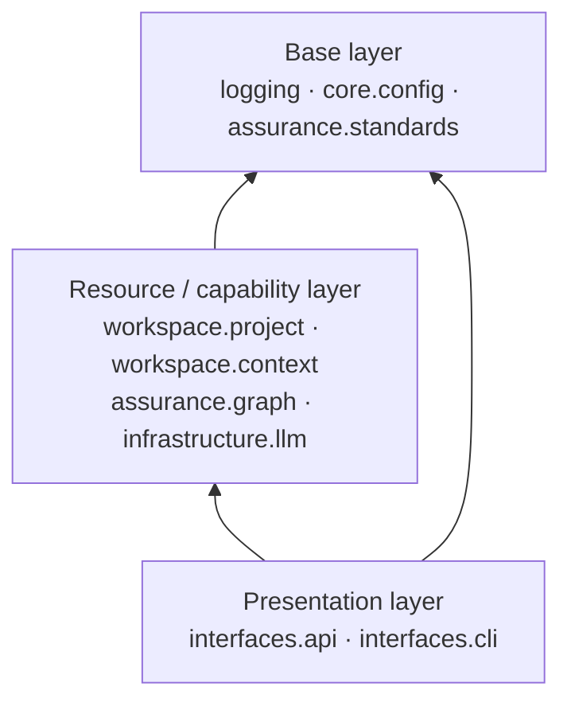

# C-EXEC-01 — Internal Layer Enforcement (Tach)

**Status**: APPROVED. **COMPLETE** — SF-01..SF-08 committed. · **Phase**: 3 · **Feature ID**:
C-EXEC-01 (legacy: Feature 3.20a)

| | |
|---|---|
| Replaces | `__init__.py` re-export encapsulation; `ruff` TID252 tidy-imports as the layer check |
| Used by | validation rule C05 (target projects); `sw scan` (writes the target's `tach.toml`) |
| Related | Feature 3.20b = `C-VAL-03` (native per-language architecture checks) |

## What it does

Adopts `Tach` (a Rust-based Python architectural linter) to enforce a Domain-Driven "Layer Cake"
across `src/specweaver/`: `tach.toml` declares each module, what it may depend on and what it
exposes; `tach check` fails on any forbidden import. For an analysed target project, the same
mechanism runs through rule C05, and `sw scan` writes the target's `tach.toml` from its
`context.yaml` topology.

## Why not ruff + `__init__.py`

`ruff` and `__init__.py` boilerplate cannot guarantee that L3 Capabilities do not depend on L1
Interface modules. A declared layer graph can, and it is checked by a tool rather than by
convention.

## Architecture

Arrows point at what a layer may import. Nothing depends on the presentation layer.

| Part | Lives in |
|---|---|
| Layer graph + `interfaces:` blocks | `tach.toml` (repo root) |
| Enforcement in the suite | `tests/unit/test_architecture.py`; `scripts/quality.py` registers `tach` at the `cb`, `sf` and `feature` gates |
| Target-project check | QA runner `run_architecture_check` → hydrated `qa_architecture_result` → rule C05 |
| Target-project config | `workspace/project/tach_sync.py` (`sync_tach_toml`), called from `sw scan` |

Guards in `test_architecture.py`:

- `test_tach_architectural_boundaries` asserts `returncode == 0`. It replaced a `fail_count <= 95`
  baseline (2026-05-25, `07ce7544`) that let a new cross-layer import pass — verified by mutation,
  `interfaces.cli` imported into `graph.lineage.scanner`, whose `depends_on` is empty. `CLAUDE.md`
  states "No cross-layer imports"; this test is what checks it.
- `test_tach_keeps_runner_soft_deprecated` looks up the `interfaces` block by the `specweaver.`
  path (`source_roots = ["src"]`) and asserts the block was *found*. It had searched for
  `from = "src.specweaver.assurance.validation"`, never matched, and passed unconditionally.

## Decisions

| # | Decision | Rationale | Architectural Switch? |
|---|----------|-----------|----------------------|
| AD-1 | **Standalone Refactor Feature** | Adopting Tach across the core produces large diffs. Folding it into 3.20b breaks single-responsibility and CI green-state reliability, so it is isolated as Feature 3.20a. | No |
| AD-2 | **Replacing `__init__.py`** | Tach `interfaces` mapping defines public module boundaries; the `__init__.py` encapsulation hacks throughout `src/specweaver/` are deleted. | No |
| AD-3 | **Replacing Ruff TID252** | Drop reliance on `ruff` tidy-imports in favour of Domain-Driven layer graphing via `Tach`. | No |

## Functional Requirements

FRs moved from prose bullets (`**FR1:**`) into this table 2026-08-17 under `specweaver-dev` §3.2c,
from `INT-US-01-SF02-MIG`: `check_fr_coverage.py` and `check_fr_sweep.py` read only `| FR-N |` rows.
Wording is preserved. FR-5 is new and covers SF-08. The old FR1 ("`Tach` must be added as a
dev-dependency") is folded into FR-1: removing it only stops `tach check` running, which is FR-2's
mutant.

| # | FR | Actor | Action | Outcome |
|---|-----|-------|--------|---------|
| FR-1 | The layer cake is a declared artefact | System | `tach.toml` names each module and the modules it may depend on | The architecture is machine-checkable rather than a convention, and a config naming a module that does not exist is itself a failure |
| FR-2 | Boundaries are enforced, not documented | CI | Runs `tach check` over `src/specweaver/` | A forbidden upstream import fails the suite — at **zero** violations, not a baseline |
| FR-3 | Public surfaces are declared, not implied | System | `tach.toml`'s `interfaces:` blocks name what each module exposes | Importing a module's internals from outside is a violation, and a soft-deprecated name cannot be quietly re-exposed |
| FR-4 | A violation becomes a reviewable finding | Validation rule C05 | Reads the hydrated QA architecture result for a target project | Each boundary violation is reported as an ERROR `Finding` with a message, rather than an exit code nobody reads |
| FR-5 | A target project's topology becomes its `tach.toml` | Developer | Syncs a `TopologyGraph` into the analysed project's `tach.toml` | `context.yaml` boundaries are enforced by tach in that project too, with `[[modules]]` rebuilt from the graph rather than merged into stale ones |

## Non-Functional Requirements

| # | NFR | Threshold / Constraint |
|---|-----|----------------------|
| NFR-1 | No `__init__.py` encapsulation hacks | Internal `__init__.py` proxy files and `__all__` re-export boilerplate are replaced by `tach.toml` `interfaces:` declarations. **[proof: meta — a one-time refactor over the tree, not a runtime behaviour; SF-06 removed the last 20, and FR-3's `interfaces:` blocks are what replaced them]** |
| NFR-2 | Enforced at the commit boundary | `tach check` runs as part of the commit-boundary gate. **[proof: meta — gate wiring, not product behaviour; `scripts/quality.py` registers `tach` at the `cb`, `sf` and `feature` gates, and `tests/unit/test_architecture.py` runs it inside the suite]** |

## Sub-features

| SF | Does | FRs | Plan |
|----|------|-----|------|
| SF-01 | Initialization & Base Layer Isolation — install Tach; `config`, `standards`, `logging.py` as strict base layers importing nothing else from SpecWeaver. | FR-1 | [sf01](C-EXEC-01_sf01_implementation_plan.md) |
| SF-02 | Resource & Core Capability Hardening — Tach rules for `llm`, `graph`, `context`, `project`; the `llm` engine isolated from business logic. | — | [sf02](C-EXEC-01_sf02_implementation_plan.md) |
| SF-03 | Presentation Layer Sterilization — no domain logic in `src/specweaver` may depend on `api` or `cli`. | FR-2 | [sf03](C-EXEC-01_sf03_implementation_plan.md) |
| SF-04 | Public Interface Enforcement — Tach `interfaces:` declare public boundaries; `__init__.py` boilerplate deleted. | FR-3 | [sf04](C-EXEC-01_sf04_implementation_plan.md) |
| SF-05 | Legacy Linter Subsumption — manual architectural tests (soft-deprecations, cyclic guards) moved to Tach. | — | [sf05](C-EXEC-01_sf05_implementation_plan.md) |
| SF-06 | Global Implicit Namespace Conversion — delete the 20 remaining internal `__init__.py` proxy files; global `strict = true` topology. | — (NFR-1) | [sf06](C-EXEC-01_sf06_implementation_plan.md) |
| SF-07 | Target Rule C05 Subsumption (Tach) — the hardcoded AST parser in `c05_import_direction.py` replaced by `tach check` on the target project, violations mapped to Findings. | FR-4 | [sf07](C-EXEC-01_sf07_implementation_plan.md) |
| SF-08 | TopologyGraph to Tach Adapter — when SpecWeaver maps `context.yaml` boundaries of a target codebase, its `tach.toml` is generated or synchronized. | FR-5 | [sf08](C-EXEC-01_sf08_implementation_plan.md) |

## Progress Tracker

| SF | Name | Depends On | Design | Impl Plan | Dev | Pre-Commit | Committed |
|----|------|-----------|--------|-----------|-----|------------|-----------|
| SF-01 | Initialization & Base Layer Isolation | — | ✅ | ✅ | ✅ | ✅ | ✅ |
| SF-02 | Resource & Core Capability Hardening | — | ✅ | ✅ | ✅ | ✅ | ✅ |
| SF-03 | Presentation Layer Sterilization | — | ✅ | ✅ | ✅ | ✅ | ✅ |
| SF-04 | Public Interface Enforcement | — | ✅ | ✅ | ✅ | ✅ | ✅ |
| SF-05 | Legacy Linter Subsumption | — | ✅ | ✅ | ✅ | ✅ | ✅ |
| SF-06 | Global Implicit Namespace Conversion | — | ✅ | ✅ | ✅ | ✅ | ✅ |
| SF-07 | Target Rule C05 Subsumption (Tach) | — | ✅ | ✅ | ✅ | ✅ | ✅ |
| SF-08 | TopologyGraph to Tach Adapter | — | ✅ | ✅ | ✅ | ✅ | ✅ |
