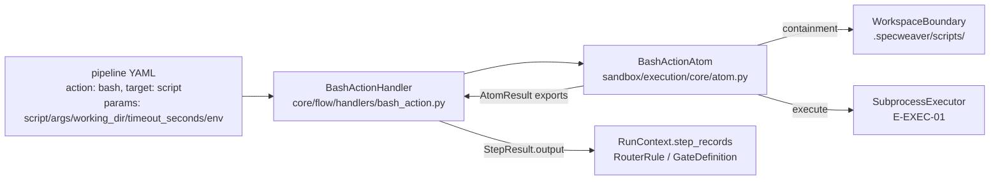

# C-EXEC-02 — Native CLI Action Nodes

**Status**: APPROVED. **COMPLETE** — SF-01, SF-02, SF-03 committed (SF-02: `0b9a5b29`, 2026-07-14).
· **Feature ID**: C-EXEC-02

| | |
|---|---|
| Builds on | `E-EXEC-01` (`SubprocessExecutor`, complete 2026-07-12 to unblock this feature); `WorkspaceBoundary` in `sandbox/security.py` |
| Enables | `B-EXEC-01` — `BashActionAtom`'s single `SubprocessExecutor.execute()` call is the container-routing swap point; `C-EXEC-04` — bash nodes for pre-merge validation scripts |
| Spun off | `TECH-010` (MCP persistent-process executor migration), `TECH-011` (load-time `params` validation for all step types) — both open |
| Not touched | containerized execution (`B-EXEC-01`), tiered access rights (`B-EXEC-02`), air-gapped network egress control (`E-EXEC-02`) |

## What it does

Adds a declarative `action: bash` pipeline step (a "Native CLI Action Node") to the YAML pipeline
engine. A pipeline author declares a step that runs a script from the fixed, protected
`.specweaver/scripts/` directory; its `stdout`/`stderr`/`exit_code` land in pipeline state. No LLM
agent is involved.

Use: deterministic, non-LLM shell steps — pre-test scaffolding, dependency installs
(`pip install -e .`, `npm ci`), DB seeding — before `generate_code` or `run_tests`. No other step
type covers this; the engine already splits deterministic steps (`action: validate`, dispatched to
`QARunnerAtom`) from LLM steps (`action: generate/draft/review`), as `workflows/pipelines/new_feature.yaml`
and `scenario_integration.yaml` show.

Two hard constraints:

- every referenced script MUST resolve inside `.specweaver/scripts/` (canonical-path containment,
  to prevent Agent RCE);
- execution MUST go through `SubprocessExecutor`, never raw `subprocess` — `subprocess.run()` is
  banned repo-wide by ruff rule TID251, exempt only for `sandbox/execution/` and test files
  (`docs/dev_guides/subprocess_execution.md`).

## Architecture

| Part | Lives in | Does |
|---|---|---|
| `StepAction.BASH`, `StepTarget.SCRIPT` | `core/flow/engine/models.py` | New entry in the `VALID_STEP_COMBINATIONS` allowlist, checked by `PipelineDefinition.validate_flow()` — same mechanism as every step type (`generate`, `validate`, `review`, `draft`, `arbitrate`, `orchestrate`) |
| `BashActionHandler` | `core/flow/handlers/bash_action.py` | Thin: passes `step.params` to the Atom, maps `AtomResult` → `StepResult` |
| `BashActionAtom` | `sandbox/execution/core/atom.py` | Containment, invocation, capture, truncation, exception containment |
| `.specweaver/scripts/` | `workspace/project/scaffold.py` | Created by `sw init` (alongside `.specweaver/`, `.specweaver/templates/`, `.specweaver/vault.env`) |

**Engine facts the design relies on:**

- `PipelineStep` = `action: StepAction` + `target: StepTarget`, both closed `StrEnum`s.
  `StepHandlerRegistry` (`handlers/registry.py`) is a plain `dict[(StepAction, StepTarget), StepHandler]`;
  `StepHandler` is a `Protocol` with one method, `async def execute(step, context) -> StepResult`.
- `GateDefinition`/`RouterRule` read only `StepResult.output` (dot-notation, no `eval()`). A bash
  step needs zero gate/router changes; it only fills `output` and maps exit code → `StepStatus`.
- `RunContext.step_records: list[dict[str, Any]]` is refreshed by `runner.py`
  (`self._context.step_records = [r.model_dump() for r in run.step_records]`) before *every* step
  and holds every prior `StepRecord` (`step_name`, `status`, `result: StepResult`). Any later
  handler can read a named prior step's `result.output`. `RunContext.feedback` is different:
  reserved for HITL loop-back rejection notes (`inject_feedback`, rendered as `<dictator-overrides>`
  per C-FLOW-05).
- `SubprocessExecutor` (`sandbox/execution/executor.py`):
  `execute(cmd: list[str], *, timeout_seconds=None, extra_env=None, cwd_override=None, input_text=None) -> SubprocessResult(exit_code, stdout, stderr, duration_seconds, timed_out, events)`.
  Provides SIGTERM→2s-grace→SIGKILL timeout escalation (Windows: immediate `terminate()`), env
  allowlisting + hard credential stripping (`GEMINI_API_KEY`, `OPENAI_API_KEY`, `ANTHROPIC_API_KEY`,
  `AZURE_*`, ...), and canonical-path `cwd` validation (`_validate_cwd`: resolves symlinks, checks
  `relative_to(boundary)`). The E-EXEC-01 design lists this feature as a direct consumer:
  *"C-EXEC-02 Native CLI Nodes | Needs safe `bash` execution from YAML | Directly uses
  SubprocessExecutor"*.
- `WorkspaceBoundary.validate_path(requested: Path) -> Path` resolves symlinks and checks subpath
  containment against configured roots, raising on escape.
- `FileExecutor._PROTECTED_PATTERNS` already includes `.specweaver`: LLM agents cannot
  write/move/delete under `.specweaver/` via `FileSystemTool`. So scripts in `.specweaver/scripts/`
  can only come from a human or CLI scaffolding — no new code needed for that.

**Why an Atom, not a Tool** (`docs/dev_guides/adding_tools_and_atoms.md`,
`docs/architecture/01_foundational_principles/atoms_vs_tools.md`): `Tool` is agent-facing and
role/grant-gated; `Atom` is engine-facing and normally bypasses grants ("the engine is trusted"). A
bash step is triggered by the pipeline runner and never exposed to an LLM's function-calling
surface, so it is Atom-tier, like `QARunnerAtom`/`GitAtom`.

**Why not the role-grant system:** `FolderGrant`/`AccessMode`/`_compute_role_grants`
(`sandbox/dispatcher.py`) is a dynamic, per-role grant system for agent-facing `Tool` calls. Its
"is this path inside a folder" logic is private (`FileSystemTool._check_grant`).
`.specweaver/scripts/` is one static boundary, so `WorkspaceBoundary` is used directly (AD-3).

**Module boundary.** `sandbox/execution/context.yaml` declares
`forbids: [sandbox.qa_runner.*, core.flow.*]`, and `tach.toml`'s `[[interfaces]] from=["specweaver.sandbox"]`
expose-list did not list `execution`. Every domain `core.flow` consumes (`qa_runner`, `git`,
`code_structure`, `mcp`) does so through a `<domain>/core` submodule with its own `context.yaml`.
`sandbox/execution/` was flat (`executor.py`, `models.py`, `platform_limiter.py`, `_signals.py`);
AD-1 adds `sandbox/execution/core/` on the same pattern.

External tools — no new third-party dependencies; pure composition of internal primitives:

| Tool | Min Version | Key API Surface | Compat Confirmed | Notes |
|------|------------|----------------|-----------------|-------|
| `SubprocessExecutor` (internal) | current (E-EXEC-01, complete) | `.execute(cmd, timeout_seconds, extra_env, cwd_override, input_text)` — `src/specweaver/sandbox/execution/executor.py` | ✅ | No changes needed to E-EXEC-01 itself |
| `WorkspaceBoundary` (internal) | current | `.validate_path(requested) -> Path` — `src/specweaver/sandbox/security.py` | ✅ | Reused as-is for containment check |
| `bash` (WSL/Git Bash on Windows; native on Linux/macOS) | any POSIX-compatible | invoked as `["bash", script_path, *args]` via argv, no bash-version-specific features; host PATH | ✅ (user-confirmed WSL installed; team migrating to Ubuntu within weeks) | Not installed by SpecWeaver — `bash` is assumed present on the host |

## Prior art

- **Archon** (github.com/coleam00/Archon), credited in `docs/ORIGINS.md` (Phase 3.40b). Archon has
  a real bash/script DAG-node pattern (`packages/workflows/src/schemas/dag-node.ts` —
  `bashNodeSchema` with a `bash: string` field and `timeout` default 120000ms, output exposed to
  downstream nodes as `$nodeId.output`, with a documented "don't double-quote `$node.output`"
  shell-injection footgun) and canonical-path/symlink defenses in its worktree provider. The terms
  **"Native CLI Action Nodes"**, `action:` as a discriminator key, and **"FolderGrant"** are
  SpecWeaver's own coinage, not Archon's — SF-03 corrected `ORIGINS.md`.
- **GitHub Actions** `GITHUB_OUTPUT` injection-risk guidance: never re-interpolate captured output
  into a later shell command unescaped → FR-3.
- **Airflow `BashOperator`**'s implicit last-stdout-line XCom is fragile → FR-4 explicit structured
  capture.
- **CVE-2025-54794** (Claude Code path-restriction bypass via prefix-matching instead of
  canonical-path comparison) plus the symlink-escape lesson → FR-2, AD-3: `resolve()` before the
  containment check, never string-prefix compare.

## Decisions

| # | Decision | Rationale | Architectural Switch? |
|---|----------|-----------|----------------------|
| AD-1 | New `BashActionAtom` lives in a new `sandbox/execution/core/` submodule (its own `context.yaml`, `archetype: adapter`, `consumes: [sandbox.execution]`), while the existing `sandbox/execution/context.yaml` (root — `executor.py` itself) keeps its `forbids: core.flow.*` unchanged | Resolves the contradiction (`sandbox/execution` forbids `core.flow.*`; `tach.toml` does not expose `execution`) **without weakening any rule**. Mirrors every domain `core.flow` consumes (`qa_runner/core`, `git/core`, `code_structure/core`, `mcp/core`). Complies with `src/specweaver/sandbox/CLAUDE.md`: "An atom may import from commons. Never from tools." — the `execution/core` Atom importing `execution` (a `commons`-tier leaf, though that doc's illustrative commons list predates it) is atom → commons. (As built, the `context.yaml` is the bare `archetype: adapter` one-liner of its siblings — see SF-01 plan.) | No |
| AD-2 | `BashActionAtom` performs an explicit canonical-path containment check even though Atoms normally bypass `FolderGrant`/role checks ("the engine is trusted") | The script *path* comes from pipeline YAML — contributor-editable, version-controlled content, not engine-internal state. Precedent: `QARunnerAtom._intent_run_tests` already does a path-traversal check (`is_relative_to`). Consistent with Atom practice, not a trust-model exception. | No |
| AD-3 | Containment **instantiates and reuses** `sandbox.security.WorkspaceBoundary` (e.g. `WorkspaceBoundary(roots=[project_path / ".specweaver/scripts"]).validate_path(resolved)`) — no reimplementation of resolve/subpath logic — and does NOT use the dynamic `FolderGrant`/`_compute_role_grants` role-based system | `.specweaver/scripts/` is one fixed boundary, not a multi-role grant list; routing it through `ToolDispatcher._compute_role_grants` (built for per-agent-role Tool access) over-engineers a static check. Reusing the class avoids a DRY violation and inherits resolve-before-compare (CVE-2025-54794: prefix-string matching is bypassable; resolve symlinks before the check, not after). Per FR-2, called at load time and again before each execution. | No |
| AD-4 | Downstream state reuses `RunContext.step_records` (refreshed by the runner before every step) — no change to `runner.py`, no repurposing of `RunContext.feedback`/`inject_feedback` | `step_records` already carries every prior `StepResult` to every later handler. `feedback` is reserved for HITL loop-back rejection notes (`<dictator-overrides>`, C-FLOW-05) and fires only on loop-back — conflating the two blurs a load-bearing convention. | No |
| AD-5 | `bash` is invoked as `bash` (`["bash", script_path, *args]`) on all platforms; no OS-appropriate interpreter dispatch (`.ps1`/`.bat`) | User-confirmed: WSL is installed (bash on PATH) and the team migrates to Ubuntu within weeks — Windows-native dispatch would be dead weight. Fails fast with a clear error if `bash` is not found. | No — scoping decision, confirmed with user during clarification |
| AD-6 | Scripts are referenced by bare name only (`script: setup.sh`), resolved as `.specweaver/scripts/<name>` — never a caller-supplied or absolute path | Closes the path-traversal surface by construction (FR-2's separator/`..` rejection is defense-in-depth on top). Matches Archon's `script: analyze-metrics` → `.archon/scripts/analyze-metrics.py` named-reference convention (verified against Archon source). | No |

## Functional Requirements

| # | FR | Actor | Action | Outcome |
|---|-----|-------|--------|---------|
| FR-1 | New step type | Pipeline author | Declares a step with `action: bash`, `script: <name>`, optional `args: [...]` and `working_dir: <relative-path>` in pipeline YAML (all under `params:` — see SF-02 plan) | `PipelineDefinition.validate_flow()` accepts the new `(StepAction.BASH, StepTarget.SCRIPT)` combination |
| FR-2 | Script path containment | System | Resolves `script: <name>` strictly as `<project_path>/.specweaver/scripts/<name>` (rejecting any `name` containing a path separator or `..`), then canonically validates (post symlink-resolution, via `WorkspaceBoundary`-style check) that the resolved path is a descendant of `.specweaver/scripts/` — **both** at pipeline-load validation time (fast author feedback) **and again, atomically, immediately before every execution** inside `BashActionAtom` itself | Any escape attempt — traversal, symlink, absolute-path override, or a script swapped in between an earlier pipeline-load check and a much-later execution (e.g. across a long HITL pause) — hard-fails, never a warning |
| FR-3 | Deterministic invocation | `BashActionAtom` | Invokes the validated script via `SubprocessExecutor.execute(["bash", resolved_path, *args], cwd_override=<working_dir resolved relative to project_path>, ...)` — fixed argv, `shell=False` always, never interpolates a prior step's captured output into the command string. `working_dir` (if set) is resolved relative to `project_path` (not `.specweaver/scripts/`) and its containment is enforced by `SubprocessExecutor`'s existing `_validate_cwd` boundary check — no separate validation is written | No shell-injection surface from either the script path, `working_dir`, or upstream pipeline state |
| FR-4 | Structured capture | `BashActionAtom` | Captures `exit_code`, `stdout`, `stderr`, and `duration_seconds` into `StepResult.output` | Downstream consumers get typed fields, never an implicit "last line of stdout" convention |
| FR-5 | Status mapping | `BashActionHandler` | Maps exit code 0 → `StepStatus.PASSED`¹, any nonzero → `StepStatus.FAILED` | Existing `GateDefinition`/`RouterRule` evaluation works on bash steps with zero engine changes |
| FR-6 | Downstream availability | System | Makes a completed bash step's `StepResult.output` readable by every later step in the same run via the existing `RunContext.step_records` list (keyed by `step_name`) | No new state-propagation channel; later handlers read `context.step_records` exactly as the runner already provides it |
| FR-7 | Router compatibility | `RouterRule` | Supports dot-notation branching on a bash step's `output.exit_code` and `output.stdout` (raw string) | Pipeline authors branch on bash-step results with the existing router, no new syntax. **Deferred (not built)**: structured/JSON parsing of `stdout` into a typed field — cut from MVP as speculative (YAGNI); revisit only on a concrete pipeline-author need |
| FR-8 | Output truncation | `BashActionAtom` | Truncates each of `stdout`/`stderr` to 1 MiB, appending a `...[TRUNCATED]` marker when truncation occurs, before storing in `StepResult.output` | Bounds `step_records` JSON payload size (persisted to SQLite) and prevents unbounded memory growth from a runaway script |
| FR-9 | Timeout override | Pipeline author | May set `timeout_seconds` on a bash step in YAML | If set, overrides the `SubprocessExecutor` default (120s) for that step only; if omitted, the default applies unchanged |
| FR-10 | Scaffold | `sw init` / project scaffold | Creates `.specweaver/scripts/` (with a placeholder `README.md` explaining the containment rule) as part of project scaffolding | The grant target directory always exists once a project is initialized; no separate manual setup step |
| FR-11 | Default resource limits | `BashActionAtom` | Constructs `SubprocessExecutor` with non-`None` default `ResourceLimits`: `max_memory_bytes=2_147_483_648` (2 GiB), `max_processes=128`, for every bash step invocation | A runaway or fork-bombing script is capped by default; authors may tune within a bounded range but MAY NOT disable limits. **What is enforced** (amended 2026-08-12 and 2026-08-17 by `TECH-029`, which alone may edit this delivered design; done because the text was false on this platform, not to weaken it; no scope added): memory is a true per-process limit (`RLIMIT_AS`). The **process** bound is not, on Linux: `RLIMIT_NPROC` is per-real-UID and counts *tasks* (threads), so `max_processes` cannot bound this sandbox alone. The ceiling is the budget **or 1% of the system's own hard `RLIMIT_NPROC`, whichever is larger**, clamped to that hard limit — a fork storm still crosses any finite ceiling, ambient load does not. Roughly 8x looser than before; **not** a per-sandbox quota (a per-UID limit cannot be one). Replaced: the raw 128 (an idle host sits at 234 tasks — **every bash step failed**), then *current task count + budget* (the UID's task count swung 313..960 in one suite run against a ~453 ceiling; innocent steps died on `fork` about one run in six). The ceiling is fixed at spawn, so no sample predicts the peak; two sampling-based repairs were measured to fail. `B-EXEC-04` replaces it with a kernel-enforced per-subtree bound (cgroups v2 `pids.max`) and should remove the backstop rather than layer on it. On Windows the field is a Job Object limit and bounds the job, unchanged. *(Forward-compat: if a DAL-aware default-limits system lands in `SubprocessExecutor`, `BashActionAtom` adopts it instead of these feature-local defaults.)* |
| FR-12 | Explicit env opt-in | `BashActionAtom` | Does **NOT** implicitly pass `RunContext.env_vars` into the bash script's environment. A pipeline author MAY declare an explicit `env: {KEY: value}` map on the step; each key is passed as `extra_env` to `SubprocessExecutor.execute()` (which already unconditionally strips credential vars per E-EXEC-01 AD-4). Any key matching `PATH` case-insensitively (`PATH`, `Path`, `path`, ...) in the step's `env:` map is rejected at pipeline-validation time | Prevents silent secret leakage from `RunContext.env_vars` into `stdout`/`step_records`/SQLite, and prevents a step from hijacking which `bash` executable resolves via a `PATH` override |
| FR-13 | Exception containment | `BashActionAtom` / `BashActionHandler` | Catches every exception raised during containment validation, `working_dir` resolution, or `SubprocessExecutor` execution, and converts it into a `StepResult` with `StepStatus.ERROR` and a human-readable `error_message` (using the existing `_error_result` helper pattern from `handlers/base.py`) | No exception from a bash step may propagate unhandled and crash the pipeline run; only that one step fails |

¹ `StepStatus` has no `COMPLETED` member; FR-5 said `COMPLETED` until SF-02 corrected it
(2026-07-14) to `PASSED`, as every handler in `core/flow/handlers/` uses.

## Non-Functional Requirements

| # | NFR | Threshold / Constraint |
|---|-----|------------------------|
| NFR-1 | Security — path containment | MUST use canonical (post-`resolve()`) path comparison, never string-prefix matching (CVE-2025-54794 lesson). MUST reject on any resolution failure (fail closed, not open). Zero tolerance: any script path resolving outside `.specweaver/scripts/` MUST abort pipeline validation, not merely log a warning. |
| NFR-2 | Security — no shell interpolation | MUST always invoke via argv list (`shell=False`); MUST NOT build a shell string by concatenating script path, args, or any prior step's captured output. |
| NFR-3 | Security — credential isolation | Inherits `SubprocessExecutor`'s existing env allowlist + credential-stripping (`GEMINI_API_KEY`, `OPENAI_API_KEY`, `ANTHROPIC_API_KEY`, `AZURE_*`, ...) unchanged — no new env var exposed to bash scripts beyond the existing allowlist. |
| NFR-4 | Performance — default timeout | 120s (inherited from `SubprocessExecutor` default), author-overridable per step (FR-9) up to a hard ceiling of 3600s (1 hour); values above the ceiling are rejected at pipeline-validation time. |
| NFR-5 | Performance — output cap | 1 MiB per stream (stdout/stderr independently), per FR-8. |
| NFR-6 | Compatibility — interpreter | `bash` is invoked by name (`["bash", ...]`) on all platforms, with argv[0] = the absolute path `shutil.which("bash")` returns (a bare `"bash"` on Windows hits the WSL `bash.exe` stub in `C:\Windows\System32`, because `CreateProcess` searches `System32` before `%PATH%`). On Windows this resolves via WSL's `bash.exe` or Git Bash if present on PATH — no OS-appropriate interpreter dispatch (`.ps1`/`.bat`) is built. If `bash` is not resolvable on PATH, the step fails immediately with a clear "bash interpreter not found on PATH" error (no silent skip, no other-interpreter fallback). **Known limitation (accepted, transitional)**: when `bash` resolves to WSL's `bash.exe`, Python-resolved Windows-style paths (`C:\...`) passed as the script path, `working_dir`, or path-valued `args` are NOT translated to WSL mount-point form (`/mnt/c/...`) — WSL translates only its own leading executable argument. Git Bash accepts native Windows paths. Not solved here, given the user-confirmed migration to native Ubuntu (see project memory). Script authors on Windows+WSL use path-safe scripting (e.g. `wslpath`) or prefer Git Bash on PATH. **[proof: none — unfalsifiable as written]** |
| NFR-7 | Compatibility — Python/OS | Same targets as E-EXEC-01: Python 3.11+, Windows 11 (26H2+) via WSL/Git Bash, Linux (kernel 7.1+), macOS Tahoe (26+) — all via existing `SubprocessExecutor` cross-platform support, no new OS-specific code. **[proof: none — unfalsifiable as written]** |
| NFR-8 | Observability | Every bash step execution logged at DEBUG level with: script name, resolved path, args, cwd, timeout, exit_code, duration — consistent with `SubprocessExecutor`'s existing NFR-5 (E-EXEC-01) logging convention. |
| NFR-9 | Error handling | A missing script file, a containment violation, or `bash` not found on PATH all raise distinct, human-readable error messages (not a generic `FileNotFoundError` traceback) surfaced in `StepResult.error_message`. |
| NFR-10 | Backward compatibility | Zero changes to any existing `StepAction`/`StepTarget` combination's behavior. All existing pipeline YAML files continue to validate and run unchanged. |

## Risks

| Risk | Probability | Impact | Mitigation |
|------|-------------|--------|------------|
| Author captures secrets via a script's own logic (e.g. `env` dump) despite env stripping | Low | Medium | `SubprocessExecutor`'s allowlist + credential-stripping limits the child env; risk documented in the dev guide |
| Truncation drops a downstream router's expected JSON field | Low | Low | 1 MiB is generous for status output; the `[TRUNCATED]` marker makes truncation visible |
| `bash` not present on a Windows host | Medium (until Ubuntu migration completes) | Low | Fails fast with a clear, actionable error (NFR-9) |
| WSL-invoked `bash` misreads Windows-style paths in `args`/`working_dir` | Medium (until Ubuntu migration completes) | Medium (confusing "no such file" instead of a path-translation error) | Accepted transitional limitation (NFR-6); documented so it is not mistaken for a bug |
| Residual TOCTOU window between FR-2's pre-execution re-validation and the `SubprocessExecutor.execute()` call | Very Low (needs write access to `.specweaver/scripts/`, which is git-tracked and blocked from LLM-agent writes) | Medium | Accepted — narrowed from "hours across a HITL pause" to "microseconds within one function call" (industry-standard mitigation per CVE-2025-54794 remediation guidance); a fully atomic fix needs OS-level open-by-fd primitives, disproportionate here |
| Hardcoded resource-limit defaults (FR-11) diverge from a future DAL-aware limits system | Low | Low | Accepted; forward-compat note in FR-11 |

Informational, not acted on: `sandbox/filesystem/interfaces/models.py` duplicates
`FolderGrant`/`AccessMode`/`MODE_ALLOWS_*`, separate from the canonical copy in
`sandbox/security.py` that is imported and used. Out of scope (AD-3 avoids the grant system).

## Developer guides

| Guide Topic | Description | Status |
|-------------|-------------|--------|
| Guide-1 | `docs/dev_guides/pipeline_engine_guide.md` §12 — declaring `action: bash` steps, the `.specweaver/scripts/` containment rule, output shape, reading `context.step_records` | ✅ Written in SF-02's pre-commit |
| Guide-2 | `docs/dev_guides/subprocess_execution.md` — `BashActionAtom` as the sanctioned way to run a script from a pipeline step | ✅ Written in SF-01's pre-commit (2026-07-13) |

## Sub-features

Order: SF-01 and SF-03 in parallel (no dependencies); then SF-02, which needs SF-01's
`BashActionAtom` (code) **and** SF-03's `tach.toml`/`context.yaml` edits (config — makes
`sandbox/execution/core` a tach-legal import for `core/flow`, so `tach check` passes).

| SF | Does | FRs | Depends on | Plan |
|----|------|-----|-----------|------|
| SF-01 | `BashActionAtom` in new `sandbox/execution/core/`: containment (load-time and pre-execution), `SubprocessExecutor` with default limits and explicit env opt-in, truncation, catch-all. Returns `AtomResult(status, exports={exit_code, stdout, stderr, duration_seconds})`. Testable in isolation with fixture scripts. Inputs: script name, args, working_dir, timeout_seconds, project_path. 8 FRs kept together (above the usual ≤5): FR-11/12/13 came from the Red/Blue review as hardening on the same `execute()` call FR-3 makes; not independently valuable or testable. | FR-2, FR-3, FR-4, FR-8, FR-9, FR-11, FR-12, FR-13 | — | [sf01](C-EXEC-02_sf01_implementation_plan.md) |
| SF-02 | `StepAction.BASH`/`StepTarget.SCRIPT`, `BashActionHandler` (wraps SF-01's Atom, maps exit code → `StepStatus`), integration tests with real pipeline YAML proving `RouterRule`/`GateDefinition`/`step_records` work end-to-end. | FR-1, FR-5, FR-6, FR-7 | SF-01, SF-03 | [sf02](C-EXEC-02_sf02_implementation_plan.md) |
| SF-03 | `workspace/project/scaffold.py` creates `.specweaver/scripts/`; `sandbox/execution/core` added to `tach.toml`'s sandbox expose-list and `core/flow/context.yaml`'s `consumes`; corrects `hard_dependency_rules.md` and `ORIGINS.md`'s Archon attribution; guide sections. Needs only the module *names* SF-01 introduces. | FR-10 | — | [sf03](C-EXEC-02_sf03_implementation_plan.md) |

## Progress Tracker

| SF | Name | Depends On | Design | Impl Plan | Dev | Pre-Commit | Committed |
|----|------|-----------|--------|-----------|-----|------------|-----------|
| SF-01 | BashActionAtom Core Execution | — | ✅ | ✅ | ✅ | ✅ | ✅ |
| SF-02 | Pipeline Engine Integration | SF-01, SF-03 | ✅ | ✅ | ✅ | ✅ | ✅ |
| SF-03 | Scaffold, Boundary Config, and Docs | — | ✅ | ✅ | ✅ | ✅ | ✅ |
