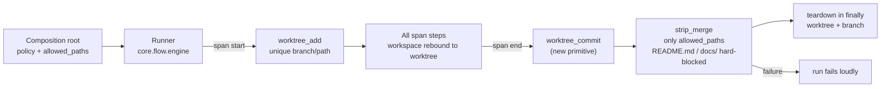

# C-EXEC-06 — Per-Run (Session) Worktree Isolation

**Status**: APPROVED — approved by Steve Bula on 2026-07-19 (AD-1..5 confirmed, incl. the AD-5
architectural switch). **COMPLETE** — SF-01, SF-02, SF-03 committed to `main` (SF-03: `bd5cedd2`,
2026-07-21). · **DAL**: C (Enterprise Standard) · **Phase**: 6 · **Feature ID**: C-EXEC-06

| | |
|---|---|
| Extends | `D-EXEC-02` (Git Worktree Bouncer, per-step isolation) |
| Resolves | `TECH-012` |
| Used by | `INT-US-09-SF05` (US-9 policy) · `INT-US-03 SF-03` (runs `sw implement` sandboxed), which unblocks US-3 and, through it, US-17/19/22/24 |
| Deferred | API composition-root wiring → `TECH-013` |
| Not touched | container isolation (`B-EXEC-01` / `D-EXEC-01`); per-step single-step isolation |

## What it does

Runs a whole span of untrusted pipeline steps inside **one** ephemeral git worktree, with **one**
reconcile at the end. Only files in `allowed_paths` come back to the real repo.

Why DAL-C: the end-of-run strip-merge is the *sole authorization gate* for what generated code
lands in the user's repo.

## Why it was needed — the three `TECH-012` gaps

Per-step isolation (`D-EXEC-02`) could not run a multi-step loop such as `sw implement`'s
generate → lint-fix → run-tests → validate:

| Gap | What broke | Where |
|---|---|---|
| 1 — no commit | Handlers never commit. `worktree_sync` runs `git rebase main`, which refuses on the dirty tree and returns FAILED — a result **discarded**. `strip_merge`'s `git merge sf-*` is then a no-op and the generated file is lost at teardown. | `git/core/atom.py:427-475`, `runner_utils.py:195` |
| 2 — no allow-list | `execute_in_sandbox` reads `getattr(context, "allowed_paths", [])`; `RunContext` has **no such field** → always `[]` → `strip_merge` strips every file. | `runner_utils.py:202`, `handlers/base.py`, `git/core/worktree_ops.py:107` |
| 3 — branch collision | Branch/path come from the constant run id (`sf-{pipeline}-{task_id}`, `.worktrees/{task_id}`). Teardown removes the worktree but **not** the branch, so the 2nd isolated step's `git worktree add -b <existing-branch>` fails closed. | `runner_utils.py:163-166` |

## Architecture

| Change | Lives in |
|---|---|
| Run-level isolation lifecycle | `core.flow.engine` |
| `worktree_commit` primitive + reconcile orchestration | `sandbox.git.core` |
| `RunContext.allowed_paths` field | `core.flow.handlers.base` |
| Policy + allow-list population | composition root |

**Reused primitives** (GitAtom, `git/core/atom.py`):

| Primitive | Does |
|---|---|
| `worktree_add` (`:385-415`) | `git worktree add -b <branch> <path> HEAD` |
| `worktree_sync` (`:427-475`) | fetch + rebase — *not* a commit |
| `strip_merge` (`:477-491` → `worktree_ops.handle_strip_merge`) | `git merge -X ours`, strip non-`allowed_paths` + hard-block `README.md`/`docs/`, commit surviving hunks |
| `worktree_teardown` (`worktree_ops.py:20-64`) | resilient remove, Windows `shutil.rmtree` backoff — **does not delete the branch** |
| `setup_sandbox_caches` (`runner_utils.py`) | symlinks `.specweaver`/caches into the worktree |

Already present: `RunContext.enforce_isolation` (`base.py:56`, default False) and `execution_root`
(`base.py:57`). The flow CLI sets the policy from settings (`flow/interfaces/cli.py:270-272`,
`sandbox.enforce_worktree_isolation`). Per-step dispatch today: `runner.py:321-327`
(`if resolve_should_isolate(step_def, context): result = execute_in_sandbox(...)`);
`execute_in_sandbox` (`runner_utils.py:151-221`) wraps ONE step: `worktree_add` → rebind
`output_dir`/`execution_root` → `handler.execute` → `worktree_sync` → `strip_merge` →
`worktree_teardown` (finally).

Opt-in setting: `[sandbox] enforce_session_isolation` (read from `SandboxSettings`). Only dependency:
git, any version, already used by `D-EXEC-02` — `worktree add/remove`, `branch -D`, `add -A`,
`commit`, `merge -X ours`. Container-free. Pattern reference: `test_step_worktree_isolation_e2e.py`.

## Decisions

| # | Decision | Why | Architectural Switch? |
|---|----------|-----|----------------------|
| AD-1 | **Whole-run span** — the entire pipeline runs in one worktree. | One unit of untrusted work (implement's 5 steps). A marked span waits until a pipeline mixes trusted and untrusted spans. | No |
| AD-2 | **`allowed_paths` = the pipeline's generation targets** (`src/<stem>.py`, `tests/test_<stem>.py`), with a config override. | Tightest safe default. Never "whole diff minus blocklist" — that is the unauthorized-write-back failure. | No |
| AD-3 | **Rebind the session workspace root** to the worktree for all steps, not just `execution_root`. | The worktree *is* the workspace; static QA lints the code about to be reconciled. Care: `.specweaver`/DB/cache symlinks. | No |
| AD-4 | **v1 = non-parking spans.** A park (HITL gate) inside an isolated session errors clearly. | Keeping a worktree across park/resume is a large separate concern; implement has no gates. | No |
| AD-5 | **New per-run isolation execution mode** in the flow engine (+ `RunContext.allowed_paths` + `worktree_commit`). | The capability itself; additive, correct layer, complements `D-EXEC-02`. | **Yes — approved by Steve Bula on 2026-07-19.** |

## Functional Requirements

| # | FR | Actor | Action | Outcome |
|---|-----|-------|--------|---------|
| FR-1 | Session lifecycle | Runner | SHALL, for a run under per-run isolation, create **one** ephemeral worktree (unique branch/path per run) at span start, and tear it down **once** at span end — **including deleting the branch** — in a `finally` (guaranteed even on crash). | No orphaned `.worktrees/` or `sf-*` branches; a run can contain many steps in one worktree (fixes Gap 3). |
| FR-2 | In-session execution binding | Runner | SHALL run **all** steps of the span against the one worktree by rebinding the session workspace root (`project_path`-equivalent + `output_dir` + `execution_root`) to the worktree (AD-3). | Generated code persists in the worktree across steps; untrusted execution (pytest/bash) is worktree-bounded; static QA (lint/validate) operates on the same worktree copy. |
| FR-3 | Commit before reconcile | Runner/GitAtom | SHALL commit the worktree's accumulated working tree onto the session branch (new `worktree_commit` primitive) **before** reconcile. | The generated/modified files exist as commits on `sf-*` so the reconcile can merge them (fixes Gap 1). |
| FR-4 | Authorized reconcile | GitAtom | SHALL perform a **single** end-of-run `strip_merge` that writes back to the real repo **only** paths in `allowed_paths` (plus the existing `README.md`/`docs/` hard-block), and SHALL **surface** (not swallow) any commit/sync/merge failure as a run failure. | Only authorized generated paths land in the user's real branch; a broken reconcile fails loudly, never silently green (fixes Gap 2 + the swallowed failure). |
| FR-5 | `allowed_paths` field | System | SHALL add `RunContext.allowed_paths: list[str]` (repo-relative path strings/globs) and populate it at the composition root (AD-2: the pipeline's generation targets, with a config override). | The reconcile has a real, tight allow-list to authorize against. |
| FR-6 | Fail-closed | Runner | SHALL fail the run with an actionable error if the session worktree cannot be created (e.g. non-git project), and SHALL NOT execute any span step against the real root in that case. | Isolation is never silently skipped when requested. |
| FR-7 | Backward compatibility | System | SHALL keep per-run isolation **opt-in / default-off**, leave the existing per-step single-step isolation path unchanged, and reject/clearly-error a **park (HITL gate) inside an isolated session** (AD-4 v1 non-parking scope). | Zero regression; existing behavior byte-identical when the policy is off. |
| FR-8 | Verifiable proof | Test suite | SHALL provide a **multi-step, freshly-generated-file** e2e: step 1 generates a file, a later step runs pytest on it **worktree-bounded**, the real source root is unmutated until the authorized reconcile, then only `allowed_paths` land back — plus a paired un-isolated control and adversarial reconcile-authorization tests (an out-of-`allowed_paths` write is stripped). | The `TECH-012` coverage gap is closed by a real proof that generated code runs sandboxed end-to-end. |

## Non-Functional Requirements

| # | NFR | Threshold / Constraint |
|---|-----|----------------------|
| NFR-1 | Container-free | Git-worktree only; MUST NOT touch Podman/Docker (`B-EXEC-01`). |
| NFR-2 | No host-execution regression | With the policy off, behavior is byte-identical to today; the per-step path is untouched. |
| NFR-3 | Determinism / no cross-run leak | A fresh worktree per run; no state carried between runs; no orphaned worktrees/branches (guaranteed teardown + branch delete). |
| NFR-4 | DAL-C authorization rigor | The reconcile allow-list is adversarially tested: out-of-`allowed_paths` writes, traversal paths, `README.md`/`docs/` hard-block, and empty allow-list = write-back nothing (never everything). |
| NFR-5 | Windows-safe teardown | Reuse the existing resilient `shutil.rmtree` backoff; branch delete must also succeed cross-platform. |
| NFR-6 | Fail-loud reconcile | A commit/sync/merge failure MUST fail the run (surfaced), never be logged-and-ignored. |
| NFR-7 | Architecture compliance | Lifecycle in `core.flow.engine`; git primitive in `sandbox.git.core`; `allowed_paths` on `RunContext`; `tach`/`ruff`/`mypy --strict` green; ADR-002 (config frozen at composition root) respected. |

## Risks

From the design review and the Red/Blue review:

| Risk | Probability | Impact | Mitigation |
|------|-------------|--------|------------|
| Reconcile authorizes an out-of-bounds write | Low | High | AD-2 tight default + NFR-4 adversarial tests + hard-block |
| Rebinding `project_path` breaks `.specweaver`/DB/cache resolution | Medium | Medium | Reuse `setup_sandbox_caches` symlinks; SF-01 tests cover it and verify DB access |
| Orphaned worktrees/branches on crash | Medium | Medium | Guaranteed `finally` teardown + branch delete (FR-1/NFR-3) |
| Silent data loss (the old swallowed failure) | — | — | FR-4/NFR-6 surface failures |
| A hard crash (kill -9) skips `finally`; the orphan collides on a same-`run_id` retry | Low | Medium | **[impl note, SF-01]** make create idempotent — prune a stale same-named worktree+branch before `worktree_add`, or add a per-attempt suffix |
| Reconcile runs against a **dirty real working tree** → `git merge` blocks/conflicts | Medium | Medium | **[impl note, SF-02]** fail loud (NFR-6) with a clear "commit/stash your changes first" message, or auto-stash; never silently drop |

`run_tests` **loop-back** re-runs steps *inside* the same session worktree. That is in-session
iteration, not a park/resume, so it is compatible with AD-4.

Follow-up: per-step `execute_in_sandbox` could be deprecated for multi-step runs; keep it for
single-step. Guide owed: `pipeline_engine_guide.md §7` documents only per-step isolation — add the
session model and `allowed_paths`.

## Sub-features

| SF | Does | FRs | Depends on | Plan |
|----|------|-----|-----------|------|
| SF-01 | Session lifecycle + context rebind: one worktree per span, workspace rebound, teardown (worktree + branch) in `finally`, fail-closed, `allowed_paths` field added unpopulated. No reconcile yet. | FR-1, FR-2, FR-5 (field), FR-6, FR-7 (park-guard) | — | [sf01](C-EXEC-06_sf01_implementation_plan.md) |
| SF-02 | `worktree_commit` + one `strip_merge` at span end, respecting `allowed_paths` and the README/docs hard-block; any failure fails the run. | FR-3, FR-4 | SF-01 | [sf02](C-EXEC-06_sf02_implementation_plan.md) |
| SF-03 | Opt-in policy (default-off); `allowed_paths` populated from generation targets (AD-2, config override, via `SandboxSettings`); per-step path unchanged; FR-8 e2e + NFR-4 adversarial tests. | FR-5 (populate), FR-7 (policy/default-off), FR-8 | SF-01, SF-02 | [sf03](C-EXEC-06_sf03_implementation_plan.md) |

## Progress Tracker
| SF | Name | Depends On | Design | Impl Plan | Dev | Pre-Commit | Committed |
|----|------|-----------|--------|-----------|-----|------------|-----------|
| SF-01 | Session Worktree Lifecycle + Context Rebind | — | ✅ | ✅ | ✅ | ✅ | ✅ |
| SF-02 | Commit-Before-Reconcile + Authorized Strip-Merge | SF-01 | ✅ | ✅ | ✅ | ✅ | ✅ |
| SF-03 | Composition-Root Policy + Allow-List + Verifiable Proof | SF-01, SF-02 | ✅ | ✅ | ✅ | ✅ | ✅ |

**Next**: `INT-US-09-SF05` (wire C-EXEC-06 into the US-9 policy) → `INT-US-03 SF-03` → US-3 closes.
