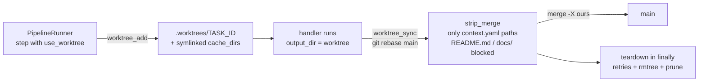

# D-EXEC-02 — Git Worktree Bouncer (Sandbox)

**Status**: APPROVED. SF-01 committed; SF-02 plan COMPLETED. · **Feature ID**: 3.26 · **Phase**: 3

| | |
|---|---|
| Touches | flow engine (`flow/`) · Loom git atom (`loom/atoms/git/`) |
| Extended by | `C-EXEC-06` — one worktree per multi-step run (per-step isolation cannot run a multi-step loop, `TECH-012`) |
| Blueprints | `flowmanager_legacy_reference.md` · Codebase Context Specification (CCS) v1.1.0-RFC |

## What it does

Runs a task in an isolated, ephemeral git worktree, so an LLM hallucination cannot edit
untouchable or forbidden files. Before merging back to trunk, diff stripping deletes out-of-bounds
hunks.

Trunk-based: little branch juggling. The worktree stays synced with main through continuous
micro-rebases, and conflicts resolve "Main Branch Wins".

Constraints: block out-of-bounds edits; handle Windows file locking so no zombie trees remain; no
heavy cache duplication.

## Why this way

- **Atoms, not tools:** the flow engine (`specweaver/flow`) may not consume `loom/tools/*` — those are
  for agents. It consumes `loom/atoms/git/` for engine-internal git operations (`worktree add`,
  diff, merge).
- **No new security protocol:** a task's allowed files are already declared in `context.yaml` and the
  `Spec.md` artifact. Those manifests are the input to diff stripping.
- **Seam:** the runner (`src/specweaver/flow/runner.py`) wraps `generate+code` steps in worktree
  setup/teardown (alternative considered: a `GitBouncerHandler` step wrapper; see SF-02 Q1).

## Architecture

## Decisions

| # | Decision | Rationale | Architectural Switch? |
|---|----------|-----------|----------------------|
| AD-1 | Engine utilizes `loom/atoms/git` | The Flow engine cannot bypass atoms to touch Git raw. Consuming atoms conforms to the `consumes` rule stack. | No |
| AD-2 | Overriding MCP vs CLI ADR | Overrides the earlier decision that vetoed worktrees. Isolated worktrees are the only secure way to enforce diff stripping. | Yes — approved by User on 2026-04-11 |

## Functional Requirements

| # | FR | Actor | Action | Outcome |
|---|-----|-------|--------|---------|
| FR-1 | Create worktree | Orchestrator | create a dedicated git worktree in `.worktrees/<task_id>` | The agent executes inside parallel files separate from the main workspace. |
| FR-2 | Cache symlinking | Orchestrator | symlink heavy workspace cache folders (like `node_modules`, `.gradle`) into the new worktree | The new worktree compiles without downloading gigabytes of cache dependencies. |
| FR-3 | Commit bounding | Agent | write code and commit changes strictly within the active worktree index | Hallucinations never touch the human's main branch files. |
| FR-4 | Diff Striping | Orchestrator | compute a structural diff patch of the worktree against main, stripping any hunks that target paths not listed in `context.yaml` | The final merge pipeline blocks hallucinated edits to forbidden dependencies. |
| FR-5 | Conflict Auto-Resolution| Orchestrator | apply a "Main-Branch Wins" (`--strategy-option=ours`) merge conflict logic during syncing | Human changes on main immediately override conflicting hallucinated agent changes. |
| FR-6 | Cleanup / Zombie prevention | Orchestrator | execute `git worktree remove --force` upon phase success/failure with strict OS unlock retries | The system is purged of temporary structures without leaving orphaned locked files on Windows. |
| FR-7 | Continuous Micro-Sync | Orchestrator | execute a proactive `git rebase main` on the sub-feature worktree when human edits occur on main | The worktree avoids deep drift over long implementation phases. |
| FR-8 | Isolated Documentation Claims | Agent / Orchestrator | output a localized `doc_updates.md` explicitly bounded within the isolated Component directory before completing its task | Agents flag required changes to global architecture documents without modifying them concurrently, delegating compilation to a sequential post-merge step. |

## Non-Functional Requirements

| # | NFR | Threshold / Constraint |
|---|-----|----------------------|
| NFR-1 | Windows File Locking | The teardown hook MUST capture `Access Denied` IO errors and execute at least 3 retry loops with progressive backoff to mitigate Windows Defender or IDE background locks before fully failing. |
| NFR-2 | Disk Footprint | The footprint of spinning up an agent MUST NOT exceed 50 MB independently of the main repository size via strict directory symlinking strategies. |
| NFR-3 | Speed | Worktree setup and cleanup MUST occur in under 2 seconds. |
| NFR-4 | Shared Documentation Protection | Shared global documentation (e.g. `docs/`, `README.md`) MUST be treated as implicitly forbidden during the diff striping phase. Agents operating in parallel worktrees must be blocked from updating shared architecture docs to prevent overlapping documentation merge conflicts. |

## External dependencies

| Tool | Min Version | Key API Surface | Compat Confirmed | Notes |
|------|------------|----------------|-----------------|-------|
| Git (git.exe) | 2.24 | `git worktree add`, `git worktree remove`, `git parse`, `git diff` (Git SCM manual) | Y | Standard local feature. |
| mklink (OS) | Windows 10+ | Directory symlinking /D for caches | — | Windows OS |

## Guides owed

| Guide Topic | Description | Status |
|-------------|-------------|--------|
| Worktree Lifecycle Troubleshooting | Manually pruning zombied worktrees and `.git/worktrees` hooks when Windows locks fail permanently. | ⬜ To be written during Pre-commit |

## Sub-features

| SF | Does | FRs | Inputs → Outputs | Depends on | Plan |
|----|------|-----|------------------|-----------|------|
| SF-01 | Worktree Sandbox Lifecycle (Atoms): setup, cache symlinking, OS-level teardown. | FR-1, FR-2, FR-6 | Task ID, target Component Path, Project Root Path → a unique `git worktree` branch mapped to a directory | none | [sf01](D-EXEC-02_sf01_implementation_plan.md) |
| SF-02 | Worktree Sync & Conflict Handling (Orchestrator): diff stripping of forbidden paths, isolated doc claims, main-branch-wins sync. | FR-3, FR-4, FR-5, FR-7, FR-8 | worktree branch code, `context.yaml` boundaries, main HEAD, `doc_updates.md` claims → purified diff applied to main | SF-01 | [sf02](D-EXEC-02_sf02_implementation_plan.md) |

## Progress Tracker

| SF | Name | Depends On | Design | Impl Plan | Dev | Pre-Commit | Committed |
|----|------|-----------|--------|-----------|-----|------------|-----------|
| SF-01 | Worktree Sandbox Lifecycle | — | ✅ | ✅ | ✅ | ✅ | ✅ |
| SF-02 | Worktree Sync & Conflict Handling | SF-01 | ✅ | ✅ | ⬜ | ⬜ | ⬜ |
