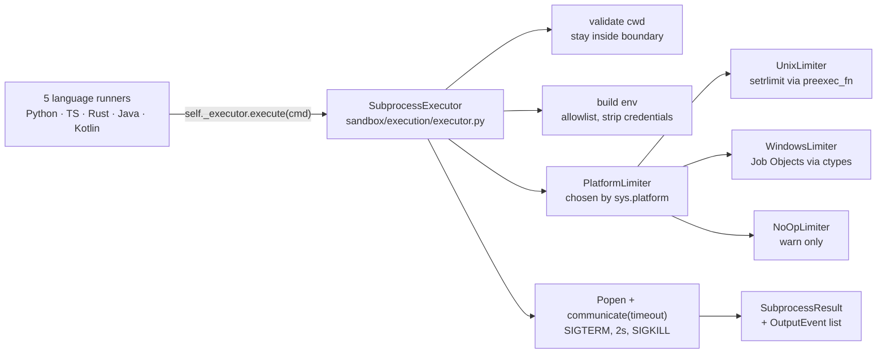

# E-EXEC-01 — Standard Local Execution

**Status**: APPROVED. **COMPLETE** (2026-07-12) — SF-01 and SF-02 implemented, tested, reviewed
(Red/Blue) and committed. Regression at close: Unit 4482 / Integration 424 / E2e 139 passed. ·
**Feature ID**: E-EXEC-01

| | |
|---|---|
| Used by | US-9 (Zero-Trust Sandbox, foundational prerequisite) · `C-EXEC-02` (Native CLI Action Nodes — `action: bash`) · `B-EXEC-01` (Ephemeral Podman Sub-Containers — the swap point) |
| Follow-up | **TECH-009** — `sandbox/git/core/executor.py` and `sandbox/filesystem/core/search.py` onto `SubprocessExecutor` (out of scope here; since done) |
| Superseded by (planned) | `B-EXEC-04` — cgroups v2 `pids.max` should **replace** the FR-10 process ceiling |

## What it does

One subprocess layer, `SubprocessExecutor`, in the `specweaver.sandbox` bounded context. All 5
language runners (Python, TypeScript, Rust, Java, Kotlin) delegate to it and get the same timeout
enforcement, resource limits, environment isolation, path validation, structured output with
DAP-compatible events, and telemetry. It moves SpecWeaver from "raw subprocess" to "controlled
subprocess" on the defense-in-depth ladder (MicroVMs > gVisor > Standard Containers > Raw subprocess).
Other industry practice (2025-2026; no `ORIGINS.md` blueprint): every execution disposable (the
`git worktree` isolation of D-EXEC-02), and stdout/stderr captured as structured events.

## Why

Each runner called `subprocess.run()` itself, with its own timeout, capture, encoding and error
handling:

| File | Methods | Lines | Timeout? | Resource Limits? | Output Structured? |
|------|---------|-------|----------|------------------|--------------------|
| `language/core/python/runner.py` | `run_tests`, `run_linter`, `run_complexity`, `run_compiler`, `run_debugger`, `run_architecture_check` | 562 | ✅ (per-method, hardcoded) | ❌ | Partial (Regex + JSON) |
| `language/core/typescript/runner.py` | `run_tests`, `run_linter`, `run_compiler`, `run_debugger` | ~200 | ✅ (inconsistent) | ❌ | Partial |
| `language/core/rust/runner.py` | `run_tests`, `run_linter`, `run_compiler`, `run_debugger`, `run_complexity` | 292 | ❌ (missing!) | ❌ | JUnit/SARIF |
| `language/core/java/runner.py` | `run_tests`, `run_linter`, `run_compiler`, `run_debugger` | ~280 | ❌ (missing!) | ❌ | JUnit/Checkstyle |
| `language/core/kotlin/runner.py` | `run_tests`, `run_linter`, `run_compiler`, `run_debugger` | ~250 | ❌ (missing!) | ❌ | JUnit/Detekt |
| `git/core/executor.py` | `_run_git()` | ~200 | ❌ | ❌ | Text |
| `filesystem/core/search.py` | `_grep_search()` | ~60 | ❌ | ❌ | Text |

- **7 files** duplicated subprocess handling (~400 lines).
- **Timeouts**: Python used per-method values (120s tests, 300s debugger, 60s linting); Rust/Java/Kotlin
  had **none** — a hanging `cargo test` or `mvn test` blocked the pipeline indefinitely.
- **No CPU/memory/process-count limits**: a fork bomb in LLM-generated test code could crash the host.
- **No telemetry**: Start/stop times, peak memory, exit signals were not captured.
- **Path traversal**: only `QARunnerAtom._intent_run_tests` checked (`is_relative_to`); runners ran
  whatever target they got. The check moves into the executor, where nothing can bypass it.

Reused as is: the `QARunnerInterface` ABC (6 methods, covered by 4900+ tests), the `QARunnerAtom` intent
dispatch, `BaseTool`/`ToolRegistry` from TECH-002, the result types (`TestRunResult`, `LintRunResult`,
etc.) in `commons/qa.py`, the DAP `OutputEvent` pattern from `run_debugger`.

Benefit per consumer: Rust/Java/Kotlin QARunners (D-VAL-03) gain timeouts and resource limits — a
critical fix; the Git Worktree Bouncer (D-EXEC-02) could delegate its custom handling in executor.py
for consistency; C-EXEC-02 uses the executor directly for `bash` from YAML; B-EXEC-01 swaps the
subprocess target to a container at this one point.

## Architecture

| Piece | Lives in |
|---|---|
| `SubprocessExecutor`, `SubprocessResult`, `ResourceLimits` | `sandbox/execution/executor.py` (the two dataclasses since moved to `models.py`) |
| `PlatformLimiter` strategy | `sandbox/execution/platform_limiter.py` |
| Runner migration | `sandbox/language/core/<lang>/runner.py` |

Dependencies — stdlib only (Python 3.11+): `subprocess` (`subprocess.run()`, `Popen`, `TimeoutExpired`;
already in use), `resource` (`setrlimit(RLIMIT_AS)`, `setrlimit(RLIMIT_NPROC)` in `preexec_fn`,
Unix/macOS), `ctypes` (`ctypes.windll`, Win32 Job Objects — no `pywin32` via `win32job`; it MUST NOT
become a hard dependency), `sys` (`sys.platform` picks the limiter). `psutil` 6.x+
(`Process.memory_info()`, `Process.cpu_times()`) was considered for a Windows poll-and-kill fallback;
Job Objects via `ctypes` replaced it — no third-party package.

## Decisions

| # | Decision | Rationale | Architectural Switch? |
|---|----------|-----------|----------------------|
| AD-1 | Place `SubprocessExecutor` in `sandbox/execution/executor.py` (new module) | Subprocess execution is an L4 Side-Effect. It belongs inside the sandbox boundary, alongside git/filesystem executors. A new `execution/` subdomain keeps it distinct from language-specific runners. | No |
| AD-2 | All language runners import `SubprocessExecutor` — no inheritance change | Runners remain concrete `QARunnerInterface` subclasses and replace internal `subprocess.run()` calls with `self._executor.execute()`. A pure DRY refactor with no public API change. | No |
| AD-3 | Return `SubprocessResult` dataclass, not raw `CompletedProcess` | Domain-specific result that adds telemetry (duration, peak_memory) and strips OS-specific fields. Language parsers convert it to `TestRunResult`/`LintRunResult`. | No |
| AD-4 | Environment stripping via allowlist | Start from a **clean base env** and add known-safe variables (PATH, HOME, LANG, PYTHONPATH, NODE_PATH, CARGO_HOME, etc.). More secure than blocklisting. | No |
| AD-5 | Timeout uses SIGTERM→SIGKILL escalation (2s grace) | On timeout: SIGTERM, wait 2s, then SIGKILL — lets processes clean up temp files. On Windows 11: `proc.terminate()` (TerminateProcess — immediate, no grace period; HITL-resolved H-1). | No |
| AD-6 | Cross-platform resource limits via `PlatformLimiter` strategy | `sys.platform` selects: **Unix/macOS** → `resource.setrlimit()` via `preexec_fn`; **Windows** → Win32 Job Objects via `ctypes.windll.kernel32` (AssignProcessToJobObject + SetInformationJobObject). All stdlib. B-EXEC-01 (Podman) adds hard container-level limits as another layer. | No |
| AD-7 | `context.yaml` for new `execution/` module | New module gets its own context.yaml with `archetype: executor`, `consumes: [sandbox/security]`, `forbids: [sandbox/qa_runner/*, core/flow/*]`. Prevents circular dependency. | No |

AD-7 as built: `archetype: adapter` with explicit `forbids` of `sandbox.qa_runner.*` and
`core.flow.*` (SF-01 H-4); it consumes `commons.qa`.

## Functional Requirements

| # | FR | Actor | Action | Outcome |
|---|-----|-------|--------|---------|
| FR-1 | Unified subprocess execution | SubprocessExecutor | Wraps ALL subprocess.run() calls across ALL language runners | Single entry point with consistent behavior |
| FR-2 | Configurable timeout enforcement | SubprocessExecutor | Accepts a `timeout_seconds` parameter (with per-DAL defaults) | Processes exceeding the timeout are killed with `SIGTERM→SIGKILL` escalation |
| FR-3 | Path traversal prevention | SubprocessExecutor | Validates all target paths stay within the provided `cwd` boundary | Paths escaping the sandbox raise `WorkspaceBoundaryError` |
| FR-4 | Structured output capture | SubprocessExecutor | Returns a `SubprocessResult` dataclass with exit_code, stdout, stderr, duration_seconds, peak_memory_bytes (optional) | All consumers get uniform structured results |
| FR-5 | DAP-compatible event streaming | SubprocessExecutor | Converts stdout/stderr into `OutputEvent` lists | Consistent with existing `run_debugger` pattern |
| FR-6 | Environment isolation | SubprocessExecutor | Strips or allowlists environment variables (e.g., removes `GEMINI_API_KEY`, `OPENAI_API_KEY` from child env) | LLM-generated code cannot exfiltrate API keys via env inspection |
| FR-7 | Signal propagation | SubprocessExecutor | On parent SIGINT/SIGTERM, propagates to child process group | No orphaned zombie processes |
| FR-8 | Language runner migration | All language runners | Replace direct `subprocess.run()` calls with `SubprocessExecutor.execute()` | All 5 runners delegate to the unified executor |
| FR-9 | Execution telemetry | SubprocessExecutor | Emits structured log entries (start, stop, exit_code, duration, command) at DEBUG level | Auditable execution trail for all subprocess calls |
| FR-10 | Cross-platform resource limit enforcement | SubprocessExecutor | Detects OS at runtime. Unix/macOS: `resource.setrlimit()` via `preexec_fn`. Windows: Win32 Job Objects via `ctypes` (no third-party deps). All platforms: stdlib-only, zero user configuration | Memory/process-count bombs are caught and killed on all platforms |

FR-2's per-DAL defaults: a DAL-aware structure replaces hardcoded per-method timeouts (e.g., DAL-E =
300s max, DAL-B = 60s max).

### FR-10's process ceiling (2026-08-17)

**Rule.** `RLIMIT_NPROC` headroom = the configured budget **or a fixed share (1%) of the system's own
hard `RLIMIT_NPROC`, whichever is larger**, clamped to that hard limit. The system limit is the only
scale on the host that is not a guess — what this machine already lets one user reach. Ambient load
sits far below it; a fork bomb is unbounded and crosses it in milliseconds, so FR-10's outcome holds.

**Replaced:** `baseline + budget` (from `TECH-029`). `RLIMIT_NPROC` is per-real-**UID** — spent by
everything the user runs — and fixed for the child's lifetime at spawn, so one sample had to predict
the machine's future peak. On this repo's suite at `-n auto` the UID's task count swung **313 to 960**
(p50 419, p95 484; a 647-task spread against a 128-task budget, ceiling ~453). Sandboxed bash steps
died on their own `fork` with `Resource temporarily unavailable`, exit 254, about one run in six,
blamed on the innocent script. A high-water mark, and high-water mark plus observed spread, were both
measured and still failed: a child spawned before the peak carries the lower ceiling, so any
sampling-derived ceiling loses the race by construction. Cap off: **0 failures in 12 runs**. New rule:
**0 failures in 12 runs**, cap still enforced (3538 against a 325-task baseline, where the old ceiling
was 453).

**Limit.** A looser bound, and not a per-sandbox quota — a per-UID limit cannot be one. The
kernel-enforced per-subtree bound is cgroups v2 `pids.max` (`B-EXEC-04`), which should **replace** this,
not layer on it.

**Reporting.** `BashActionAtom`'s failure message carries the first line of stderr (before: only the
exit code, with stderr in `exports`, which nothing surfaces — an environmental death read as a script
failure).

## Non-Functional Requirements

| # | NFR | Threshold / Constraint |
|---|-----|------------------------|
| NFR-1 | Backward compatibility | All 4900+ existing tests MUST pass unchanged after migration. No public API signature changes to `QARunnerInterface`. **[proof: meta — rule about tests, docs or the diff]** |
| NFR-2 | Performance overhead | SubprocessExecutor wrapper adds < 5ms overhead per invocation compared to direct `subprocess.run()` |
| NFR-3 | Cross-platform | Must work identically on Windows 11 (26H2+), Linux (kernel 7.1+), and macOS Tahoe (26+) without any code changes by the user. OS-specific internals are abstracted behind a `PlatformLimiter` strategy. **[proof: none — unfalsifiable as written]** |
| NFR-4 | No new dependencies | All functionality uses Python stdlib only (`subprocess`, `resource`, `ctypes`, `sys.platform`). No third-party packages required. **[proof: arch — tach/lint gate, not pytest]** |
| NFR-5 | Logging | All executions logged at DEBUG level with command, cwd, timeout, exit_code, duration |
| NFR-6 | File size | SubprocessExecutor module ≤ 300 lines **[proof: arch — tach/lint gate, not pytest]** |
| NFR-7 | Testability | All subprocess behavior mockable via `subprocess.run` patching **[proof: meta — rule about tests, docs or the diff]** |
| NFR-8 | Path traversal | MUST validate execution targets before spawning any process |
| NFR-9 | Credential leakage prevention | MUST strip known LLM API key env vars from child environment |

## Risks

| Risk | Probability | Impact | Mitigation |
|------|-------------|--------|------------|
| Subtle behavior change in Python runner migration | Low | Medium | Full 4900+ test suite regression |
| Platform-specific resource limiter edge cases | Low | Low | PlatformLimiter tested on all 3 OS targets; graceful degradation if unsupported |
| Performance regression from extra abstraction layer | Very Low | Low | Benchmarked at < 5ms overhead |

TOCTOU between cwd validation and `Popen` is a known limit; B-EXEC-01 closes it (SF-01 plan).

Guide: `docs/dev_guides/subprocess_execution.md` — how to add subprocess calls via
`SubprocessExecutor` (Guide-1, done).

## Sub-features

| SF | Does | FRs | Depends on | Plan |
|----|------|-----|-----------|------|
| SF-01 | `SubprocessExecutor.execute()`, `SubprocessResult`, timeout escalation, env stripping, path validation, telemetry. In: command list, cwd, timeout, env allowlist, resource limits. Built and tested in isolation. | FR-1, FR-2, FR-3, FR-4, FR-5, FR-6, FR-7, FR-9, FR-10 | — | [sf01](E-EXEC-01_sf01_implementation_plan.md) |
| SF-02 | All 5 runners from `subprocess.run()` to `SubprocessExecutor.execute()`; all 4900+ tests green. | FR-8 | SF-01 | [sf02](E-EXEC-01_sf02_implementation_plan.md) |

## Progress Tracker

| SF | Name | Depends On | Design | Impl Plan | Dev | Pre-Commit | Committed |
|----|------|-----------|--------|-----------|-----|------------|-----------|
| SF-01 | SubprocessExecutor Core | — | ✅ | ✅ | ✅ | ✅ | ✅ |
| SF-02 | Language Runner Migration | SF-01 | ✅ | ✅ | ✅ | ✅ | ✅ |
