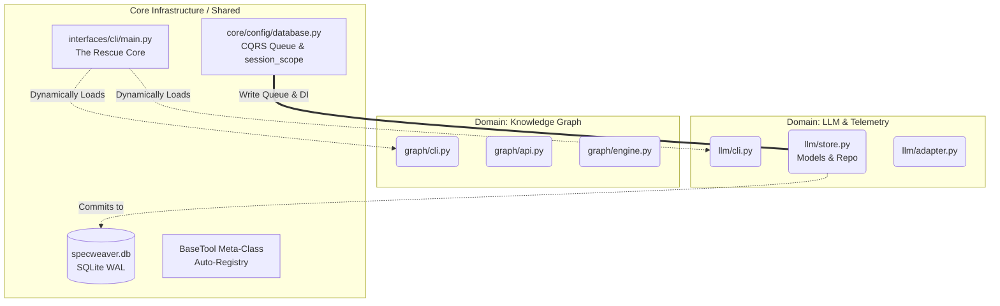
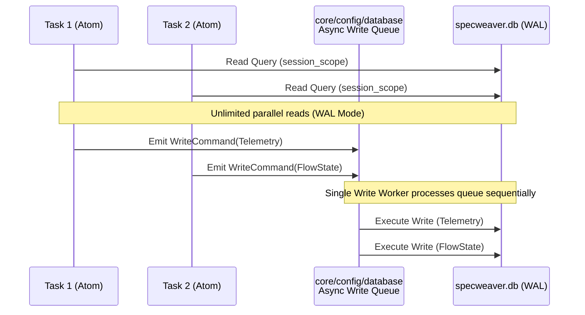

please# Design: Domain-Driven Design Unification

- **Feature ID**: TECH-01
- **Phase**: 6
- **Status**: APPROVED
- **Design Doc**: docs/roadmap/features/topic_07_technical_debt/TECH-01/TECH-01_design.md

## Feature Overview

Feature TECH-01 adds Domain-Driven Design (DDD) compliance to the SpecWeaver core system by dismantling legacy monolithic layers (`core/config/`, `interfaces/cli/`, and `core/loom/`). It solves the "Package by Layer" anti-pattern by extracting and relocating database mixins, CLI commands, and Sandbox executors into their respective feature-bounded contexts (e.g., `llm_store/`, `sandbox/git/`, `graph/cli.py`). It interacts with the Typer CLI root, the LLM telemetry database, and the execution engine, but does NOT touch actual business logic. Key constraints: Zero Regression Guarantee (the entire E2E test suite must pass with zero modifications to test assertions) and strict DAL Context Enforcement via `context.yaml` files.

## Research Findings

### Codebase Patterns
Currently, `core/config/` houses a monolithic SQLite connection pool and multiple mixins (`_db_llm_mixin.py`, `_db_telemetry_mixin.py`) serving disparate features. This must be decentralized into specific data access layers per domain.
The `interfaces/cli/` directory contains commands for every system feature (e.g., `lineage.py`, `graph.py`, `review.py`). These will be moved into domain-specific subdirectories (e.g., `src/specweaver/graph/cli.py`) and dynamically loaded.
The `core/loom/` Sandbox groups files by layer (`atoms/`, `tools/`, `commons/`) rather than by domain (`sandbox/git/`, `sandbox/qa/`). We will refactor this to align with the 4-layer Agentic Architecture pattern (Executor → Tool → Interface → Atom) and physically colocate these layers inside feature-specific packages.

**ROI Analysis & Beneficiaries:**
1. **Microservice Readiness (High ROI):** Features like the Knowledge Graph (`graph/`) or Telemetry will profit immensely because their API, Database, and CLI layers will be strictly decoupled, making extraction into a standalone microservice trivial.
2. **Security & RBAC (High ROI):** Organizing `loom/` into bounded domains (`sandbox/git/`) ensures that security executors and role-based interfaces are isolated, severely reducing the blast radius of any Sandbox escape.
3. **Developer Experience (Medium ROI):** Future engineers will no longer have to jump between 4 different root directories to add a single feature.

### External Tools
| Tool | Version | Key API Surface | Source |
|------|---------|----------------|--------|
| Typer | ^0.12.0 | `Typer.add_typer()` | CLI Sub-command Registration |
| SQLAlchemy | ^2.0.0 | Engine, Session, DeclarativeBase | SQLite Persistence |

### Blueprint References
- `knowledge/secure_ai_agent_workflows/artifacts/best_practices/tool_refactoring_guide.md`
- `knowledge/secure_ai_agent_workflows/artifacts/architecture/atoms_and_tools.md`

## Functional Requirements

| # | FR | Actor | Action | Outcome |
|---|-----|-------|--------|---------|
| FR-1 | Extract LLM Telemetry DB | System | Separates LLM database mixins from `core/config/database.py` | A standalone `llm_store` layer handles LLM storage. |
| FR-2 | Extract Flow State DB | System | Separates pipeline state DB mixins | A standalone `flow_store` layer handles pipeline execution state. |
| FR-3 | Extract Profile DB | System | Separates profile DB mixins | A standalone `profile_store` layer handles domain profiles. |
| FR-4 | Decentralize CLI Commands | System | Relocates Typer CLI modules to their respective domains | Domain-specific `cli.py` files exist in `graph/`, `llm/`, `workflows/`, etc. |
| FR-5 | Re-register CLI Root | System | Modifies `interfaces/cli/main.py` | All decentralized commands are discovered and mounted. |
| FR-6 | Refactor Loom Sandbox Domains | System | Groups `atoms/`, `tools/`, and `commons/` into feature directories | Directories like `sandbox/git/` and `sandbox/qa/` exist with native layer files. |
| FR-7 | Config Control Flow Decoupling | System | Strips `database.py` and `settings.py` of all domain orchestration logic and inline imports. | Configuration modules contain zero control flow, shifting DB schema initialization and settings loading to Orchestrator layers (CLI). |
| FR-8 | LLM Factory Dependency Injection | System | Removes `Database` coupling from `llm/router.py` and `llm/factory.py`. | The LLM domain strictly accepts pure Pydantic `SpecWeaverSettings` via DI, severing it from active project state logic. |

## Non-Functional Requirements

| # | NFR | Threshold / Constraint |
|---|-----|----------------------|
| NFR-1 | Zero Regression | 100% of the existing E2E and Unit test suite MUST pass without changing test assertions. |
| NFR-2 | Boundary Enforcement | All new bounded contexts MUST include a `context.yaml` enforcing `consumes`/`forbids` rules, and MUST be registered in `tach.toml` (including the new `workspace` boundary). |
| NFR-3 | CQRS & SQLite WAL | Decentralized `store/` layers MUST use SQLite WAL mode. Concurrent Atoms MUST use read-only sessions. **True CQRS:** Repositories MUST pass pure DTOs to the Write Queue. The CQRS worker MUST own its own isolated write session to prevent `DetachedInstanceError`s. |
| NFR-4 | Native Healer Isolation | `interfaces/cli/main.py` MUST hardcode the core agent commands AND the base File System tool. Plugin crashes must fail loudly but allow the core to boot so the agent can heal the broken plugin. |
| NFR-5 | Safe Bootstrapping | Runtime DB bootstrapping MUST use safe, idempotent `run_sync(Base.metadata.create_all)` separated from the `Database` constructor. Programmatic Alembic execution at runtime is forbidden (Alembic is CLI-only). |
| NFR-6 | Meta-Class Registry | The Sandbox MUST eradicate string-based dispatching and pre-commit generators. Tools MUST inherit from `BaseTool`, utilizing `__init_subclass__` to automatically and safely populate the in-memory registry. |

## External Dependencies

| Tool | Min Version | Key API Surface | Compat Confirmed | Notes |
|------|------------|----------------|-----------------|-------|
| Typer | 0.12.0 | `add_typer()` | Yes | Required for dynamic CLI loading. |

## Architectural Decisions

| # | Decision | Rationale | Architectural Switch? |
|---|----------|-----------|----------------------|
| AD-1 | Retain `interfaces/cli/main.py` as root | A single entrypoint is required for the `sw` binary, acting strictly as a router to domain CLIs. | No |
| AD-2 | Rename `loom` to domain prefixes | Nest Sandbox Domains under a `sandbox/` namespace (e.g. `sandbox/git`) to prevent naming collisions with pure logic domains while keeping the root directory clean. | No |

## Architecture Visualization

### 1. New Bounded Contexts

### 2. CQRS Database Flow

## Developer Guides Required

Evaluate if this feature introduces a new sub-system, paradigm, or extension layer that requires a Developer Guide for onboarding engineers.

| Guide Topic | Description | Status |
|-------------|-------------|--------|
| Domain-Driven CLI Creation | How to add a new CLI command to a bounded context and register it. | ✅ Done |

## Sub-Feature Breakdown

### SF-1: Deconstruct `core/config/` Database Monolith
- **Scope**: Extracts LLM telemetry, Flow state, and Profile database logic into independent domain stores.
- **FRs**: [FR-1, FR-2, FR-3]
- **Inputs**: Legacy `_db_mixin` classes and SQLAlchemy models.
- **Outputs**: Decentralized `store/` packages inside their respective domains.
- **Depends on**: none
- **Impl Plan**: docs/roadmap/features/topic_07_technical_debt/TECH-01/TECH-01_sf1_implementation_plan.md

### SF-2: Decentralize `interfaces/cli/` Layer
- **Scope**: Moves CLI commands into domain folders and sets up dynamic Typer registration.
- **FRs**: [FR-4, FR-5]
- **Inputs**: Existing Typer modules in `interfaces/cli/`.
- **Outputs**: Domain-specific `cli.py` modules mounted to `main.py`.
- **Depends on**: none
- **Impl Plan**: docs/roadmap/features/topic_07_technical_debt/TECH-01/TECH-01_sf2_implementation_plan.md

### SF-3: Consolidate `core/loom/` Sandbox
- **Scope**: Reorganizes the execution engine into pure `sandbox/` bounded contexts honoring the 4-layer architecture.
- **FRs**: [FR-6]
- **Inputs**: `core/loom/atoms`, `core/loom/tools`, `core/loom/commons`.
- **Outputs**: Feature-packaged sandbox directories (`sandbox/git`, etc.).
- **Depends on**: none
- **Impl Plan**: docs/roadmap/features/topic_07_technical_debt/TECH-01/TECH-01_sf3_implementation_plan.md

## Execution Order

1. SF-1, SF-2, and SF-3 can run in parallel (no shared dependencies).

## Progress Tracker

| SF | Name | Depends On | Design | Impl Plan | Dev | Pre-Commit | Committed |
|----|------|-----------|--------|-----------|-----|------------|-----------|
| SF-1 | Deconstruct Config Monolith | — | ✅ | ✅ | ✅ | ✅ | ✅ |
| SF-2 | Decentralize CLI Layer | — | ✅ | ✅ | ✅ | ✅ | ✅ |
| SF-3 | Consolidate Sandbox | — | ✅ | ✅ | ⬜ | ⬜ | ⬜ |

## Session Handoff

**Current status**: SF-2 Pre-Commit Approved & Committed.
**Next step**: Run `/dev docs/roadmap/features/topic_07_technical_debt/TECH-01/TECH-01_sf3_implementation_plan.md`
**If resuming mid-feature**: Read the Progress Tracker above. Find the first ⬜
in any row and resume from there using the appropriate workflow.
