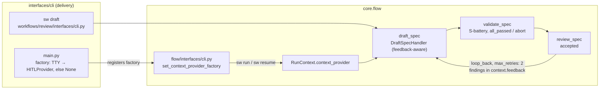

# INT-US-02 — Interactive Drafter Integration

**Status**: APPROVED — approved by Steve Bula on 2026-07-22 (AD-1..5 confirmed; **AD-6 resolved to
(a)** — feedback-aware re-draft). **COMPLETE** — SF-03 committed `e6645a57` (2026-07-23); **US-2 epic
🟢**. · **Phase**: 6 · **Feature ID**: INT-US-02

| | |
|---|---|
| Closes | US-2 (flagship loop) |
| Unblocks | US-21 (Autonomous Decomposition) — its ONLY blocker was US-2 Core, now integration-only; US-8 / US-12 / US-14 — US-2 Core dependency satisfied (each keeps one other blocker) |
| Mirrors | `INT-US-03` (inline-pipeline extension, composition wiring, proof pattern); `INT-US-09` e2e control-test pattern (`test_step_worktree_isolation_e2e.py`) |
| Not touched | new capability or prompt machinery; rubric externalization (`C-VAL-05`); drafting-content quality (`D-INTL-04`) |
| Verifiable Proof | `tests/e2e/capabilities/workflows/test_drafter_loop_e2e.py` (7 scenarios) |

## What it does

US-2: *co-author a spec with the LLM section-by-section, and have it validated and semantically
reviewed with **zero manual copy-pasting***. All six Core-Required capabilities were ✅ built but
formed **two half-loops that never met**:

1. **`sw draft <name>`** (registered in the review CLI module) ran a **single-step** `draft_spec`
   pipeline with the interactive `HITLProvider`, then printed *"Run 'sw check' to validate the drafted
   spec."* — the manual handoff the contract forbids (the defect `INT-US-03` removed from
   `sw implement`).
2. **`sw run new_feature <name>`** had the full `draft_spec → validate_spec → review_spec` chain with
   `loop_back`, but its composition root **never wired a `context_provider`**, so `DraftSpecHandler`
   **parked** ("write the spec manually, then `sw resume`") instead of co-authoring.

This contract joins them:

- `sw draft` runs draft → validate → review in one inline pipeline, with a bounded draft↔review
  reflection loop and an inline report.
- `sw run` / `sw resume` get a TTY-gated `HITLProvider`, so `new_feature` co-authors instead of parking.
  Headless runs still park.

**Integration-only**: drafting/review guidance stays knowledge-shaped content (middle-way constraint).

## Why the loop needed a handler change

`DraftSpecHandler`'s FIRST check was *spec exists → PASSED (skip)*. So `new_feature.yaml`'s
`review_spec` `on_fail: loop_back → draft_spec` re-entered a handler that **skipped**: the shipped
rejection loop was always dead (validate → review → fail → skip → … until abort). Nobody noticed because
the unwired provider meant no one reached it interactively. A loop gated on `accepted` is theater unless
re-drafting is real — hence AD-6.

## Architecture

| Module | Change |
|---|---|
| `workflows/review/interfaces/cli.py` | `sw draft` inline pipeline extended to 3 steps + inline report |
| `core/flow/handlers/draft.py` | feedback-aware re-draft on the loop_back path (AD-6) |
| `core/flow/interfaces/cli.py` | provider-factory seam, applied when `sw run`/`sw resume` build `RunContext` |
| `interfaces/cli/main.py` | registers the TTY-gated `HITLProvider` factory |
| `workflows/pipelines/new_feature.yaml` | explicit review-loop bound |

Existing pieces reused:

- **`sw draft` (E-INTL-02)** — `@review_cli.command(name="draft")`, registered via
  `main.py:109 add_typer(review_cli)`; built
  `PipelineDefinition.create_single_step(name="draft_spec", ...)`; wires `context_provider=HITLProvider(console=_core.console)`
  (`:111`); loads settings with `llm_role="draft"`.
- **`DraftSpecHandler`** — `DRAFT+SPEC`: spec exists → PASSED (skip); provider+llm present →
  `_execute_drafting` (builds `Drafter` with `_build_base_prompt` INTERACTIVE profile — **D-INTL-05
  metadata + constitution/standards already injected here**); otherwise → **PARKS** ("spec creation
  parking") for `sw resume`.
- **`Drafter` (`workflows/drafting/drafter.py`)** — section-by-section engine (`SectionDef`, topology
  contexts, lineage UUID stamping).
- **`HITLProvider` (`interfaces/cli/hitl_provider.py`)** — Rich-prompt ContextProvider (terminal-coupled).
- **Spec validation (E-VAL-01/US-1)** — `VALIDATE+SPEC` runs the S01–S12 battery
  (`validation_spec_*.yaml` presets); gate `all_passed`.
- **`ReviewSpecHandler` (`core/flow/handlers/review.py:155-168`)** — LLM semantic review; PASSED iff
  `verdict == "accepted"`, outputs `{verdict, findings…}`; gate condition `accepted` as in
  `new_feature.yaml`.
- **`new_feature.yaml`** — `draft_spec (hitl gate) → validate_spec (auto, on_fail abort) → review_spec
  (auto, `on_fail: loop_back → draft_spec`)` → generation steps.
- **Composition roots** — `flow/interfaces/cli.py` `_execute_run` (`:251-259`) and `resume`
  (`:452-460`) built `RunContext` **without** `context_provider`; the only `HITLProvider` wiring was
  the `sw draft` command.

**Boundary rule.** `hitl_provider.py` lives in `interfaces/cli/` (delivery layer); the flow CLI is
`core.flow.interfaces`. Importing the provider there would be a **wrong-direction import** (core must not
depend on the delivery layer). So the delivery layer injects it (AD-2). `tach check` stays green.

No external tool or dependency; Rich prompts are already vendored.

## Decisions

| # | Decision | Rationale | Architectural Switch? |
|---|----------|-----------|----------------------|
| AD-1 | Extend `sw draft`'s **existing inline** pipeline (draft→validate→review) rather than switching the command to load `new_feature.yaml`. | `new_feature.yaml` continues into code generation — wrong for a drafting command. Mirrors `INT-US-03` AD-1; minimal, in-module. | No |
| AD-2 | Wire `HITLProvider` at the composition root **by injection from the delivery layer**, gated on `sys.stdin.isatty()`. Core imports only the `ContextProvider` protocol. | Importing `interfaces.cli.hitl_provider` from `core.flow.interfaces` is a wrong-direction dependency; injection keeps the boundary clean (NFR-4/NFR-6), the TTY gate keeps headless parking (FR-5). Mechanism: provider factory (SF-02). | No (composition wiring; same class as `INT-US-03` AD-2). |
| AD-3 | Leave the `draft` command's **module home** (`workflows/review/interfaces/cli.py`) untouched. | Moving it to `workflows/drafting/interfaces/` is a placement cleanup with zero user-facing value — `TECH-006`-class refactoring. | No |
| AD-4 | Bound the `review_spec` loop in `new_feature.yaml` **inside this contract** (FR-7) rather than minting a separate TECH ticket. | One-line gate change, found by this design's research, tested by this contract's proof; a ticket would be bloat (2026-07-21 no-bloat guidance). The loop was bounded (3), not unbounded as first stated; FR-7 tightens it to 2. | No |
| AD-5 | Reviewer findings feed the re-draft via the existing feedback mechanism (`loop_back` carries step output into `context.feedback`, as `INT-US-03`'s QA loop does). | Reuse, not invention; the Drafter already receives base-prompt context. | No |
| AD-6 | **[RESOLVED — approved by Steve Bula 2026-07-22: option (a)]** `DraftSpecHandler` becomes **feedback-aware**: re-entered via `loop_back` with reviewer findings in `context.feedback`, it re-drafts (regenerates the spec with the findings, bounded by `max_retries`) instead of skipping on "spec exists". | Only (a) delivers US-2's benefit AND fixes the dead loop. Rejected: **(b)** park-with-findings for manual editing — reintroduces the forbidden manual step; **(c)** no loop in v1 — re-running `sw draft` also skips on the existing spec, stranding the user in manual editing. Small handler glue in the `INT-US-03` SF-02 precedent class (LintFixHandler target fix). Whole-spec regeneration is base-grade; *surgical* revision (AST mutators) stays `INT-US-02-SF01` add-on territory. | No (handler glue + defect fix; flagged for explicit sign-off because it changes a shipped handler's skip semantics — only on the feedback-bearing loop_back path). |

**Execution discipline** (2026-07-22, after `D-INTL-07` was minted; scope unchanged). The drafting
engine will be superseded (`D-INTL-07`/`INT-US-02-SF03`, blocked on `C-FLOW-11`), so:

1. engine-coupled internals (AD-6a findings-injection plumbing) at **minimal depth** — smallest working
   version, no prompt polish;
2. **investment freeze** on the `E-INTL-02` engine — no `SPEC_SECTIONS` tuning or Drafter refactors;
3. **seam-first tests** — assert the feedback/re-draft/park contract, not Drafter internals;
4. SF-02 picks the engine-neutral AD-2 shape (provider factory).

The gates and wiring built here are the permanent harness the replacement engine will be verified by.

## Functional Requirements

| # | FR | Actor | Action | Outcome |
|---|-----|-------|--------|---------|
| FR-1 | In-pipeline validate | `sw draft` pipeline | SHALL append `validate_spec` (`VALIDATE`/`SPEC`, S-battery) after `draft_spec` in the inline pipeline. | A co-authored spec is validated immediately; failures reported inline. |
| FR-2 | In-pipeline semantic review | `sw draft` pipeline | SHALL append `review_spec` (`REVIEW`/`SPEC`) after validation, gate `condition: accepted`. | The Review Engine judges the draft with no manual handoff (the contract's core sentence). |
| FR-3 | Bounded reflection loop | `sw draft` pipeline | SHALL gate `review_spec` with `on_fail: loop_back → draft_spec`, **`max_retries: 2`**; the re-entered draft step SHALL actually re-draft with the reviewer findings (AD-6 — today it would skip on "spec exists", making the loop dead); on exhaustion surface the findings and exit non-zero. | Rejected drafts get REAL bounded re-drafting with reviewer findings fed back; no unbounded LLM spend. |
| FR-4 | Composition-root provider wiring | `sw run` / `sw resume` | SHALL wire the interactive `HITLProvider` into `RunContext.context_provider` **when attached to an interactive terminal (TTY)**, injected without a core→delivery import (AD-2). | `sw run new_feature <name>` co-authors instead of parking; layering stays legal. |
| FR-5 | Headless behavior preserved | `sw run` / `sw resume` | SHALL keep the park-for-user-input behavior byte-identical when no TTY (CI, scripts, API) or when the spec already exists. | Zero regression for autonomous/headless flows; parking remains the headless contract. |
| FR-6 | Inline outcome reporting | `sw draft` command | SHALL report validation + review outcomes inline (rules passed/failed, verdict, findings count, retries used) and REMOVE the stale "Run 'sw check'…" message. | One command shows the whole result; no manual follow-up implied. |
| FR-7 | Explicit loop bound | `new_feature.yaml` | SHALL add an explicit `max_retries: 2` to the `review_spec` loop_back gate *(corrected 2026-07-22: the default bound is 3, not unbounded — this is parity/self-documentation, not a fix; the real defect is the dead loop, fixed by FR-3/AD-6)*. | The shipped pipeline's loop bound is explicit and consistent with `INT-US-03`. |
| FR-8 | Verifiable proof | test suite | SHALL provide an e2e driving draft→validate→review through the real `PipelineRunner` with a **scripted ContextProvider** (deterministic answers) + mocked LLM verdicts: [accept path], [reject→loop_back→re-draft→accept], [retries exhausted → non-zero + findings], and a **headless control** proving `sw run` without TTY still parks. | The contract's Verifiable Proof is a real, unmocked-runner, CI-runnable test; the park control guards FR-5. |

FR-7 as built: the gate already carried an explicit `max_retries: 3` (`GateDefinition.max_retries`
also defaults to **3**, `models.py:160`); FR-7 tightened it to 2.

## Non-Functional Requirements

| # | NFR | Threshold / Constraint |
|---|-----|----------------------|
| NFR-1 | Integration-only | No new capability, handler, or prompt machinery (middle-way: drafting/review guidance stays content-shaped; rubric externalization = `C-VAL-05`, out of scope). |
| NFR-2 | Backward compatibility | Headless `sw run`/`resume` and existing `sw draft` happy path byte-identical except the added chain + report; parking semantics unchanged without TTY. |
| NFR-3 | Bounded cost | All reflection loops `max_retries ≤ 2`; no unbounded LLM spend (fixes the found defect). |
| NFR-4 | Architecture compliance | No `core.flow.interfaces → interfaces.cli` import (AD-2 injection); `tach`/`ruff`/`mypy --strict` green. **[proof: arch — tach/lint gate, not pytest]** |
| NFR-5 | Deterministic proof | The e2e uses a scripted provider + mocked LLM (no live keys, no prompts blocking CI); includes the headless park control (INT-US-09 discriminator pattern). **[proof: meta — rule about tests, docs or the diff]** |
| NFR-6 | Terminal-coupling containment | `HITLProvider` (Rich) stays in the delivery layer; core sees only the `ContextProvider` protocol. |

## Risks

| Risk | Probability | Impact | Mitigation |
|------|-------------|--------|------------|
| TTY-gated provider changes `sw run` behavior for interactive users who EXPECTED parking | Low | Low | It replaces a dead-end (park + manual spec authoring) with the designed co-author flow; headless unchanged (FR-5); document in the run output. |
| Review loop_back re-draft ignores reviewer findings (weak loop) | Medium | Medium | AD-5 — checked against the feedback plumbing (SF-01 plan). |
| Interactive prompts block CI if TTY misdetected | Low | Medium | Gate strictly on `isatty()`; the headless park control (FR-8) is the regression tripwire. |
| Scope creep into drafting-content quality (rubrics, question flows) | — | — | NFR-1; that is `C-VAL-05`/`D-INTL-04` territory. |

**Known semantics (documented, not tested):** resume-in-TTY after a rejection-park skips the re-draft
(findings were consumed at park time) and self-heals on the next rejection. Details in the
[SF-03 walkthrough](INT-US-02_sf03_walkthrough.md).

**Follow-ups:**

| Existing Feature | Current Issue | Benefit | Effort |
|-----------------|---------------|---------|--------|
| `draft` command placement | Lives in `workflows/review/interfaces/cli.py` | Move to `workflows/drafting/interfaces/` (TECH-006-class cleanup) | Low |
| Review criteria in handler prompts | Frozen judgment content | Externalize rubric-first once `C-VAL-05` lands | — (separate story) |

**Guide owed:**

| Guide Topic | Description | Status |
|-------------|-------------|--------|
| Interactive drafting loop | Update the drafting section of the user/dev guides: one-command draft→validate→review, TTY vs headless behavior | ⬜ To be written during Pre-commit |

## Sub-features

| SF | Does | FRs | Depends on | Plan |
|----|------|-----|-----------|------|
| SF-01 | Draft → Validate → Review Inline Chain: `validate_spec` + `review_spec` (gate `accepted`, `loop_back → draft_spec`, `max_retries: 2`); feedback-aware `DraftSpecHandler` (AD-6); inline report; stale "Run 'sw check'…" message removed; same bound on `new_feature.yaml` (FR-7). | FR-1, FR-2, FR-3, FR-6, FR-7 | none | [sf01](INT-US-02_sf01_implementation_plan.md) |
| SF-02 | Composition-Root Provider Wiring (TTY-Gated): provider injected into `sw run`/`sw resume` from the delivery layer (AD-2), gated on `isatty()`; headless parking byte-identical (FR-5); no core→delivery import. | FR-4, FR-5 | none (parallel-safe; run serially per repo convention) | [sf02](INT-US-02_sf02_implementation_plan.md) |
| SF-03 | Verifiable Proof: the FR-8 e2e — scripted ContextProvider + mocked LLM through the real runner: accept, reject→loop_back→accept, retries exhausted, headless park control. Closes the contract. | FR-8 | SF-01, SF-02 | [sf03](INT-US-02_sf03_implementation_plan.md) |

Executed SF-01 → SF-02 → SF-03 (linear, acyclic).

## Progress Tracker

| SF | Name | Depends On | Design | Impl Plan | Dev | Pre-Commit | Committed |
|----|------|-----------|--------|-----------|-----|------------|-----------|
| SF-01 | Draft → Validate → Review Inline Chain | — | ✅ | ✅ | ✅ | ✅ | ✅ |
| SF-02 | Composition-Root Provider Wiring | SF-01 | ✅ | ✅ | ✅ | ✅ | ✅ |
| SF-03 | Verifiable Proof | SF-01, SF-02 | ✅ | ✅ | ✅ | ✅ | ✅ |
